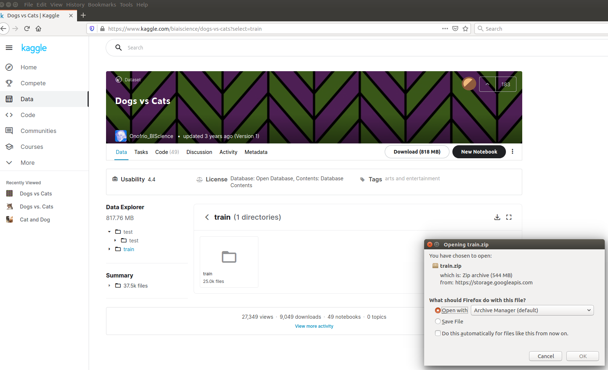

<table>
 <tr>
   <td align="center"><h1>Vitis AI Tutorials</h1>
   </td>
 </tr>
 <tr>
 <td align="center"><h3> Quantization and Pruning of AlexNet CNN trained in Caffe with Cats-vs-Dogs dataset</h3>
 </td>
 </tr>
</table>


### Current status

1. Tested with TensorFlow 1.15 in Vitis AI 1.4 on an Ubuntu 18.04.5 Desktop PC

2. Tested in hardware on ZCU102 board with  ``xilinx-zcu102-dpu-v2021.1-v1.4.0.img.gz``SD card

3. Tested in hardware on VCK190 ES1 board with  ``xilinx-vck190-dpu-v2020.2-v1.4.0.img.gz`` SD card


#### Date: 11 October 2021


# 1. Introduction

This Deep Learning (DL) tutorial shows you how to train, prune, and quantize a modified version of the AlexNet convolutional neural network (CNN) with the Kaggle [Dogs vs. Cats](https://www.kaggle.com/c/dogs-vs-cats) dataset to deploy it on the Xilinx&reg; [ZCU102](https://www.xilinx.com/products/boards-and-kits/ek-u1-zcu102-g.html) board. You will use the [Caffe](http://caffe.berkeleyvision.org) environment available from [Vitis AI](https://developer.xilinx.com/en/get-started/ai.html), a set of optimized IP, tools libraries, models, and example designs valid for AI inference on both Xilinx edge devices and Alveo&trade; cards.

After the selected CNN has been trained in Caffe, the Vitis AI Quantizer quantizes the ``caffemodel`` file of floating point weights and creates an 8-bit integer representation (named "INT8"). From this, the Vitis AI Compiler generates the ``XMODEL`` file with micro-instructions for the Deep Processor Unit (DPU). The final application is executed at run time - through VART C++ APIs - on the target board to make predictions that can be compared against the simulation reference results.

The Dogs vs. Cats dataset consists of only two classes of objects to classify: cats and dogs. It contains 25000 RGB images that have been organized into the following three databases (all the images are randomly shuffled before forming the database):
- ``train_lmdb``: 20000 images (resized to 256x256) in the LMDB database for the forward or backward training process.
- ``valid_lmdb``:  4000 images (resized to 256x256) in the LMDB database for the validation step during the training process.
- ``test``: 1000 images (resized to 227x227) in plain JPEG format for the top-1 prediction measurements, once the CNN is trained.

AlexNet is a well-known CNN that works with images in 227x227x3 size. It is described in the
[Practitioner Bundle book](https://www.pyimagesearch.com/deep-learning-computer-vision-python-book) by [Dr. Adrian Rosebrock](https://www.linkedin.com/in/adrian-rosebrock-59b8732a/) from [PyImageSearch](https://www.pyimagesearch.com/) where it is modeled and trained in Keras or TensorFlow. The model adopted in this tutorial was manually translated into ``.prototxt`` files and trained with Caffe from scratch. Moreover, some layers were organized differently:
- "Local Response Normalization" (LRN) layers were replaced by "Batch Normalization" (BN) layers
- The "ReLU" activation layer was placed after the BN layer, and not before
- The number of BN and "DROPOUT" layers were also reduced
- The parameters of the first layer ``conv1`` were changed from the original values
    ```
    kernel_size: 11
    pad: 1
    ```
    to these new values
    ```
    kernel_size: 8
    pad: 0
    ```
  because the Versal&trade; DPU architecture does not support kernel sizes larger than 8x8 (while the MPSoC DPU architecture supports it). In this way the same flow can be used to compile the same CNN on two different target architectures and related ``XMODEL`` files.

:pushpin: **Note:** The Xilinx [Vitis AI Optimizer](https://www.xilinx.com/cgi-bin/docs/rdoc?t=vitis_ai;v=1.3;d=ug1333-ai-optimizer.pdf), which performs "pruning", requires a license fee and can be accessed only at its [lounge](https://www.xilinx.com/member/ai_optimizer.html) page. Therefore the pruning tool is not included in this tutorial, although all the shell scripts to prune the CNN and the related log files, [logfile_pruning_alexnet_host.zip](files/log/logfile_pruning_alexnet_host.zip), are available for reference.


# 2. Prerequisites

- Ubuntu 16.04 host PC with Python 3.6. Do not use any Ubuntu Virtual Machine on a Windows PC.

- The entire repository of [Vitis AI stack release 1.4](https://github.com/Xilinx/Vitis-AI) from [www.github.com/Xilinx](https://www.github.com/Xilinx).

-  Accurate reading of [Vitis AI User Guide UG1414 v1.4](https://www.xilinx.com/support/documentation/sw_manuals/vitis_ai/1_4/ug1414-vitis-ai.pdf). In particular:
  1. *Vitis AI Overview* in Chapter 1 with DPU naming and guidelines to download the tools container available from [docker hub](https://hub.docker.com/r/xilinx/vitis-ai/tags) and the Runtime Package for edge (MPSoC) devices.
  2. *Installation and Setup* instructions of Chapter 2 for both host and target. We recommended you build a GPU-based docker image.
  3. *Quantizing the Model* in Chapter 3 and *Compiling the Model* in Chapter 4.  
  4. *Programming with VART* APIs in Chapter 5.
  5. *Setting Up the Target* as described in [Vitis-AI/demo/VART](https://github.com/Xilinx/Vitis-AI/blob/master/demo/VART/README.md).  


- A Vitis AI target board such as either:
  - [ZCU102](https://www.xilinx.com/products/boards-and-kits/ek-u1-zcu102-g.html) or
  - [VCK190](https://www.xilinx.com/products/boards-and-kits/vck190.html).


- Familiarity with Deep Learning principles.

- Familiarity with Caffe (here is the official [online Caffe tutorial](http://caffe.berkeleyvision.org/tutorial/)).


### Dos-to-Unix Conversion

If you run into unepexted errors during the execution of the scripts, you have to pre-process -all the``*.sh`` shell and the python ``*.py`` scripts with the [dos2unix](http://archive.ubuntu.com/ubuntu/pool/universe/d/dos2unix/dos2unix_6.0.4.orig.tar.gz) utility only once.
Run the following commands from your Ubuntu host PC (out of the Vitis AI docker images):
```bash
sudo apt-get install dos2unix
cd <WRK_DIR> #your working directory
for file in $(find . -name "*.sh"); do
  dos2unix ${file}
done
```


# 3. Before Starting with Vitis AI 1.4

You have to know few things about [Docker](https://docs.docker.com/) in order to run Vitis AI smoothly.

This tutorial assumes that you have cloned the [Vitis AI stack release 1.4](https://github.com/Xilinx/Vitis-AI)  
(for example in a folder renamed ``~/ML/VAI1v4``, as in my case), which now becomes your working directory ``<WRK_DIR>``.

To list the currently available docker images run:
```bash
docker images # to list the current docker images available in the host pc
```

and you should see text similar to the following:
```text
REPOSITORY            TAG                               IMAGE ID            CREATED             SIZE
xilinx/vitis-ai-gpu   1.4                               0b5e7cc1bef5        3 weeks ago         27.5GB
```

To launch the docker container with Vitis AI tools - to perform all the steps from CNN training to the generation of the XMODEL file for the DPU - based on GPU, execute the following commands from the ``<WRK_DIR>`` folder:

```bash
cd <WRK_DIR> # you are now in Vitis_AI subfolder
./docker_run.sh xilinx/vitis-ai-gpu:1.4
```

**Note:** The container maps the shared folder ``/workspace`` with the file system of the host PC from where you launch the above command, which is ``<WRK_DIR>`` in your case.
This shared folder enables you to transfer files from the host PC to the docker container and vice versa.

The docker container does not have any graphic editor, so it is recommended that you work with two terminals and you point to the same folder. In one terminal, use the docker container commands, and in the other terminal, open any graphic editor you prefer.


**Note**: The docker does not have an automatic garbage collection system as of now. You can use this command to do a manual garbage collection:
```
docker rmi -f $(docker images -f "dangling=true" -q)
```

## 3.1 Install Missing Packages on the Vitis AI Tools Container

This tutorial requires some packages that are not included in the original Vitis AI tools container. Here are the commands to include such packages:
```bash
./docker_run.sh xilinx/vitis-ai-gpu:1.4    
sudo su # you must be root
conda activate vitis-ai-caffe     # as root, enter into Caffe (anaconda-based) virtual environment
#conda install pycairo==1.18.2    # for Vitis AI >= 1.0
pip install lmdb==0.98            
conda deactivate
exit # to exit from root
conda activate vitis-ai-caffe # as normal user, enter into Caffe (anaconda-based) virtual environment
```

**Note**: If you exit from the current Vitis AI tools docker image, you will lose all the installed packages. To save all the changes, open a new terminal and run the following commands:

```bash
sudo docker ps -l # To get the Docker CONTAINER ID
```
You will see the following text (the container ID might have a different number):

```text
CONTAINER ID        IMAGE                        COMMAND                CREATED             STATUS              NAMES
7c9927375b06        xilinx/vitis-ai-gpu:1.4      "/etc/login.sh bash"   30 minutes ago      Up 30 minutes       heuristic_lamport
```

Save the modified docker image:

```bash
sudo docker commit -m"caffe" 7c9927375b06 xilinx/vitis-ai-gpu:1.4

```

Assuming you have renamed this project ``VAI-Caffe-ML-CATSvsDOGS`` and placed it in the directory named ``<WRK_DIR>/tutorials/``, you can launch the modified tools container by running the following commands:
```bash
cd <WRK_DIR>
./docker_run.sh xilinx/vitis-ai-gpu:1.4
cd /workspace/tutorials/VAI-Caffe-ML-CATSvsDOGS
conda activate vitis-ai-caffe
```

## 3.2 Copy caffe-xilinx.zip

Now, enter into the [AI Model Zoo caffe-xilinx](https://github.com/Xilinx/Vitis-AI/tree/master/models/AI-Model-Zoo/caffe-xilinx) file and copy the entire directory at the same level of this project directory so that both ``VAI-Caffe-ML-CATSvsDOGS`` and ``caffe-xilinx`` repositories are placed in ``<WRK_DIR>/tutorials/``, with the following commands:
```bash
cd <WRK_DIR>
cp -r models/AI-Model-Zoo/caffe-xilinx/ ./tutorials/
```

Leave it as it is, you do not need to compile and build anything.

You should see something similar to the following image:


*Figure 1: Entering into the Vitis AI tools container (screenshot taken from Vitis AI 1.2 release).*

You will use only the following python 2.7 scripts placed in the folder ``caffe-xilinx/tools/extra``:
- ``caffe-xilinx/tools/extra/parse_log.py``
- ``caffe-xilinx/tools/extra/extract_seconds.py``

**Note**: You need to modify line number 166 of code ``parse_log.py`` to make it compatible with python >= 3.6:
```python
print 'Wrote %s' % output_filename
```
into
```python
print ("Wrote %s" % output_filename)
```


# 4. Project Directory Structure

In Caffe, ``.prototxt`` files cannot use Linux environmental variables- only relative pathnames. This project assumes that the following fixed subdirectories are placed under ``/workspace/tutorials/VAI-Caffe-ML-CATSvsDOGS/``:

- ``caffe/code``: contains all the Python scripts

- ``caffe/models``: contains the solver, training, and deploy``.prototxt`` files;

- ``deploy``: contains the files for quantization of either the baseline (``quantiz``) or pruned (``pruned``) CNN, plus the files for ZCU102 and VCK190 run-time execution (``zcu102/baseline`` ``zcu102/pruned`` ``zcu102/test_images`` and ``vck190/baseline`` ``vck190/pruned`` ``vck190/test_images`` respectively)

- ``input`` contains the following:
  - [LMDB](https://en.wikipedia.org/wiki/Lightning_Memory-Mapped_Database) databases for the Caffe phases of training and validation
  - JPEG images for testing the top-1 accuracy
  - Other JPEG images for calibration during the quantization process


#  5. Get the Dogs vs. Cats Dataset

The dataset cannot be hosted in this repository because of its large size. To obtain the dataset, you need to register on the [Kaggle website](https://www.kaggle.com) by setting up a username and password. The registration procedure involves receiving confirmation codes by email and smartphone.

Once registered, we recommend to skip the official [Cat and Dog](https://www.kaggle.com/tongpython/cat-and-dog) page and directly download the 818MB [archive.zip](https://www.kaggle.com/biaiscience/dogs-vs-cats?select=train) archive as shown in the following image:



*Figure 2: Downloading the dataset of training images.*


 Unzip it in a temporary folder ``./tmp``,  and then move the innermost subfolder ``train`` inside the folder ``input`` and rename it as ``jpg``, for example, with the following commands:

```bash
cd <WRK_DIR/tutorials/VAI-Caffe-ML-CATSvsDOGS/files/tmp #the zip archive with images is supposed to be here
unzip archive.zip
cd train
mv ./train ./jpg      #rename
mv ./jpg ../../input/ #move folder
cd ../..
rm -r tmp             # remove tmporary folder
```

Note that you do not need to use the original ``test`` archive, because it does not have labeled images and therefore it is not useful for this tutorial.


# 6. Python and Shell Scripts

Once the JPEG images have been put in the ``input/jpg`` folder, as explained in the previous section, the entire flow can be launched with the following commands:

```bash
cd <WRK_DIR/tutorials/VAI-Caffe-ML-CATSvsDOGS/files
source ./run_all_alexnet.sh 2>&1 | tee logfile_baseline_alexnet_host.txt
```

The shell script [run_all_alexnet.sh](files/run_all_alexnet.sh) does all the job for the AlexNet CNN in this order:

- Sets the environmental variables required by this project by calling  [set_prj_env_variables.sh](files/caffe/set_prj_env_variables.sh). **Note**: This script must be called mandatorily prior to any of the remaining scripts

- Sets the project directories by launching  [set_the_CATSvsDOGS_prj.py](files/set_the_CATSvsDOGS_prj.py) that organizes the images taken from the ``input/jpg/`` folder

- Runs the whole Caffe flow by calling [caffe_flow_AlexNet.sh](files/caffe/caffe_flow_AlexNet.sh) script

- Launches the Vitis AI Quantizer  [vaiq_alexnetBNnoLRN.sh](files/deploy/alexnetBNnoLRN/quantiz/vaiq_alexnetBNnoLRN.sh) and Compiler [vaic_alexnetBNnoLRN.sh](files/deploy/alexnetBNnoLRN/quantiz/vaic_alexnetBNnoLRN.sh) scripts.

In the order of execution, the Python scripts that compose the Caffe design flow are listed below. They enable you to create the datasets, train your CNN with a training and validation LMDB database, and finally make predictions on JPEG images. They all are launched by [caffe_flow_AlexNet.sh](files/caffe/caffe_flow_AlexNet.sh).

a) [1_write_cats-vs-dogs_images.py](files/caffe/code/1_write_cats-vs-dogs_images.py): this script creates  subfolders ``test``, ``train``, ``val``, and  ``calib``. The ``calib`` folder is needed only for quantization. You only need to execute it once.  

b) [2a_compute_mean.py](files/caffe/code/2a_compute_mean.py): This script computes the three mean values for the ``train_lmdb`` database. You only need to execute it once.  

c) [2b_create_lmdb.py](files/caffe/code/2b_create_lmdb.py): This script creates the LMDB databases ``input/lmdb/train_lmdb`` and ``input/lmdb/valid_lmdb`` for the training step. You only need to execute it once.

d) [3_read_lmdb.py](files/caffe/code/3_read_lmdb.py): This script can be used to debug the first two scripts.

e) [4_training.py](files/caffe/code/4_training.py): This script launches the real training process in Caffe, given certain ``solver`` and CNN description ``.prototxt`` files. It can be used for any trial of training.

f) [5_plot_learning_curve.py](files/caffe/code/5_plot_learning_curve.py): This script is launched at the end of the training to plot the learning curves of accuracy and loss.

g) [6_make_predictions.py](files/caffe/code/6_make_predictions.py): This script is launched at the end of the training to measure the average prediction accuracy achieved by the CNN.


# 7. AlexNet Caffe Training Files

## 7.1. CNN Model Description

To describe the CNN in Caffe, you need a ``.prototxt`` text file that shows:
- The type of layers and how they are connected
- Some specific actions to be done only during the training or validation phases, indicated as TRAIN and TEST, respectively.

You also need to set the ``batch_size`` during the TRAIN and TEST phases: 128 (or 256, depending on the memory of your GPU card) and 80, respectively. During the TRAIN phase, all the parameters of the CNN are updated by the ``Adam`` solver, every ``batch_size`` number of images.

The model giving the best top-1 prediction results in previous experiments is [train_val_2_alexnetBNnoLRN.prototxt](files/caffe/models/alexnetBNnoLRN/m2/train_val_2_alexnetBNnoLRN.prototxt). Associated with it, you also have the [deploy_2_alexnetBNnoLRN.prototxt](files/caffe/models/alexnetBNnoLRN/m2/deploy_2_alexnetBNnoLRN.prototxt), which is needed to compute the prediction accuracy on the 1000 images in the ``test`` subfolder (the same that will be used at run time on the ZCU102).

There is another model, [q_train_val_2_AalexnetBNnoLRN.prototxt](files/caffe/models/alexnetBNnoLRN/m2/q_train_val_2_alexnetBNnoLRN.prototxt), which will be applied later during the quantization process of the baseline CNN. It is exactly the same as [train_val_2_alexnetBNnoLRN.prototxt](files/caffe/models/alexnetBNnoLRN/m2/train_val_2_alexnetBNnoLRN.prototxt), but the calibration images have replaced the LMDB database of the TRAIN phase.


## 7.2. Caffe Training Process Solver

In Caffe, the solver file defines the optimization method (that is, ``SGD``, or ``Adam``, or ``Nesterov``), the number of iterations, and the policy for changing the learning rate during the various iterations. It also says if a CPU or GPU is being used for computation.

The solver file is named [solver_2_alexnetBNnoLRN.prototxt](files/caffe/models/alexnetBNnoLRN/m2/solver_2_alexnetBNnoLRN.prototxt), and contains the settings for the training of the AlexNet model that have proved to be optimal during the previous experiments.

## 7.3. Prediction Accuracy Performance

The output of each process running on the host side is captured and stored into a single unified log file,  [logfile_baseline_alexnet_host.txt](files/log/logfile_baseline_alexnet_host.txt). The following portion of this section, some fragments of such file are reported.

After training is executed, the CNN has a top-1 average accuracy of 94% (with 20000 iterations) computed on the validation dataset:

```
:40:06.936664   252 solver.cpp:384] Iteration 20000, loss = 0.0319048
:40:06.936691   252 solver.cpp:424] Iteration 20000, Testing net (#0)
:40:08.358999   252 solver.cpp:523] Test net output #0: accuracy = 0.9535
:40:08.359033   252 solver.cpp:523] Test net output #1: loss = 0.158723 (* 1 = 0.158723 loss)
:40:08.359038   252 solver.cpp:523] Test net output #2: top-1 = 0.9535
```

When making predictions with the 1000 test images, the average top-1 prediction accuracy is still 94%:
```
                precision recall  f1-score   support

cat             0.94      0.94      0.94       500
dog             0.94      0.94      0.94       500

accuracy                            0.94      1000
macro avg       0.94      0.94      0.94      1000
weighted avg    0.94      0.94      0.94      1000

SKLEARN Accuracy = 0.94
```

Since  GPUs have varying random states, you might not achieve exactly the same numerical results.


# 8. Quantization of AlexNet


## 8.1. Input and Output .prototxt Files

The Vitis AI Quantizer tool needs the following input files:
- ``float.prototxt``: the description text file of the floating point CNN model
- ``float.caffemodel``: the  weights file of the CNN in floating point
- ``calibration dataset``: A subset of the images used in the original training, containing about 1000 pictures in this case study.

When the quantization is done, two output files are generated. These become the inputs to the  Vitis AI Compiler:
- ``deploy.prototxt``: the new description text file of the quantized CNN model.
- ``deploy.caffemodel``: the file with fixed point quantized weights (note that this is not a standard Caffe format).

Preparing the input ``.prototxt`` files requires the following steps:

a) Take the weights file generated after the Caffe training process (``snapshot_2_alexnetBNnoLRN__iter_20000.caffemodel``), and rename it simply ``float.caffemodel``.

b) Take the description file used in the Caffe training process ([train_val_2_alexnetBNnoLRN.prototxt](files/caffe/models/alexnetBNnoLRN/m2/train_val_2_alexnetBNnoLRN.prototxt)), and rename it  ``float.prototxt``.

c) Make the following further changes to the ``float.prototxt`` file:
- Remove the ``Datatype`` layers for the original TRAIN phase
- Add an ``ImageData`` type layer with the calibration images folder for the new TRAIN phase
- At the bottom, add one ``Accuracy`` layer to compute top-1 prediction accuracy

For your reference, the above changes were already made in the [q_train_val_2_alexnetBNnoLRN.prototxt](files/caffe/models/alexnetBNnoLRN/m2/q_train_val_2_alexnetBNnoLRN.prototxt) file.


## 8.2. Quantization Flow

The estimated top-1 average accuracy after quantization (computed on the validation dataset) can be seen in one of the last lines of the captured ``logfile_baseline_alexnet_host.txt``, 91.8% is achieved (with only a 0.4% drop in comparison with the floating point model):

```
:40:26.459435   349 net_test.cpp:394] Test iter: 50/50, accuracy = 0.94
:40:26.459457   349 net_test.cpp:394] Test iter: 50/50, loss = 0.203777
:40:26.459461   349 net_test.cpp:394] Test iter: 50/50, top-1 = 0.94
:40:26.459465   349 net_test.cpp:405] Test Results:
:40:26.459467   349 net_test.cpp:406] Loss: 0.163935
:40:26.459470   349 net_test.cpp:421] accuracy = 0.954
:40:26.459477   349 net_test.cpp:421] loss = 0.163935 (* 1 = 0.163935 loss)
:40:26.459481   349 net_test.cpp:421] top-1 = 0.954
```

The quantization flow is composed mainly of five steps:

1. Quantize the CNN 32-bit floating point model to INT8 by using the Vitis AI Quantizer (see  [vaiq_alexnetBNnoLRN.sh](files/deploy/alexnetBNnoLRN/quantiz/vaiq_alexnetBNnoLRN.sh)).

2. Compile the INT8 CNN model by using the Vitis AI Compiler (see [vaic_alexnetBNnoLRN.sh](files/deploy/alexnetBNnoLRN/quantiz/vaic_alexnetBNnoLRN.sh)) to generate the ``XMODEL`` file for the target board.

3. Use VART C++ or Python APIs to write the hybrid application.  The term "hybrid" is adopted because the ARM CPU is executing some software routines while the DPU hardware accelerator is running the FC, CONV, ReLU, and BN layers of the CNN that were coded in the ``XMODEL``file. See the [main.cc](files/deploy/alexnetBNnoLRN/zcu102/code/src/main.cc) and the [classification.py](files/deploy/alexnetBNnoLRN/zcu102/code/src/classification.py) program application files, respectiely.

4. Cross-compile the hybrid (CPU + DPU) application with the [build_app.sh](files/deploy/alexnetBNnoLRN/zcu102/code/build_app.sh) shell script on your ``petalinux_sdk`` host environment. This step is optional because the application will be compiled directly in the target board environment in step 5.

  ```bash
  unset LD_LIBRARY_PATH    
  sh ~/petalinux_sdk/environment-setup-aarch64-xilinx-linux
  cd <WRK_DIR>/tutorials/VAI-Caffe-ML-CATSvsDOGS/files
  cd deploy/zcu102
  bash -x ./build_app.sh
  cd ..
  tar -cvf zcu102.tar ./zcu102 # to be copied on the SD card
  ```

5. Assuming you have transferred the ``zcu102.tar`` archive from the host to the target board with the ``scp`` utility, you can run the hybrid application (from the _target_ board side). See below the command line example for the AlexNet case:
   ```
   tar -xvf zcu102.tar
   cd zcu102
   bash ./run_all_target.sh
   ```

   This command  also runs the [check_dpu_runtime_accuracy.py](files/deploy/alexnetBNnoLRN/zcu102/code/src/check_dpu_runtime_accuracy.py) script to check the top-1 prediction accuracy that AI Inference DPU achieves at run time on the test images. This is the most important step, because you can now see the real average accuracy of your CNN system working at run time.


## 8.3.  Main  Application

This is the file that has to be compiled on the ARM CPU. It controls the DPU hardware accelerator using the VART APIs. [main_int8.cc](files/deploy/alexnetBNnoLRN/zcu102/code/src/main_int8.cc) computes the top-2 prediction accuracy. If you change the way this information is printed in the ``stdout``, you must also change the  [check_dpu_runtime_accuracy.py](files/deploy/alexnetBNnoLRN/zcu102/code/src/check_dpu_runtime_accuracy.py) Python script accordingly, because it acts essentially as a text parser of the ``logfile_target_baseline_host.txt`` captured at run time.


## 8.4. Performance of the Quantized Baseline AlexNet on Target Boards

At the end of this quantization procedure, when the AI Inference DPU runs the ``alexnetBNnoLRN`` on the ZCU102 to make predictions on the 1000 test images, the following performance is achieved:
- 149 fps with two threads
- 94% top-1 average accuracy
The VCK190 board the performance is:
- 1475 fps with two threads
- 94% top-1 average accuracy

**Note**: The fps are measured with the [get_dpu_fps.cc](files/deploy/alexnetBNnoLRN/zcu102/code/src/get_dpu_fps.cc) utility code (developed for this tutorial).


# 9 Pruning  AlexNet

The pruning reference documentation can be found in the [Vitis AI Optimizer UG1431](https://www.xilinx.com/html_docs/vitis_ai/1_0/thf1576862844211.html). This section gives instructions to effectively prune the AlexNet CNN.


## 9.1 Introduction

Pruning is a technique to remove redundant or less useful weights and output channels from a CNN layer to reduce or compress the overall number of operations. The aim is to reduce the number of operations and increase the frames per second. You might not need it if your CNN is already optimized by design. However, this can be detrimental to the average top-1 accuracy: the final result is ultimately a trade-off between the desired compression and the effective accuracy to sustain a certain target frame rate.

There are usually two types of pruning: fine and coarse. Fine pruning selectively kills the weights or the output features with the smallest values from a channel. To achieve higher frame rates from a fine-compressed CNN, the hardware accelerator must be enabled to perform zero-skipping (that is, skipping all the multiplications with zero values). Zero-skipping requires a proper hardware architecture and organization of non-zero data (usually with [run-length coding](https://en.wikipedia.org/wiki/Run-length_encoding)) in the internal memory of the hardware accelerator. Otherwise, there would be no performance gain from fine pruning.

The Xilinx Vitis AI Optimizer applies coarse pruning, which involves removing a complete output channel. In this case, any hardware accelerator can gain from it.

However, this invasive kind of pruning can affect the average accuracy. So, it is important to apply the pruning in an iterative manner: for example, by compressing the CNN by only 10% and then performing fine-tuning (which can be a complete training process) to recover the probable accuracy drop. If you work carefully and apply this process for 7-8 steps (or even more), you can arrive at 70-80% of compression with a negligible top-1 average accuracy decrease. This iterative process can take a lot of time, especially if you are using a large database.

At the end of the pruning process, you get a new  floating point ``.caffemodel`` file of a size probably reduced by 40-60% (depending on the CNN) in comparison with the original ``.caffemodel`` file of the baseline (non-pruned) CNN. To run it on the ZCU102 board, you need to apply quantization using the output files generated by pruning (with some minor but important manual editing) as the input file to quantization.

## 9.2. Prepare the Input Files for Pruning

Before you begin, you need to have the following files in the ``files/pruning/alexnetBNnoLRN/`` working directory:

- [config.prototxt](files/pruning/alexnetBNnoLRN/config.prototxt): Use this file to set the number of GPU devices and test iterations, as well as the Caffe model description, weights files, and compression ratio you want to achieve. In reality, seven files like this are adopted, and each one applies the weights generated by the previous pruning trial to increment the compression by 10%.

- [solver.prototxt](files/pruning/alexnetBNnoLRN/solver.prototxt): This is the same solver of your original ``.caffemodel``, just renamed (for example, the same [solver_2_alexnetBNnoLRN.prototxt](files/caffe/models/alexnetBNnoLRN/m2/solver_2_alexnetBNnoLRN.prototxt) that was already adopted during the training process). In general, you can also try to reduce the amount of iterations, depending on your specific case. For this CNN, 12000 iterations per each 10% of pruning step are good enough, instead of using the 20000 iterations as in the original training.

- [train_val.prototxt](files/pruning/alexnetBNnoLRN/train_val.prototxt): This is the same description file of your original ``.caffemodel``, but renamed. For example, it is the same as the [train_val_2_alexnetBNnoLRN.prototxt](files/caffe/models/alexnetBNnoLRN/m2/train_val_2_alexnetBNnoLRN.prototxt). **Note**: You need to edit [train_val.prototxt](files/pruning/alexnetBNnoLRN/train_val.prototxt) to add top-1 layer at its end.

- ``float.caffemodel``. This is the same weights file of your original ``.caffemodel``, only renamed (for example, the same ``snapshot_2_alexnetBNnoLRN__iter_20000.caffemodel``).


## 9.3. Pruning Flow

In previous experiments, pruning the AlexNet required seven steps of 10% compression each time. The flow can be explained by looking at the [pruning_flow.sh](files/pruning/alexnetBNnoLRN/pruning_flow.sh) shell script:

- ``analysis (ana)`` has to be executed only once at the beginning. It generates a hidden text file, ``.ana.regular``, which is reused by all following trials. This process can take a lot of time, so it is recommended to comment out the related line in the shell script after you have executed it once (assuming you are not changing the input files).

- Seven steps  of ``compress / finetune`` actions, each one compressing the previously compressed CNN by 10% more. In particular, ``compress`` is responsible for heuristically selecting the channels to kill, while ``finetune`` performs a retrain to restore the top-1 accuracy at the previous value if possible.

- The final action is ``transform``, which transforms the intermediate sparse CNN model into the effective output ``.caffemodel`` of the compressed CNN (``transform.caffemodel``).

In the ``transform`` step, you need to complete the following steps:

1. Take the [final.prototxt](files/pruning/alexnetBNnoLRN/regular_rate_0.7/final.prototxt) generated by the seventh step of ``compress-finetune``.
2. Take the final finetuned ``.caffemodel`` named ``regular_rate_0.7/snapshot/_iter_12000.caffemodel``. This is also illustrated in the [pruning_flow.sh](files/pruning/alexnetBNnoLRN/pruning_flow.sh) shell script.

The command to prune the whole CNN is as follows:
 ```
 cd <WRK_DIR>/tutorials/VAI-Caffe-ML-CATSvsDOGS/files/
 bash pruning/alexnetBNnoLRN/pruning_flow.sh 2>&1 | tee logfile_pruning_alexnet_host.txt
 ```
**IMPORTANT:** Check or change the path names inside the ``solver``, ``train_val``, and ``config*.prototxt`` files mentioned above.

## 9.4. Pruning Results

After seven rounds of ``compress`` and ``finetune``, two output files are generated from the three input files (``float.caffemodel``,  [solver.prototxt](files/pruning/alexnetBNnoLRN/solver.prototxt) and [train_val.prototxt](files/pruning/alexnetBNnoLRN/train_val.prototxt)). The output files are ``transformed.caffemodel`` and  [final.prototxt](files/pruning/alexnetBNnoLRN/regular_rate_0.7/final.prototxt). These become the input files to the next quantization process.

The compressed AlexNet now has ~3x less operations and ~8x less weights than the original baseline CNN, as reported in the ``logfile_pruning_alexnet_host.zip``.

After the last ``finetune`` step, the estimated top-1 average prediction accuracy is  ~95%. In this case, the top-1 accuracy is measured on the validation dataset. To measure the effective top-1 average accuracy on the DPU at run time, you need to quantize the CNN you just pruned.

In conclusion, the original baseline floating point CNN model has the following complexity:
 ```
 ... net_counter.cpp:114] Total operations: 2054601568
 ... net_counter.cpp:115] Total params:        3748579
 ```
The pruned CNN has:
 ```
 ... net_counter.cpp:114] Total operations: 632681164
 ... net_counter.cpp:115] Total params:        472319

 ```


# 10. Quantization of Pruned AlexNet

## 10.1 Pruned Quantization Flow

The process is exactly the same as explained in the [Quantization of the AlexNet](README.md#8-quantization-of-the-alexnet) section. The only difference is that the input files are now named as follows:

- ``transformed.caffemodel``: The output of the ``transform`` step from the pruning process.

- ``q_final.prototxt``: Generated by manually editing the same [final.prototxt](files/pruning/alexnetBNnoLRN/regular_rate_0.7/final.prototxt) that was produced at the end of the pruning process.

You also need to replace the training LMDB database with the calibration images and add the three mean values. Pruning is not a deterministic process, so every pruning trial can create a different final ``.prototxt`` file, and in that case, you have to re-edit a new q_final ``.prototxt`` file (the [q_final.prototxt](files/deploy/alexnetBNnoLRN/pruned/q_final.prototxt) is solely for documentation).

To compile with the Vitis AI quantizer and compiler tools, call the two shell scripts, [vaiq_pruned_alexnetBNnoLRN.sh](files/deploy/alexnetBNnoLRN/pruned/vaiq_pruned_alexnetBNnoLRN.sh) and [vaic_pruned_alexnetBNnoLRN.sh](files/deploy/alexnetBNnoLRN/pruned/vaic_pruned_alexnetBNnoLRN.sh), with the following commands:
 ```
 cd <WRK_DIR/tutoriala/VAI-Caffe-ML-CATSvsDOGS/files/
 source deploy/alexnetBNnoLRN/vaiq_pruned_alexnetBNnoLRN.sh 2>&1 | tee deploy/alexnetBNnoLRN/pruned/rpt/logfile_vaiq_pruned_alexnetBNnoLRN.txt
 source deploy/alexnetBNnoLRN/vaic_pruned_alexnetBNnoLRN.sh 2>&1 | tee deploy/alexnetBNnoLRN/pruned/rpt/logfile_vaic_pruned_alexnetBNnoLRN.txt
 ```

At the end of the Quantization process on the pruned AlexNet, the top-1 accuracy is 0.9524 as illustrated in the following fragment of ``logfile_pruning_alexnet_host.zip``:
```
:41:13.822603  1031 net_test.cpp:394] Test iter: 50/50, loss = 0.272241
:41:13.822607  1031 net_test.cpp:394] Test iter: 50/50, top-1 = 0.94
:41:13.822610  1031 net_test.cpp:405] Test Results:
:41:13.822613  1031 net_test.cpp:406] Loss: 0.248254
:41:13.822615  1031 net_test.cpp:421] accuracy = 0.9524
:41:13.822623  1031 net_test.cpp:421] loss = 0.248254 (* 1 = 0.248254 loss)
:41:13.822626  1031 net_test.cpp:421] top-1 = 0.9524
```

Now cross-compile the hybrid (CPU + DPU) application with the [build_app.sh](files/deploy/alexnetBNnoLRN/zcu102/code/build_app.sh) shell script.
Again, this step is optional (similar to the baseline CNN case), as the compilation will be done directly on the target board.
   ```bash
   unset LD_LIBRARY_PATH    
   sh ~/petalinux_sdk/environment-setup-aarch64-xilinx-linux
   cd <WRK_DIR>/tutorials/VAI-Caffe-ML-CATSvsDOGS/files
   cd deploy/zcu102/code
   bash ./build_app.sh
   cd ..
   tar -cvf zcu102.tar ./zcu102 # to be copied on the SD card
   ```

Assuming you have transferred the ``zcu102.tar`` archive from the host to the target board with the ``scp`` utility, you can run the hybrid application (from the target board side). The following is the command line example for the AlexNet case:
    ```
    tar -xvf zcu102.tar
    cd zcu102
    source run_all_target.sh
    ```

## 10.2. Performance of the Quantized Pruned AlexNet on Target Boards

At the end of the pruning and quantization procedures, when the AI Inference DPU runs the AlexNet CNN on the ZCU102, the following performance was reported:
- 503 fps with seven threads
- 94% average top-1 accuracy
as shown in the ``logfile_alexnet_zcu102.txt`` log file.

For the VCK190 board:
- 3643 fps with three threads
- 94% average top-1 accuracy
as shown in the ``logfile_alexnet_vck190.txt`` log file.

**Note**: The fps are measured with the [get_dpu_fps.cc](files/deploy/alexnetBNnoLRN/zcu102/code/src/get_dpu_fps.cc) utility code.


## 11.  AlexNet Summary  ##

Congratulations! You have completed the Caffe training of AlexNet using the Dogs vs. Cats database. You then applied Xilinx Vitis AI tools to quantize the original CNN to get a baseline reference. You also have seen how to prune (and quantize again) the new optimized CNN: the CNN is optimized in the sense that it has fewer output channels than its baseline version.

By running the ``.xmodel`` files of either the baseline or the pruned CNNs on the ZCU102 target board, you have measured a frame rate improvement from 149 fps (baseline) to 503 fps (pruned) with an average top-1 accuracy almost constant to 94% at runtime for both baseline and pruned CNNs. When using the VCK190 target board, the achieved throughput is higher due to the Versal DPU architecture, 1475fps and 3643fps respectively, fixed the same 94% top-1 average accuracy. See the  related logfiles in the [log](files/log) folder.

The following is a summary of the most important steps you have completed to arrive at this point.

1. You have downloaded the Dogs vs. Cats dataset and organized it in the proper way to train AlexNet with Caffe, making predictions on 1000 testing images to get the average top-1 accuracy: 20000 and 4000 images respectively in the LMDB training and validation databases, plus 200 images (from the training dataset) to compose the calibration dataset to be used during the quantization process. You have applied the following Python scripts:
  - [1_write_cats-vs-dogs_images.py](files/caffe/code/1_write_cats-vs-dogs_images.py)
  - [2a_compute_mean.py](files/caffe/code/2a_compute_mean.py)
  - [2b_create_lmdb.py](files/caffe/code/2b_create_lmdb.py)

2. You have trained the CNN with 20000 iterations by applying the [4_training.py](files/caffe/code/4_training.py) Python script  and the  [train_val_2_alexnetBNnoLRN.prototxt](files/caffe/models/alexnetBNnoLRN/m2/train_val_2_alexnetBNnoLRN.prototxt) and [solver_2_alexnetBNnoLRN.prototxt](files/caffe/models/alexnetBNnoLRN/m2/solver_2_alexnetBNnoLRN.prototxt) input ``.prototxt`` files. You have also plotted the learning curves of the training process with the [5_plot_learning_curve.py](files/caffe/code/5_plot_learning_curve.py) Python script.

3. The floating point weights file ``float.caffemodel`` generated in the previous step together with the CNN deploy model ([deploy_2_alexnetBNnoLRN.prototxt](files/caffe/models/alexnetBNnoLRN/m2/deploy_2_alexnetBNnoLRN.prototxt)) have then been used to make predictions on the 1000 testing images.  All the above steps can be run with the single shell script [caffe_flow_AlexNet.sh](files/caffe/caffe_flow_AlexNet.sh).

4. You have then quantized this baseline CNN with  vitis AI quantizer and compiler tools on the host PC by applying the [vaiq_alexnetBNnoLRN.sh](files/deploy/alexnetBNnoLRN/quantiz/vaiq_alexnetBNnoLRN.sh) and [vaic_alexnetBNnoLRN.sh](files/deploy/alexnetBNnoLRN/quantiz/vaic_alexnetBNnoLRN.sh) shell scripts to the files generated in step 3, ``float.caffemodel`` and [q_float.prototxt](files/caffe/models/alexnetBNnoLRN/m2/q_train_val_2_alexnetBNnoLRN.prototxt), where the latter file is the [train_val_2_alexnetBNnoLRN.prototxt](files/caffe/models/alexnetBNnoLRN/m2/train_val_2_alexnetBNnoLRN.prototxt) edited to replace the LMDB training database with the calibration images and to add in the bottom the top-1 accuracy layer.

5. You have cross-compiled the hybrid application, composed of the [main.cc](files/deploy/alexnetBNnoLRN/zcu102/code/src/main.cc) file and the ``.xmodel`` DPU kernel generated by Vitis AI compiler in the previous step.  Then you have copied everything to the target board and run it. The application is called "hybrid" because the ARM CPU is executing the SoftMax and top-2 software routines while the DPU hardware accelerator is running the FC, CONV, ReLU, and BN layers of the CNN.

6. You have measured an effective frame rate of 149fps and an average top-1 accuracy of 94% (this last one using the [check_dpu_runtime_accuracy.py](files/deploy/alexnetBNnoLRN/zcu102/baseline/check_dpu_runtime_accuracy.py) Python script). This ends the implementation flow of the baseline ``alexnetBNnoLRN`` from the concept to the run-time execution on the ZCU102 target board.

7. You have seen how the CNN can be optimized by applying pruning to reduce the number of output channels, and consequently, the overall number of operations the DPU has to complete. You have applied the iterative flow described in the [pruning_flow.sh](files/pruning/alexnetBNnoLRN/pruning_flow.sh) shell script together with seven variances of the same [config.prototxt](files/pruning/alexnetBNnoLRN/config.prototxt) configuration file to the following input files:
  - [solver.prototxt](files/pruning/alexnetBNnoLRN/solver.prototxt): The same solver [solver_2_alexnetBNnoLRN.prototxt](files/caffe/models/alexnetBNnoLRN/m2/solver_2_alexnetBNnoLRN.prototxt) adopted during the training process, with edited pathnames and 12000 iterations instead of 20000.
  - [train_val.prototxt](files/pruning/alexnetBNnoLRN/train_val.prototxt): The same description file adopted during the training process, renamed from [train_val_2_alexnetBNnoLRN.prototxt](files/caffe/models/alexnetBNnoLRN/m2/train_val_2_alexnetBNnoLRN.prototxt) with some editing to add top-1 accuracy layer at its end.
  - ``float.caffemodel``, the same weights file of your original ``.caffemodel`` (``snapshot_3_alexnetBNnoLRN__iter_20000.caffemodel``).

8. The pruning process generated the following output files, which then became inputs to the next and final quantization step:
     - ``transformed.caffemodel``: A ``.caffemodel`` binary file much smaller in size than the starting ``float.caffemodel``.
     - [final.prototxt](files/pruning/alexnetBNnoLRN/regular_rate_0.7/final.prototxt): A ``.prototxt`` file detailing how many channels every layer has after pruning.

9. You have edited the [final.prototxt](files/pruning/alexnetBNnoLRN/regular_rate_0.7/final.prototxt) file to replace the LMDB training database with the calibration images, adding the top-1 accuracy layers in the bottom to get the new [q_final.prototxt](files/deploy/alexnetBNnoLRN/pruned/q_final.prototxt) file. You have applied the Vitis AI quantizer and compiler tools on the _host_ PC, by applying the [vaiq_pruned_alexnetBNnoLRN.sh](files/deploy/alexnetBNnoLRN/pruned/vaiq_pruned_alexnetBNnoLRN.sh) and [vaic_pruned_alexnetBNnoLRN.sh](files/deploy/alexnetBNnoLRN/pruned/vaic_pruned_alexnetBNnoLRN.sh) shell scripts to the  [q_final.prototxt](files/deploy/alexnetBNnoLRN/pruned/q_final.prototxt) and ``transformed.caffemodel`` files.

10. As in step 5, you have cross-compiled the hybrid application and then you copy it on the target ZCU102 board and run it there. You have measured a frame rate of 503 fps with an average top-1 accuracy of 94%.


# References

- [BVLC Caffe GitHub page](https://github.com/BVLC/caffe)

- [Designing Deep Learning Neural Networks using Caffe](https://www.researchgate.net/publication/308895193_Designing_Deep_Learning_Neural_Networks_using_Caffe)

- [Deep learning tutorial on Caffe technology : basic commands, Python and C++ code](https://christopher5106.github.io/deep/learning/2015/09/04/Deep-learning-tutorial-on-Caffe-Technology.html)

- [IBM Getting Started with Caffe](https://www.ibm.com/support/knowledgecenter/en/SS5SF7_1.5.3/navigation/pai_getstarted_caffe.html)

- [Xilinx Vitis AI Caffe Examples](https://www.xilinx.com/html_docs/vitis_ai/1_0/vdy1575039492108.html)

- [Getting Started with Caffe (PDF)](http://on-demand.gputechconf.com/gtc/2015/webinar/deep-learning-course/getting-started-with-caffe.pdf)

- [A Practical Introduction to Deep Learning with Caffe and Python](http://adilmoujahid.com/posts/2016/06/introduction-deep-learning-python-caffe/)

- [Using Caffe with your own dataset](https://medium.com/@alexrachnog/using-caffe-with-your-own-dataset-b0ade5d71233)

- [Caffe Tutorial PDF Slides](http://graphics.cs.cmu.edu/courses/16-824/2016_spring/slides/caffe_tutorial.pdf)
