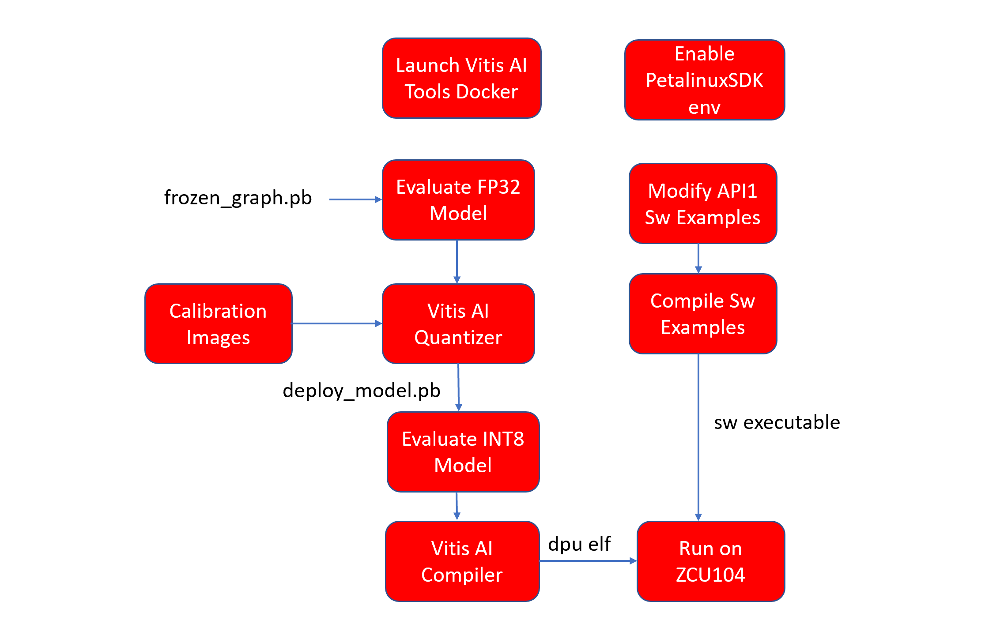
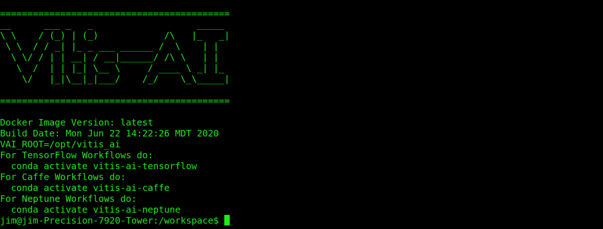
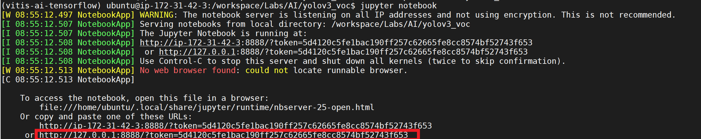
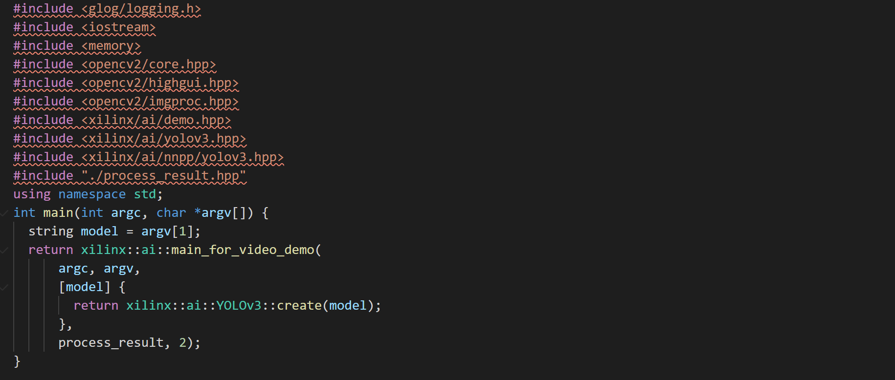
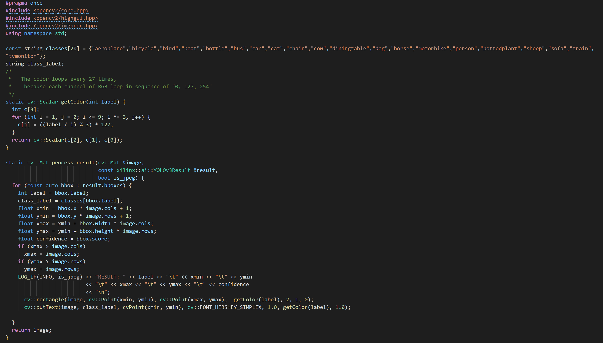
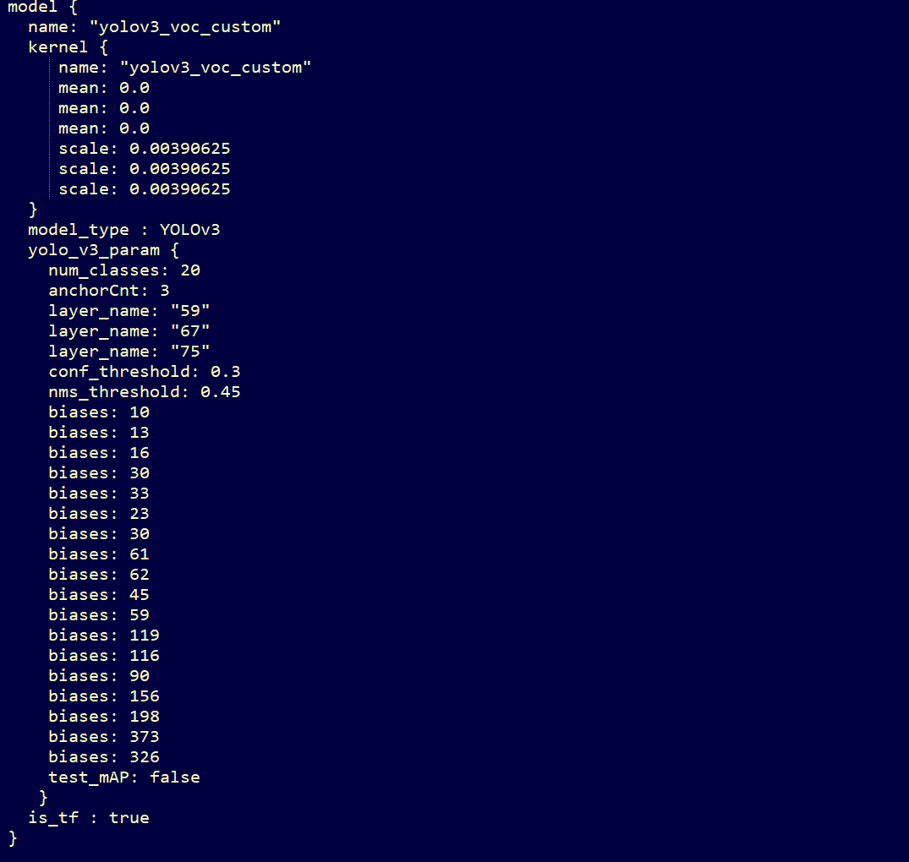
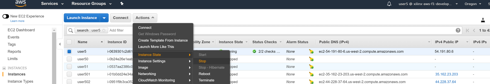
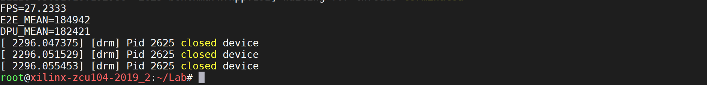
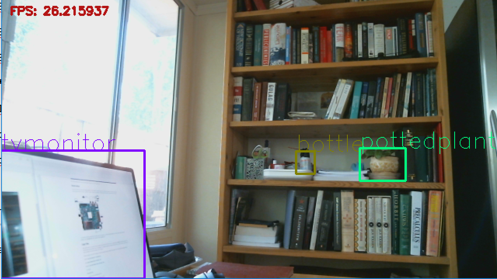

# ML at the Edge - Introduction Lab

## Introduction

In this lab, you will use the Vitis&trade; AI 1.2 tool kit to quantize and compile a Yolov3 TensorFlow model that utilizes the Xilinx® Deep Learning Processor (DPU) on the ZCU104 board. The Yolov3 model was trained on the Pascal VOC data set.

You will also use the high-level Vitis AI Library APIs to build sw examples to measure DPU performance and display the video stream using a USB camera.  

## Prerequisites

For this lab, the tools have been pre-installed on an AWS p2.xlarge instance, and you should have been provided with login information.

If you want to run this lab on another machine, the following is required:

  + An Ubuntu host machine configured with the requirements defined in Table 2 of the <a href="https://www.xilinx.com/support/documentation/sw_manuals/vitis_ai/1_2/ug1414-vitis-ai.pdf">Vitis AI User Guide (UG1414)</a>.
  + The host machine should also have:
    + Either the `vitis-ai-docker-tools` GPU image or the `vitis-ai-docker-tools` CPU image.
    + The Petalinux SD environment for the Vitis-AI-Libaries
    + A terminal emulator and/or SSH Client, such as Putty.

For more details, refer to the [Vitis AI Repository](https://github.com/Xilinx/Vitis-AI).

  + The host machine will need access to the internet for downloading files.
  + A ZCU104 evaluation board.

## Lab Flow

The following figure shows the lab flow:



## **Connecting to your P2 instance (skip if running from local machine)**

In this module, you will start an EC2 P2 instance, and connect to it using SSH or a remote desktop client. When connected, you will use the tool with all needed scripts and data sets. For this event, each registered participant will be required to start an EC2 P2 instance; therefore, participants need to have experience with:

- AWS accounts and launching EC2 instances

- Connecting to a running instance using SSH or Windows Remote Desktop

## **Logging into AWS and Start the Instance (skip if running from local machine)**

The AWS environment <https://aws.amazon.com> is applied for this lab. You will be assigned a specific user name and unified password to log in.

* **Account ID**: Refer to Tag information

* **IAM User name**: `userXXXX` (refer to the tag)

* **Password**: `xlnx_XDF` (refer to the tag)

  


1. Log in using the supplied credentials.   
 The following page displays.

  

2. Verify that the region is already set to **US West (Oregon)** in top right corner.

3. Click **Services \> EC2 \> Instances** on the top left corner. You will see a
list of instances.

4. Click **Actions \> Instance State \> Start** to select the instance associated with your user name.

5. In the Start Instance dialog, click **Yes, start**.

  

  **Note**: The startup time is about 20 \~30 seconds, and you need to refresh the browser to see the status update. You will see the instance state becomes running and there is an **IPv4 public IP** address associated with it. Later, you will use this IP address for SSH or Windows Remote Desktop Connection to access the working directory.

  

## Connecting to Your AWS instance Using SSH (skip if running from local machine)

In the SSH client, such as PuTTy, use the IPv4 Public IP of your instance:

`  ssh ubuntu\@\<your IPv4 Public IP\>`

The first time you connect, you might for a username and password. Enter the following:

* **Username**: `ubuntu` (refer to the tag)

* **Password**: `xlnx_XDF` (refer to the tag)

## Launching the Vitis AI Tools Docker Container

The following instructions assume that you placed the lab files in a directory named yolov3_voc. From within the yolov3_voc directory in your terminal, type:

 ```
 bash <Path to Vitis-AI Install>/docker_run.sh xilinx/vitis-ai-gpu:latest
 ```

  The docker container launches.



## **Entering the Anaconda Environment**

Type the following to enter the Anaconda environment.
```
conda activate vitis-ai-tensorflow
```

## **Jupyter Notebook**

For this AI Edge lab, you will use Jupyter Notebook.

Jupyter Notebook is an environment that combines codes with inline
instructions. Rather than type commands manually, you can simply click the **Run** button in front of the code section to execute your the commands.
When finished, the output is printed. Run the code block in sequence, *NOT in parallel*.

When the code block is running, there will be a star in the brackets. Wait until it finishes.
When finished, the star will turn into number, and you can jump to the next one.

To run the lab:

1. Execute the Jupyter notebook using the following command:

```
jupyter notebook
```

2. Copy the link into the browser. Change the IP address to *\<your IPv4 Public IP\>,*

 

 The following window displays:

 

3. In the files folder, double-click the **yolov3_voc.ipynb** file to start the lab.

4. Follow the instructions in the Jupyter notebook to generate the `dpu_yolov3_voc.elf` file.

 

## Using the Vitis AI-Library SW Examples

You will now use the Vitis AI Library SW Examples. The Vitis AI Library allows you to quickly build applications for Xilinx or custom models for the following use cases:

* Using Xilinx models directly from the Vitis AI Model Zoo

* Using your own models that are retrained by your own data under the Vitis AI library supported network list

* Using custom models, similar to the models supported by the Vitis AI libraries, and using the Vitis AI’s post processing library.

Three API Levels are provided. In this lab, you will use the API-1 flow.

 

For more details about using the Vitis AI-Library and various APIs, refer to the *Vitis AI Library User Guide* ([UG1354](https://www.xilinx.com/support/documentation/sw_manuals/vitis_ai/1_2/ug1354-xilinx-ai-sdk.pdf)).

You should now be out of the Vitis AI Tool docker container. If you have not done so, press **Ctrl + C** to close your Jupyter Notebook. Then, press **Ctrl + D** to close the docker container.

## Enabling the PetaLinux SDK Environment

This assumes that you have setup your host environment for the Vitis-AI-Libaries
For more info see:  https://github.com/Xilinx/Vitis-AI/tree/master/Vitis-AI-Library

```
source <Path to PetaLinux SDK>/environment-setup-aarch64-xilinx-linux
```

Change to the following directory:

```
cd yolov3_voc/sw
```

## Building Software Examples

Notice that four files have been copied from the Vitis AI_Libraries from`<Vitis-AI Install Path>/Vitis-AI-Library/overview/samples/yolov3` to the following local directory:


* The `test_performance_yolov3.cpp` file measures dpu performance:

 

* The `test_video_yolov3.cpp` file displays the object detection in real-time using openCV for video acquisition.

 

* The `process_result.hpp` is used by `test_video_yolo application` to process the detection results from the DPU. It has been modified to display the label class names on the detection boxes.

 

Run the following build script:

```
bash build.sh
```

The following two application binaries now display in the directory.


## Understanding Board Files

You are now ready to copy your application executables and the `dpu.elf` file to the ZCU104 board. Before you start, lets understand how the model post-processing is configured on the target board using a prototxt file.

The prototxt file `yolov3/zcu104/yolov3_voc.prototxt` is shown in the following figure. It configures the model post-processing with model parameters, such as the number of classes, the anchor points (biases), and the detection threshold.




## Setting Up the Board

For this lab, you will use the Xilinx ZCU104 board as the hardware platform. A 16 GB SD card, which holds the boot image and necessary demo files, is provided as the boot device. A 1080p DP monitor is required as the display. An Ethernet cable is needed to download the ELF file from home.

The Vitis AI Prebuilt Linux Image and the Vitis AI Libraries have already been installed. If you are running this lab on your ZCU104 own board, follow the Target Install instructions for the Vitis-AI-Libraries: https://github.com/Xilinx/Vitis-AI/tree/master/Vitis-AI-Library.


The SD card already is in the slot, and if the board is correctly powered on, you will see the desktop display on the monitor after booting. The board IP address is set to **192.168.0.104**; and the password is **root**.

Note: if you are running this lab on your own, you can set the IP address of the ZCU104 using the `ifconfig` command:
```
ifconfig eth0 192.168.0.104
```
You will also need to set a static IP addess on your host machine, for example 192.168.0.105

## Copying Files

After booting the board, use the `scp` command to copy the .elf file from AWS to your computer or use a program  such as  **File Zila** to finish the file transfer. In this lab, only the File Zila flow is introduced as an example.

To complete the transfer, two steps are required:
1. Copy the `dpu.elf` and sw excutable files from AWS to the local laptop.
2. Copy these files from the local laptop to the ZCU104 board.

When you open File Zila, the repository on the left is the local drive. You must log into  AWS with the following information.

* Host IP: **<your IPv4 Public IP\> / 192.168.0.105**
* User: **ubuntu (Please refer to the tag) / root**
* Password: **xlnx_XDF (Please refer to the tag) / root**
* Port: **22 / 22**

**From AWS Copy (or Host Machine):**

 - `yolov3_voc/sw/test_video_yolov3`

 - `yolov3_voc/sw/test_performance_yolov3`

 - `yolov3_voc/vai_c_output/dpu_yolov3_voc.elf`

 - `yolov3_voc/zcu104/yolov3_voc/yolov3_voc.prototxt`

 - `image directory`

**To ZCU104 Copy**
You can use such as **File Zila** to copy the files from your local machine to the ZCVU104. Use the following log in information.
* IP: **192.168.0.104**
* User: **root**
* Password: **root**
* Port: **22**


Create the following directories on the ZCU104 Board.

```
mkdir ~/Lab
mkdir ~/Lab/yolov3_voc
```

Copy the following files

- `test_video_yolov3         to ~/Lab/`

- `test_performance_yolov3   to ~/Lab/`

- `dpu_yolov3_voc.elf        to ~/Lab/yolov3_voc/yolov3_voc.elf` (Note the name of the elf file is changed)

- `image directory           to ~/Lab`

- `yolov3_voc.prototxt       to ~/Lab/yolov3_voc/`

## **Stopping the AWS Instance**

**IMPORTANT:** Stop your AWS sever at this time.



## Running Software

To communicate with the board, use terminals like **Tera Term** or **MobaXterm**. Set the baud rate to 115200 bps.

From your terminal, enter the following:

```
cd ~/Lab

chmod 777 test_video_yolov3

chmod 777 test_performance_yolov3

export DISPLAY=:0.0
```

To run the performance test, use five threads:

```
./test_performance_yolov3 yolov3_voc images/image.lst -t5
```

**NOTE:** There are two DPUS running in parallel in the logic fabric of the Zynq&reg;  UltraScale+&trade; MPSoC device on the ZCU104 board.

The DPU\_MEAN time divided by the number of threads gives the dpu processing time in μS for each image.

The E2E\_MEAN time divided by the number of threads gives the end to end processing time in μS for each image.



Try running this again with different thread numbers.

Use the following code to run the video test with camera input using five threads:

```
./test_video_yolov3 yolov3_voc 0 -t5
```

If you have time, you can experiment by changing the detection threshold (conf_threashold) in  `~Lab/yolov3_voc/yolov3_voc.prototxt` file. This changes the sensitivity of the detection. Objects with a confidence level above the threshold are displayed.



## Conclusion

This tutorial guided you through completing an end-to-end deployment flow from a TensorFlow model to DPU instructions, and finally running on the selected hardware platform.

Here is a review of the key tasks:

1. Quantization followed by evaluation progress.

2. DPU Compilation (dpu elf file creation) with assigned hardware platform.

3. Use of the Vitis AI Library Examples to quickly create software test applications.
