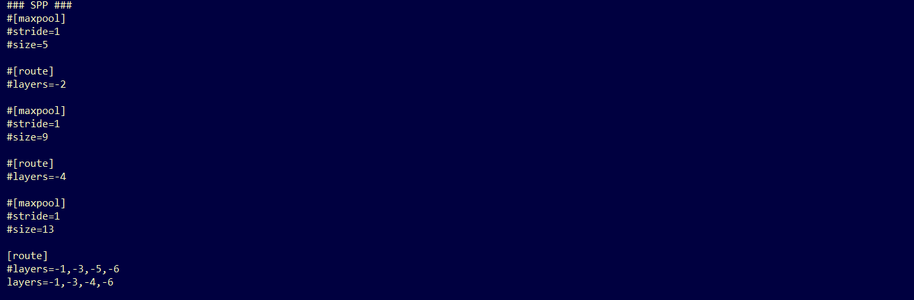
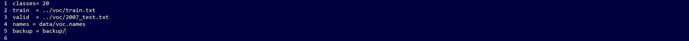
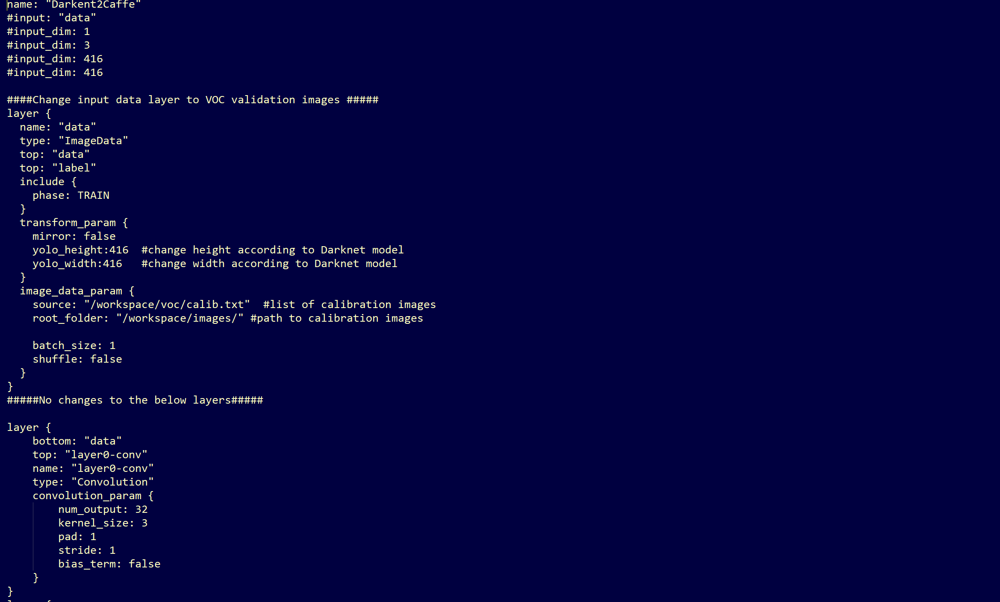
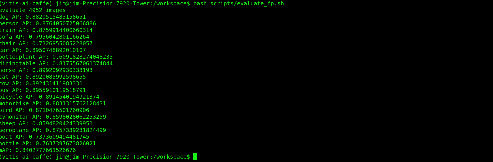
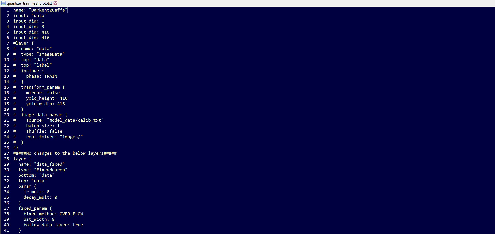
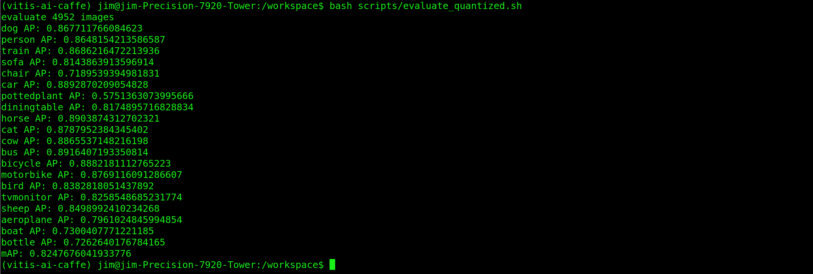
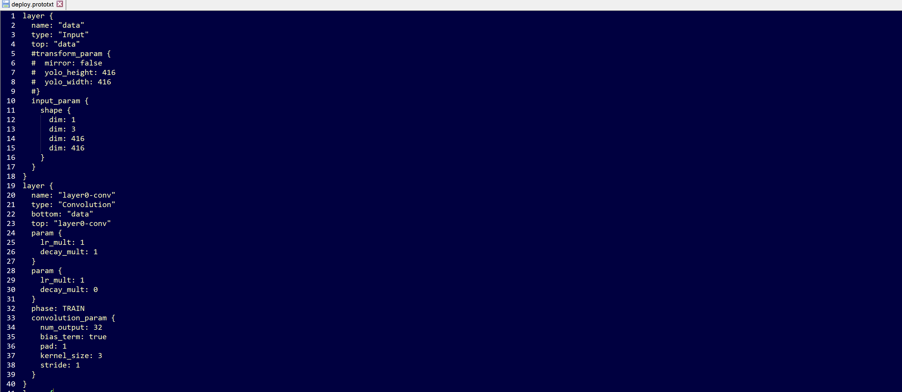
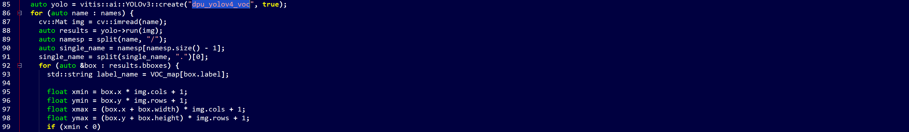

<table>
 <tr>
   <td align="center"><h1>Vitis AI Tutorials</h1>
   </td>
 </tr>
 <tr>
 <td align="center"><h3>YoLov4</h3>
 </td>
 </tr>
</table>

# Tutorials

## Introduction

The following tutorials cover training, evaluating, converting, quantizing, compiling, and deploying YoLov4 on the Xilinx&reg; ZCU102 and ZCU104 evaluation boards.  

We modified the official YoLov4 model configuration to make it compatible with the Xilinx Zynq&reg; UltraScale+&trade; Deep Learning Processor (DPU). These modifications typically result in a 1-2% accuracy loss compared to the original model.

Vitis AI does not natively support Darknet and the trained Darknet model and can be converted with two options:
- TensorFlow: using 3rd party repositories.
- Caffe conversion: using the Vitis-AI Darknet to Caffe conversion tool.

Each  of the conversion flows is covered as a separate Tutorial:
- Part 2 YoLov4 trained on COCO and using conversion to TensorFLow
- Part 3 YoLov4 trained on VOC and using conversion to Caffe

This tutorial is organized into the following steps:

1.)  Installation and Darknet Setup

2.) Training on Coco and Converting to TensorFLow

2.1) Darknet Model Training for Coco

2.2) Darknet Model Conversion to TensorFLow

2.3) Model Quantization and Compilation

2.3) Model Deployment on ZC102

3.) Training on VOC and Converting to Caffe

3.1) Darknet Model Training for VOC

3.2) Darknet Model Conversion to Caffe

3.3) Model Qauntization

3.4) Model Evaluation

3.5) Model Compilation

3.6) Model Deploymnet on ZCU104

## General Installation and Darknet Setup
A few prerequisites for the required environment:

  - Ubuntu 16.04, 18.04 or other Linux Vitis AI&trade; supported distributions
  - For model training or evaluation, ensure you have NVidia Drivers, CUDA 10.0, and CuDNN installed to /usr/local/cuda (it can be a soft link)
  - The automated scripts use Conda, so make sure you have Anaconda installed if you want to use these
  - Install OpenCV 4.4
  - This Tutorial has been tested on Vitis AI 1.4

- The first step is to clone and follow the install steps for Vitis AI on the host machine: https://github.com/Xilinx/Vitis-AI
- Next, extract the contents of this tutorial within the Vitis AI folder
- The AlexyAB branch of Darknet is needed to train the YoLov4 model:
``` git clone https://github.com/AlexeyAB/darknet```

- Next cd to the Darknet folder, open the Makefile, and make the following edits (assuming you have a CUDA capable GPU):
    ```
    GPU=1
    CUDNN=1
    CUDNN_HALF=0
    OPENCV=1
    LIBSO=1
    ```
- Build Darknet by running `make` (you can use `make -jx` where x is the number of processors you have).

``` make ```

## 2. YoLov4 using COCO Data Set and converting to TensorFlow Tutorial
This tutorial covers the Darknet to TensorFlow process.

## 2.1 Darknet Model Training on COCO

To convert to TensorFlow, you will alos need the following repository:
  - david8862 Keras Model Set: https://github.com/david8862/keras-YOLOv3-model-set

``` git clone https://github.com/david8862/keras-YOLOv3-model-set```

Create, activate, and set up a virtual environment by running:
 ```
  source scripts/setup_environment.sh
  conda activate yolov4
  pip install -r requirements.txt
```

This tutorial uses the COCO 2017 dataset, though COCO 2014 also works. You can adapt the detection dataset to suit your application.

In terms of differences versus the official YoLov4 model, this tutorial makes two making modifications to enable compliance with the Zynq Ultrascale+ DPU:

- The MISH activation layers are swapped to leakyrelu as the DPU doesn't support MISH
- The SPP module maxpool sizes have been changed to 5x5, 6x6, and 8x8 as the DPU has a maximum kernel size of 8x8

After making these changes to the model and retraining on COCO 2014/2017, the YoLov4 model achieves 63.4% mAP @ IOU50 and 41.3% AP using the COCO test2017 image set on the Codalab COCO evaluation server.  This is approximately a 2% degradation in mAP from the original model, though still a significant improvement over Yolov3 (~9% AP improvement).

The tutorial provided a few scripts to help setup the COCO2017 dataset as Darknet requires a specific format for the labels.

You will need to download the train and validation images as well as the associated annotations:

- train images: http://images.cocodataset.org/zips/train2017.zip
- val images: http://images.cocodataset.org/zips/val2017.zip
- train/val annotations: http://images.cocodataset.org/annotations/annotations_trainval2017.zip

Once you have extracted these files, you can use some of the provided scripts to process the annotations and generate the files needed for training within darknet.

 - Under the scripts directory, there are two scripts "gen_yolo_train_labels.sh" and "gen_yolo_val_labels.sh".  Open these two scripts and edit the paths to the annotations files as well as images.  The -labels argument provides a path where to write the txt files and darknet expects these to be in the same directory as the images.

 - After providing the specific paths to your dataset, run these two scripts. It takes some time (likely a couple hours) to process all the annotations.

 - Next, you need to generate the list files val2017.txt and train2017.txt which are used by darknet to provide a list of images for training and validation.  The tutorial contains the `dk_files/gen_coco_lists.sh` script that can be used for this purpose. You need to open it and edit the paths to the validation and training datasets.

  - Generally, when training, the model.cfg file input size is set to 512x512, and when deploying the model, it can be changed to a smaller input size such as 416x416 to increase FPS.

      - There is also a script to measure map with Darknet directly and this is under 'dk_files/dk_measure_map_yolov4.sh'.  This approach reports an mAP of about 70% @ 50IOU when using 512x512 input size.

      - When measuring accuracy with the pycocotools, the observed mAP is about 60.2%. A script has been provided under scripts/dk_eval_yolov4_pycocotools_2017.py.  It is possible that the difference lies in the evaluation code used by darknet vs. pycocotools which compares the output to the ground truths. This has not been investigated  extensively.

        - This script uses the instances_val2017.json file to loop through each annotation, read the image, run inference in darknet and post processing, then write the results to a json file.  The results are then read back in at the end and evaluated with the pycocotools API.

## 2.2.: Darknet Model Conversion
The next step is to convert the darknet model to a frozen TensorFlow graph.  The keras-yOlOv3-model-set repository provides some helpful scripts for this.   

 - To convert the model that is populated under dk_model, you can cd to the scripts directory and run 'convert_YoLo.sh'.  This creates the keras.h5 model as well as the converted frozen TF graph under the tf_model folder.  

 - To evaluate the converted model, I have provided the 'tf_eval_yolov4_coco_2017.py' script that can be used to evaluate the TensorFlow frozen graph against the COCO2017 validation set.  

   - One key step is that this file expects the val2017 folder (containing the images for validation) and instances_val2017.json to be present under the scripts folder.  The reason for this is so that this script can be run with the quantized model within the docker container.  Make sure to copy these two items directly into the scripts folder before running the evaluation.

   - The mAP when measured on the frozen TensorFlow model with this approach is ~60.2% @ IOU50.

   - At this point the frozen TensorFlow graph under tf_model/tf_model.pb is ready for quantization/compilation.

### Notes on Alternative Conversion Flow:

If you run into trouble converting your model with the david8862 Keras Model Set repository, there is an alternative approach for converting the model.  The alternative repository can be found here: https://github.com/qqwweee/keras-yolo3.

This repository has a similar script (convert.py) which can be used to convert from Darknet to Keras.  You will need to update the model_data/yolo_anchors.txt with the YoLov4 anchors, but otherwise,  this repository has been tested and it results in the exact same accuracy as the other conversion repository.

If you use this alternative approach for converting the model, you will still need to use convert from Keras to TensorFlow which can be done using the other david8862 Keras Model Set repository Keras to TensorFlow script.  You can reference the scripts/convert_yoloov4.sh for an example command to do this step.

This repository results in different layer names, so to run the quantization, you will need to modify the quantize_yolov4.sh script and change the following:

    Change –input_nodes to input_1
    Change –output_nodes to conv2_94/BiasAdd,conv2_102/BiasAdd,conv2_110/BiasAdd

You will also need to modify the yolov4_graph_input_keras_fn.py to and change line 95 to:

return {“input_1”: images}

If you want to use the evaluation script “tf_eval_yolov4_coco_2017.py”, you will also need to make the same updates as noted above on lines 514-517.

When deploying the model, you will also need to update the dpu_yolov4.prototxt file which is under the dpu_yolov4 folder and change the layer_name parameters (increment them by 1).

## 2.3) Model Quantization/Compilation
At this point, you will need to start the docker container and activate the conda environment for TensorFlow 'conda activate vitis-ai-tensorflow'.

- Next install pycairo and pycocotools (both can be installed with pip).

- If you followed the steps in the previous section, you should have the validation images in the scripts directory, if you did not go ahead and copy val2017 into the scripts directory

- Change directory to the scripts folder and run `./quantize_yolov4.sh`.  This produces a quantized graph in the yolov4_quantized directory a level above the scripts directory.

- The quantized model can now be evaluated against the COCO2017 dataset by modifying 'tf_eval_yolov4_coco_2017.py' and setting quantized = '1'.

- My quantized model achieves ~58.1% mAP @ IOU50 on COCO2017 validation set.

- The model can now be compiled for the ZCU102 by running `./compile_yolov4.sh` from the scripts directory

## 2.4: Model Deployment
Once you have set up your board image to run the [Vitis-AI-Library](https://github.com/Xilinx/Vitis-AI/blob/master/tools/Vitis-AI-Library/README.md#setting-up-the-target) examples, you can proceed to the following steps.

The code used to run YoLov3 from the Vitis-AI-Library can also be used to run YoLov4.  If the target has been setup correctly, this should be present under ~/Vitis-AI/demo/Vitis-AI-Library/samples/yolov4. CD into this directory to run the example and build the examples: 'bash -x build.sh'

- On the host machine copy the compiled model .xmodel file dpu_yolov4 directory.

- Next copy the entire dpu_yolov4 directory into the **/usr/share/vitis_ai_library/models/** directory on the target ZCU102 board.  

- Run with 6 threads with a webcam using:

```
 ./test_video_yolov4 dpu_yolov4 0 -t 6
```
In this short tutorial, we've covered how to train, evaluate, convert, quantize, and deploy a DPU compatible version of YoLov4 the ZCU102 board.  Good luck and happy developing!

## 3.0) YoLov4 using VOC Data Set and converting to Caffe Tutorial
This tutorial covers the Darknet to Caffe process.

## 3.1: Darknet Model Training on VOC


- This Tutorial uses the VOC dataset. You can run the following script to download the dataset and ground truth files. A python file is used to create the labels so you will need to create a python env if you do not have one:
 ~~~
 conda create -n yolov4 pip python=3.6
 conda activate  yolov4
 bash scripts/get_voc_dataset.sh
~~~

- Next you will need to modify the configuration file **darknet/cfg/yolov4.cfg** to be compatible with the Zynq Ultrascale+ DPU. The MISH activation layers are swapped to leaky as the DPU doesn't support MISH. The SPP module maxpool section has kernel sizes of 5, 9, 13, and the DPU only supports a maxpool kernel size of up to 8. There are also additional restrictions for maxpool when the stride=1 and converting to Caffe. There are 3 possible changes you can make to the SPP Section:
  - Change all max kernel sizes to 1, 1, 1
  - Change all kernel sizes 3,5, 7
  - Comment out max_pool layers

- I saw the best post Quantization accuracy results when commenting out the 3 max_pooling layers as follows. Note the route layers were changed to -1,-3,-4,-6 from -1,-3,-5,-6



- Make the following additional changes:
  - set height to 416 and width to 416
  - set max_batches to 1001000
  - set number of classes to 20 for each output layer
  - set filter size of convolutional layer before each output layers to 75

- **Note:** The batch size divided by the subdivision is the number of images sent to the GPU at one time. I used a sub division value of 16. If your GPU has enough memory you can try reducing the subdivision size to a smaller number for faster training. If you get a GPU memory error during training you will need to go back and increase the subdivision value.

- Make the following changes to the **darknet/cfg/voc.data** file:



- Download YoLov4 pretrained weights. From within the darknet directory run:

```wget https://github.com/AlexeyAB/darknet/releases/download/darknet_yolo_v3_optimal/yolov4.weights```

- Launch Training:

``` ./darknet detector train cfg/voc.data cfg/yolov4.cfg yolov4.weights -map```

- It should take about 150K Iterations for the training to converge. To measure accuracy you can use the following command:

``` ./darknet detector map  cfg/voc.data cfg/yolov4.cfg backup/yolov4_best.weights -letterbox -point 11```

- For my trained model I saw:
  - mAP for model with modifications              82.39%             
  - mAP for original model with no modification    82.55%

## 3.2: Darknet Model Conversion
- The next step is to convert the darknet model to a Caffe model. This will be done using the built in conversion function which is part of the Vitis-AI Caffe install.
~~~
bash <Path to Vitis-AI Install>/Vitis-AI/docker_run.sh xilinx/vitis-ai-gpu:latest
conda activate vitis-ai-caffe
bash scripts/darknet_convert.sh
~~~

## 3.3: Model Quantization
- Before quantizing  the model, we will need to make a minor modifcations to .prototxt file to point to the calibration images. Make a new copy of the prototxt file and make  the following edits:

``` cp voc/yolov4.prototxt voc/YoLov4_quant.prototxt ```



For easy reference here are the lines to copy:
~~~
  name: "Darkent2Caffe"
  #input: "data"
  #input_dim: 1
  #input_dim: 3
  #input_dim: 416
  #input_dim: 416

  ####Change input data layer to VOC validation images #####
  layer {
    name: "data"
    type: "ImageData"
    top: "data"
    top: "label"
    include {
      phase: TRAIN
    }
    transform_param {
      mirror: false
      yolo_height:416  #change height according to Darknet model
      yolo_width:416   #change width according to Darknet model
    }
    image_data_param {
      source: "voc/calib.txt"  #list of calibration imaages     
      root_folder: "images/" #path to calibartion images

      batch_size: 1
      shuffle: false
    }
  }
  #####No changes to the below layers#####
~~~

``` bash scripts/run_vai_q.sh ```

## 3.4: Compare Accuracy Between Floating Point and Quantized Models (Optional)

~~~
bash scripts/test_caffe_fp.sh
bash scripts/evaluate_fp.sh
~~~

  - The mAP value for our trained model was 84.03%



#### **Generate predictions using quantized model**
- In order to run predictions on the quantized model, we first will need to make some minor edits to the simulation prototxt file quant_output/quantize_train_test.prototxt Make the following edits to input layer so  that you file looks like the following:



~~~
bash scripts/test_quantized.sh
bash scripts/evaluate_quantized.sh
~~~
  - The map value for our quantized model was 82.48%




## 3.5) Model Compilation

#### **Prototxt File Mods**
- Before compiling the model we will need to make a minor edit to the deploy prototxt file **yolov4_quantized/deploy.prototxt**. Comment out lines 5-9 as shown below:




```bash scripts/run_vai_c_zcu104.sh```

The compiled xmodel file will be located in yolov4_compiled/dpu_yolov4_voc.xmodel

## 3.6: Running  the Vitis AI Library Examples

Once you've set up your board image to run the [Vitis-AI-Library](https://github.com/Xilinx/Vitis-AI/blob/master/tools/Vitis-AI-Library/README.md#setting-up-the-target) examples, you can proceed to the following steps.

- On the host machine copy the compiled model .xmodel to the the dpu_yolov4_voc directory.
- Next copy the entire dpu_yolov4 directory into the directory **/usr/share/vitis_ai_library/models/** on the target ZCU104 board.  

The code used to run YoLov4 samples  from the Vitis-AI-Library can also be used to run the model.  If the target has been setup correctly, this should be present under ~/Vitis-AI/demo/Vitis-AI-Library/samples/yolov4.

```
cd ~/Vitis-AI/demo/Vitis-AI-Library/samples/yolov4
```

- If you would like to run a VOC accuracy example there is an example from samples/yolov3 that you can use. On the target board:

```
cp ../yolov3/test_accuracy_yolov3_voc.cpp ./test_accuracy_yolov4_voc.cpp
```

 You will also need to  make the following edit to line to change the model to match your .xmodel name:


- Next build all the examples

```
bash build.sh
```


### Running the Yolo Video Test
- To run the Yolo Video Test webcam using 4 threads use the following command. Assuming that you have a DP Monitor connected, you will also the DISPLAY variable first.

```
export DISPLAY=:0.0
./test_video_yolov4 dpu_yolov4_voc 0 -t4
```

### Running the Yolo Accuracy Test
- To run the Yolo Accurarcy test against the VOC data test set, you will need to copy the images directory from the host machine to the target ZCU104 board. In addition copy the image list file voc/2007_test.txt to the targt board.

- Change the conf_threshold value in file **/usr/share/vitis_ai_library/models/dpu_yolov4_voc/dpu_yolov4_voc.prototxt** to 0.005

```./test_accuracy_yolov4 2007_test.txt yolov4_voc_pred.txt```

- This will take a few minutes to run. When the predictions complete, copy the file **yolov4_pred.txt** to your host machine and run the evaluation from within your Vitis-AI Caffe conda environment:

``` bash ./scripts/evaluate_boards.sh```

  - The mAP reported should be close to what was reported for the Quantized mAP

### Running the Yolo Performance test
- To run the Yolo Performance Test, create a file called image.list on the ZCU104, and add the first 5 images names from the file 2007_test.txt. To run with 4 threads use the following command:
  - Running on a  ZCU104 you should see a performance around 28FPS.

``` ./test_performance_yolov3 dpu_yolov4_voc image.list -t4 -s30```


In this short tutorial, we've covered how to train, evaluate, convert, quantize and deploy a dpu compatible version of YoLov4 on the ZCU104 board.  Good luck and happy developing!

Copyright 2020-2022 Xilinx Inc.
Licensed under the Apache License, Version 2.0 (the "License");
you may not use this file except in compliance with the License.
You may obtain a copy of the License at: http://www.apache.org/licenses/LICENSE-2.0
Unless required by applicable law or agreed to in writing, software distributed under the License is distributed on an "AS IS" BASIS, WITHOUT WARRANTIES OR CONDITIONS OF ANY KIND, either express or implied.
See the License for the specific language governing permissions and limitations under the License.
