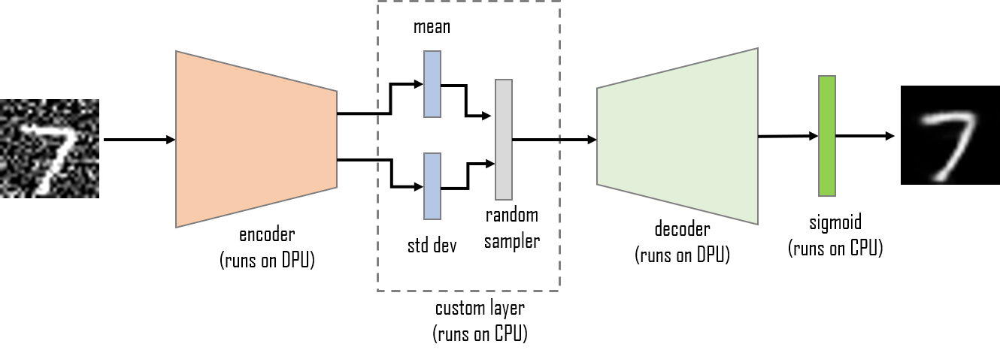
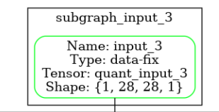
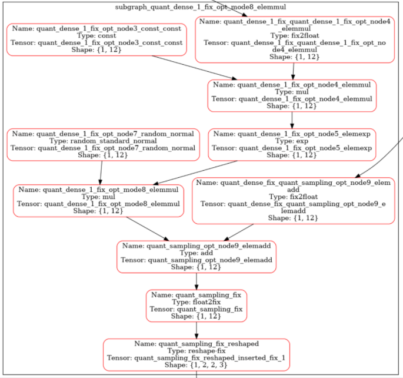

<!--
Copyright 2021-2022 Xilinx Inc.

Licensed under the Apache License, Version 2.0 (the "License");
you may not use this file except in compliance with the License.
You may obtain a copy of the License at

http://www.apache.org/licenses/LICENSE-2.0

Unless required by applicable law or agreed to in writing, software
distributed under the License is distributed on an "AS IS" BASIS,
WITHOUT WARRANTIES OR CONDITIONS OF ANY KIND, either express or implied.
See the License for the specific language governing permissions and
limitations under the License.

Author: Mark Harvey, Xilinx Inc
-->
<table class="sphinxhide">
 <tr>
   <td align="center"><h1>Vitis AI Tutorials</h1>
   </td>
 </tr>
 <tr>
   <td align="center"><h1>Denoising Variational Autoencoder with TensorFlow2 and Vitis AI</h1>
   </td>
  </tr>
</table>

## Current Status

+ Tested on ZCU102 with Vitis AI&trade; 1.4


# Introduction

The Xilinx&reg; DPU can accelerate the execution of many different types of operations and layers that are commonly found in convolutional neural networks(CNNs) but occasionally we need to execute models that have fully custom layers. One such layer is the sampling function of a convolutional variational autoencoder. The DPU can accelerate the convolutional encoder and decoder but not the statistical sampling layer. This must be executed in software on a CPU. This tutorial will use the variational autoencoder as an example of how to approach this situation.

# The Variational Autoencoder

An autoencoder is an artificial neural network that learns how to efficiently compress and encode data to a lower dimensionality and reconstruct the data back from the reduced encoded representation to something as close as possible to the original input. It is a form of representation learning.
An autoencoder consists of three main parts, the encoder, the decoder, and between them a ‘bottleneck’ or ‘latent space’, which is the encoded version of the input.
The encoder and decoder can be made up of MLPs, CNNs, or LSTMs. This tutorial uses a CNN-based encoder and decoder.
A variational autoencoder maps the input to a latent space which is a  normal distribution. We pass the mean and standard deviation of the learned distribution to the decoder.

<p align="center">
 <br><br>
 
 <br>
 Figure 1: Variational Autoencoder architecture
 <br><br>
</p>

The variational autoencoder model is defined in the vae.py Python script. The encoder section is a series of 2D convolution layers (with batchnorm and ReLU activations) that reduce the dimensions of the input feature map. The final feature map is flatten and then passed to two dense/FC layers. The dense/FC layer outputs are encoder_mu, encoder_log_variance and the sampled latent space (encoder_z).

The custom layer in our model samples the latent space using the well know 'reparametrization trick' which overcomes problems related to backpropagation:

```python
class Sampling(layers.Layer):
    """Uses (encoder_mu, encoder_log_variance) to sample encoder, the vector encoding a digit."""

  def call(self, inputs):
      encoder_mu, encoder_log_variance = inputs
      batch = tf.shape(encoder_mu)[0]
      dim = tf.shape(encoder_mu)[1]
      epsilon = tf.keras.backend.random_normal(shape=(batch, dim))
      return encoder_mu + tf.exp(0.5 * encoder_log_variance) * epsilon
```

# Before you Begin

The host machine has several requirements that need to be met before we begin. You will need:

  + An x86 host machine with a supported OS and either the CPU or GPU versions of the Vitis AI docker installed - see [System Requirements](https://github.com/Xilinx/Vitis-AI/blob/master/docs/learn/system_requirements.md).

  + The host machine will require Docker to be installed and the Vitis AI CPU or GPU docker image to be built - see [Getting Started](https://github.com/Xilinx/Vitis-AI#getting-started).

  + A GPU card suitable for training is recommended, but the training in this tutorial is quite simple that can be done using a CPU.

  + If you plan to use the ZCU102 evaluation board, it should be prepared with the board image as per the [Step2: Setup the Target](https://github.com/Xilinx/Vitis-AI/tree/master/setup/mpsoc/VART#step2-setup-the-target) instructions. Hints on how to connect the various cables to the ZCU102 are also available [here](https://www.xilinx.com/html_docs/vitis_ai/1_4/installation.html#yjf1570690235238).

  + For the Alveo&trade; U50, follow the [Setup Alveo Accelerator Card](https://github.com/Xilinx/Vitis-AI/tree/master/setup/alveo) instructions.


For more details, refer to the latest version of the *Vitis AI User Guide* ([UG1414](https://www.xilinx.com/html_docs/vitis_ai/1_4/zmw1606771874842.html)).

This tutorial assumes you are familiar with Python3, TensorFlow, and have some knowledge of machine learning principles.


# Setting up the Workspace

1. Copy this repository by doing either of the following:

    + Download the repository as a ZIP file to the host machine, and then unzip the archive.
    + From a terminal, use the `git clone` command.

2. Open a Linux terminal, `cd` to `<path_to_autoencoder_design>/files` folder.

4. Start either the Vitis AI GPU or CPU docker (we recommend using the GPU docker if possible):

     ```shell
     # navigate to files folder
     cd <path_to_autoencoder_design>/files

     # to start GPU docker container
     ./docker_run.sh xilinx/vitis-ai-gpu:latest

     # ..or if you wish to use CPU docker container
     ./docker_run.sh xilinx/vitis-ai-cpu:latest
     ```

  The docker container will start and after accepting the license agreement, you should see something like this in the terminal:

     ```shell
     ==========================================

     __      ___ _   _                   _____
     \ \    / (_) | (_)            /\   |_   _|
      \ \  / / _| |_ _ ___ ______ /  \    | |
       \ \/ / | | __| / __|______/ /\ \   | |
        \  /  | | |_| \__ \     / ____ \ _| |_
         \/   |_|\__|_|___/    /_/    \_\_____|

     ==========================================

     Docker Image Version:  1.4.776
     Build Date: 2021-06-22
     VAI_ROOT: /opt/vitis_ai

     For TensorFlow 1.15 Workflows do:
          conda activate vitis-ai-tensorflow
     For Caffe Workflows do:
          conda activate vitis-ai-caffe
     For Neptune Workflows do:
          conda activate vitis-ai-neptune
     For PyTorch Workflows do:
          conda activate vitis-ai-pytorch
     For TensorFlow 2.3 Workflows do:
          conda activate vitis-ai-tensorflow2
     For Darknet Optimizer Workflows do:
          conda activate vitis-ai-optimizer_darknet
     For Caffe Optimizer Workflows do:
          conda activate vitis-ai-optimizer_caffe
     For TensorFlow 1.15 Workflows do:
          conda activate vitis-ai-optimizer_tensorflow
     For LSTM Workflows do:
          conda activate vitis-ai-lstm
     Vitis-AI /workspace >
     ```

>:bulb: *If you get a "Permission Denied" error when starting the docker container, it is almost certainly because the docker_run.sh script is not set to be executable. You can fix this by running the following command:*
>    
>    ```shell
>     chmod +x docker_run.sh
>    ```


Activate the Tensorflow2 python virtual environment with `conda activate vitis-ai-tensorflow2` and you should see the prompt change to indicate that the environment is active:


```shell
Vitis-AI /workspace > conda activate vitis-ai-tensorflow2
(vitis-ai-tensorflow2) Vitis-AI /workspace >
```


# Implementing the Design

The remainder of this README describes the steps to implement the tutorial. Each command needs to be run from within the Vitis AI Docker container which was started in the previous section.

A shell script called `run_all.sh` is also provided. It contains all the commands needed to run the complete flow:

```shell
source run_all.sh
```

## Step 1 - Training and Evaluation of the Floating-Point model

To run the training and evaluation of the floating-point model:

```shell
python -u train.py -p 2>&1 | tee build/logs/train.log
```

Use the MNIST dataset as a simple example of image denoising. The dataset download and preprocessing is done by the mnist_download() function defined in utils.py. The training and test data is downloaded using the built-in download function of the tf.keras API:

```python
def mnist_download():
  (x_train, _), (x_test, _) = mnist.load_data()
```

Scale the pixel data from range 0:255 to range 0:1 by dividing by 255. We add the channel dimension to each image (they are downloaded as (28,28) and we require them to be (28,28,1) ). Then the random noise is added to create a noisy training set and a noisy test set:


```python
# scale to (0,1)
x_train = (x_train/255.0).astype(np.float32)
x_test = (x_test/255.0).astype(np.float32)
# add channel dimension
x_train = x_train.reshape(x_train.shape[0],28,28,1)
x_test = x_test.reshape(x_test.shape[0],28,28,1)
# add noise
noise = np.random.normal(loc=0.2, scale=0.3, size=x_train.shape)
x_train_noisy = np.clip(x_train + noise, 0, 1)
noise = np.random.normal(loc=0.2, scale=0.3, size=x_test.shape)
x_test_noisy = np.clip(x_test + noise, 0, 1)
return x_train, x_test, x_train_noisy, x_test_noisy
```

In `train.py`, we create the training and test datasets:

```python
x_train, x_test, x_train_noisy, x_test_noisy = mnist_download()
train_dataset = input_fn((x_train_noisy,x_train), batchsize, True)
test_dataset = input_fn((x_test_noisy,x_test), batchsize, False)
predict_dataset = input_fn((x_test_noisy), batchsize, False)
```

Note how the train and test datasets are composed of noisy images which will be the input to the variational autoencoder model and clean images whic are the ground truths. The autoencoder learns how to generate clean images from the noisy ones.

During training, we use a loss function that quantifies the difference between the learned distribution and a standard normal distribution using Kullback-Liebler divergence (KL divergence). The second component of the loss function is a reconstruction loss, often mean-squared error (MSE) or cross-entropy is used here. The total loss is the sum of KL divergence and reconstruction loss.

The trained checkpoint will be saved at the end of each epoch if the mean squared error improves. At the end of training, we can optionally make a set of predictions using the test dataset. To make the predictions, we first reload the best checkpoint, including the custom layer:

```python
with custom_object_scope({'Sampling': Sampling}):
  model = load_model(float_model, compile=False, custom_objects={'Sampling': Sampling})
model.compile(loss=lambda y_true,y_predict: loss_func(y_true,y_predict,encoder_mu,encoder_log_variance))
predictions = model.predict(predict_dataset, verbose=1)
```

The predictions are returned as numpy arrays, so we can then save the predictions and inputs as PNG images:
```python
for i in range(20):
  cv2.imwrite(pred_dir+'/pred_'+str(i)+'.png', predictions[i] * 255.0)
  cv2.imwrite(pred_dir+'/input_'+str(i)+'.png', x_test_noisy[i] * 255.0)
print('Inputs and Predictions saved as images in ./' + pred_dir)
```

Here are some samples so that they can be directly compared:

<p align="center">
 <br><br>
 
 <br>
 Figure 2: Noisy inputs and predicted outputs of the trained autoencoder
 <br><br>
</p>


## Step 2 - Generating and Evaluating the Quantized model

To run the generation of the quantized model:

```shell
python -u quantize.py -p 2>&1 | tee build/logs/quant.log
```

The Xilinx DPU family of ML accelerators execute models and networks that have their parameters in integer format so we must convert the trained, floating-point checkpoint into a fixed-point integer checkpoint. This process is known as quantization.

The `quantize.py` script loads the trained floating-point checkpoint, creates a quantizer object, and then a quantized model:

```python
with custom_object_scope({'Sampling': Sampling}):
  # load trained floating-point model    
  float_model = load_model(float_model, compile=False, custom_objects={'Sampling': Sampling} )
  # quantizer with custom strategy for Sampling layer
  quantizer = vitis_quantize.VitisQuantizer(float_model)
  quantized_model = quantizer.quantize_model(calib_dataset=calib_dataset)
```

The quantized model is saved and will be the input to the compiler phase:

```python
quantized_model.save(quant_model)
```

If the appropriate command line option is provided, `quantize.py` will run a number of predictions using the quantized model and save the results as image files:

```python
if (predict):
  # remake predictions folder
  shutil.rmtree(pred_dir, ignore_errors=True)
  os.makedirs(pred_dir)
  predict_dataset = input_fn((x_test_noisy), batchsize, False)
  predictions = quantized_model.predict(predict_dataset, verbose=0)
  # scale pixel values back up to range 0:255 then save as PNG
  for i in range(20):
    cv2.imwrite(pred_dir+'/pred_'+str(i)+'.png', predictions[i] * 255.0)
    cv2.imwrite(pred_dir+'/input_'+str(i)+'.png', x_test_noisy[i] * 255.0)
```


## Step 3  Compile the Quantized Model

To run compile the quantized model in XMODEL format, run the source `compile.sh` with one of the target boards as a command line argument. For example:

```shell
source compile.sh zcu102
source compile.sh u50
source compile.sh vck190
```

The `compile.sh` shell script will compile the quantized model and create an .xmodel file which contains the instructions and data to be executed by the DPU.


## Step 4  Determine the Subgraphs of the Compiled Model

Looking at the compiler report log (./logs/compile_<target>.log), you can see one line that indicates how the compiled model has been divided into subgraphs:

```shell
[UNILOG][INFO] Total device subgraph number 6, DPU subgraph number 2
```

This lines tells that our compiled XMODEL contains a total of six subgraphs of which two are DPU subgraphs (and hence executed on the DPU accelerator). The other four subgraphs are either CPU subgraphs or User subgraphs.

To establish how the different subgraphs are connected together, we can generate a PNG image of the subgraphs using the following command:


```shell
xir png build/compiled_model_zcu102/autoenc.xmodel build/autoenc_zcu102.png
```

When you open the PNG file, you will see numerous colored boxes with connection lines between them. Boxes with green outlines are User subgraphs and appear only at the inputs:

<p align="center">
 <br><br>
 
 <br>
 Figure 3: User subgraph
 <br><br>
</p>

 In this case, we have a single input called 'quant_input_3' with shape (1, 28, 28, 1). The shape is in NHWC format. This tensor input corresponds to the encoder input.

 The 'quant_input_3' tensor feeds into another subgraph called 'subgraph_quant_conv2d' that contains only boxes with blue outlines. These will be executed on the DPU and hence 'subgraph_quant_conv2d' is a DPU subgraph. There are two output tensors 'quant_dense_1_fix' and 'quant_dense_fix' which correspond to the 'encoder_log_variance' and 'encoder_mu' outputs from the encoder block.

 'quant_dense_1_fix' and 'quant_dense_fix' feed into another subgraph called 'subgraph_quant_dense_1_fix_opt_mode8_elemmul'. This subgraph contains boxes with red outlines and hence is a CPU subgraph. This subgraph implements the custom sampling layer:

 <p align="center">
 <br><br>
 
 <br>
 Figure 4: CPU subgraph - custom sampling layer
 <br><br>
</p>


The next subgraph is 'subgraph_quant_conv2d_transpose' containing blue boxes indicating a DPU subgraph. This is the decoder.

The final subgraph, 'subgraph_activation_8' is another CPU subgraph and contains the sigmoid activation function.

The complete compiled architecture can be summarized like this:

 <p align="center">
 <br><br>
 
 <br>
 Figure 5: All subgraphs and connections
 <br><br>
</p>


## Step 5 - Create the Python Application Code

Our application code must do the following things:

  + Pre-process the images as done in training (scale the pixel values to range 0:1)
  + For each DPU subgraph:
    + Create a DPU runner
  + For each CPU subgraph:
    + Provide code that will be executed by the CPU tom implement the CPU sbugraph functions
  + Create one or more Python threads that execute the DPU and CPU subgraphs in the correct sequence. In each thread we must also:
    + Initialize an input buffer for each input tensor of each DPU subgraph
    + Initialize an output buffer for each output tensor of each DPU subgraph


The application code is contained in the application/app_mt.py Python script. Let's look in detail at each of these steps.

### Image Pre-Processing

Each image will need to be pre-processed in exactly the same way that was done during training and quantization. The images are read as grayscale format and hence have shape (28,28). We need to add the channel dimension so that they have shape (28,28,1) before scaling each pixel to the range 0, 1.0.

```python
def preprocess_fn(image_path):
  image = cv2.imread(image_path, cv2.IMREAD_GRAYSCALE)
  image = np.reshape(image, [image.shape[0],image.shape[1],1] )
  image = (image/255.0).astype(np.float32)
  return image
```

The `preprocess_fn` is used in the main application function (`app`) to create a list of pre-processed images:

```python
img = []
for i in range(runTotal):
  path = os.path.join(image_dir,listimage[i])
  img.append(preprocess_fn(path))
```

### DPU Runners

In this tutorial, we have two DPU subgraphs which correspond to the encoder and decoder sections of our variational autoencoder.

In the main application function (`app`) we first load the XMODEL file (which was generated by the quantize and compile tools of Vitis-AI) and then get a topographically sorted list of DPU subgraphs:

```python
g = xir.Graph.deserialize(model)
subgraphs = get_child_subgraph_dpu(g)
```

Then, we create a DPU runner for each DPU subgraph. Because the list of DPU subgraphs (the `subgraphs` variable in the above code snippet) is topographically sorted, we know that `subgraphs[0]` is the encoder and  `subgraphs[1]` is the decoder:


```python
all_dpu_runners = []
for i in range(threads):
  all_dpu_runners.append( [vart.Runner.create_runner(subgraphs[0], "run"),
                           vart.Runner.create_runner(subgraphs[1], "run")]  )
```

### Code for CPU Subgraphs

We have two CPU subgraphs, one for the custom sampling layer.

```python
def sampling_layer(encoder_mu, encoder_log_variance):
  '''
  Sampling layer
  '''
  batch = encoder_mu.shape[0]
  dim = encoder_mu.shape[1]
  epsilon = np.random.normal(size=(batch, dim))
  sample = encoder_mu + (np.exp(0.5 * encoder_log_variance) * epsilon)
  return sample
```

 The other one for the final sigmoid activation:


```python
def sigmoid(x):
  '''
  calculate sigmoid
  '''
  pos = x >= 0
  neg = np.invert(pos)
  result = np.empty_like(x)
  result[pos] = 1 / (1 + np.exp(-x[pos]))
  result[neg] = np.exp(x[neg]) / (np.exp(x[neg]) + 1)
  return result
```


### Threads

The function called by each thread (`runThread`) will set up input buffers and output buffers for each of the two DPU runners and also establish the batchsize for

```python
'''
Set up encoder DPU runner buffers & I/O mapping dictionary
'''
encoder_dict, encoder_inbuffer, encoder_outbuffer = init_dpu_runner(encoder_dpu_runner)

# batchsize
batchSize = encoder_dict['quant_input_3'].shape[0]

'''
Set up decoder DPU runner buffers
'''
decoder_dict, decoder_inbuffer, decoder_outbuffer = init_dpu_runner(decoder_dpu_runner)
```

For each batch of pre-processed images, it will run the encoder DPU runner, the code for the sampling layer CPU subgraph, the decoder DPU runner and finally the code for the sigmoid CPU subgraph. The predicted images are written into a global list called `predictions_buffer`.


Once all the threads have completed execution, `predictions_buffer` will contain a list of predicted image outputs in numpy array format. The final step is to convert them into PNG image files and write them into a folder:


```python
'''
post-processing - save output images
'''
# make folder for saving predictions
os.makedirs(pred_dir, exist_ok=True)

for i in range(len(predictions_buffer)):
  cv2.imwrite(os.path.join(pred_dir,'pred_'+str(i)+'.png'), predictions_buffer[i]*255.0)

print('Predicted images saved to','./'+pred_dir)
```


## Step 6 - Make the Target Folder for use on Target Board

To prepare the images, XMODEL and application code for copying to the selected target, run any or all of the following commands:

```shell
python -u make_target.py -m build/compiled_model_zcu102/autoenc.xmodel -td build/target_zcu102 2>&1 | tee build/logs/target_zcu102.log
python -u make_target.py -m build/compiled_model_u50/autoenc.xmodel -td build/target_u50 2>&1 | tee build/logs/target_u50.log
python -u make_target.py -m build/compiled_model_vck190/autoenc.xmodel -td build/target_vck190 2>&1 | tee build/logs/target_vck190.log
```

The `make_target.py` script will do the following:

+ Create a set of noisy images in JPEG files and then copy them to the target folder.
     + the number of images is set by the `--num_images` command line argument which defaults to 2000.
+ Copy the compiled model to the target folder.
+ Copy the Python application code to the target folder.

## Step 7 - Run the Application on the Target

### ZCU102

The entire `target_zcu102` folder will be copied to the ZCU102's SDcard. Copy it to the /home/root folder of the flashed SD card, this can be done in one of several ways:

1. Direct copy to SD Card:

  + If the host machine has an SD card slot, insert the flashed SD card and when it is recognized you will see two volumes, BOOT and ROOTFS. Navigate into the ROOTFS and then into the /home folder.  Make the ./root folder writeable using the ``sudo chmod -R 777 root`` command. Copy the entire `target_zcu102` folder from the host machine into the /home/root folder of the SD card.

  + Unmount both the BOOT and ROOTFS volumes from the host machine and then eject the SD Card from the host machine.

2. With the `scp` command:

  + If the target evaluation board is connected to the same network as the host machine, the `target_zcu102` folder can be copied using scp.

  + The command will be something like ``scp -r ./build/target_zcu102 root@192.168.1.227:~/.``  assuming that the target board IP address is 192.168.1.227 - adjust this as appropriate for your system.

  + If the password is asked for, insert 'root'.


With the `target_zcu102` folder copied to the SD Card and the evaluation board booted, you can issue the command for launching the application.
**Note:** This done on the target evaluation board and not the host machine. So, it requires a connection to the board such as a serial connection to the UART or an SSH connection through Ethernet.

The application can be started by navigating into the `target_zcu102` folder on the evaluation board and then issuing the command ``python3 app_mt.py``. The application will start and after a few seconds will show the throughput in frames/sec, like this:


```shell
root@xilinx-zcu102-2021_1:~/target_zcu102# python3 app_mt.py
------------------------------------
Command line options:
 --image_dir :  images
 --pred_dir  :  predictions
 --threads   :  1
 --model     :  autoenc.xmodel
------------------------------------
Pre-processing 2000 images...
------------------------------------
Found 2 DPU subgraphs
Starting 1 threads...
------------------------------------
Throughput=646.65 fps, total frames = 2000, time=3.0929 seconds
Predicted images saved to ./predictions
```

The predicted images will be written to a folder called 'predictions' on the SDcard.

The throughput can be improved by increasing the number of threads with the `--threads` option:


```shell
root@xilinx-zcu102-2021_1:~/target_zcu102# python3 app_mt.py -t 3
------------------------------------
Command line options:
 --image_dir :  images
 --pred_dir  :  predictions
 --threads   :  3
 --model     :  autoenc.xmodel
------------------------------------
Pre-processing 2000 images...
------------------------------------
Found 2 DPU subgraphs
Starting 3 threads...
------------------------------------
Throughput=1290.60 fps, total frames = 2000, time=1.5497 seconds
Predicted images saved to ./predictions
```


# Acknowledgements & References

+ Python code for sampling layer taken from [Keras example](https://keras.io/examples/generative/vae/)


# Appendix - Script command line arguments


## train.py

|Argument|Default|Description|
|:-------|:-----:|:----------|
|--float_model or -m|float_model/f_model.h5|Full path of floating-point model|
|--batchsize or -b|100|Batchsize used in training and validation - adjust for memory capacity of your GPU(s)|
|--epochs or -e|40|Number of training epochs|
|--learnrate or -lr|0.0001|Learning rate for optimizer|
|--predict or -p|False|Will enable predictions if specified|
|--pred_dir or -pd|float_predict|Full path of folder for saving predictions|


## quantize.py

|Argument|Default|Description|
|:-------|:-----:|:----------|
|--float_model or -m|float_model/f_model.h5|Full path of floating-point model|
|--quant_model or -q|quant_model/q_model.h5|Full path of quantized model|
|--batchsize or -b|100|Batchsize used in training and validation - adjust for memory capacity of your GPU(s)|
|--predict or -p|False|Will enable predictions if specified|
|--pred_dir or -pd|quant_predict|Full path of folder for saving predictions|


## make_target.py

|Argument|Default|Description|
|:-------|:-----:|:----------|
|--target_dir or -td|target|Full path of target folder|
|--image_format or -f|png|Image file format - valid choices are png, jpg, bmp|
|--num_images or -n|2000|Number of images to create|
|--app_dir or -a|application|Full path of application code folder|
|--model or -m|compiled_model/autoenc.xmodel|Full path of compiled model|
