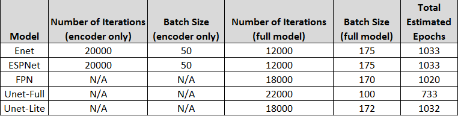
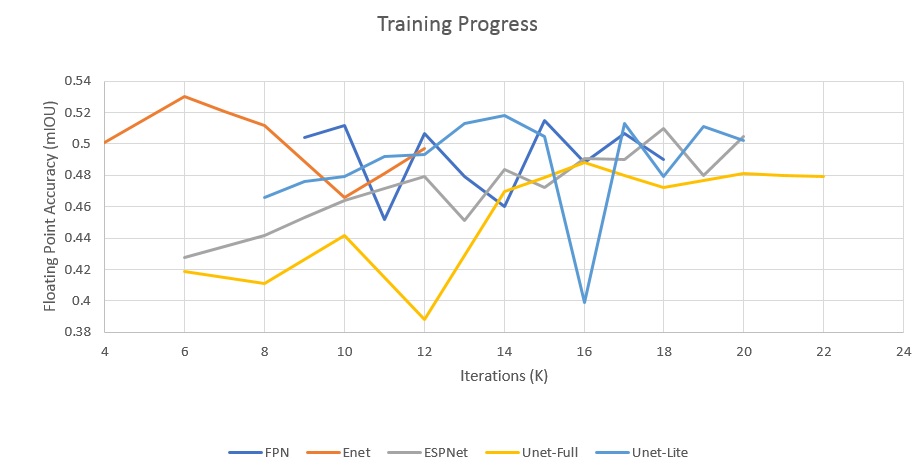
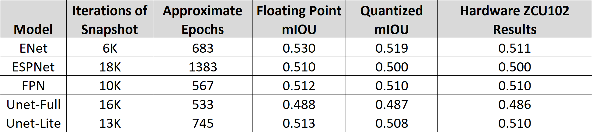
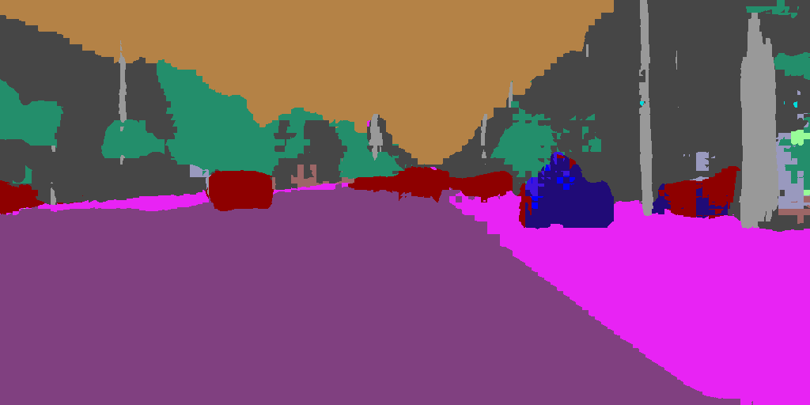
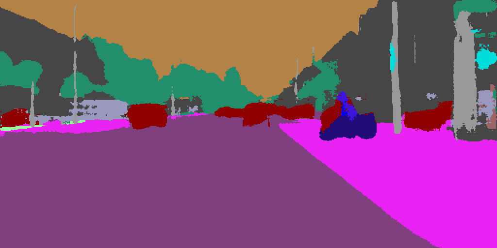
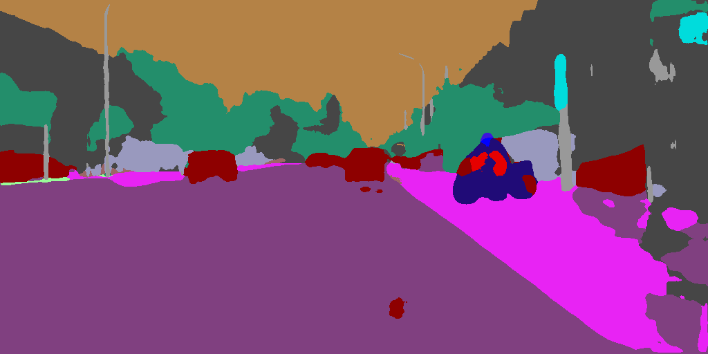
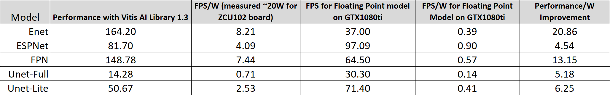

<table class="sphinxhide">
 <tr width="100%">
    <td align="center"><h1>Vitis-AI™ 1.4 - Machine Learning Tutorials</h1>
    <a href="https://www.xilinx.com/products/design-tools/vitis.html">See Vitis™ Development Environment on xilinx.com</br></a>
    <a href="https://www.xilinx.com/products/design-tools/vitis/vitis-ai.html">See Vitis-AI™ Development Environment on xilinx.com</a>
    </td>
 </tr>
</table>

# ML Caffe Segmentation Tutorial

The following tutorial describes how to train, quantize, compile, and deploy various segmentation networks using Vitis&trade; AI, including ENet, ESPNet, FPN, UNet, and a reduced compute version of UNet that we'll call Unet-lite. The training dataset used for this tutorial is the Cityscapes dataset, and the Caffe framework is used for training the models.

After training, the Vitis AI tools are used to quantize and compile the models, and the Vitis-AI-Library application examples are used for deploying the models on a Xilinx ZCU102 target board. For background information on ESPNet, ENet, and general segmentation approaches, refer to the [Segmentation Introduction Presentation](files/PDF/Segmentation_Introduction.pdf).

**Note**: The goal of this tutorial is not to provide optimized high accuracy models, but rather to provide a framework and guidance under which segmentation models can be trained and deployed on Xilinx&reg; MPSoC and Versal devices.

The tutorial is organized as follows:

1. Environment Setup and Installation

2. Prepare the Cityscapes database for Training Segmentation Models

3. Training the Models

4. Quantizing and Compiling the Segmentation networks for DPU implementation

5. Evaluating the Floating Point Models on the Host PC

6. Running the Models on the ZCU102

## Pre-Installation Considerations for Caffe for Segmentation Models

The Vitis AI tools come with a version of caffe that is supported for training the various segmentation models. Section 1 will address the various setup steps required for configuring your environment with the Vitis AI tools.

## 1.0 Environment Setup and Installation

An Ubuntu 20.04 host machine and GeForce GTX 1080 Ti graphics card were used for the development and testing of this tutorial.

**Note**: These networks have also been tested all the way back to DNNDK v3.0/v3.1 and the DPU v1.4.0, and have been found to work properly with this configuration.

This tutorial was tested with a ZCU102 revision 1.0 (and could also be used with newer versions),
Displayport monitor, keyboard, mouse, and USB hub with USB micro converter.

The Vitis AI release used for testing this tutorial is [Vitis AI 1.4](https://github.com/Xilinx/Vitis-AI/tree/v1.4).

### 1.1 Vitis AI Environment Setup and Board Package Installation

1) Follow the instruction in the [Vitis AI 1.4](https://github.com/Xilinx/Vitis-AI/tree/v1.4) readme to install either the GPU or CPU docker.

 (TIP: Paths to datasets outside of the docker environment can be made visible within the docker by editing the docker_run.sh script.  Under the 'docker run' command in the script, simply add a path with `-v path_outside_docker:path_inside_docker`.  For instance if I have a path where data is stored locally at /data2/datasets, it can be made available inside the docker by adding `-v /data2/datasets:/data2/datasets`).

2) Copy the [Segment](files/Segment) folder to the docker workspace so that it is available inside the docker once launched.

3) Next follow the steps in [Setting Up the Target](https://github.com/Xilinx/Vitis-AI/tree/v1.4/setup/mpsoc/VART) in the Vitis AI User Documentation (if targeting a custom board, additional steps are outlined after installing the board image to manually install the Vitis AI Runtime).

4) Launch the docker using `./docker_run xilinx/vitis-ai-gpu:latest` (or -cpu if using the cpu docker)

5) Activate the caffe environment using `conda activate vitis-ai-caffe`

6) Dos-to-Unix Conversion

In case you get some strange errors during the execution of the scripts, you can pre-process (just once) all the``*.sh`` shell scripts with the [dos2unix](http://archive.ubuntu.com/ubuntu/pool/universe/d/dos2unix/dos2unix_6.0.4.orig.tar.gz) utility.
In that case run the following commands from your Ubuntu host PC (out of the Vitis AI docker images):
```bash
sudo apt-get install dos2unix
cd <WRK_DIR> #your working directory
for file in $(find . -name "*.sh"); do
  dos2unix ${file}
done
```

## 2.0 Prepare the Cityscapes Database for Training Segmentation Models

For this tutorial, you will train the models on the Cityscapes dataset. Cityscapes is an automotive dataset created by Daimler which includes various driving scenes, mostly contained in Germany.

The files from Cityscapes provide around 5000 images with fine annotations (class labels) for various city driving scenarios. There are two primary folders from the dataset that we'll be working with:

* leftImg8bit (includes all of the input images for training)
* gtFine (includes the class annotations as polygonal format (.json files))

There are also scripts that are separately downloaded for the dataset which are used to transform the class label .json files into class label images (.png files) which are used for training.

Examples that show the different classes after being color coded and alpha-blended with the original image can be viewed on the [Cityscapes website]( https://www.cityscapes-dataset.com/examples/).

The focus of this database for our purpose is on Semantic Annotations, which consist of the following types (we only use the Fine Annotations for this tutorial, though it should also be possible to use coarse annotations and perhaps achieve even better results):
* Course Annotations (20000 images)
* Fine Annotations (5000 images)

The following eight groups are contained within the Cityscapes dataset with 19 classes. There are 30 classes listed, but all classes with a ‘+’ next to them are treated as a single void class and preparation steps will change their values to ‘255’ which will subsequently be ignored in the training process. Classes marked with * have single-instance based annotations available; however, this tutorial does not cover instance-based segmentation.

**Group	Classes:**  
flat	road · sidewalk · parking+ · rail track+  
human	person\* · rider\*   
vehicle	car\* · truck\* · bus\* · on rails\* · motorcycle\* · bicycle\* · caravan\*+ · trailer\*+  
construction	building · wall · fence · guard rail+ · bridge+ · tunnel+  
object	pole · pole group+ · traffic sign · traffic light  
nature	vegetation · terrain  
sky	sky  
void	ground+ · dynamic+ · static+

For more information about the Cityscapes database, see the [Cityscapes Dataset Overview webpage](
https://www.cityscapes-dataset.com/dataset-overview/).

Because preparing such a database for training requires a number of steps, the following detailed instructions are provided:

1. Download the Cityscapes dataset from the [Cityscapes Downloads page](https://www.cityscapes-dataset.com/downloads/).

 The specific packages needed are the [gtFine_trainvaltest.zip](https://www.cityscapes-dataset.com/file-handling/?packageID=1) and [lefImg8bit_trainvaltest.zip](https://www.cityscapes-dataset.com/file-handling/?packageID=3). These files include the 5000 images with fine (pixel-wise) semantic annotations which are divided into train, test, and validation groups. It would also be possible to train using the coarse annotations provided by Cityscapes and perhaps achieve better results, but only training with the fine annotations is covered in this tutorial.

2. On the Linux workstation, inside the docker container, create a folder called "Cityscapes" under the "Segment" folder.

3. Extract the Cityscapes dataset files into the "Cityscapes" folder you just created.

  After this you should have sub-folders labeled "gtFine" and "leftImg8bit". These folders contain the class labels and input images.

4. There are various preparation, inspection, and evaluation scripts provided for Cityscapes, which can be cloned from github. The next step will be to download or clone these using the following and copy them into the Cityscapes folder inside the docker:
```
git clone https://github.com/mcordts/cityscapesScripts.git
```

5. You can install the scripts by changing directory into the cityscapes Scripts folder then using the `pip` command.

 ```
sudo pip install .
```

 **Note**: If you encounter difficulties due to permissions within the docker with this step, you can try the following:
 * Execute the dataset preparation outside of the docker as only the images and ground truths are needed inside the docker.
 * Change the permissions by running `sudo su` and changing permissions using `chown` for the files needed to install with `pip`.  
<span></span>  
   The next step is to export the CITYSCAPES_DATASET variable to point to the directory where you extracted the `leftimg8bit` and `gtFine` folders. This environment variable will be used by the preparatory scripts which pre-process the annotations into class labels.


6. Change directory to the location where the dataset was extracted, then run the following command.  

 ```
export CITYSCAPES_DATASET=`pwd`
```
 **Note**: It is recommended to copy/paste the command, because it uses a backtick character surrounding `pwd` and not a single apostrophe.

 The next step is to create the images which have class labels associated with each pixel and set the unused classes to value '255'.

7. Run the `createTrainIdLabelImags.py` script. To run this script, change directory to the `cityscapesScripts/cityscapesscripts` directory and run the following:

 ```
python preparation/createTrainIdLabelImags.py
```
 This converts annotations in polygonal format (.json files) to .png images with label IDs, where pixels encode the “train IDs”. Because we use the default 19 classes, you do not need to change anything in the `labels.py` script at this time. You will later go back and change the `labels.py` script for use with evaluating the trained models.

 If you are new to datasets, it might be worthwhile to inspect the .json file to see how the polygon data is stored. You will notice that it is basically an array of points that connect the lines for each polygonal area for each class.

 After running this script, you will see color coded images that denote the classes, as well as trainable images that have the classes encoded in the order determined by the `cityscapesscripts/helpers/labels.py` script.

 After the pixels are encoded with trainable values, the different classes are identified as values 0-18 and all of the ignored classes are set to value 255. Notice that it is very difficult to distinguish the various classes in this image because they are such low values (with the exception of the ignored classes). These images end in `_gtFine_labelTrainIds.png`.

 Note that it is possible to modify the `cityscapesscripts/helpers/labels.py` script to change the class annotations during the preparatory step.

 During the training process, a text file is used to identify the location of the training data and annotations; the path to this file is specified in the input data layer of the model prototxt files. This text file is located under [files/Segment/workspace/data/cityscapes/img_seg.txt](files/Segment/workspace/data/cityscapes/img_seg.txt). If you placed your cityscapes dataset in a different directory, you will need to modify this text file as well to point to the absolute paths for the input images and associated label images which were just created, which should exist in the subdirectories where the Cityscapes data was extracted.

 The left column in the `img_seg.txt` file should point to the input image, which is stored in the `Cityscapes/leftImg8bit` directory. The right column should point to the `labelTrainIds.png` file, which is the annotations or ground truths; this file is stored in the `Cityscapes/gtFine` directory.

 There are many classes that get ignored and their pixel values are set to '255'. You can note that in the provided model prototxt files, the final softmax and accuracy layers in the network have set a label ignore parameter for value 255 to ignore these classes. All of the other classes need to start at class 0 and increment. The prototxt files referred to here include folders for each of the models that are covered in the tutorial; they are located in [files/Segment/workspace/model](files/Segment/workspace/model).

 (TIP: Note again, paths to datasets outside of the docker environment can be made visible within the docker by editing the docker_run.sh script.  Under the 'docker run' command in the script, simply add a path with `-v path_outside_docker:path_inside_docker`.  For instance if I have a path where data is stored locally at /data2/datasets, I can make it available inside the docker by adding `-v /data2/datasets:/data2/datasets`).

At this point, the training dataset has been prepared and is ready for use to train the models.

## 3.0 Training Models
This tutorial contains prototxt files, which can be used to train the various models. Note that these models may differ somewhat from the original models as they have been modified for end use in the DPU IP. Some of the types of modifications that were made to these models include:

 - Replacing the un-pooling layer with deconvolution layer in the decoder module.
 - Replacing all PReLU with ReLU.
 - Removing spatial dropout layers.
 - Replace Batchnorm layers with a merged Batchnorm + Scale layer.
 - Position Batchnorm layers in parallel with ReLU.
 - In UNet-full/Unet-lite models, Batchnorm/scale layer combinations were inserted before relu layers (after d0c, d1c, d2c, and d3c) because the DPU doesn't support the data flow from Convolution to both the Concat and relu simultaneously.

If further analysis is desired, the model prototxt files have been included; you can simply diff them from the original caffe prototxt file.

In terms of augmentation, the mean values from the dataset and a scale factor of 0.022 are applied to the input layers for each model.

### 3.0.1 Training the Models from Scratch

When training from scratch, it is necessary to train ESPNet and ENet models in two stages:
For ESPNet, we will train a model similar to the **(c) ESPNet-C** architecture which can be seen in figure 4 of the [ESPNet publication](https://arxiv.org/pdf/1803.06815.pdf).

This essentially removes the decoder stage that is present in the **(d) ESPNet** model, and in place of that decoder stage, a single deconvolution layer is added to resize up 8x back to the original input size which matches the annotation size.

For ENet, a similar approach is taken and we train only the encoder stage by removing the decoder portion of the model and adding a single deconvolution layer to resize by a factor of 8x up to the original label size which matches the annotation size.

The FPN, Unet, and Unet-lite models can all be trained end to end, so the encoder/decoder two-stage training process is not necessary for those models (though a similar process could be employed if desired and it may end up producing better results).

In my experiments, I needed to train the ESPNet/ENet encoder models for 20K Iterations with an effective batch size of 50, and lr_base 0.0005. Note that larger batch sizes can also be used and may ultimately produce more accurate results, though training time would be increased for larger batch sizes.

If you happen to encounter a situation where you receive a "CUDA out of memory" error, try reducing the batch size in the train_val.prototxt or train_val_encoder.prototxt and increase the corresponding iter_size in the solver.prototxt to maintain the same effective batch size. Note again that all these models were trained with GTX 1080ti GPUs which have 12GB of memory. If your GPU has less memory, you may need to adjust the batch sizes to fit within your GPU memory limits.

After this first step has been completed, you can train the full ESPNet prototxt using the weights from the first step to fine tune the model.

Note that the initial training step for these models takes about 36 hours on a Xeon workstation using a GTX 1080ti graphics card.

#### 3.0.1.1 Training the ESPNet (ESPNet-C) and ENet Encoder Models
The encoder model prototxt files have been included with this tutorial. The following files are needed as a starting point for this tutorial and can be used for training the encoder-only poritions of these networks:
* **solver_encoder.prototxt**, located in [files/Segment/workspace/model/espnet](files/Segment/workspace/model/espnet)
* **train_val_encoder.prototxt**, located in [files/Segment/workspace/model/enet](files/Segment/workspace/model/enet)

The full model prototxt files are also available under these paths. It is recommended to compare the two files using a text editor to understand what has been removed from the full model for the encoder-only portion.

To train these models, open the **solver_encoder.prototxt** file for the associated model.

   It is important to understand the training parameters and paths for this file. Notice the lines containing the "net: " definition and "snapshot_prefix: ".

  The first line specifies a path to where the **train_val_encoder.prototxt** file exists and the second should point to an existing directory where you would like the model snapshots to be stored.

  Note also how the other hyper-parameters are set in the solver prototxt. The following are important training parameters:

  * **base_lr** is probably the most important parameter. If it is set to big or too small, the training process will never converge. For this tutorial, it has been found that a size of 0.0005 is an appropriate value for training the models.

  * **iter_size** is used to determine the effective batch size. If the batch size is set in the train_val_encoder.prototxt file to '5' in the input layer, then the iter_size essentially applies a multiplier to that batch size by not updating the weights until iter_size number of batches have been completed. For example, if the iter_size is set to 10, then 10 x 5 = 50 is the effective batch size. Batch size has a significant effect on the convergence of the training process as well as the accuracy of the model, so it is important to maintain a larger batch size when training the full models. In the case of this tutorial, this parameter is used to enable the training process to maintain a larger effective batch size where there is a limited amount of GPU memory.

  * **device_id** specifies the device ID of the GPU card that will be used to accelerate the training process. If you have only one GPU, specify '0'; however, multiple GPUs can also be used by using a comma separated list and you can also train multiple models on different GPUs.

  * **max_iter** parameter determines how many times the model will see the training data during the training process. If a dataset has N images and batch size is B, and P is the number of epochs, then the relationship between epochs and iterations is defined as:
  ```
Iterations = (N * P) / B
```

  Since the training dataset is around 3000 images, we can re-arrange this equation to calculate the number of epochs by:

  ```
 (20K*50) /3K = 333 epochs.
```

After the solver_encoder.prototxt has been verified, the model can be trained by changing directory to the model directory (such as /workspace/files/Segment/workspace/model/espnet) and then running the following command:

```
caffe train \
–solver solver_encoder.prototxt \
2>&1 | tee encoder_models/train_encoder_log.txt
```

The console outputs a log during the training process. For an example of the log output, view the [example log file](files/Segment/workspace/model/espnet/encoder_models/example_log.txt).

After the training process completes, you can train the full model, which uses these pre-trained weights as a starting point for the encoder portion of the model.

#### 3.0.1.2 Training the Full Models
The **solver.prototxt** and **train_val.prototxt** files are located in the following directories:

* ESPNet: [files/Segment/workspace/model/espnet](files/Segment/workspace/model/espnet)
* ENet: [files/Segment/workspace/model/enet](files/Segment/workspace/model/enet)
* FPN: [files/Segment/workspace/model/FPN](files/Segment/workspace/model/FPN)
* Unet-Full: [files/Segment/workspace/model/unet-full](files/Segment/workspace/model/unet-full)
* Unet-Lite: [files/Segment/workspace/model/unet-lite](files/Segment/workspace/model/unet-lite)

Because FPN, Unet-full, and Unet-lite can be trained end-to-end from scratch, there is no need to train the encoder portion separately. Generally for training the full models, a larger batch size is desirable because it helps the model to approximate the full dataset better than a smaller batch size. This tutorial uses batch sizes >= 100 for training the full models.

To train the full models:

1. Open the associated **solver.prototxt** file and view the properties of the various hyper-parameters. Note again that relative paths are used for the "net" and "snapshot_prefix" parameters, so if the files were placed as directed by the tutorial then these files should reside in the appropriate paths.

2. Once the **solver.prototxt** file has been verified, the model can be trained by running one of the following commands (specify the name of your caffemodel instead of pretrained_encoder.caffemodel):

**For ESPNet or ENet**:
```
caffe train \
–solver solver.prototxt \
–weights encoder_models/pretrained_encoder.caffemodel \
2>&1 | tee final_models/train_log.txt
```

**For FPN, Unet-Full, or Unet-Lite**:
```
caffe train \
–solver solver.prototxt \
2>&1 | tee final_models/train_log.txt
```

I have included log files for each of the networks from my training session which show the output of the training process:

 - [ENet example log file](files/Segment/workspace/model/enet/final_models/example_log.txt)
 - [ESPNet example log file](files/Segment/workspace/model/espnet/final_models/example_log.txt)
 - [FPN example log file](files/Segment/workspace/model/FPN/final_models/example_log.txt)
 - [Unet-Full example log file](files/Segment/workspace/model/unet-full/final_models/example_log.txt)
 - [Unet-Lite example log file](files/Segment/workspace/model/unet-lite/final_models/example_log.txt)

 Note that these are stored respectively at:

  `files/Segment/workspace/model/enet/final_models/example_log.txt`

  `files/Segment/workspace/model/espnet/final_models/example_log.txt`

  `files/Segment/workspace/model/FPN/final_models/example_log.txt`

  `files/Segment/workspace/model/unet-full/final_models/example_log.txt`

  `files/Segment/workspace/model/unet-lite/final_models/example_log.txt`

You should see something similar during the training process for your full models.

In general, training the full models is quite time consuming, in many cases >72 hours per model using my ML workstation.

### 3.1.0 Results from My Experiments

I trained the models for various ## of iterations and with various batch sizes. Note that training all of the models end to end took about 3-4 weeks on my Xeon server with 2x GTX 1080ti graphics cards.

The full settings used for training these models are captured in the log files and solver prototxt files. The initial training approach is outlined in the following table, and from this it can be seen that an attempt was made to train the models for ~1000 epochs each. This extended amount of training allows for exploratory options when picking a suitable model for deployment.

 

In my experience, each model achieves a different mIOU and some of this variation is due to the training parameters used. An initial effort was made to keep the total training epochs around 1000 for each model and the effective batch size around 170-175, with the exception of Unet-full as it was an exceptionally large model, so a reduced batch size (and therefore number of epochs) was used to speed up the training process.

Note again that the intention of this tutorial is not to benchmark different models against each other, or even to show a model that works exceptionally well, but rather to show how different segmentation models can be trained, quantized, then deployed in Xilinx SoCs while maintaining the floating point model accuracy.

As the training progressed, regular mIOU measurements were taken using Vitis AI (don't worry if you don't understand this yet, it's covered in section 5 - part 3) to score the models against the Cityscapes validation dataset (500 images). When viewing the plot, recall again that ENet and ESPNet had separate encoder training, so the reduced number of iterations shown in this plot do not visualize that fact.

 

It can be seen from the plot that the model with the highest number of iterations does not necessarily correspond to the highest mIOU. You can also see from the fluctuations in mIOU that perhaps it might be possible to achieve better results by adjusting the learning rate and lr_policy, or by training some of the models for more iterations. In general, the models with the highest mIOUs were included as the pre-trained model for each respective network in this tutorial.

- For ENet -> 6K iteration model
- For ESPNet -> 18K iteration model
- For FPN -> 10K iteration model
- For Unet-Lite -> 13K iteration models
- For Unet-Full -> 16K iteration model

Note that ESPNet continued to increase in mIOU at 12K iterations, so an additional 8K iterations of training were performed to find a higher mIOU model. Exploratory results are captured in the table below which shows the training snapshot used as well as the mIOU as was measured for the floating point model, the quantized model on the host machine, and the model deployed on the ZCU102 hardware. Again, don't worry if it isn't yet clear how these results were achieved. The latter sections in this tutorial explain how to measure the mIOU for each of these scenarios.




## 4.0 Quantizing and Compiling the Segmentation networks for DPU implementation

NOTE: The target for this tutorial is the ZCU102, but it should be possible to target other boards as well by changing the target shown above when installing the tools and also modifying the compiler command to target the correct DPU.  The models should also work on the VCK190, ZCU104, and Kria SoM Starter Kit.

Please refer to the [Vitis AI User Guide](https://www.xilinx.com/support/documentation/sw_manuals/vitis_ai/1_4/ug1414-vitis-ai.pdf) for more details on the Vitis AI tools.

### 4.0 PART 1: Configuring the Files for Quantization, Compilation, and mIOU Testing:

1) I have included an example workspace in [files/Segment/VAI](files/Segment/VAI) to show how the VAI tools may be invoked as well as the necessary modifications to the prototxt files for both quantization/compilation and testing the float and quantized model mIOUs. Change directory to the VAI directory before proceeding to the next step.

2) Within the VAI directory, there is a subdirectory for each model. Inside each model directory several files:

 - "float.prototxt" is used for quantizing/compiling the models for deployment on the target hardware

 - "float_test.prototxt" is used for testing the float and quantized models to report the mIOU against the cityscapes validation dataset

 - "float.caffemodel" is the pre-trained caffemodel.

 - "quantize_and_compile.sh" is a script that is used to perform both quantization and compilation (vai_q_caffe and vai_c_caffe) for deployment on the target hardware

 - "test_float_and_quantized.sh" is a script that will test both the floating point and quantized models and report out the mIOU for each


3) Open the "float.prototxt" that is included as an example in the VAI subfolders (i.e. ENet, ESPNet, etc.).

 The "float.prototxt" files should be mostly identical to your "train_val.prototxt" except for the following:

 - The input layer has changed from "ImageSegData" type to "ImageData"

 - Absolute paths have been specified to the calibration data so that they point to the correct locations if the steps in the tutorial were followed for populating the data (see step 4 below).

 - Note by default that the prototxt files are set to generate a 512x256 input size model which is intended for use with the xxx_video applications (e.g. fpn_video). If you wish to run the evaluation in hardware on cityscapes validation images rather than on the recorded video (e.g. fpn_eval), simply change the input to use 1024x512 (the float_test.prototxt files have the input set for 1024x512 if you wish to use this as an example).

```
line 11: source: "/workspace/files/Segment/VAI/data/cityscapes/calibration.txt"
line 12: root_folder: "/workspace/files/Segment/VAI/data/cityscapes/calibration_images/"
```

 - The "SoftmaxWithLoss" layer has been changed to "SoftMax" and the "Accuracy" layer has been removed. These layers were previously used to compute loss and accuracy for the training phase, so they have now been updated for deployment.

You can use these prototxt files directly if the differences mentioned above are the only deltas between your train_val.prototxt file and float.prototxt. Otherwise, if you are deploying the encoder model only or a modified version, you will need to update your train_val.prototxt to accommodate for the differences mentioned above, rename that file to "float.prototxt", and place it in the correct directory.

4) The calibration data needs to be populated into the [files/Segment/VAI/data/cityscapes/calibration_images](files/Segment/VAI/data/cityscapes/calibration_images) directory. This data consists of a list of images which are specified in the [calibration.txt](files/Segment/VAI/data/cityscapes/calibration.txt) file, and 1000 test images from Cityscapes. These will be used by the `vai_q_caffe quantize` process as stimulus for calibration of the model dynamic range during the quantization process.

 The data listed in the calibration.txt file calls out the following 1000 images:
  - the first 100 images from CITYSCAPES_DATASET/leftImg8bit/test/berlin
  - all images from $CITYSCAPES_DATASET/leftImg8bit/test/bielefeld
  - all images from $CITYSCAPES_DATASET/leftImg8bit/test/bonn
  - all images from $CITYSCAPES_DATASET/leftImg8bit/test/mainz
  - the first 373 images from $CITYSCAPES_DATASET/leftImg8bit/test/munich

 You will need to copy these images or potentially create soft links from the dataset directories listed about to the [files/Segment/VAI/data/cityscapes/calibration_images](files/Segment/VAI/data/cityscapes/calibration_images) directory. You can use other calibration images if desired, however, the provided [calibration.txt](files/Segment/VAI/data/cityscapes/calibration.txt) file uses the images listed above.

5) Next copy your latest trained model from Caffe into the **files/Segment/VAI/model_subdirectory_name** directory and rename it "float.caffemodel". This model should be located wherever the snapshot was saved from the the training step.

6) Next run the quantization tools using the following command (note that you made need to make the file executable first by running "chmod +x quantize_and_compile.sh"):

```
./quantize_and_compile.sh
```

If you open the script, you will see the following contents which indicate several things - first of all, you should make sure the GPUID environment variable is set correctly for your machine. If you have only one GPU, this should be '0', otherwise, please change this to the index for the desired GPU to use for quantization.

Finally, the `vai_c_caffe` command is called which compiles the floating point model and produces a file called "segmentation.xmodel" under the compile directory.


```
#!/usr/bin/env bash
export GPUID=0
net=segmentation

#working directory
work_dir=$(pwd)
#path of float model
model_dir=quantize
#output directory
output_dir=compile

echo "quantizing network: $(pwd)/float.prototxt"
vai_q_caffe quantize     \
     -model $(pwd)/float.prototxt   \
     -weights $(pwd)/float.caffemodel \
     -gpu $GPUID \
     -calib_iter 1000 \
     -keep_fixed_neuron \
     -output_dir ${model_dir} 2>&1 | tee ${model_dir}/quantize.txt

echo "Compiling network: ${net}"

vai_c_caffe  --prototxt=${model_dir}/deploy.prototxt \
    --caffemodel=${model_dir}/deploy.caffemodel \
    --output_dir=${output_dir} \
    --net_name=${net} \
    --arch=/opt/vitis_ai/compiler/arch/DPUCZDX8G/ZCU102/arch.json 2>&1 | tee ${output_dir}/compile.txt
```   


At this point, an xmodel file should have been created in the **compile** directory which can be used in the final step which is to run the models on the ZCU102. If desired, you can also proceed to the Part 3 of 4.0 which is testing the floating point and quantized models.

### 4.0 PART 2: Testing the Floating Point and Quantized Models

As mentioned in the previous section, files have been provided under the `files/Segment/VAI/model_subdirectory_name` filepath which can enable you to rapidly test the mIOU of both the floating point model as well as the quantized model on the cityscapes validation dataset. In order to perform this testing, perform the following steps:

1) Open the `files/Segment/VAI/data/val_img_seg_nomap.txt` file with a text editor.

2) Notice that this file contains paths to the cityscapes validation dataset as would be expected if the dataset was placed in the recommended location. The left column has a path to the input image, and the right column has a path to the labels. You may need to modify the root directory portion of both paths to point to the location of the cityscapes dataset on your machine if you placed your dataset in a location other than what was recommended in this tutorial.

3) Open the [float_test.prototxt](files/Segment/VAI/FPN/float_test.prototxt) file that corresponds to the model of interest. Notice that there are several differences between this file and the [float.prototxt](files/Segment/VAI/FPN/float_test.prototxt) that was used for deployment. The reason for this is that the DeephiResize layer causes some problems in the current version of vai_q_caffe which will prevent the compiler from compiling the model (it causes the input layer to be renamed to "resize_down" which causes the compiler to fail- for this reason two separate files are used, one for testing and one for deployment).

The new additions to this model are to support the auto_test and test commands:

- The input size of the model has been changed from 512x256 to 1024x512. This is because the larger input size produces better mIOU results. It would be possible to use other sizes such as the native input size for the cityscapes dataset which is 2048x1024, but testing the models would take longer and the Unet-full model will not work in this case because of some limitations on the Caffe distribution used within the vai_q_caffe tool. Additionally, the models were trained with an input crop size of 512, so it is not necessarily expected that using the larger size will produce better results.

- An additional input layer "ImageSegData" has been added which has a path to the val_img_seg_nomap.txt file. This is how the labels and input images are supplied for the testing procedure.

- A layer after this called "resize_down" has been added to scale the input image to the desired input size for the model (in this case 1024x512).

- A new layer at the end of the model has been added called "SegmentPixelIOU" which is a custom caffe layer packed up within the vai_q_caffe tool. If you noticed, the val_img_seg_nomap.txt file actually points to the *gtFIne_labelIds* rather than *gtFine_labelTrainIds*. This is because the SegmentPixelIOU layer has been coded to automatically relabel the classes from the cityscapes labels such that the classes match gtFine_labelTrainIds and values 255 are ignored.

4) Open the one of the `test_float_and_quantized.sh` scripts. The contents of this script are shown below. You will only need to edit the GPUID to specify the correct GPU index for your tests. Note that the log files will be captured under the test_results subdirectory for both the floating point and quantized results.

```
export GPUID=0
export WKDIR=`pwd`

cd $WKDIR
vai_q_caffe test -model float_test.prototxt -weights float.caffemodel -test_iter 500 -gpu $GPUID 2>&1 | tee test_results/float_model_test.txt

#working directory
work_dir=$(pwd)
#path of float model
model_dir=${work_dir}
#output directory
output_dir=${work_dir}

vai_q_caffe quantize      \
     -model ${model_dir}/float_test.prototxt   \
     -weights ${model_dir}/float.caffemodel \
     -gpu $GPUID \
     -calib_iter 1000 \
     -test_iter 500 \
     -keep_fixed_neuron \
     -auto_test \
     -output_dir ${output_dir} 2>&1 | tee test_results/quantized_model_test.txt

```

5) Execute the Script by running the following command. This will take some time which varies depending on the GPU hardware available as well as which model is being run. I have included example test results from a previous run under the associated model directories such as [files/Segment/VAI/FPN/test_results](files/Segment/VAI/espnet/test_results). Note that the previous run results I have included does not necessarily represent the best performing snapshot - it is just an example of the output of running the test script.

```
./test_float_and_quantized.sh
```

At this point, the floating point model has been fully verified on the host and you are ready to proceed to deploying the models to the target hardware.

## 5.0 Evaluating the Floating Point Models on the Host PC

### 5.1 Evaluating the Models with Still Images and Displaying the Results
After training the models, it is useful to evaluate the model on the host PC before attempting to deploy it in the DPU. In order to evaluate the models, scripts have been provided under the [files/Segment/workspace/scripts/test_scripts](files/Segment/workspace/scripts/test_scripts) directory.

You can test both the encoder only models as well as the full models for all of the networks. To do so, execute the following steps.

1) Change directory to the `files/Segment/workspace/scripts/test_scripts` directory

2) The following scripts can be used to evaluate the various models on a single image:

- test_enet_encoder.sh
- test_enet.sh
- test_espnet_encoder.sh
- test_epsnet.sh
- test_fpn.sh
- test_unet-full.sh
- test_unet-lite.sh

The evaluation scripts contain paths to the caffemodel which will be evaluated. You will need to modify the path to the caffemodel and prototxt file. An example is shown below for enet which uses relative paths to point up to the model directory where the prototxt and trained snapshot exist.

```
export PYTHONPATH=../../../caffe-master/python
python test_enet.py \
--model ../../model/enet/deploy.prototxt \
--weights ../../model/enet/final_models/pretrained.caffemodel \
--input ../munich_000000_000019_leftImg8bit.png \
--out_dir ./
```
As can be seen from the screenshot above, these scripts will call the underlying python script which will run one forward inference on the trained model using the "munich_000000_000019_leftImg8bit.png" image as the input.

The output will then color code the classes and display the output image. You could modify the python program to work on a recorded video or a webcam if desired, though the scope of this tutorial only provides an evaluation of a single images.

The input image and example outputs for the pre-trained networks can be seen below. Note the differences between the two networks as well the smoothing effect that including the full decoder stage has on the output.

**Note: You will need to first copy the image "munich_000000_000019_leftImg8bit.png" from the cityscapes dataset leftImg8bit folder to the /workspace/files/Segment/workspace/scripts/ folder before running the test inferences.**

Example outputs from my experiments:

ENet Encoder Only Output:


ENet Full Model Output:


ESPNet Encoder Only Output:


ESPNet Full Model Output:


FPN Model Output:


Unet-Full Model Output:


Unet-Lite Model Output:


**If the output of your model looks reasonable, you can now proceed to step 5, however, there are other tests that may be performed at this point which are outlined in the remainder of this section.**

It is also possible to test the inference time of the models on the host machine by running the following command from $CAFFE_ROOT:

**For ENet Encoder Only:**
```
caffe time \
-model ../workspace/model/enet/deploy_encoder.prototxt -gpu 0 -iterations 100
```
**For ENet Full Model:**
```
caffe time \
-model ../workspace/model/enet/deploy.prototxt -gpu 0 -iterations 100
```
**For ESPNet Encoder Only:**
```
caffe time \
-model ../workspace/model/espnet/deploy_encoder.prototxt -gpu 0 -iterations 100
```
**For ESPNet Full Model:**
```
caffe time \
-model ../workspace/model/espnet/deploy.prototxt -gpu 0 -iterations 100
```

My results for these various tests with a Xeon CPU and GTX 1080ti graphics card and a 512x256 input size for the models are as follows (note that the GPU power was estimated using the nvidia-smi command while running forward inference):

**For ENet Encoder Only: Average Forward Pass 17 ms, 94W**

**For ENet Full Model: Average Forward Pass 27 ms, 93W**

**For ESPNet Encoder Only: Average Forward Pass 9.1 ms, 108W**

**For ESPNet Full Model: Average Forward Pass 10.3 ms, 108W**

**For FPN Model: Average Forward Pass 15.5 ms, 114W**

**For UNet-Full Model: Average Forward Pass 33 ms, 220W**

**For UNet-Lite Model: Average Forward Pass 14 ms, 176W**


### 5.2 Measuring the Floating Point Model mIOU on the Cityscapes Validation dataset
In each of the model subdirectories under the [files/Segment/VAI](files/Segment/VAI) filepath, a script has been provided that will perform the following actions:

- Test the floating point model against the cityscapes validation dataset (run inference and calculate mIOU)

- Quantize the model using the calibration images from the [files/Segment/VAI/data/cityscapes/calibration_images](files/Segment/VAI/data/cityscapes/calibration_images) directory (Need to first check step 4.0 on Quantization as directions are provided there for populating this directory).

**To use this primary method, please make sure you have covered section 4.0 on quantization as some of the steps covered in that section will be needed to complete this step.**

In addition to using the vai_q_caffe capabilities to test the floating point model, one secondary method is included in this section. This method employs the use of Caffe along with some python scripts to run forward inference on the floating point model and check the mIOU.

##### Floating Point Model Test Using Python on Host Machine
- Change directory to [files/Segment/workspace/scripts/eval](files/Segment/workspace/scripts/eval)

- Make sure your CITYSCAPES_DATASET variable is exported properly to the location of dataset. If you have not done this, a default location will be used which will cause the script to fail.

- Next you need to prepare the validation images that will be used as a ground truth for comparison against the model output. This can be done by running the cls34_to_cls19.py script by entering `python -cls34_to_cls19.py`. This step only needs to be performed once for the ground truth images. Note that these will be stored in a folder called `test_gtFine_cls19` where your CITYSCAPES_DATASET is located.

- Next you need to run forward inference using the validation images. This can be done using the `forward_inference_model_name.sh` scripts provided (e.g. `./forward_inference_enet.sh`). These scripts will create a soft link to the pretrained caffe models in the working directory where the snapshots of the training process are stored. Then the script will run segmentation_miou_test.py to perform forward inference using that model and store the results under the "results" directory.

- Finally, with the results captured and ground truth images prepared, run `./eval_segmentation.sh` script to compare the ground truth images and report the mIOU. The mIOU for all classes will be the first number reported and the other numbers reported will be the per class mIOU numbers.  (TIP: if you run the validation images on the ZCU102 board and save the output masks as the class values, you can copy the resultant images back to the host machine and calculate the board run mIOU using this script).

## 6.0 Running the Models on the ZCU102
The final step in this tutorial is to run the models on the target hardware - in my case, a ZCU102, but other development boards may also be used (just make sure you changed the vai_c_caffe command when compiling the model to target your DPU configuration board). In order to expedite the process for running on the target hardware, we will use the Vitis-AI-Library code that is installed with the board image.

1) At this point you can copy over your compiled model .xmodel file (output of vai_c_caffe) into the model subdirectory such as [files/ZCU102/enet/segmentation.xmodel](files/ZCU102/enet/).

2) Boot the ZCU102 board

3) Launch the Linux terminal using the keyboard/mouse connected to the ZCU102

4) Configure the IP address for a compatible range with your host machine (I use 192.168.1.102 and then set my laptop to 192.168.1.101). The command needed to perform this step is:

`ifconfig eth0 192.168.1.102`

5) Launch a file transfer program - I like to use MobaXterm, though others such as pscp or WinSCP can also be used.

6) Transfer the ZCU102 model directory over to the board under the Vitis_AI/examples/Vitis-AI-Library/samples/segmentation/ path

7) Ensure you have copied over and extracted the Vitis AI Library video files to the board.  See [step 1](https://github.com/Xilinx/Vitis-AI/tree/v1.3/demo/Vitis-AI-Library) under the section titled "Running Vitis AI Library Examples".

8) Run either the performance, video, jpeg or accuracy tests.  Example commands for video and performance tests are as follows:

  a) For video tests: ./test_video_segmentation ZCU102/FPN/segmentation.xmodel ../apps/segs_and_roadline_detect/seg_512_288.avi -t 6

  b) For performance tests: ./test_performance_segmentation ZCU102/FPN/segmentation.xmodel test_perfomrance_segmentation.list -t 6 -s 60

  (NOTE: the unet-full model won't run with 6 threads due to the size of the model.  It should run ok with 2 threads).

 - When running the video application, you should see the video play back with overlays that color code the various classes from the scene onto the monitor. After the playback is completed, an FPS number will be reported in the terminal which summarizes the forward inference performance from the hardware run.  With video based applications, the framerate is sometimes limited by the video file (typically 25 FPS for the Vitis-AI-Library sample videos).

Using data gathered throughout this tutorial, we can compare the performance of the ZCU102 vs. the GTX1080ti graphics card that was used to time the models from section 4.1. Albeit, this isn't a fair comparison for two reasons:
 1. We are comparing an embedded ~20W device with a 225W GPU
 2. The ZCU102 execution time includes reading/preparing the input and displaying the output whereas the GPU measurement only includes the forward inference time of the models

What is perhaps a bit more useful than comparing raw FPS is to compare FPS/W (performance/Watt) as this is a more generic comparison of what performance is achievable for a certain power cost. In order to perform this comparison, ~20W was measured on the ZCU102 board during forward inference, and the nvidia-smi tool was used to read the power during forward inference of each of the models as part of section 4.1. The comparison between the two can be seen in the following figure.



At this point, you have verified the model functionality on the ZCU102 board.

## Summary
Looking back, we've covered a lot of ground, including walking through the process of preparing, training, testing, and deploying 5 different segmentation models. The goal of this tutorial was not to show a perfectly optimized solution, but rather to blaze a trail so you experts and explorers can streamline your own segmentation model development and rapidly deploy those models on a Xilinx SoC/MPSoC.

The beauty of this solution is that there is a full portfolio of [Zynq-7000](https://www.xilinx.com/support/documentation/selection-guides/zynq-7000-product-selection-guide.pdf) and [Zynq Ultrascale+](https://www.xilinx.com/support/documentation/selection-guides/zynq-ultrascale-plus-product-selection-guide.pdf) devices (qualified for commercial, industrial, automotive, and aerospace and defense end markets) and various DPU configurations that allow you to scale for low power applications that that require < 3W as well as dial up the performance for higher end products (where you may need hundreds to thousands of FPS), such as deployments on PCIe accelerator class products such as [Alveo](https://www.xilinx.com/products/boards-and-kits/alveo/u250.html) or [Versal](https://www.xilinx.com/products/silicon-devices/acap/versal.html) devices.

All of this is possible while using the same design approaches and tool flow, without re-inventing algorithms for low end vs. high end products. You can even make trade-offs for DPU size vs. traditional pre/post-processing hardware acceleration (e.g. optical flow, stereo block matching, scaling, de-interlacing, FFTs, or even custom Image Sensor Pipelines). The number of potential implementations are virtually endless, so you can truly build an optimal solution for your application that maximizes your differentiation.
