<table class="sphinxhide">
 <tr>
    <td align="center"><h1>Vitis-AI™ 1.4 - Machine Learning Tutorials</h1>
    <a href="https://www.xilinx.com/products/design-tools/vitis.html">See Vitis™ Development Environment on xilinx.com </a>
    <a href="https://www.xilinx.com/products/design-tools/vitis/vitis-ai.html">See Vitis-AI™ Development Environment on xilinx.com</a>
    </td>
 </tr>
</table>

# Introduction Tutorial to the Vitis AI Profiler

## Current Status:
- Tested with Vitis AI&trade; 1.4, Profiler 1.4.0, Vivado&trade; 2021.1
- Tested on the following platform: ZCU104
## Introduction:
This tutorial introduces you to the Vitis AI Profiler tool flow and describes how to Profile an example from the Vitis AI runtime (VART).   This example utilizes the Zynq&reg; MPSOC demonstration platform ZCU104.
The Vitis AI profiler is an application level tool that helps detect the performance bottlenecks of the whole AI application. This includes pre- and post-processing functions together with the Vitis AI DPU kernel while running a neural network. You can see the complete AI data pipeline displayed across a common time scale and determine where to make improvements.  Additionally, read and write accesses to DDR memory are also captured to obtain a system wide perspective.
Low performing functions can be evaluated and considered for execution on different accelerators such as the AIE block or programmable logic to reduce the CPU's workload.  The Profiler version 1.4.0 supports both Alveo&trade; HBM Accelerator cards (DPUCAHX8) and Zynq UltraScale+ MPSoC (DPUCZDX8).  

The following steps demonstrate the Vitis AI Profiler:
- Setup the target hardware and host computer
- Configure the Linux operating system for profiling using PetaLinux (if needed)
- Execute a simple trace VART Resent50 example
- Execute a fine grain trace using VART Resent50 example
- Import all Captured results into Vitis Analyzer for observations
- Conclusions

## Setup and Requirements:

#### Host Computer Setup for Vivado
-	To review the Profiler results, you will require Vivado 2021.1  to run Vitis_Analyzer - [Found Here](https://www.xilinx.com/support/download/index.html/content/xilinx/en/downloadNav/vivado-design-tools/2021-1.html)
-	Download the Xilinx&reg; Unified Installer for the Windows operating system and run.
-	Provide your Xilinx.com login details and install Vivado.

	**Note:** The Profiler ONLY requires the Vivado Lab Edition.   This will greatly reduce the amount of disk space required.
-	Target Setup: [LINK1](https://www.xilinx.com/html_docs/vitis_ai/1_4/installation.html) [LINK2](https://github.com/Xilinx/Vitis-AI/tree/master/setup/mpsoc/VART)
-	The above 2 hyperlinks provided an in-depth explanation to set up Vitis AI on the host computer and different target hardware.  For the purposes of this tutorial, you will only require the following steps:
       - Download the SD card Image for the ZCU104 [HERE](https://www.xilinx.com/member/forms/download/design-license-xef.html?filename=xilinx-zcu104-dpu-v2021.1-v1.4.0.img.gz)
       - Download Etcher from: https://etcher.io/ and install on your Host computer.
       - Etcher software to burn the image file onto the SD card
       - Insert the SD card with the image into the ZCU104.
       - Connect all required peripherals to the target (see figure#1).

#### Figure #1

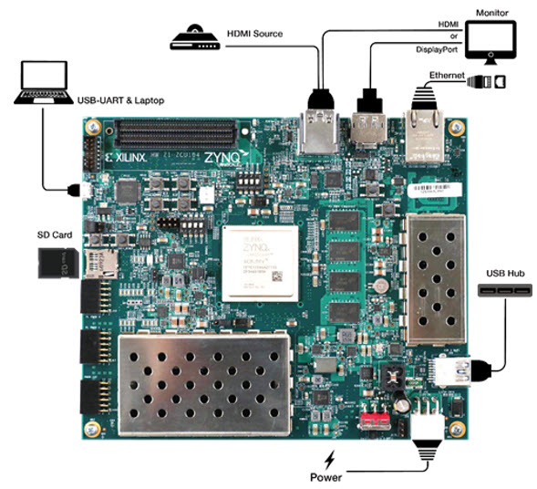

-	Plug in the power source and boot the board.
-	Set up your terminal program TeraTerm [HERE](https://tera-term.en.lo4d.com/windows) and connect to each of the terminal ports using the following connection settings.
       - baud rate: 115200 bps
       - data bit: 8
       - stop bit: 1
       - no parity

-	If you see the ZCU104 boot information, you have located the correct serial port.
-	Ensure your host computer and target hardware are on the same LAN network. The ZCU104 is DHCP-enabled and will be assigned an IP by your router.
-	Using the serial port type: **ifconfig** at the Linux prompt to determine the target’s IP address.

Once you have the target’s IP, you can use a network communication tool such as MobaXterm – [HERE](https://download.mobatek.net/2102021022292334/MobaXterm_Installer_v21.0.zip) to setup a SSL connection to the target (**user = root, password = root**).  This will provide a stable and highspeed connection to transfer files to and from the target hardware.
**Note:** The Vitis AI Runtime packages, VART samples, Vitis-AI-Library samples and models have been built into the board image. Therefore, you do not need to install Vitis AI Runtime packages and model packages on the board separately. However, users can still install models or Vitis AI Runtime on their own image.

PetaLinux Configuration (not required for this tutorial)
The below instructions can be used to enable the correct petaLinux setting for the Vitis AI profiler. The Xilinx prebuild SD card images come with these settings enabled.   This section is provided as reference.
	**:petaLinux-config -c kernel**
Enable the following settings for the Linux kernel.
-	General architecture-dependent options ---> [*] Kprobes
-	Kernel hacking ---> [*] Tracers
-	Kernel hacking ---> [*] Tracers --->
		             		[*] Kernel Function Tracer
	                   [*] Enable kprobes-based dynamic events
				   	[*] Enable uprobes-based dynamic events

Enable the following setting for root-fs
	**:petalinux-config -c rootfs**
	-	user-packages ---> modules ---> [*] packagegroup-petalinux-self-hosted
Rebuild Linux
	**:petalinux-build**

## Simple Trace Example
On the target hardware, change directories to the VART examples path as shown below:

**root@xilinx-zcu104-2021_1:~/Vitis-AI/demo/VART#**

The VART examples come with many machine learning models you can run on the target hardware. The following table provides the various model names and execution commands to run the models on the target.  In this tutorial, we will run model #1 (resnet50) (see figure#2).

#### Figure #2

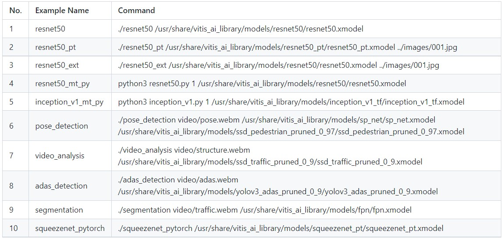

Locate the ResNet50 application (main.cc) and open it in a text editor.  This file can be found at the following location (Vitis-AI/demo/VART/resnet50/src). The `main.cc` program consists of the following key functions shown below.  Figure#3 illustrates the dataflow in the example design.   Images are read from the SD flash card, resized 224x224, classified, and then displayed to the monitor.   

#### Figure#3

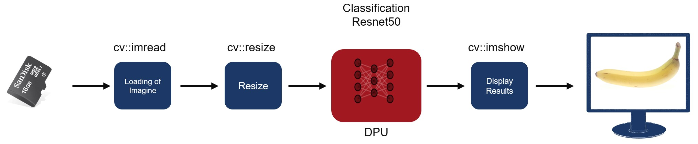

The application runs only one image, displays it, and then waits. To allow for fast image processing, we will disable the `cv::imshow` function and delay (`cv::waitKey`).  Search for the below `cv:imshow` function and comment both code lines out. This will allow us to process many images in a short period of time.

 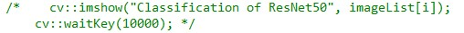

Also, make note of the other additional functions (TopK and CPUCalcSoftmax) processed by the CPU in this application. These functions can be traced by the Profiler and added to the end captured results.
Save and close your text editor.

## Build the Application:
Enter the command: `./build.sh`

Once complete, you will see the compiled application in the same directory. The example design requires images to classify to be loaded on to the SD card.   Using Mobaterm, drag and drop your images of choice to the following directory (/home/root/Vitis-AI/demo/VART).  These are the images that will be classified by the example design. The ResNet50 neural network requires 224x224 resolution images. Other image sizes can be used as the data pipeline has an image scaler.
If you wish to build your application on the host machine, additional cross-compilation tools are required.  Step-by-step installation instructions can be found in UG1414 [LINK](https://www.xilinx.com/support/documentation/sw_manuals/vitis_ai/1_4/ug1414-vitis-ai.pdf).

## Vitis AI Profiler Options:

The Vitis AI profiler option can be displayed by typing

**:vaitrace –help**

Figure #4 are the key profiler options:

#### Figure#4

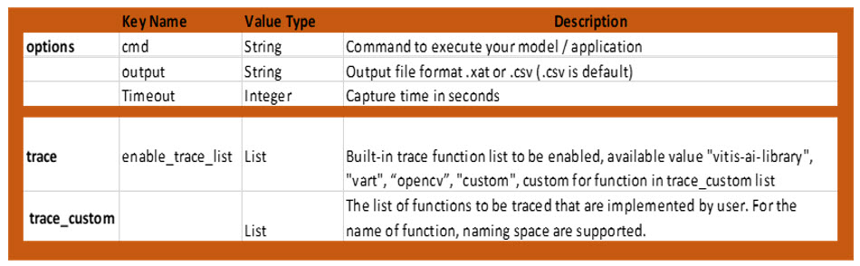

The profiler options are captured in a JSON file and executed by the profiler using the -c switch.
In the below JSON file (see figure#5), the runmode is set to “normal”.  In this mode, the profiler will trace the ResNet50 model as a single task.  That means all layers of the model are captured as a single-timed event.  This is a good option to compare the DPU performance against other processing blocks within the system’s data path.
The `cmd` command points to the ResNet50 application and model for execution and profiling.  This can be altered to trace other VART / Vitis Libs examples.  The `trace` / `trace_custom` commands highlight the areas for the profiler to perform its captures.   

**Note:** The trace_custom is profiling the 2 CPU functions found during the review of the `main.cc` application file.  

#### Figure#5

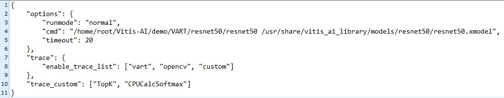

## Start Profiling
At the Linux prompt, begin profiling by typing the following command

root@xilinx-zcu104-2021_1:~/Vitis-AI/demo/VART/resnet50# **vaitrace -c config.json**

#### Figure #6 is an example of the profiler output. Different input images yield different classification results.

## Profiler Screen Output
Figure #6

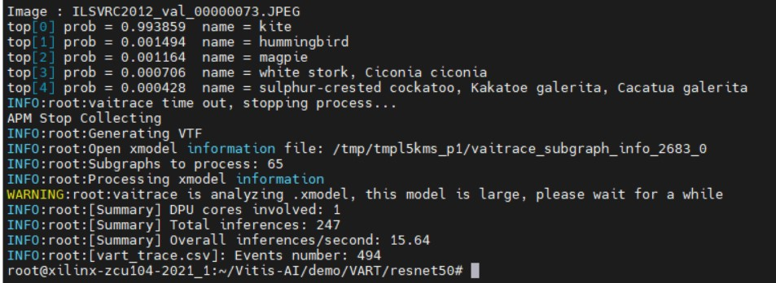

## Move the Output Files to the Host for Analysis:
At the completion of the profiling run, you will notice five files created containing your captured profiled results. Using MobaXterm, copy these files to your host computer (see figure#7).  

#### Figure #7

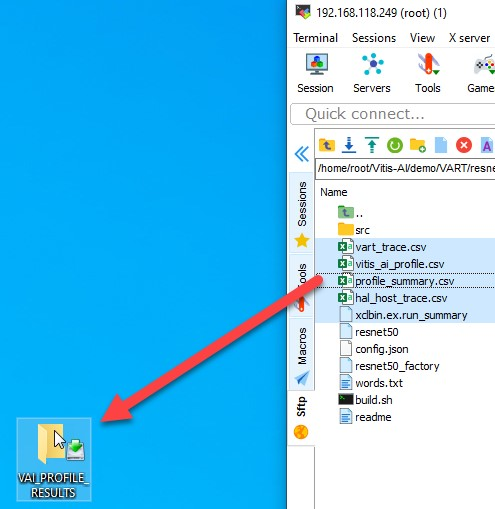

## Start Vitis Analyzer using the Vivado TCL console
On the host computer, use the Vivado TCL console to start the Vitis Analyzer by entering the below command at the Vivado% prompt.

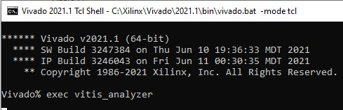

## Load the Captured Results for Analysis
The captured results can be loaded into the Vitis Analyzer by using the following steps (see figure#8)

#### Figure #8

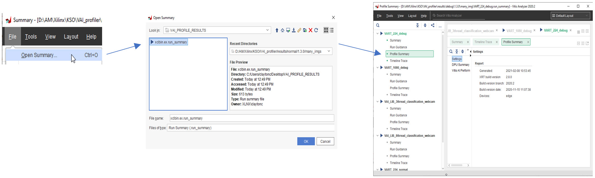

The Vitis Analyzer provides lots of status and version information under the Summary and Run Guidance section to allow for capture management.  The profiler information is displayed in the DPU summary (see figure#9).  In this example, after processing hundreds of images, we see the complete ResNet50 model averages approximately 12.2mS of execution time. Also, displayed are the CPU functions that were executed as pre/post data processing blocks.  In this case, the input images were already the correct resolution (224x224) for this ML model and as a result the cv::resize function was lightly utilized.  

#### Figure#9

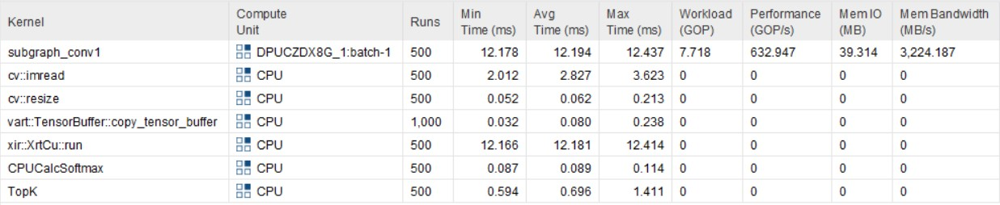

The Vitis Analyzer GUI also provides bandwidth utilization on the Zynq MPSOC memory controller at the port level (see figure#10). By looking at our hardware design, we can determine which memory clients are assigned to each memory port and in turn understand their memory bandwidth consumption. In this example, we have two DPUs with the assigned memory ports.  
Dpuczdx8G_1                                                       Dpuczdx8G_2
instr_port = S2(HPC0)                                             instr_port = S2(HPC0)
data_ports = S3(HP0) and S4(HP1)                                  data_ports = S4(HP2) and S5(HP3)

#### Figure #10

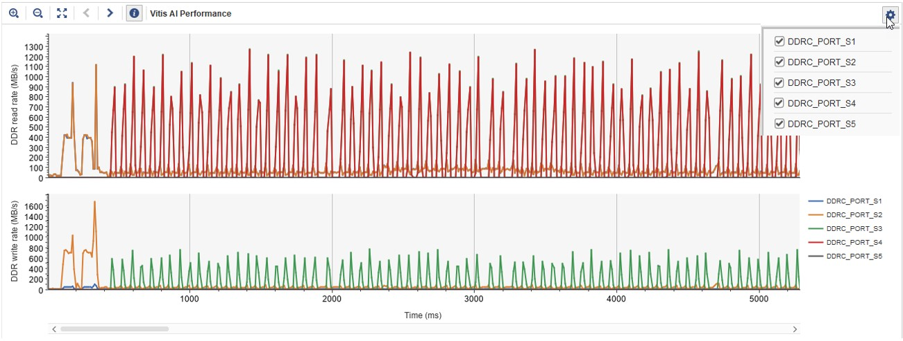   

The Vitis Analyzer can enable/disable each DDR Port layer by using the gear icon in the upper righthand corner of the GUI.  Using this feature lets you confirm each memory clients use during system level execution.

## Fine Grain Profiling Example:
To enable fine grain profiling, update the JSON file and switch the runmode from “normal” to “debug”.  In this mode, the profiler will profile each layer of the ResNet50 model.  To have a complete system profile, we will still have a custom trace enabled on our Application functions (Topk and CPUCalcSoftmax).
Rerun the profiler on your model using the same command used in the simple example.
**root@xilinx-zcu104-2021_1:~/Vitis-AI/demo/VART/resnet50# vaitrace -c config.json**

## DPU Layer-by-Layer Summary with CPU Functions
In the captured results note this ResNet50 model has 61 layers (see figure#11). Each layer is profiled and listed.  Fine grain profiling will allow for analysis of each layer’s performance during system level execution.   

#### Figure #11

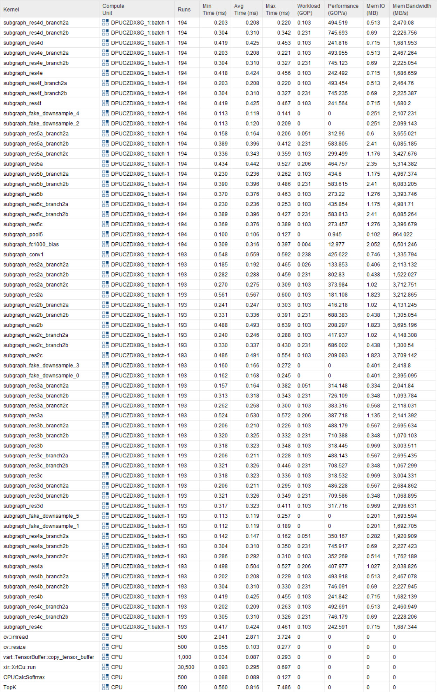

## Profiler Observations:
In this tutorial, we completed two profile captures of the VART ResNet50 model.  Each capture provides slightly different information when reviewed.  In the normal mode, the model was processed as one element and yielded an average time of 12.578mS.  While in the debug mode, the model has an average runtime of 0.334mS.  Why is there such a large difference? (see figure#12)

#### Figure #12

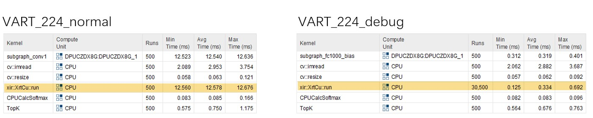

It is important to remember in debug mode this time represents the time per each layer of the model. Therefore, we need to multiply this by the number of layers creating a total average time of 20.374 mS. This shows the additional overhead fine-grain profiler adds to the execution of the model.

Resnet 50 xmodel contains 61 subgraphs
 **Normal mode**
•	The compiler merges 61 subgraphs into 1 big subgraph to reduce overhead(scheduling and memory)
•	Total Avg. Time = 12.578mS

**Debug mode**
•	One complete inference contains 61 subgraphs and calls xrtCu::run 61 times
•	Each call = 0.334 mS x 61 calls
•	Total Avg. Time = 20.374mS

## Vitis AI Tool Optimizations
When a model is processed by the Vitis AI tools, it applies various optimizations and breaks up the graph into subgraphs for execution on the DPU.  These optimizations can include layer or operator fusion to improve execution performance and DDR memory accesses.  In the following image, we see an example of these optimizations.  In this case, Layer “res5c_branch2c” was joined with layer “res5c” and the Profiler doesn’t report it.

#### Figure #13

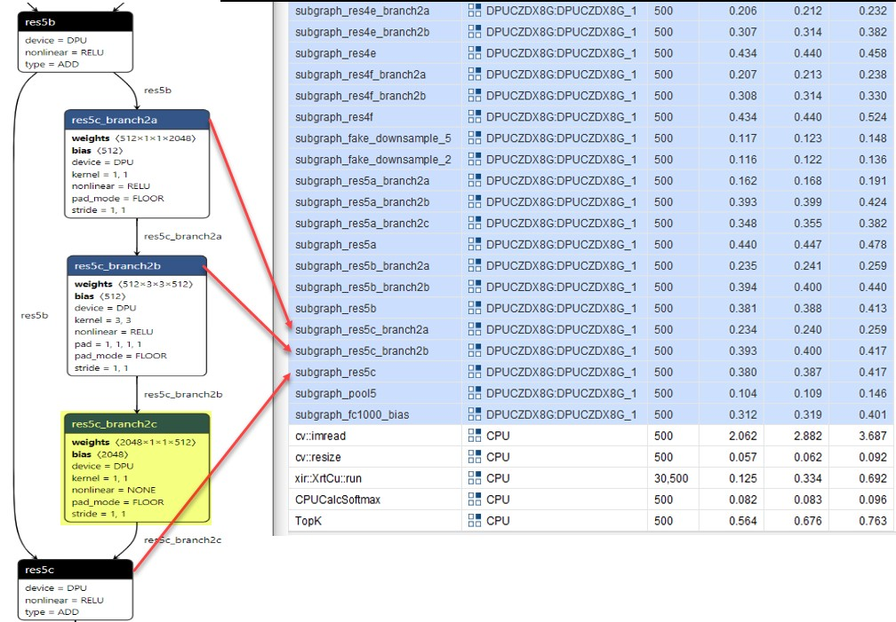

## Viewing the Xmodel
The Vitis AI tools produce an XMODEL which can be viewed by Netron at different stages during compilation.  
•	Netron (LINK)

## Data Resizing Example
The following is an example of two fine grain profiler captures using the VART ResNet50 model (see figure #14).  In the first case, we use image data with 224x224 resolution.  In the second case, we increase our image size to 1920x1080 resolution (HD). For the smaller image, the resize function (`cv::resize`) was not used as the image was already the correct size for the ResNet50 model.  When the HD image was classified, the `cv::resize` function utilized more CPU time to resize the image. This is reflected in the below images.   

#### Figure #14

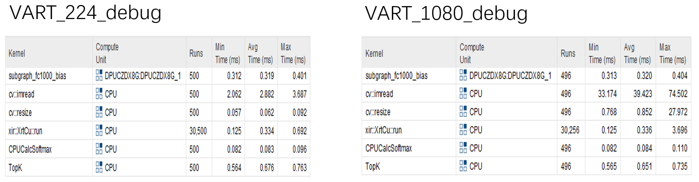

If the cv::resize function is deemed the performance bottleneck it could be offloaded from the CPU and implemented in the PL logic using Vitis Libs [LINK](https://xilinx.github.io/Vitis_Libraries/vision/2021.1/api-reference.html#resolution-conversion).     

## Conclusion:
The Vitis AI profiler enables a system-level view of your AI model within your system and
provides the following:

### A unified timeline that shows running status of different compute units in the FPGA
- DPU tasks running status and utilization
- CPU busy/idle status
- Time consumption of each stage

### Information about hardware while executing
- Memory bandwidth
- Real-time throughputs of AI inference (FPS)

### Hardware information
- CPU model/frequency
- DPU kernel latency

### Statistical information
- Time consumed at each stage of each processing block in the system
