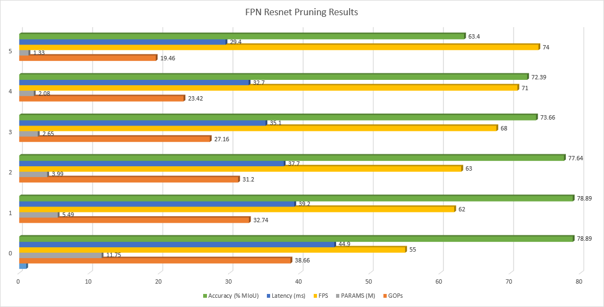
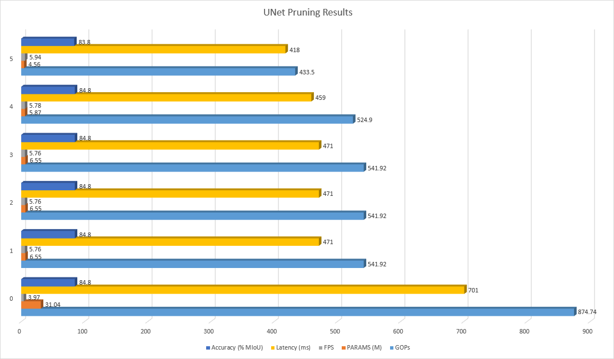

<table class="sphinxhide">
 <tr>
    <td align="center"><h1>Vitis-AI™ 1.4 - Machine Learning Tutorials</h1>
    <a href="https://www.xilinx.com/products/design-tools/vitis.html">See Vitis™ Development Environment on xilinx.com</br></a>
    <a href="https://www.xilinx.com/products/design-tools/vitis/vitis-ai.html">See Vitis-AI™ Development Environment on xilinx.com</a>
    </td>
 </tr>
</table>

# PyTorch CityScapes Pruning

The following is a tutorial for using the Vitis AI Optimizer to prune the Vitis AI Model Zoo [FPN Resnet18 segmentation model](https://github.com/Xilinx/Vitis-AI/blob/master/models/AI-Model-Zoo/model-list/pt_SemanticFPN_cityscapes_256_512_10G_1.4/model.yaml) and a publicly available [UNet model](https://github.com/milesial/Pytorch-UNet) against a reduced class version of the Cityscapes dataset.  The tutorial aims to provide a starting point and demonstration of the PyTorch pruning capabilities for the segmentation models.

  * > This tutorial has been tested with Vitis AI 1.4.1 and the resultant models have been tested on the ZCU102 board.  

  * > The tutorial has been tested with PyTorch v1.4 as well as PyTorch v1.7.1.  Each version has been found to work independently (the two should not be mixed).

To execute this tutorial, you first need to create an account to access the Cityscapes datatset.  This can be done through the following link:

https://www.cityscapes-dataset.com/register/

Also, a license is required to run the Vitis AI Optimizer pruning tools which are required by this tutorial.  It is possible to request a temporary evaluation licenses for the Vitis AI Optimizer tools and you can start by requesting access to the secure site at
[https://www.xilinx.com/member/ai_optimizer.html](https://www.xilinx.com/member/ai_optimizer.html).  Contact [xilinx_ai_optimizer@xilinx.com](xilinx_ai_optimizer@xilinx.com ) for inquiries on evaluation licenses.

Contact your local FAE or salesperson to purchase a license.

The Vitis AI Optimizer tools support coarse-grained (channel) pruning that can optimize a model against a particular dataset.  This results in a smaller, faster model which uses less memory.   

From the experiments for this tutorial, pruning the FPN Resnet18 and UNet segmentation models for five iterations yielded a speedup of approximately 1.15x for FPN and 1.5x for UNet (with <1% accuracy loss) with a 3x and 6.8x reduction in model parameters, respectively, as shown in the following two charts.







### Step 1: Environment Setup

1. Set up the [Vitis AI 1.4.1 GPU Docker](https://github.com/Xilinx/Vitis-AI) and [ZCU102 board image](https://github.com/Xilinx/Vitis-AI/blob/master/setup/mpsoc/VART/README.md#step2-setup-the-target).  
2. Once the docker has been configured, copy the contents of this tutorial into the workspace directory of the docker.  
3. A script has been provided to overlay your environment with the fpn and unet models as well as training scripts and cityscapes dataset.

The script performs the following actions:

  * Downloads the pretrained floating point [pt_SemanticFPN_cityscapes_256_512_10G_1.4](https://github.com/Xilinx/Vitis-AI/blob/master/models/AI-Model-Zoo/model-list/pt_SemanticFPN_cityscapes_256_512_10G_1.4/model.yaml) model and extracts it
  * Downloads the Cityscapes dataset (account required), and then extracts it in the model's data directory
  * Copies the shell and python scripts provided for pruning into the various workspace directories
  * Downloads the [UNet model](https://github.com/milesial/Pytorch-UNet) and copy it to code/models
  * Updates the `unet_parts.py` model definition file to comment out the 0 padding on lines 59-61
  * Downloads the model prototxt file (used by Vitis AI Libraries for inference on the target) and copies it to the ZCU102/FPN and ZCU102/UNet directories

To initialize the workspace, run the following:

  ```
  cd scripts
  source init_workspace.sh
  ```

4. Copy the `license.lic` file (obtained either by purchasing a license or requesting an evaluation license from [xilinx_ai_optimizer@xilinx.com](xilinx_ai_optimizer@xilinx.com )) for the Vitis AI Optimizer tools into the `pt_SemanticFPN_cityscapes_256_512_10G_1.4` directory

5. The PyTorch pruning environment must also be installed on the host machine. The installation can be performed either natively or in the GPU docker environment (GPU docker was used for the creation of this tutorial).  The [Vitis AI Optimizer Lounge](https://www.xilinx.com/member/ai_optimizer.html) provides Conda packages for the pruning tools.  Once acquired, the Conda package can be installed with the following steps
**Note:** The default PyTorch version in the lounge is v1.4. If PyTorch v1.7.1 is needed,  request the Conda package from [xilinx_ai_optimizer@xilinx.com](xilinx_ai_optimizer@xilinx.com )):

  ```
  conda config --add channels conda-forge
  sudo cp /home/vitis-ai-user/.condarc /etc/conda/condarc
  tar xzvf vai_optimizer_pytorch.tar.gz
  conda create -n prune_pytorch -y
  conda activate prune_pytorch
  conda install -c file://$(pwd)/conda-channel-deephi -c pytorch -c conda-forge vai_optimizer_pytorch_gpu
  ```

 **Note:If you are using PyTorch 1.7.1, you should also use the script provided in the VAI Docker to change the PyTorch quantization Conda environment from 1.4 to 1.7:

  First set up the ownership of the pip tool:
  ```
  chown vitis-ai-user: -R /home/vitis-ai-user/.cache/pip
  ```
  When using Vitis AI 1.4.1, I needed to modify the `replace_pytorch.sh` script with the following change:
  ```
  cp /opt/vitis_ai/scripts/replace_pytorch.sh ./
  #pip install ./pytorch_nndct-*.whl
  pip install ./pytorch_nndct-0.1.0_d3021c9_torch1.7.1_cu101-cp36-cp36m-linux_x86_64.whl
  ```
  The PyTorch environment can then be modified using the following command:
  ```
  ./replace_pytorch.sh vitis-ai-pytorch1.7
  ```

### Step 2: Train the Floating Point Model

This pruning tutorial uses a reduced (6 class vs. 19 class) version of the Cityscapes dataset so we will begin by training the model on the 6 class dataset.  There is no modification needed to the raw Cityscapes data as the [reducedclasscityscapes.py](./files/scripts/dataset/reducedclasscityscapes.py) is designed to only include the reduced classes.

The classes have been modified as follows:

  * Class 1 [static objects like buildings]: grouping of building, wall, fence, guard rail, bridge, tunnel, pole, and polegroup
  * Class 2 [sky]: sky
  * Class 3 [person]: grouping of person and rider
  * Class 4 [vehicle]: grouping of car, truck, and bus
  * Class 5 [bike]: grouping of motorcycle and bicycle

The floating point model can be trained with a compatible installation of PyTorch (For example: v1.4, v1.7.1)

To train the floating point model, run the following:

    ```
    cd pt_SemanticFPN_cityscapes_256_512_10G_1.4
    source run_train_fpn_6cls.sh
    # OR
    source run_train_unet_6cls.sh
    ```

### Step 3: Prune the Floating Point Model

After training is complete, snapshots will exist in the `pt_SemanticFPN_cityscapes_256_512_10G_1/checkpoint/citys_reduced/fpn/` (or unet/) directory.  By default, the pruning script will use the `model_best.pth.tar` snapshot.

The pruning script uses the [code/prune/train.py](./files/scripts/prune/train.py) which was copied over from this tutorial.  

The first step in pruning is the analysis step, and this typically requires at least a few hours, even with GPU acceleration.  This step will generate a hidden file (.ana) in the working directory that represents the sensitivity analysis output.

**Note:** If for some reason pruning is halted after the analysis phase and you wish to resume pruning without re-running analysis, you can use the provided example script [resume_pruning_example.sh](./files/scripts/resume_pruning_example.sh) as a starting point to do so.

After this step, the pruning script will attempt to run five iterations of pruning by default and will increase the pruning threshold by 0.1 after each iteration.  These parameters can be modified in the shell script used to start the pruning process.

Each iteration of pruning will run the following commands: prune => finetune => validate for a maximum number of epochs as are specified by the pruning shell script (default is 200).  If the validate procedure determines that the model is within 2% of the initial model mIoU, the pruning process will take a snapshot and move to the next iteration.

All of these parameters are configurable by either editing the shell script (run_prune*.sh) or by modifying the pruning python script (`code/prune/train.py`).

To run the pruning process, use the following command (use the name of the PyTorch Conda environment into which the VAI optimizer was installed):

    ```
    conda activate prune_pytorch
    source run_prune_fpn.sh
    # OR
    source run_prune_unet.sh
    ```

The time required to prune the model will depend on the performance of the host machine, but it is expected to take 6-12 hours minimum typically.

### Step 4: Quantize the Pruned Model

The next step is to quantize the pruned model. The first step to quantize will be to activate the PyTorch quantization Conda environment within the Vitis AI docker (if you are using PyTorch 1.7, make sure to activate the correct Conda environment for that version).  Note that this is a different environment provided by the Vitis AI GPU docke/*r that contains XIR and the quantization tools.

  ```
  conda activate vitis-ai-pytorch
  ```

Quantization scripts ([quant_pruned_fpn.sh](./files/scripts/quant_pruned_fpn.sh) and [quant_pruned_unet.sh](./files/scripts/quant_pruned_unet.sh)) have been provided which by default will use pruned iteration 1 from the first epoch.  

Ensure to set the following two variables in the script to point to the desired snapshot:

  ```
  PRUNED_WEIGHTS=path_to_dense_ckp.pth
  PRUNED_MODEL_DEF=pruned_model_def_folder_name.pruned_1 #(make sure to use a '.' to separate the folder name and filename and omit the '.py' from the filename)
  ```

The FPN scripts by default use the --fast_finetune setting whereas the UNet scripts do not.  All scripts will run both calibration and testing, and then dump to an XMODEL.  It is possible to edit these steps as desired by modifying the script.

### Step 5. Compile the Pruned Model

Scripts have also been provided to compile the pruned models.  By , the scripts point to an iteration 0 snapshot and will target the ZCU102 board. Edit the desired `run_compile_*.sh` script to point to the quantized snapshot of interest and compile it using the following:

  ```
  source run_compile_fpn.sh
  ```
The compiled .xmodel will be populated in the directory specified within the script (For example: compiled_unet_pruned_iter0).

**Note:** These models may also be compiled for other hardware targets by modifying the `arch.json` in the compile script.  

### Step 6. Run the Model on the Target

The compiled model needs to be copied to the ZCU102/FPN or ZCU102/UNet directory.  To run on the target, the model name should be the same as the prototxt file name (used by Vitis AI Libraries for pre/post processing) that exists in that directory.  

To run on the target, copy the ZCU102/FPN or ZCU102/UNet directory to the board and run with the prebuilt Vitis AI Libraries:

```
# For Video Tests:
cd Vitis-AI/demo/Vitis-AI-Library/samples/segmentation
./test_video_segmentation path_to_ZCU102/FPN/FPN.xmodel video_source -t 4

# For Performance tests:
cd Vitis-AI/demo/Vitis-AI-Library/samples/segmentation
./test_performance_segmentation path_to_ZCU102/FPN/FPN.xmodel test_performance_segmentation.list -t 4 -s 60
```

### Summary

In conclusion, Vitis AI Optimizer tools provide an additional vector of optimization in the form of coarse-grained channel pruning.  The benefits shown here for segmentation models ranged from 1.15-1.5x speedup with a significant size reduction (3x to 6.8x) in model parameters.  This is quite modest when compared to the benefits the same pruning tools can provide for other model architectures which exhibit higher compute/data (ops/byte) transfer ratios such as Yolo and SSD.  In these architectures, a 5-7x speedup is often realizable.

The follow on is now to adapt this tutorial to your target PyTorch model and dataset of choice and explore what benefits (device and/or DPU size reduction, power reduction, throughput boost, latency and/or memory reduction) are possible for your system.
