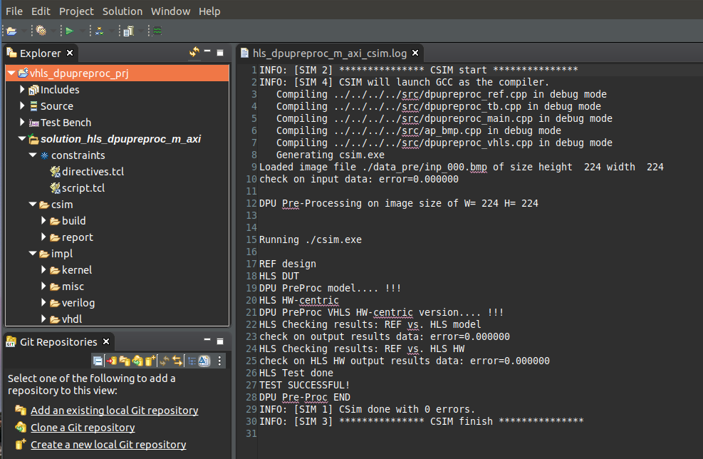
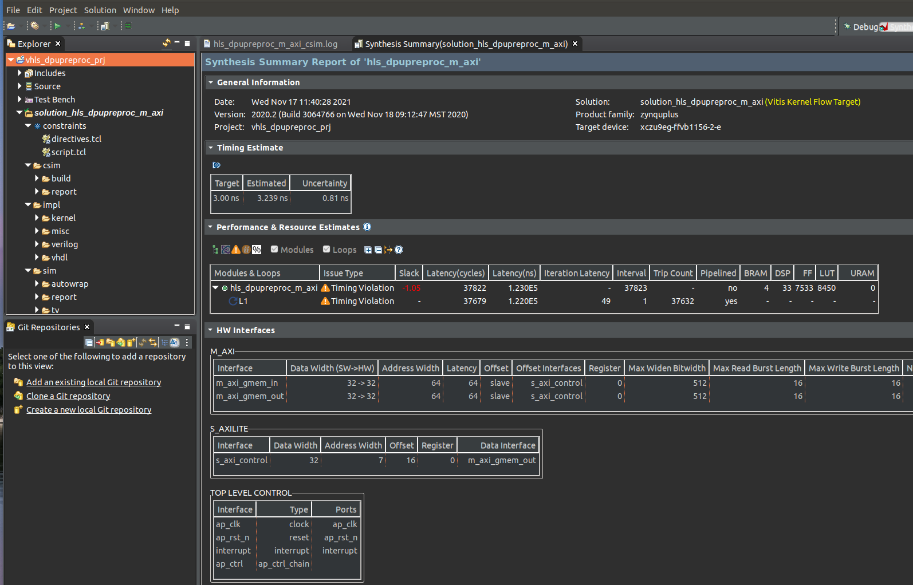
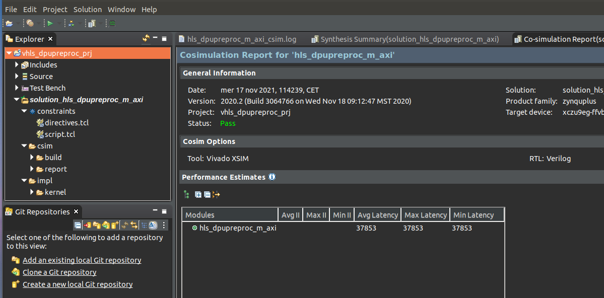
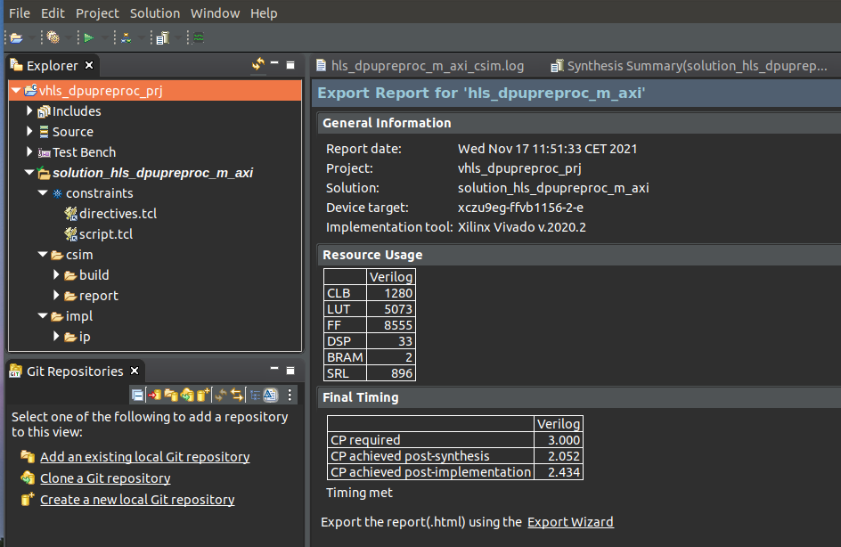
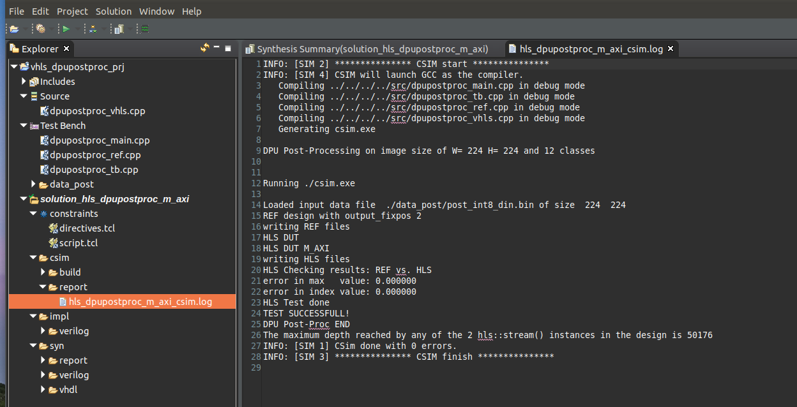
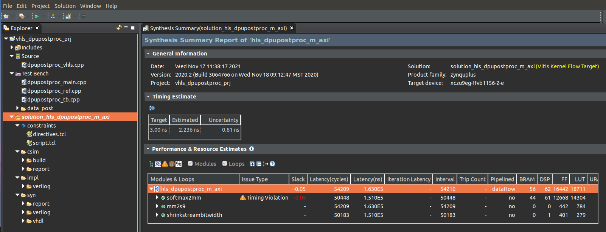
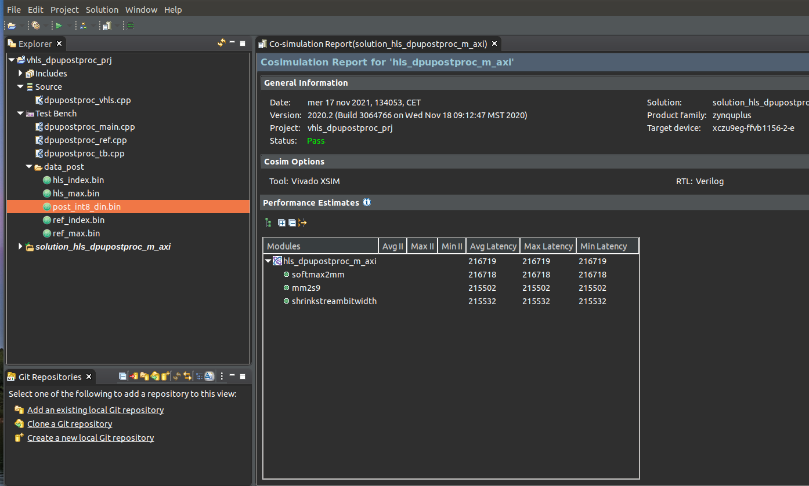
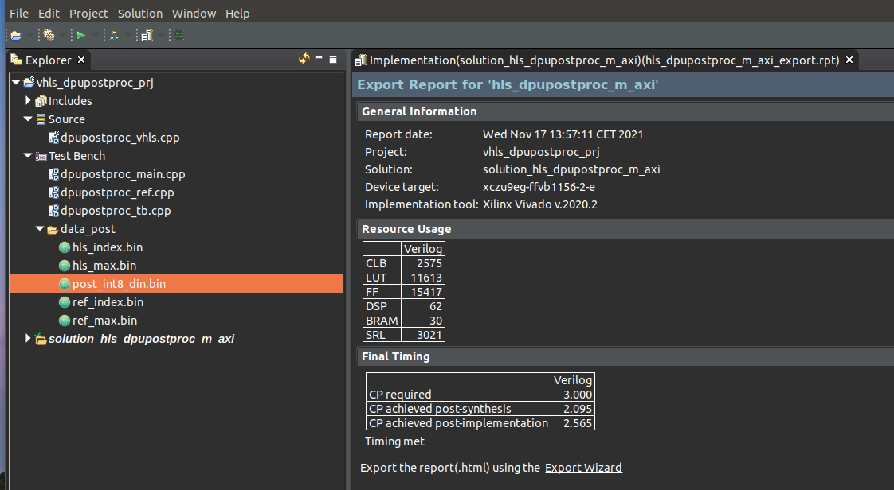

<!--
Copyright 2021-2022 Xilinx Inc.

Licensed under the Apache License, Version 2.0 (the "License");
you may not use this file except in compliance with the License.
You may obtain a copy of the License at

http://www.apache.org/licenses/LICENSE-2.0

Unless required by applicable law or agreed to in writing, software
distributed under the License is distributed on an "AS IS" BASIS,
WITHOUT WARRANTIES OR CONDITIONS OF ANY KIND, either express or implied.
See the License for the specific language governing permissions and
limitations under the License.

Authors: Daniele Bagni, Peter Schillinger, Herve Ratigner, Kay Migge, Xilinx Inc
-->
<table class="sphinxhide">
 <tr>
    <td align="center"><h1>Vitis-AI™ 1.4 - Machine Learning Tutorials</h1>
    <a href="https://www.xilinx.com/products/design-tools/vitis.html">See Vitis™ Development Environment on xilinx.com</br></a>
    <a href="https://www.xilinx.com/products/design-tools/vitis/vitis-ai.html">See Vitis-AI™ Development Environment on xilinx.com</a>
    </td>
 </tr>
</table>


# Pre- and Post-processing Accelerators for Semantic Segmentation with Unet CNN on MPSoC DPU

## Current status


1. Embedded system designed with Vitis 2021.1 environment (``Xilinx_Unified_2021.1_0610_2318.tar.gz`` archive).

2. UNet CNN model deployed with Vitis AI >= 1.4.

3. Tested in hardware on ZCU102 board.


#### Last update

02 December 2021

## 1. Introduction

This repository contains the Pre- and Post-processing kernels to be used in Machine Learning (ML) jointly with the Deep learning Processor Unit (DPU) to accelerate the tasks in Programmable Logic (PL). These tasks will be otherwise executed by the ARM host CPU of the FPGA target device. Off-loading those two tasks from the ARM CPU improves the overall system performance in terms of frames-per-second (fps).

The two accelerators were tested using data from the Semantic Segmentation UNet CNN of this tutorial:
[VAI-KERAS-UNET-SEMSEG](https://github.com/Xilinx/Vitis-AI-Tutorials/blob/master/Design_Tutorials/05-Keras_FCN8_UNET_segmentation/README.md), but they are general enough to be used or easily adapted with few changes also to other Deep Learning applications, such as Object Detection or Image Classification. Their design is done with Vitis High Level Synthesis (HLS) within the Vitis suite. The application running on the host ARM&reg; CPU applies XRT APIs.

This tutorial can also be seen as a complete example of how to use the [WAA](https://github.com/Xilinx/Vitis-AI/tree/master/demo/Whole-App-Acceleration) flow targeting the MPSoC ZCU102 board.

You are supposed to name this tutorial repository ``MPSOCDPU-PRE-POST-PLACC`` and place it into a certain working directory ``$WRK_DIR``. For example, in this tutorial we used ``export WRK_DIR=/media/danieleb/DATA/``.

There are three major commands that run all that is explained in Sections 2 and 3.1, 3.2:

  ```shell
  cd $WRK_DIR
  cd MPSOCDPU-PRE-POST-PLACC/files # you are supposed to be here
  # whole section 2
  source ./run_hls_projects.sh
  # Subsection 3.2
  cd makefile_flow
  source ./run_makefile_flow.sh
  # Subsection 3.3
  cd ../dpu_trd
  make all  
  ```

**Imporant:** All the tasks in this tutorial were done on an Ubuntu 18.04 desktop with Vitis 2021.1. It was never tried on a Windows OS PC.


## 1.2 Dos-to-Unix Conversion

If you run into unexpected errors during the execution of the scripts, you have to pre-process all the``*.sh``, ``*.cpp``, ``*.h`` files with the [dos2unix](http://archive.ubuntu.com/ubuntu/pool/universe/d/dos2unix/dos2unix_6.0.4.orig.tar.gz) utility for once.
In that case, run the following commands from your Ubuntu host PC (out of the Vitis AI docker images):
```bash
#sudo apt-get install dos2unix
cd <WRK_DIR> #your working directory
for file in $(find . -name "*.sh" ); do dos2unix ${file}; done
for file in $(find . -name "*.tcl"); do dos2unix ${file}; done
for file in $(find . -name "*.h"  ); do dos2unix ${file}; done
for file in $(find . -name "*.c*" ); do dos2unix ${file}; done
```

## 1.3 Setup

### 1.3.1 Downloads

As described in https://github.com/Xilinx/Vitis-AI/blob/master/dsa/DPU-TRD/prj/Vitis/README.md, download (or git clone) the following components anywhere into an accessible location in your file system:  

- ZCU102 base platform 2021.1 (about ~30 MB size) from https://www.xilinx.com/support/download/index.html/content/xilinx/en/downloadNav/embedded-platforms.html
  ```
  $ md5sum xilinx_zcu102_base_202110_1.zip
  cf000aca06d1aba278199d285a78b933  xilinx_zcu102_base_202110_1.zip
  ```
- ZYNQMP common image 2021.1 (about ~1.7GB size) from https://www.xilinx.com/support/download/index.html/content/xilinx/en/downloadNav/embedded-platforms.html  
  ```
  $ md5sum  xilinx-zynqmp-common-v2021.1.tar.gz
  16d8657d4fe1c606df52f3dc1bc418fe  xilinx-zynqmp-common-v2021.1.tar.gz
  ```
  For example, we have placed both archives in this folder ``$WRK_DIR/MPSOCDPU-PRE-POST-PL-ACC/dpu_trd/``.

- Clone the Vitis-AI (1.4.1) GitHub repository https://github.com/Xilinx/Vitis-AI with this command:
  ```shell  
  git clone https://github.com/Xilinx/Vitis-AI.git  
  ```
  For example, we have placed it in the  ``$WRK_DIR/Vitis-AI-1.4.1`` folder.

### 1.3.2 Installing the SDK

Decompress ``xilinx-zynqmp-common-v2021.1.tar.gz``  and extract its ``sysroot``:
```shell
cd $WRK_DIR/MPSOCDPU-PRE-POST-PL-ACC/dpu_trd/  
tar -xvf ~/Downloads/xilinx-zynqmp-common-v2021.1.tar.gz -C .   
sudo ./sdk.sh -y -d /tools/Xilinx/sdk -p
```

**Note**: This tutorials uses a short-length name for the destination folder, as ``/tools/Xilinx/sdk``, to avoid the following error:
```
File "./tmp/xilinx-zynqmp-common-v2021.1/sdk/relocate_sdk.py", line 82, in change_interpreter
 p_filesz, p_memsz, p_align = struct.unpack(ph_fmt, ph_hdr)
 struct.error: unpack requires a string argument of length 56
```
### 1.3.3 Environmental Variables

Beside Vivado&trade; and Vitis environment for 2021.1, the variables below have to be set up according to where you have placed them.
The [set_env_before_make.sh](files/sh_scripts/set_proj_env .sh) script contains a template to be adapted by the user.

The following lines show the desktop settings:

```shell
# set the Vitis/Vivado 2021.1 release
source /tools/Xilinx/Vitis/2021.1/settings64.sh
# working directory
export WRK_DIR=/media/danieleb/DATA
# for Vitis AI>=1.4
export VITIS_AI_PATH=${WRK_DIR}/Vitis-AI-1.4.1
# for the HLS kernels and host applications
export MPSOCDPU_PRE_POST_PL_ACC=${WRK_DIR}/MPSOCDPU-PRE-POST-PL-ACC/files
# for the necessary included files and libraries of host_apps
export TRD_HOME=${MPSOCDPU_PRE_POST_PL_ACC}/dpu_trd
# for ZCU102 common sw package
export VITIS_SYSROOTS=${TRD_HOME}/xilinx-zynqmp-common-v2021.1/sdk/sysroots/cortexa72-cortexa53-xilinx-linux
# for common zcu102 platform
export VITIS_PLATFORM=xilinx_zcu102_base_202110_1
export VITIS_PLATFORM_DIR=${TRD_HOME}/${VITIS_PLATFORM} #xilinx_zcu102_base_202110_1
export VITIS_PLATFORM_PATH=${VITIS_PLATFORM_DIR}/${VITIS_PLATFORM}.xpfm
export SDX_PLATFORM=${VITIS_PLATFORM_PATH}
```


### 1.4.4 Input Images

The input images can taken from the dataset adopted into [VAI-KERAS-UNET-SEMSEG](https://github.com/Xilinx/Vitis-AI-Tutorials/blob/master/Design_Tutorials/05-Keras_FCN8_UNET_segmentation/README.md).

Alternatively, you can extract [some images from video frames](https://www.raymond.cc/blog/extract-video-frames-to-images-using-vlc-media-player/) taken by Vitis AI [vitis_ai_runtime_r1.4.0_image_video.tar.gz](https://www.xilinx.com/bin/public/openDownload?filename=vitis_ai_runtime_r1.4.0_image_video.tar.gz) video files of the [Step3: Run the Vitis AI Examples](https://github.com/Xilinx/Vitis-AI/blob/master/setup/mpsoc/VART/README.md#step2-setup-the-target) with the  following command:
```shell
vlc ${HOME}/Videos/segmentation/video/traffic.webm  --video-filter=scene \
 --vout=dummy --start-time=001 --stop-time=400 --scene-ratio=100 \
 --scene-path=${HOME}/Videos vlc://quit
```

Another possible way is to get some input pictures from the  [vitis_ai_library_r1.4.0_images.tar.gz](https://www.xilinx.com/bin/public/openDownload?filename=vitis_ai_library_r1.4.0_images.tar.gz) archive file in
[Vitis AI Library examples](https://github.com/Xilinx/Vitis-AI/blob/master/tools/Vitis-AI-Library/README.md#running-vitis-ai-library-examples-for-u50u50lvu280vck5000).

In all cases, ensure to resize all the images to 224x224x3 resolution with python code similar to this:
```python
import cv2
inp_img = cv2.imread("scene_00001.png")
out_img = cv2.resize(inp_img, [224, 224])
cv2.imwrite("scene_00001_224x224.png", out_img)
```


# 2 Design Flow with HLS

For each accelerator, there are two project folders named [hls](files/preproc/hls) and [vitis](files/preproc/vitis), respectively, with the source files adopted in the standalone HLS design and the final Vitis system design. Note that the files are the same among the two subfolders, except the [vitis](files/preproc/vitis) folder also requires the ARM host code with XRT APIs, which is not needed
by the vitis_hls folder. Therefore, the [dpupreproc_defines.h](files/preproc/vitis/kernels/dpupreproc_defines.h) file must have the line #define ARM_HOST commented when used in the kernels subproject, but it must have such line not commented when used in the host code, as shown in [dpupreproc_defines.h](files/preproc/vitis/host/dpupreproc_defines.h). This is the only difference between these two files that have the same name and are placed in different folders.

The same concept is also valid for the post-processing kernel and its related folders [hls](files/postproc/hls) and [vitis](files/postproc/vitis), respectively, for the source files adopted in the standalone HLS design and the final Vitis system design.

**Important**: To avoid proliferation of files with the same name, we used softlinks for the common files between the standalone HLS and the Vitis project.
Run the following command before reading the rest of this document:

```shell
cd MPSOCDPU-PRE-POST-PLACC/files
# clean everything
bash -x ./sh_scripts/clean_files.sh
# do soft-links
bash -x ./sh_scripts/prepare_files.sh
```

## 2.1 Pre-processing Kernel

### 2.1.1 Kernel Functionality

In ML, the preprocessing job has to change the statistics on the data used for training the CNN to facilitate such training. There are many ways to do preprocessing. The most popular methods are the *Caffe* and *TensorFlow* modes, respective, explained with Python code fragments below:

```python
. . .
if (TensorFlow_preproc): #TensorFLow mode
  _B_MEAN = 127.5
  _G_MEAN = 127.5
  _R_MEAN = 127.5
  MEANS = [_B_MEAN, _G_MEAN, _R_MEAN]
  SCALES = [0.007843137, 0.007843137, 0.007843137] # 1.0/127.5
else: #Caffe mode
  _B_MEAN = 104.0# build the HLS project
source ./run_hls_projects.sh

  _G_MEAN = 117.0
  _R_MEAN = 123.0
  MEANS = [_B_MEAN, _G_MEAN, _R_MEAN]
  SCALES = [1.0, 1.0, 1.0]
. . .
def preprocess_one_image_fn(image_path, pre_fix_scale, width, height):
    means = MEANS
    scales = SCALES
    image = cv2.imread(image_path)
    image = cv2.resize(image, (width, height))
    B, G, R = cv2.split(image)
    B = (B - means[0]) * scales[0] * pre_fix_scale
    G = (G - means[1]) * scales[1] * pre_fix_scale
    R = (R - means[2]) * scales[2] * pre_fix_scale
    image = cv2.merge([R, G, B])
    image = image.astype(np.int8)
    return image
```

Usually, in Caffe, the input image R G B pixels are manipulated by subtracting the R G B mean values (``MEANS``) of all the training dataset images. So, the output data is the ``signed char`` type (in C/C++) or ``int8`` (python NumPY), with a possible range from -128 to +127, being 8-bit.
On the other hand,  in TensorFlow, the pixels are manipulated by normalizing them in the interval from -1.0 to 1.0 typically.

During the CNN training phase, the pre-processing works on floating-point data, but in real life, the DPU works with ``int8`` after quantization with [Vitis AI tools](https://github.com/Xilinx/Vitis-AI/tree/master/tools/Vitis-AI-Quantizer). So, in the application running on the target device in real time, you have to scale the data with the ``pre_fix_scale`` parameter that comes from a query to the DPU before starting the ML prediction (inference) task itself, with Python code similar to this:

```python
input_fixpos = all_dpu_runners[0].get_input_tensors()[0].get_attr("fix_point")
pre_fix_scale = 2**input_fixpos
```

In conclusion, before starting its job,  the image pre-processing module requires six floating-point input parameters:
```
float MEANS[3];
float SCALES[3];
```
The scaling factor could be either
``float pre_fix_scale;``
or
``int input_fixpos;``
The last can be a value from 1 to 7 because it represents the exponent ``i`` of a power of ``2,`` that is ``2^i``.    

In the HLS TestBench (TB), all those parameters are fixed in the [dpupreproc_defines.h](files/preproc/hls/src/dpupreproc_defines.h) file, to test the core funcationality.

The input images used in the self-checking TB are taken from the test dataset of the
[VAI-KERAS-UNET-SEMSEG](https://github.com/Xilinx/Vitis-AI-Tutorials/blob/master/Design_Tutorials/05-Keras_FCN8_UNET_segmentation/README.md) tutorial.

### 2.1.2 HLS Design

After setting up the Vitis environment, enter the following command
```shell
cd MPSOCDPU-PRE-POST-PLACC/files # you are supposed to be here
cd preproc/hls
vitis_hls -f hls_script.tcl
```
The whole HLS flow will run in its steps: CSIM, SYN, coSIM, and IMP. For reference, see the related screenshots of Figures 1, 2, 3 and 4.




*Figure 1. Pre-processing CSIM step with Vitis HLS*




*Figure 2. Pre-processing SYN step with Vitis HLS*



*Figure 3. Pre-processing coSIM step with Vitis HLS*



*Figure 4. Pre-processing IMP step with Vitis HLS*


**Note:** The [dpupreproc_defines.h](files/preproc/hls/src/dpupreproc_defines.h) file must have the  ``#define ARM_HOST`` line commented.

As you can see from figure 4, after Place-And-Route, the accelerator consumes the following resources: 5073 LUT, 8555 FF, 2 BRAM, and 33 DSP from the  MPSoC ZU9 device  with a minimum clock period of 2.43ns, which corresponds to  410MHz maximum clock frequency.

Figure 3 shows the cycle accurate simulation (coSIM step). Considering the amount of clock cycles to process the whole image before sending it back to DDR memory, the latency of this kernel is  given by 37853 (cycles) x 2.43ns (clock period) = 0.092ms.

Even assuming a longer clock period of 5ns (corresponding to 200MHz clock frequency) the latency would become 0.189ms.

**Note:** This latency is the time to process the entire frame (224x224x3) of pixels because this is the way Vitis HLS works if you want to do a functional cycle-accurate simulation (acknowledged as "coSIM") of the accelerator. But the core has a real latency of a few dozens of clock cycles in itself. Such effective latency could be exploited either by:
- Using AXI4 Streaming interfaces (which are not accepted by the DPU core because it cannot work in a streaming mode) instead of full MAXI4 interfaces or,
- Adding a ping-pong buffer of a few image lines among the Pre-processing accelerator and the external DDR memory.  


## 2.2 Post-processing Kernel


### 2.2.1 Kernel Functionality

In ML, the post-processing job has to present the "features map" generated by the CNN in a human-readable form. In the case of Semantic Segmentation, this requires understanding which pixel of the image belongs to which class.

There are 12 classes per pixel in this application case, so the output tensor generated by the DPU is a 3D volume with the same horizontal and vertical size of the input images: 224 and 224, respectively, and 12 channels.

For each set of 12 values related to one pixel, the post-processing task computes the Softmax classifier first and then searches for its maximum value and related index. The index of this max value represents the object class (coded with a number from 0 to 11) with the highest probability to be predicted by the CNN. For more details, see the C/C++ code of the  [dpupostproc_ref.cpp](files/postproc/common_src/dpupostproc_ref.cpp):

```text
void ref_SoftMax(signed char  *inp_data, float *out_data, float post_scale_factor, unsigned char size)
{
  float result[MAX_NUM_OF_CLASSES];
  float sum = 0.0f;
  for (int i=0; i<size; i++) {
	  int addr = 128+inp_data[i];
	  assert( (addr>=0) & (addr<=255) );
    float x = addr*post_scale_factor;
    result[i]= expf(x);
    sum += result[i];
  }
  float div = 1.0f / sum;
  for (int i=0; i<size; i++)
    out_data[i]=result[i] * div;
}

void ref_ArgMax(float *inp_data, unsigned char *out_max, unsigned char *out_index, unsigned char size)
{
  unsigned char  max=0, index=0;
  for (int i=0; i<size; i++) {
    float val = inp_data[i];
    val = val * 255.0f;
    int i_val = (int) val;
    assert( (i_val<=255) & (i_val>=0) );
    unsigned char u_val = i_val;
    if (u_val > max) {
    	max = u_val;
    	index = i;
    }
  }
  *out_index = index;
  *out_max = max;
}

void ref_dpupostproc(signed char *inp_data, unsigned char *out_max,
     unsigned char *out_index, float post_scale_factor, unsigned short int height, unsigned short int width)
{
  unsigned short int rows = height;
  unsigned short int cols = width;
  unsigned short int size = MAX_NUM_OF_CLASSES;

  float softmax[MAX_NUM_OF_CLASSES];
  signed char ch_vect[MAX_NUM_OF_CLASSES];
  unsigned char index, max;

  for (int r = 0; r < rows; r++) {
    for (int c = 0; c < cols; c++) {
      for(int cl=0; cl<size; cl++) {
    	  signed char  tmp_data  = inp_data[r*POST_MAX_WIDTH*MAX_NUM_OF_CLASSES + c*MAX_NUM_OF_CLASSES + cl];
    	  ch_vect[cl] =  tmp_data;
      }
      ref_SoftMax(ch_vect, softmax, post_scale_factor, size);
      ref_ArgMax(softmax, &max, &index, size);
      out_max[  r*POST_MAX_WIDTH + c] = (unsigned char) max;
      out_index[r*POST_MAX_WIDTH + c] = index;
    }
  }
}
```

As with pre-processing, in this case, there is the need to scale the data generated by the DPU before inputting them into the SoftMax classifier. It is done with the ``post_scale_factor`` parameter that comes from a query to the DPU at run time, with Python code similar to this:

```python
output_fixpos = outputTensors[0].get_attr("fix_point")
post_scale_fact = 1 / (2**output_fixpos)
```

**Note:** The ``output_fixpos`` is value from 1 to 7 because it represents the exponent ``i`` of a power of ``2,`` that is ``2^i``.    

The SoftMax function is computed by a Look Up Table (LUT) because there are seven possible ``output_fixpos`` values. The  [luts.h](files/postproc/common_src/luts.h) file contains 7 different LUTs, one for each value.

In the HLS TB this parameter is fixed in the [dpupostproc_defines.h](files/postproc/vitis/kernels/dpupostproc_defines.h) file to test the functionality of the core.


### 2.2.2 HLS Design


After setting up the Vitis environment, enter this command:
```shell
cd MPSOCDPU-PRE-POST-PLACC/files # you are supposed to be here
cd postproc/hls
vitis_hls -f hls_script.tcl
```
and the whole HLS flow will run in its steps: CSIM, SYN, coSIM and IMP.
See the related screenshots of Figures 5, 6, 7 and 8.




*Figure 5. Post-processing CSIM step with Vitis HLS*




*Figure 6. Post-processing SYN step with Vitis HLS*



*Figure 7. Post-processing coSIM step with Vitis HLS*



*Figure 8. Post-processing IMP step with Vitis HLS*


**Note:** The [dpupostproc_defines.h](files/postproc/hls/src/dpupostproc_defines.h) file must have the line ``#define ARM_HOST`` commented.

As you see from Figure 8, after Place-And-Route, the accelerator consumes the following resources: 11613 LUT, 15417 FF, 30 BRAM, and 62 DSP from the  MPSoC ZU9 device  with a minimum clock period of 2.565, which corresponds to  389MHz maximum clock frequency.

Figure 7 shows the cycle accurate simulation (coSIM step). Considering the amount of clock cycles to process the whole image before sending it back to DDR memory, the latency of this kernel is  given by 216719 (cycles) x 2.565ns (clock period) = 0.55ms.

Even assuming a longer clock period of 5ns (corresponding to 200MHz clock frequency) the latency would become 1.08ms.

**Note:** This latency is the time to process the entire frame (224x224x12) of data because it is the way Vitis HLS works if you want to do a functional cycle accurate simulation (acknowledged as "coSIM") of the accelerator. But the core has a real latency of few dozens of clock cycles in itself. Such effective latency could be exploited either by:
- Using AXI4 Streaming interfaces (which are not accepted by the DPU core because it cannot work in a streaming mode) instead of full MAXI4 interfaces or
- By adding a ping-pong buffer of few image lines among the Post-processing accelerator and the external DDR memory


# 3 Makefile-Based Design Flow

When adding also the DPU software application to the PL pre- and post-processing accelerators, you have to use the Vitis flow based on the usage of ``Makefiles``.


## 3.1 Compile the Host Applications

Assuming you have properly setup the Vitis environment, the complete software application with the cascade of the three kernels (punlink       ./postproc/vitis/kernels/lut_exp.h
re-processing, DPU, post-processing)
can be compiled with the Vitis Makefile-based flow by launching the following commands in the [Makefile](files/makefile_flow/host_apps/Makefile) from the [host_apps](files/makefile_flow/host_apps):

```shell
cd $WRK_DIR/MPSOCDPU-PRE-POST-PLACC/files # you are supposed to be here
cd makefile_flow
bash -x ./run_makefile_flow.sh
```

These commands will compile the host applications with a Makefile flow for the standalone pre-processing (``preproc`` folder, the application is named ``host_preproc_xrt``),
the standalone post-processing (``postproc`` folder, the application is named ``host_postproc_xrt``) and the cascade of "preprocessing -> DPU -> postprocessing" (``pre2dpu2post`` folder, the application is named ``pre2dpu2post``).


## 3.2 Compile the Whole Embedded Hardware/Software System

The following command will create the entire embedded system (Depending on computer you are using, it might require up to a few hours):

```shell
cd $WRK_DIR/MPSOCDPU-PRE-POST-PLACC/files/dpu_trd # you are supposed to be here
make all
```

The ``sd_card.img`` image file to boot the ZCU102 board from SD-card will be produced in the ``$WRK_DIR/MPSOCDPU-PRE-POST-PLACC/files/dpu_trd/prj/Vitis/binary_container_1/`` folder.
You have to use an utility like ``Wind32DiskImager`` (on a Windows-OS PC) to burn such file on the SD card media.   

You should find all the necessary application files directly on the FAT-32 (BOOT) partition of the SD card.


## 3.3 Run the Host Applications on the Target ZCU102 Board

All necessary files should be on FAT (BOOT) partition of the SD Card in the app folder:

```shell
cd /mnt/sd-mmcblk0p1
ls -l
```

You should see the following files:

```text
-rwxrwxr-x 1 root users 28181640 BOOT.BIN
-rwxrwxr-x 1 root users 21582336 Image
drwxrwxr-x 5 root users      512 app
-rwxrwxr-x 1 root users     2594 boot.scr
drwxrwxr-x 2 root users      512 data_post
drwxrwxr-x 2 root users      512 data_pre
drwxrwxr-x 3 root users      512 data_pre2dpu2post
-rwxrwxr-x 1 root users 26594522 dpu.xclbin
-rwxrwxr-x 1 root users   112600 host_postproc_xrt
-rwxrwxr-x 1 root users  1645224 host_pre2dpu2post_xrt
-rwxrwxr-x 1 root users   150544 host_preproc_xrt
-rwxrwxr-x 1 root users      106 init.sh
-rwxrwxr-x 1 root users       28 platform_desc.txt
-rwxrwxr-x 1 root users    40937 system.dtb
```

Alternatively, in case of changes to the ``host_apps`` running on the ARM CPU, you can create an archive and copy it on your ZCU102 target board with the
``scp`` utility (assuming your board has a certain IP address ``ZCU102_IP_ADDRESS``):

```shell
#from HOST PC
cd MPSOCDPU-PRE-POST-PLACC/files # you are supposed to be here
cd makefile_flow
# -h to replace softlinks with real files
tar -chvf host_apps.tar ./host_apps
# transfer archive from host to target
scp host_apps.tar root@ZCU102_IP_ADDRESS:~/
```

Then you can work on the UART terminal of your target board with the following commands:
```shell
#FROM TARGET BOARD
tar -xvf host_apps.tar
cd host_apps
bash -x ./run_all_on_target.sh | tee logfile_host_apps_zcu102.txt
```

You should see something like what is mentioned in the [logfile_host_apps_zcu102.txt](files/img/ logfile_host_apps_zcu102.txt) file.

Each host application generates an output that perfectly matches the reference:
- The standalone ``preproc`` PL kernel generates the  ``inp_000_out.bmp``  image that is bit-a-bit equal to the ``inp_000_ref.bmp``  image produced by the software task running on the ARM&trade; CPU as reference

- The standalone ``postproc`` PL kernel generates the  ``pl_hls_index.bin``  binary file that is bit-a-bit equal to the ``arm_ref_index.bin``  binary file produced by the software task running on the ARM CPU as reference

- The processing chain ``pre2dpu2post`` composed by the cascade of ``preproc`` ``dpu``, and ``postproc`` kernels produces the outputs of Figures 9 and 10 and the output files ``post_uint8_out_idx.bin`` (PL pre-precessing, DPU , and PL post-processing kernels) and ``post_uint8_ref_idx.bin`` (DPU and ARM sw post-processing task) perfectly match each other.


*Figure 9. Pre-processing output data represented  as an image.*


*Figure 10. Post-processing output data represented  as an image. On the left is the input image, and on the right is the output segmented image.*


<hr/>
<p align="center"><sup>Copyright&copy; 2021 Xilinx</sup></p>
