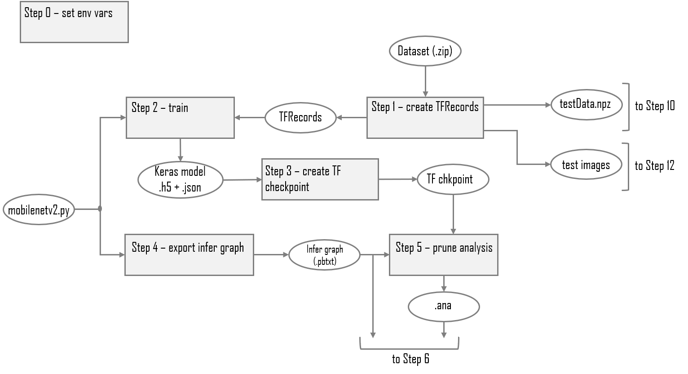
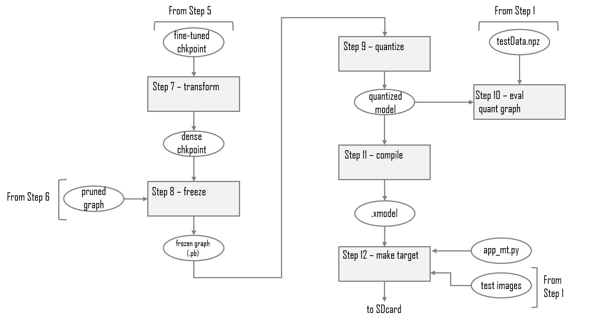

<!--
Copyright 2020 Xilinx Inc.
 
Licensed under the Apache License, Version 2.0 (the "License");
you may not use this file except in compliance with the License.
You may obtain a copy of the License at

http://www.apache.org/licenses/LICENSE-2.0
 
Unless required by applicable law or agreed to in writing, software
distributed under the License is distributed on an "AS IS" BASIS,
WITHOUT WARRANTIES OR CONDITIONS OF ANY KIND, either express or implied.
See the License for the specific language governing permissions and
limitations under the License.

Author: Mark Harvey, Xilinx Inc
-->
<table class="sphinxhide">
 <tr>
   <td align="center"><h1>Vitis AI Tutorials</h1>
  </td>
 </tr>
 <tr>
 <td align="center"><h1>TensorFlow1 AI Optimizer example using Keras</h1>
 </td>
 </tr>
</table>


## Current status

+ Tested with Vitis-AI 1.4.1 (do not use Vitis-AI 1.4 or any previous version)
+ Tested on ZCU102 evaluation board.


## Tutorial Overview

The Vitis-AI Optimizer can optimize convolutional neural networks (CNN) by exploiting redundancies and near-zero parameters to reduce the number of mathematical operations required to execute the network. This process is often known as 'pruning'. The reduction of mathematical operations leads to several benefits:

+ Increased throughput.
+ Reduced latency.
+ Reduced memory footprint of the compiled model.
+ Reduced number of accesses to memory.

This tutorial will show you how to use Xilinx's AI Optimizer for TensorFlow1 to prune a MobileNetV2 CNN by 50% whilst maintaining the original floating-point accuracy.

The scripts provided in this design will allow users to either run a complete pruning flow or to run a baseline design without pruning. Having the baseline design is useful to provide a comparison of performance and accuracy with the pruned design.

The `run_baseline.sh` shell script creates the baseline design whereas `run_prune.sh` will prune the Kears MobileNetV2 design by approximately 50%. Users are invited to examine both scripts to get an idea of the differences between the two flows.

The remainder of this tutorial is dedicated to running the pruning flow.


## TensorFlow AI Optimizer design steps

Pruning a CNN is an iterative process and requires an initial analysis phase in which the trained CNN is analysed using the test dataset and then is pruned in steps. The following diagrams summarize the complete TensorFlow AI Optimizer flow when using Keras:


<p align="center">
  <br><br>
  
  <b>Steps 0 to 5</b>
  <br><br>
  <br><br>
  
  <b>Step 6</b>
  <br><br>
  <br><br>
  
  <b>Steps 7 to 12</b>
  <br><br>
</p>


## Before You Begin


The host machine has several requirements that need to be met before we begin. You will need:

  + A license for the AI Optimizer - contact your Xilinx sales representative to obtain one.

  + An x86 host machine with a supported OS - see [System Requirements](https://github.com/Xilinx/Vitis-AI/blob/master/docs/learn/system_requirements.md).

  + The host machine will require Docker to be installed and the Vitis-AI GPU docker image to be built - see [Getting Started](https://github.com/Xilinx/Vitis-AI#getting-started).

  + A GPU card suitable for ML training - a GPU with at least 8GB of memory is recommended.

  + If you plan to use the ZCU102 evaluation board, it should be prepared with the board image as per the [Step2: Setup the Target](https://github.com/Xilinx/Vitis-AI/tree/master/setup/mpsoc/VART#step2-setup-the-target) instructions. Hints on how to connect the various cables to the ZCU102 are also available [here](https://www.xilinx.com/html_docs/vitis_ai/1_4/installation.html#yjf1570690235238).

  + For the Alveo accelerator cards, follow the [Setup Alveo Accelerator Card](https://github.com/Xilinx/Vitis-AI/tree/master/setup/alveo) instructions.


For more details, refer to the latest version of the *Vitis AI User Guide* ([UG1414](https://www.xilinx.com/support/documentation/sw_manuals/vitis_ai/1_4/ug1414-vitis-ai.pdf)) and the *Vitis AI Optimizer User Guide* ([UG1333](https://www.xilinx.com/support/documentation/sw_manuals/vitis_ai/1_4/ug1333-ai-optimizer.pdf)).


This tutorial assumes the user is familiar with Python3, TensorFlow and has some knowledge of machine learning principles.


## Setting up the workspace, dataset and AI Optimizer license

1. Copy this repository by doing either of the following:

    + Download the repository as a ZIP file to the host machine, and then unzip the archive.
    + From a terminal, use the `git clone` command.

2. Download the Kaggle dogs-vs-cats dataset.

    + Go to the [Kaggle website](https://www.kaggle.com/c/dogs-vs-cats/data) and register a new account if necessary.
    + Download the [dataset](https://www.kaggle.com/c/dogs-vs-cats/data).
    + Move dogs-vs-cats.zip into the `files` folder in the design repository, which is the same folder that contains the python (`.py`) and shell (`.sh`) scripts.

    The Kaggle dog-vs-cats dataset consists of 25,000 images of varying dimensions, divided into two classes: cat and dog. Each image is intrinsically labelled or classified in its filename (for example, `cat.12.jpg`).

    There is a set of unlabelled images which were part of the original Kaggle dogs-vs-cats challenge, but we will not use it in this tutorial. Only the 25000 images that are contained in the `train.zip` archive will be used.


3. Place a copy of the AI Optimizer license file on your host machine - it needs to be placed under the 'files' folder so that it is visible to the Vitis-AI docker. The exact location is defined in the `0_setenv_pr.sh` script:

```shell
# Xilinx pruning licenses
export XILINXD_LICENSE_FILE=AI_OPTIMIZER.lic
```


## Starting the Vitis-AI GPU container

1. Open a linux terminal, `cd` to the repository folder, and then `cd` to the `files` folder.
   
2. Start the Vitis AI GPU docker:

    ```shell
    # navigate to densenet tutorial folder
    cd <path_to_repository>/files

    # to start GPU docker container
    ./docker_run.sh xilinx/vitis-ai-gpu:latest
    ```

  The docker container will start and after accepting the license agreement, you should see something like this in the terminal:

    ```shell
    ==========================================

    __      ___ _   _                   _____
    \ \    / (_) | (_)            /\   |_   _|
     \ \  / / _| |_ _ ___ ______ /  \    | |
      \ \/ / | | __| / __|______/ /\ \   | |
       \  /  | | |_| \__ \     / ____ \ _| |_
        \/   |_|\__|_|___/    /_/    \_\_____|

    ==========================================

    Docker Image Version:  1.4.1.978 
    Vitis AI Git Hash:  da248ad33 
    Build Date: 2021-10-21

    For TensorFlow 1.15 Workflows do:
         conda activate vitis-ai-tensorflow 
    For Caffe Workflows do:
         conda activate vitis-ai-caffe 
    For Neptune Workflows do:
         conda activate vitis-ai-neptune 
    For PyTorch Workflows do:
         conda activate vitis-ai-pytorch 
    For TensorFlow 2.3 Workflows do:
         conda activate vitis-ai-tensorflow2 
    For Darknet Optimizer Workflows do:
         conda activate vitis-ai-optimizer_darknet 
    For TensorFlow 1.15 Optimizer Workflows do:
         conda activate vitis-ai-optimizer_caffe 
    For TensorFlow 1.15 Workflows do:
         conda activate vitis-ai-optimizer_tensorflow 
    Vitis-AI /workspace >
    ```

>:bulb: If you get a "Permission Denied" error when starting the docker container, it is almost certainly because the docker_run.sh script is not set to be executable. You can fix this by running the following command:
>    
>    ```shell
>     chmod +x docker_run.sh
>    ```

*The remainder of this tutorial shows a step-by-step pruning flow however users can just run the complete flow using `source run_prune.sh` if they wish. The baseline flow can be run with `source run_baseline.sh`*


## Running the complete pruning flow


### Step 0: Set up environment variables

Activate the Tensorflow1 python virtual environment with `conda activate vitis-ai-tensorflow` and you should see the prompt change to indicate that the environment is active:


```shell
Vitis-AI /workspace > conda activate vitis-ai-tensorflow1
(vitis-ai-tensorflow) Vitis-AI /workspace > 
```

Set the environment variables:

```shell
source ./0_setenv_pr.sh
```

The environment variables contained in `0_setenv_pr.sh` can be modified by the user if required. Pay particular attention to the BATCHSIZE and GPU_LIST variables and modify them according to your particular system.

All files and subfolders generated by the Vitis-AI flow will be written to the folder defined by BUILD.

The trained model is written to the folder defined by TRAIN_DIR and the TFRecords, numpy test data and test images are created in the folder defined by DATA.

For the remiander of this tutorial, the references to file and folder names assumes that the 0_setenv_pr.sh has not been modified.


### Step 1: Convert Kaggle dataset to TFRecords

To run step 1:

```shell
python -u images_to_tfrec.py \
  --data_dir       ${DATA} \
  --tfrec_dir      ${TFREC} \
  --input_height   ${INPUT_HEIGHT} \
  --input_width    ${INPUT_WIDTH} \
  2>&1 | tee ${LOG}/tfrec.log
```

To speed up training, the JPEG images of the dogs-vs-cats dataset will be converted into the TFRecord format. The `images_to_tfrec.py` script will do the following:

+ Unzip the dogs-vs-cats.zip archive into the folder set by its `--data_dir` argument.
+ Split the images into the train and test datasets, ensuring a balance between classes.
+ Resize the images to the dimensions specified by the `--input_height` and `--input_width` arguments.
+ Convert each image and label into a TFRecord. The TFRecord files are written into .tfrecord files in the folder deefined by the `--tfrec_dir` argument.
+ Move the test images to a separate folder for later use on the target board.
+ Create a compressed numpy file that containes the pre-processed test images - this will be used during quantization and then in evaluation of the quantized model.

Each TFRecord has five fields that are defined by the feature dictionary:

```python
# features dictionary
feature_dict = {
  'label' : _int64_feature(label),
  'height': _int64_feature(image_shape[0]),
  'width' : _int64_feature(image_shape[1]),
  'chans' : _int64_feature(image_shape[2]),
  'image' : _bytes_feature(image)
}
```

The label is obtained by looking at the first part of the image file name and assigning either '0' for dog or '1' for cat:

```python
class_name,_ = filename.split('.',1)
if class_name == 'dog':
  label = 0
else:
  label = 1
```

Once this script completes, you should find a folder called `data` that contains the following:

+ A subfolder called `tfrecords` that contains the training and test TFRecord files.
+ A subfolder called `test_images` that contains JPEG test images for use on the target board.
+ A numpy file called testData.npz - this holds the preprocessed test images and labels for use during quantization.


### Step 2: Initial training

To run step 2:

```shell
python -u train_ft.py \
  --output_ckpt    ${FLOAT_MODEL} \
  --tfrec_dir      ${TFREC} \
  --tboard_dir     ${TF_BOARD} \
  --input_height   ${INPUT_HEIGHT} \
  --input_width    ${INPUT_WIDTH} \
  --input_chan     ${INPUT_CHAN} \
  --batchsize      ${BATCHSIZE} \
  --epochs         ${EPOCHS} \
  --learnrate      ${LEARNRATE} \
  --gpu            ${GPU_LIST} \
  2>&1 | tee ${LOG}/train.log
```


The `train_ft.py` script is used at two different points in the pruning flow — here in Step 2 for the initial training of the original network and also in Step 6 for fine-tuning the pruned checkpoints.

If an input checkpoint is specified using the `--input_ckpt` argument, the script will assume that it is fine-tuning a pruned checkpoint and sets the pruning mode. For fine-tuning it is necessary to call the `tf.set_pruning_mode()` API which enables a 'sparse training' mode that keeps the weights of pruned channels at a zero value during fine-tuning:

```python
if (input_ckpt!=''):
  tf.set_pruning_mode()
```

>:warning: When fine-tuning, tf.set_pruning_mode() must be set *before* defining the Keras model:
>    
>  ```python
>  # if required, tf.set_pruning_mode must be set before defining the model
>  if (input_ckpt!=''):
>     tf.set_pruning_mode()
>
>    '''
>    Define the model
>    '''
>    model = mobilenetv2(input_shape=(input_height,input_width,input_chan),classes=2,
>                        alpha=1.0,incl_softmax=False)
>    ```


During training, the TFRecord files are read into the tf.data pipeline by the `input_fn_trn` function defined in `dataset_utils.py`. This function finds all TFRecord files whose names match the pattern train_*.tfrecord and creates a tf.data.Dataset object. The function also includes all the image pre-processing (augmentation and normalization):


```python
def input_fn_trn(tfrec_dir,batchsize):
  '''
  Dataset creation and augmentation for training
  '''
  tfrecord_files = tf.data.Dataset.list_files('{}/train_*.tfrecord'.format(tfrec_dir), shuffle=True)
  dataset = tf.data.TFRecordDataset(tfrecord_files)
  dataset = dataset.map(parser, num_parallel_calls=tf.data.experimental.AUTOTUNE)
  dataset = dataset.batch(batchsize, drop_remainder=False)
  dataset = dataset.map(augment, num_parallel_calls=tf.data.experimental.AUTOTUNE)
  dataset = dataset.map(normalize, num_parallel_calls=tf.data.experimental.AUTOTUNE)
  dataset = dataset.prefetch(buffer_size=tf.data.experimental.AUTOTUNE)
  dataset = dataset.repeat()
  return dataset
```


The validation phase uses the `input_fn_test` function which will make a dataset from all TFRecord files which match the glob pattern test_*.tfrecord. Note how there is no augmentation, only normalization and the dataset does not repeat:


```python
def input_fn_test(tfrec_dir,batchsize):
  '''
  Dataset creation for test
  '''
  tfrecord_files = tf.data.Dataset.list_files('{}/test_*.tfrecord'.forma(tfrec_dir), shuffle=False)
  dataset = tf.data.TFRecordDataset(tfrecord_files)
  dataset = dataset.map(parser, num_parallel_calls=tf.data.experimental.AUTOTUNE)
  dataset = dataset.batch(batchsize, drop_remainder=False)
  dataset = dataset.map(normalize, num_parallel_calls=tf.data.experimentalAUTOTUNE)
  dataset = dataset.prefetch(buffer_size=tf.data.experimental.AUTOTUNE)
  return dataset
```

As training and evaluation progresses, the weights will be saved into an HDF
5 format checkpoint if the validation accuracy (val_acc) improves. This is achieved using the ModelCheckpoint callback:

```python
chkpt_call = ModelCheckpoint(filepath=output_ckpt,
                             monitor='val_acc',
                             verbose=1,
                             save_best_only=True,
                             save_weights_only=True
                             )
```

The `train_ft.py` script also saves the model architecture into a JSON file:

```python
'''
save just the model architecture (no weights) to a JSON file
'''
with open(os.path.join(os.path.dirname(output_ckpt),'baseline_arch.json'), 'w') as f:
  f.write(model.to_json())
```

After training completes, the `trained_model` folder will contain the best weights in a file called `f_model.h5` and the model architecture in a JSON file called `baseline_arch.json`. 


### Step 3: Convert Keras checkpoint to TensorFlow checkpoint

To run step 3:

```shell
python -u keras_to_tf.py \
  --float_model    ${FLOAT_MODEL} \
  --tf_ckpt        ${TF_DIR}/${TF_CKPT} \
  --pruning  \
  2>&1 | tee ${LOG}/keras_to_tf.log
```

The later stages of the TensorFlow1 pruning flow require TensorFlow compatible weights. The `keras_to_tf.py` Python script will load the Keras compatible weights and JSON model that were saved and then save the weights as a TensorFlow checkpoint.

The checkpoint is saved to ./build_pr/tf_cpt as four files:

+ checkpoint
+ tf_float.ckpt.data-00000-of-00002
+ tf_float.ckpt.data-00001-of-00002
+ tf_float.ckpt.index


### Step 4: Export inference graph

To run step 4:

```shell
python -u export_inf_graph.py \
  --build_dir      ${BUILD} \
  --output_file    inference_graph.pbtxt \
  --output_node    ${OUTPUT_NODE} \
  --input_height   ${INPUT_HEIGHT} \
  --input_width    ${INPUT_WIDTH} \
  --input_chan     ${INPUT_CHAN} \
  2>&1 | tee ${LOG}/export_inf_graph.log
```

An inference graph is required for the pruning. The `export_inf_graph.py` Python script will write out an inference graph in the protobuf text format.

A protobuf text file called `inference_graph.pbtxt` will be written to ./build_pr.


### Step 5 - Run Pruning Analysis

To run step 5:

```shell
# activate the TF pruning conda environment
conda activate vitis-ai-optimizer_tensorflow

prune_analysis() {
  vai_p_tensorflow \
   --action             ana \
   --input_graph        ${BUILD}/inference_graph.pbtxt \
   --input_ckpt         ${TF_DIR}/${TF_CKPT} \
   --eval_fn_path       eval_model.py \
   --target             "accuracy" \
   --workspace          ${PRUNE_ANA} \
   --input_nodes        ${INPUT_NODE} \
   --input_node_shapes  ${INPUT_SHAPE} \
   --output_nodes       ${OUTPUT_NODE} \
   --gpu                ${GPU_LIST}
}
prune_analysis 2>&1 | tee ${LOG}/prune_analysis.log
```


The pruning analysis command analyzes the trained checkpoint and inference graph and writes the analysis results into a file named `.ana` in the folder indicated by the `--workspace` argument.

The ``--eval_fn_path`` argument points to a Python file that contains a function named `evaluate`. This function will run an evaluation of the MobileNetV2 model and its weights using the test dataset to understand how it can be pruned.

After the script completes, before proceeding to the next step, ensure that you have a file named ``.ana`` in the folder indicated by the ``--workspace`` argument.

**Note**: You may need to enable viewing of hidden files to see the .ana file as Linux usually treats any file that begins with '.' as a hidden file.


### Step 6 - Pruning and Fine-tuning

To run step 6:

```shell
prune() {
  sparsity=$1
  vai_p_tensorflow \
    --action                prune \
    --input_graph           ${BUILD}/inference_graph.pbtxt \
    --input_ckpt            ${FT_DIR}/${FT_CKPT} \
    --output_graph          ${PRUNE_DIR}/pruned_graph.pbtxt \
    --output_ckpt           ${PRUNE_DIR}/${PR_CKPT} \
    --input_nodes           ${INPUT_NODE} \
    --input_node_shapes     ${INPUT_SHAPE} \
    --workspace             ${PRUNE_ANA} \
    --output_nodes          ${OUTPUT_NODE} \
    --sparsity              $sparsity \
    --gpu                   ${GPU_LIST}
}

finetune_pruned_model() {
  target_acc=$1
  python -u train_ft.py \
    --input_ckpt     ${PRUNE_DIR}/${PR_CKPT} \
    --output_ckpt    ${FT_DIR}/${FT_CKPT} \
    --target_acc     $target_acc \
    --tfrec_dir      ${TFREC} \
    --tboard_dir     ${TF_BOARD} \
    --input_height   ${INPUT_HEIGHT} \
    --input_width    ${INPUT_WIDTH} \
    --input_chan     ${INPUT_CHAN} \
    --batchsize      ${BATCHSIZE} \
    --epochs         ${EPOCHS} \
    --learnrate      ${LEARNRATE} \
    --gpu            ${GPU_LIST}
}

TF_CPP_MIN_LOG_LEVEL=0

# clear any previous results
rm -rf    ${PRUNE_DIR}
rm -rf    ${FT_DIR}
mkdir -p  ${PRUNE_DIR}
mkdir -p  ${FT_DIR}

# copy trained checkpoint to fine-tuned checkpoint
# fine-tuned checkpoint is input for pruning
cp -f ${TF_DIR}/${TF_CKPT}*   ${FT_DIR}/.
mv ${FT_DIR}/${TF_CKPT}.data-00000-of-00002  ${FT_DIR}/${FT_CKPT}.data-00000-of-00002
mv ${FT_DIR}/${TF_CKPT}.data-00001-of-00002  ${FT_DIR}/${FT_CKPT}.data-00001-of-00002
mv ${FT_DIR}/${TF_CKPT}.index ${FT_DIR}/${FT_CKPT}.index


# pruning loop 
# first iterations in this loop are done with a lower target_acc
# last iteration of fine-tuning uses the final accuracy
for i in {1..5}
do
  echo "----------------------------------"
  echo " PRUNING STEP" $i
  echo "----------------------------------"

  # sparsity value, increments by 0.1 at each step
  SPARSITY=$(printf %.1f "$(($i))"e-1)
  echo " ** Sparsity value:" $SPARSITY

  # prune
  prune ${SPARSITY} 2>&1 | tee ${LOG}/prune_step_$i.log
  
  # fine-tuning
  echo " ** Running fine-tune.."
  rm ${FT_DIR}/*

  if [[ $i -eq 5 ]]
  then
   TARGET_ACC=0.94
  else
   TARGET_ACC=0.91
  fi
  finetune_pruned_model ${TARGET_ACC} 2>&1 | tee ${LOG}/ft_step_$i.log
done
```


Pruning is an iterative process in which we reduce the network by a set amount (10% is used in this tutorial) and then fine-tuned it (i.e. retrain it) to bring its performance back to the original -  for this reason, Step 6 actually contains two distinct operations (pruning then fine-tuning) that are run sequentially one after the other in a loop.

First, the TensorFlow checkpoint created in Step 3 is copied to the folder that normally holds the fine-tuned checkpoint - the pruning command always takes its input from the fine-tuning checkpoint.

At the start of the loop, the required sparsity value is set - this tutorial uses 0.1 for the intial sparsity value and then increments the sparsity by 0.1 for every loop iteration to give a final network reduction of approximately 50%.

The pruning command defined in `prune()` is run to create a pruned checkpoint and graph which are written to the folder defined by `${PRUNE_DIR}`. The fine-tuning operation is really just a retraining so it uses the same `train_ft.py` script that was used for the intial training in Step 2 but this time we don't train from scratch but instead start from the pruned checkpoint.

When the `train_ft.py` starts from a previously created checkpoint, it assumes that it is fine-tuning a pruned checkpoint and so sets the pruning mode:

```python
# if required, tf.set_pruning_mode must be set before defining the model
if (input_ckpt!=''):
  tf.set_pruning_mode()
```

One of the most important components of the `train_ft.py` script is the custom Keras callback that exits training/fine-tuning when the validation accuracy reaches a certain value:

```python
class EarlyStoponAcc(tf.keras.callbacks.Callback):
  '''
  Early stop on reaching target accuracy 
  '''
  def __init__(self, target_acc):
    super(EarlyStoponAcc, self).__init__()
    self.target_acc=target_acc

  def on_epoch_end(self, epoch, logs=None):
    accuracy=logs['val_acc']
    if accuracy >= self.target_acc:
      self.model.stop_training=True
      print('Reached target accuracy of',self.target_acc,'..exiting.')
```

The target accuracy is set by the `--target_acc` argument of the `train_ft.py` script. At each pruning/fine-tuning iteration we set a target accuracy to be reached. For the initial iterations, we set a value somewhat less then the original floating-point accuracy - this ensures that we don't spend alot of time in the initial iterations and focus our efforts on the final iteration. Users can adjust these values as they like - the final target accuracy could be set to 1.0 for example.


### Step 7 - Create Dense Checkpoint

To run step 7:

```shell
generate_dense_ckpt() {
  input_checkpoint=$1
  output_checkpoint=$2
  vai_p_tensorflow \
    --action      transform \
    --input_ckpt  $input_checkpoint \
    --output_ckpt $output_checkpoint \
    --gpu         ${GPU_LIST}
}

generate_dense_ckpt ${FT_DIR}/${FT_CKPT} ${TRSF_DIR}/${TRSF_CKPT} 2>&1 | tee ${LOG}/transform.log
```

This step will convert the sparse checkpoint that is created by the pruning/fine-tune iterations into a dense checkpoint.

The final pruned and fine-tuned checkpoint created in step 6 contains exactly the same number of parameters as there were in the original model but mnay of them are now 'zeroed out'.  The ``vai_p_tensorflow --action transform`` command called in the ``source 6_transform.sh`` script will remove the zero values to reduce the checkpoint.


## Step 8 - Freeze Pruned Graph and Checkpoint

To run step 8:

```shell
run_freeze_graph() {
  freeze_graph \
    --input_graph       ${PRUNE_DIR}/pruned_graph.pbtxt \
    --input_checkpoint  ${TRSF_DIR}/${TRSF_CKPT} \
    --input_binary      false  \
    --output_graph      ${FROZEN_DIR}/${FROZEN_MODEL} \
    --output_node_names ${OUTPUT_NODE}
}

mkdir -p ${FROZEN_DIR}
run_freeze_graph 2>&1 | tee ${LOG}/freeze.log
```

The Vitis AI tools require a TensorFlow frozen graph as the input to the quantization stage. The frozen graph is in the binary protobuf format and gets its name because all variables are converted into constants and graph nodes associated with training, such as the optimizer and loss function, are stripped out.


## Step 9 - Quantize

To run step 9:

```shell
conda activate vitis-ai-tensorflow

quantize() {
  vai_q_tensorflow quantize \
    --input_frozen_graph ${FROZEN_DIR}/${FROZEN_MODEL}  \
		--input_fn           image_input_fn.calib_input \
		--output_dir         ${QUANT_DIR} \
	  --input_nodes        ${INPUT_NODE} \
		--output_nodes       ${OUTPUT_NODE} \
		--input_shapes       ${INPUT_SHAPE_Q} \
		--calib_iter         20 \
    --gpu                ${GPU_LIST}
}

quantize 2>&1 | tee ${LOG}/quantize.log
```

The DPU accelerator IP executes all operations in 8bit integer format, so we must quantize our floating-point frozen graph. This is done by the Vitis AI tools, in particular by the `vai_q_tensorflow quantize` command. This command has several arguments that you must provide values for:


**Note**: Any error messages relating to `./bin/ptxas` can be ignored.

Most of the arguments of the `vai_q_tensorflow quantize` command are self-explanatory but special mention needs to be made for the `--input_fn` and `--calib_iter` arguments.

You must use a sample set of data to calibrate the quantization process. This data will be passed through the model, so the data must be pre-processed in exactly the same way as the data is pre-processed in training. The function pointed to by the `--input_fn` argument will need to contain all of the pre-processing steps.

The `image_input_fn.py` Python script contains a single function called calib_input (the `--input_fn` argument is set to image_input_fn.calib_input) which unpacks the training dataset from its numpy format and then creates a list of numpy arrays. The number of arrays in the list is given by calib_batch_size * calib_iter and should be at least 1000.


## Step 10 - Evaluate quantized model

To run step 10:

```shell
python -u eval_graph.py \
  --data_dir    ${DATA} \
  --graph       ${QUANT_DIR}/quantize_eval_model.pb \
  --input_node  ${INPUT_NODE} \
  --output_node ${OUTPUT_NODE} \
  --batchsize   ${BATCHSIZE} \
  --gpu         ${GPU_LIST} \
  2>&1 | tee ${LOG}/eval_quant.log
```


This step is optional but *highly* recommended. The conversion from a floating-point model where the values can have a very wide dynamic range to an 8-bit model where values can only have one of 256 values almost inevitably leads to a small loss of accuracy. You use the quantized evaluation model to see exactly how much impact the quantization process has had.


## Step 11 - Compile for a specific target

To run step 11:

```shell
compile() {
  TARGET=$1
  if [ $TARGET = zcu102 ]; then
      ARCH=/opt/vitis_ai/compiler/arch/DPUCZDX8G/ZCU102/arch.json
      echo "COMPILING MODEL FOR ZCU102.."
  elif [ $TARGET = zcu104 ]; then
      ARCH=/opt/vitis_ai/compiler/arch/DPUCZDX8G/ZCU104/arch.json
      echo "COMPILING MODEL FOR ZCU104.."
  elif [ $TARGET = kv260 ]; then
      ARCH=/opt/vitis_ai/compiler/arch/DPUCZDX8G/KV260/arch.json
      echo "COMPILING MODEL FOR KV260.."
  elif [ $TARGET = u280 ]; then
      ARCH=/opt/vitis_ai/compiler/arch/DPUCAHX8L/U280/arch.json
      echo "COMPILING MODEL FOR ALVEO U280.."
  elif [ $TARGET = vck190 ]; then
      ARCH=/opt/vitis_ai/compiler/arch/DPUCVDX8G/VCK190/arch.json
      echo "COMPILING MODEL FOR VERSAL VCK190.."
  else
      echo  "Target not found. Valid choices are: zcu102, zcu104, kv260, u280, vck190 ..exiting"
      exit 1
  fi

  vai_c_tensorflow \
    --frozen_pb       ${BUILD}/quant_model/quantize_eval_model.pb \
    --arch            $ARCH \
    --output_dir      ${BUILD}/compiled_model_${TARGET} \
    --net_name        ${NET_NAME}

}

for targetname in zcu102 zcu104 kv260 u280 vck190; do
  compile $targetname 2>&1 | tee ${LOG}/compile_${targetname}.log
done 
```


The DPU is a soft-core IP whose only function is to accelerate the execution of convolutional neural networks. It acts as a co-processor to the host processor and has its own instruction set; those instructions are passed to the DPU in .xmodel file format.

The Vitis AI compiler will convert and optimize where possible, the quantized model to a set of micro-instructions and then output them to an .xmodel file.


## Step 12 - Run the Application on the Target Board

To run step 12:

```shell
for targetname in zcu102 zcu104 kv260 u280 vck190; do
  python -u target.py \
         --build_dir  ${BUILD} \
         --data_dir   ${DATA} \
         --target     $targetname \
         --app_dir    ${APP_DIR} \
         --model_name ${NET_NAME} \
         2>&1 | tee ${LOG}/target_${targetname}.log
done
```

This final step will copy all the required files for running on the chosen target board board into the `files/build_pr/target_<board_name>` folder. 


### ZCU102

Ensure that the ZCU102 SDCard has been flashed with the correct version of the image file and boots correctly before proceeding.

The entire `files/build_pr/target_zcu102` folder will need to be copied to the `/home/root` folder of ZCU102's SDcard. This can be done in one of several ways:

1. Direct copy to SD card:

    + If the host machine has an SD card slot, insert the flashed SD card, and when it is recognized, you will see two volumes, BOOT and ROOTFS.
    + Navigate into the ROOTFS and then into the `/home` folder.  Make the `./root` folder writeable by issuing the command ``sudo chmod -R 777 root``, and then copy the entire target folder from the host machine into the `/home/root` folder of the SD card.
    + Unmount both the BOOT and ROOTFS volumes from the host machine, and then eject the SD card from the host machine.

2. With the scp command:

    + If the ZCU102 is connected to a network and reachable by the host machine, the target folder can be copied using the scp command. If you connect directly from your host machine to the ZCU102 using ethernet, you might need to set up static IP addresses.
    + The command will be something like ``scp -r ./build_pr/target_zcu102 root@192.168.1.227:~/.`` assuming that the ZCU102 IP address is 192.168.1.227. Adjust this and the path to the target folder as appropriate for your system.
    + If the password is asked for, enter `root`.

With the target folder copied to the SD card and the ZCU102 booted, you can issue the command to launch the application.

**Note**: This process is done on the ZCU102 board, not the host machine, so it requires a connection to the ZCU102, such as a serial connection to the UART or an SSH connection via Ethernet.

The application can be started on the ZCU102 by navigating into the `target_zcu102` folder (`cd target_zcu102`) and then issuing the command `python3 app_mt.py -m mobilenetv2_np.xmodel`. The application will start and after a few seconds show the throughput (in frames/sec) and the accuracy:


## Performance results on ZCU102

The following example console outputs show typical perfromnace results for both the baseline and pruned version of the design with a single Python thread and with 8 threads:

### Baseline, single thread

```shell
root@xilinx-zcu102-2021_1:~/target_zcu102# python3 app_mt.py -m mobilenetv2_np.xmodel 
------------------------------------
Command line options:
 --image_dir :  images
 --threads   :  1
 --model     :  mobilenetv2_np.xmodel
------------------------------------
Pre-processing 5000 images...
Starting 1 threads...
------------------------------------
Throughput=284.48 fps, total frames = 5000, time=17.5758 seconds
Post-processing 5000 images..
Correct:4548, Wrong:452, Accuracy:0.9096
------------------------------------
```

### Baseline, 8 threads

```shell
root@xilinx-zcu102-2021_1:~/target_zcu102# python3 app_mt.py -m mobilenetv2_np.xmodel -t 8
------------------------------------
Command line options:
 --image_dir :  images
 --threads   :  8
 --model     :  mobilenetv2_np.xmodel
------------------------------------
Pre-processing 5000 images...
Starting 8 threads...
------------------------------------
Throughput=752.72 fps, total frames = 5000, time=6.6426 seconds
Post-processing 5000 images..
Correct:4548, Wrong:452, Accuracy:0.9096
------------------------------------
```


### Pruned, single thread

```shell
root@xilinx-zcu102-2021_1:~/target_zcu102# python3 app_mt.py -m mobilenetv2_pr.xmodel
------------------------------------
Command line options:
 --image_dir :  images
 --threads   :  1
 --model     :  mobilenetv2_pr.xmodel
------------------------------------
Pre-processing 5000 images...
Starting 1 threads...
------------------------------------
Throughput=425.99 fps, total frames = 5000, time=11.7374 seconds
Post-processing 5000 images..
Correct:4641, Wrong:359, Accuracy:0.9282
------------------------------------
```


### Pruned, 8 threads

```shell
root@xilinx-zcu102-2021_1:~/target_zcu102# python3 app_mt.py -m mobilenetv2_pr.xmodel -t 8
------------------------------------
Command line options:
 --image_dir :  images
 --threads   :  8
 --model     :  mobilenetv2_pr.xmodel
------------------------------------
Pre-processing 5000 images...
Starting 8 threads...
------------------------------------
Throughput=1189.79 fps, total frames = 5000, time=4.2024 seconds
Post-processing 5000 images..
Correct:4641, Wrong:359, Accuracy:0.9282
------------------------------------
```

## References

+ [Vitis AI User Guide UG1414 ver 1.4](https://www.xilinx.com/support/documentation/sw_manuals/vitis_ai/1_4/ug1414-vitis-ai.pdf)
+ [Vitis AI Optimizer User Guide UG1333 ver 1.4](https://www.xilinx.com/support/documentation/sw_manuals/vitis_ai/1_4/ug1333-ai-optimizer.pdf).
+ [MobileNetV2: Inverted Residuals and Linear Bottlenecks](https://arxiv.org/pdf/1801.04381.pdf)
+ [Kaggle Dogs-vs-Cats dataset](https://www.kaggle.com/c/dogs-vs-cats)

</hr>
<p align="center"><sup>Copyright&copy; 2020 Xilinx</sup></p>
