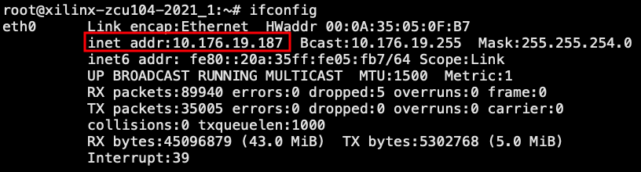

# Section 3: Basic Use Case

## 3.1 "Hello World" Preparation

This model provides the pre-built [DPU](https://github.com/Xilinx/Vitis-AI/tree/master/dsa/DPU-TRD) platform dedicated to machine learning applications. You can retrieve it and write it into an SD card to prepare the running environment.


* Prerequisites

  * Terminal emulator. Example: [Tera Term](https://osdn.net/projects/ttssh2)

  * SD Card Image Writer tool.  Example:  [Etcher](https://etcher.io/)

* Download the pre-built DPU board image from the link below

  * [ZCU104 prebuilt image](https://www.xilinx.com/member/forms/download/design-license-xef.html?filename=xilinx-zcu104-dpu-v2021.1-v1.4.0.img.gz)

Vitis AI Runtime packages, VART samples, Vitis-AI-Library samples, and models have been built into the board image to improve the user experience. Therefore, you do not need to install Vitis AI
runtime and model package on the board separately.
However, you can still install the model or Vitis AI Runtime on your own or official image by following these steps:

1. Choose an unpartitioned SD card of 8GB or greater size.
2.  Use Etcher to burn the image file onto the SD card. Etcher launches, as shown in the following figure.


3.  Navigate to the image location. You can select a .zip or .gz compressed file.
4. Etcher tries to detect the SD drive. Verify the drive designation and the image size.
5. Click **Flash** and wait till the operation is complete
  
6. Next, get the ZCU104 board ready with one serial cable and Ethernet cable.
7. Insert the SD card with the image into the destination board.
8. Plug in the power and boot the board using the serial port to operate on the system.
9. Find out the IP information of the board using the serial port.
    ```
    root@xilinx-zcu104-2021_1:~# ifconfig
    ```
      

Now the board is ready to be operated by using SSH. Follow the instruction in [Module 2](../Module_2) for next steps.


Copyright&copy; 2020-2022 Xilinx
