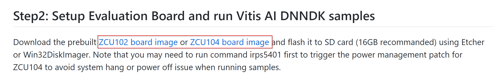
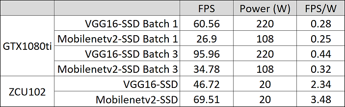
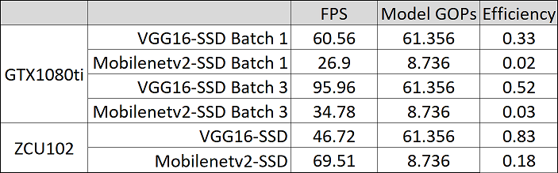

<table>
 <tr>
   <td align="center"><h1>Edge AI Tutorials</h1>
   </td>
 </tr>
 <tr>
 <td align="center"><h3>ML SSD PASCAL Caffe Tutorial</h3>
 </td>
 </tr>
</table>

The following is a tutorial on the Single Shot Detector (SSD), which is trained with Caffe on the [PASCAL VOC](http://host.robots.ox.ac.uk/pascal/VOC/voc2012/devkit_doc.pdf) dataset. This dataset contains 21 classes, one of which is background.

The topics covered in this tutorial include how to train, quantize, and compile SSD using PASCAL VOC 2007/2012 datasets, the Caffe framework, and Vitis&trade; AI tools. The model is then deployed on a Xilinx&reg; ZCU102 target board.

If you are new to the SSD network, the [SSD_0_Background.pdf](PDF/SSD_0_Background.pdf) contains a compilation of background information on the SSD network; it should provide a helpful introduction.

One of the really cool things about SSD (in addition to the fact that it provides solid detection results) is the ability to plug and play with different backbone feature extractors.  This allows for the flexibility to make tradeoffs of performance between different backbones on your dataset as well as to tradeoff performance vs. latency.

This tutorial covers two different uses of SSD:

  * SSD with VGG16 backbone using 300x300 input size
  * Mobilenetv2-SSD using 480x360 input size

The goals of this tutorial are to:
- Demonstrate the workflow to go from Caffe to Xilinx embedded targets
- Highlight the viability of INT8 performance/accuracy
- Highlight the value of the Xilinx model zoo by leveraging a pre-trained Mobilenetv2-SSD model and retraining it on a different dataset with a different number of classes
- Demonstrate the quantized model finetuning flow
- Blaze a trail for those explorers among you who may be new to SSD or detection models

You should hopefully walk away with and understanding of how we trained a model from scratch using a publicly available backbone, as well as how we finetuned a model from the model zoo on a different dataset.

The tutorial is organized as follows:

1. Install the Caffe tool for SSD

2. Prepare the dataset and database

3. Train the SSD networks

4. Evaluate the Floating Point Network

5. Quantize and Compile the Network

6. Run the application on the ZCU102 board

You may also be wondering, "why a Caffe tutorial, isn't Caffe old?". The primary answer is that this is a reincarnation of a tutorial I wrote for DNNDK some 2-3 years ago before we supported TensorFlow.  Caffe is also a great way to learn the fundamentals of ML which apply to all the different frameworks without actually having to know Python or a bunch of APIs.  

As to the part of Caffe being old, ok, that's true, but there's something to be said for stability and there's still some folks out there that use it.  Hopefully the probability of this still all working in >6-12 months is pretty high given that nobody came in decided all APIs should be different...  

# 1.0 Pre-Install Considerations for Caffe for SSD

The public version of SSD Caffe is posted by Wei Liu and the associated "official" version of SSD Caffe is available at: https://github.com/weiliu89/caffe/tree/ssd.  You can find the original SSD publication here as well if you're interested in the theory/operation behind it:  https://arxiv.org/pdf/1512.02325.

This tutorial, however, uses Caffe provided within [Vitis AI 1.1](https://github.com/Xilinx/Vitis-AI/tree/v1.1).

Note: This tutorial is not compatible with Vitis AI 1.0 because the SSD network could not be trained in that environment.

# 1.1 Environment Setup and Installation

My workstation is a good 'ole fashioned Ubuntu 16.04 host machine, so that's what I used for the development and testing of this tutorial.  I also have a couple GTX 1080ti GPUs (never leave home with 'em) and the GPU docker has been tested with Docker 19.03.1, NVIDIA driver 410.xx (to work with CUDA 10.0) and nvidia-docker 2.2.2.  The Vitis AI user guide also mentions support for CentOS/RHEL 7.4 and 7.5 though this tutorial has not been tested in those environments, because that's just too much work.

This tutorial was tested with a ZCU102 revision 1.0 (newer should also be ok), DisplayPort monitor, keyboard, mouse, and USB hub with USB micro converter.


## 1.1 PART 1: Vitis AI Environment Setup and Board Package Installation:

1. Install the Vitis AI GPU tools via the following steps:

```
git clone https://github.com/Xilinx/Vitis-AI
cd Vitis-AI/docker
```

Next build the docker image using the following:

```
./docker_build_gpu.sh
cd ..
./docker_run.sh xilinx/vitis-ai-gpu:latest
conda activate vitis-ai-caffe
```

At this point the environment should be prepared such that the Caffe command using the GPU should be available.  

2. Now copy the [SSD](SSD) folder to the docker workspace so that it is available inside the docker once launched.

3. Download the demo image for the desired board.  The images available on the AI Developer Hub support the ZCU104 and ZCU102.  This tutorial should work with either of the boards provided that the compiler is set to target the correct DPU within that board image.  

https://github.com/Xilinx/Vitis-AI/blob/master/mpsoc/README.md



4. Next follow the steps in the Vitis AI User Guide starting on p20 and continue through p30 to flash the image to the SD card and copy over the Vitis AI package, install the VART and model packages etc. Be sure to follow the host setup instructions as the steps provided there will produce the glog library for the board package.

https://www.xilinx.com/support/documentation/sw_manuals/vitis_ai/1_1/ug1414-vitis-ai.pdf

# 2.0 Prepare the VOC database for SSD

To prepare the VOC0712 database follow the recipe below:

1. Download the PASCAL VOC dataset from the following three links:
 - http://host.robots.ox.ac.uk/pascal/VOC/voc2012/VOCtrainval_11-May-2012.tar
 - http://host.robots.ox.ac.uk/pascal/VOC/voc2007/VOCtrainval_06-Nov-2007.tar
 - http://host.robots.ox.ac.uk/pascal/VOC/voc2007/VOCtest_06-Nov-2007.tar


2. Copy the 3 tar files into the folder within the docker named /workspace/SSD/data.  Extract all files from the 3 archives and merge them under a single VOCdevkit folder. If you CTRL+click all three files, then right click and select extract this should happen automatically.

  At the end of this process you should have a new folder named **/workspace/SSD/data/VOCdevkit** which contains the VOC2007 and VOC2012 subfolders.  Note: This dataset contains the training, validation, and testing images as well as the annotations which are the bounding box locations contained in .xml format.

  For the next step, you will be processing the annotations (labels) and the training images into LMDB files which can then be directly used by Caffe for the training process.  

  You need two files [create_list.sh](https://github.com/intel/caffe/blob/master/data/VOC0712/create_list.sh) and [labelmap_voc.prototxt](https://github.com/intel/caffe/blob/master/data/VOC0712/labelmap_voc.prototxt) which are available from this repository: https://github.com/intel/caffe/tree/master/data/VOC0712.

3. cd into the /workspace/SSD/data folder within the docker and copy the create_list.sh and labelmap_voc.txt files into this directory:

4. Open the create_list.sh script and add the following line at the start of the file:

  ```
DATAPATH=/workspace/SSD
```

5. Next change line 41 from:

  ```
$bash_dir/../../build/tools/get_image_size $root_dir $dst_file $bash_dir/$dataset"_name_size.txt"
```
  to:
  ```
get_image_size $root_dir $dst_file $bash_dir/$dataset"_name_size.txt"
```

6. Execute the following commands:

  ```
source create_list.sh
./build_lmdb.sh
```

  The first command will create the trainval.txt, test.txt and test_name_size.txt files in the current directory, then the second command will call a binary file "convert_annoset" which is a precompiled Caffe tool for preparing the lmdb (included in the Xilinx docker image).

You should now see something similar to what is illustrated in this example:


Note: This process created the LMDB databases stored in **/workspace/SSD/data/VOC/VOCdevkit/VOC0712/lmdb**.  The training lmdb is ~1.5GB the test lmdbd is ~445MB.

At this point, the training dataset has been prepared and is ready for use to train the SSD model and you can proceed to the next step which is training the model.

# 3.0 Training the SSD Models

## 3.0.1 Preparing the VGG-16 SSD Model for Training

1. Download the pre-trained [VGG_ILSVRC_16_layers_fc_reduced.caffemodel](https://github.com/conner99/VGGNet) (weights) files of the VGG network.  This will be used as the backbone (feature extraction layers) for our SSD network and since they are pre-trained, it will help to reduce training time.  

2. Copy this file into the **/workspace/SSD/workspace** folder.

3. Example trainable [train_test_example.prototxt](SSD/workspace/VGG16-SSD/train_test_example.prototxt) and [solver.prototxt](SSD/workspace/VGG16-SSD/solver.prototxt) files have been provided under [SSD/workspace/VGG16-SSD](SSD/workspace/VGG16-SSD).  

  Output snapshots will be incrementally created under the following directory: **/workspace/SSD/workspace/VGG16-SSD/snapshots**.

## 3.0.2 Understanding the SSD Prototxt Files
There are a few notable differences between the official SSD model that gets created as part of Wei Liu's tutorial/caffe distribution.

We changed **mbox_conf_reshape**, **mbox_conf_softmax**, and **mbox_conf_flatten** layers to include the phase:test parameter so that these layers are only used for testing.  The entry that was added is:

```
include{
  phase: TEST
}
```

This was inserted in each of the layers just after the **top:** declaration and before the layers other parameters.

We replaced the Normalize layer with a BatchNorm/Scale combined layer because the DPU does not support Normalize.  In the original SSD model, this is called "conv4_3_norm".  The following steps were used to replace the layer:

1. Delete the Normalize layer named "conv4_3_norm" which should start at around line 972 and end around line 985.

2. Insert the Batchnorm/scale layer "conv4_3" and "relu4_3" layers.

3. Replace the other bottom layers in the prototxt named "conv4_3_norm" with "conv4_3" (there should be three of these) and they appear as `bottom: "conv4_3_norm"`.

We modified the "fc6" layer by changing the num_output to 682 instead of 1024.  The reason for this is that the DPU only supports 12 bits to describe the number of parameters.  With a dilation of 6, the number of output parameters will be 6143 which is too many for the DPU to capture.

Because of this change to the layer, we renamed both fc6 and fc7 layers - for "fc6" we named it "fc6_682", and for "fc7", we named it "fc7_682".

Taking a look at the [solver.prototxt](SSD/workspace/VGG16-SSD/solver.prototxt), this file has the training hyper-parameters and also points to the net which is being trained.  In this file, we use a combined train/test prototxt file instead of two separate files for train and test:

```
net:  "train_test_example.prototxt"
```

Notice the snapshot_prefix location which is where the training will produce output models.  This can be modified as desired to place the snapshot output model in a desired directory, though for this tutorial, leaving the snapshots at this location with the recommended prefix as it will allow for easier evaluation of the floating point model without modifying other scripts.

```
snapshot_prefix: "./snapshots/snapshot"
```

The number/frequency of snapshots are determined based on the parameters specified in the solver and note that by default the first snapshot will occur after 10K iterations.

The training process requires about 10GB of GPU memory in the current configuration.  If your GPU does not have sufficient memory, you can modify the train_test.prototxt file and change the batch_size parameter in the input layers to a smaller value such as 8, 4, 2, or 1.  

Since the training typically uses a batch_size of 32, if you modify this value, you should also change the solver.prototxt iter_size parameter such that the product of iter_size x batch_size = 32.  For instance, if you change the batch_size to be 8, you should change the iter_size to be 4 so that the effective batch size used for the training process is 4x8 = 32.  

## 3.0.3 Train It!

The Vitis AI docker comes with caffe tools so to train the model, all you need to do is execute the following commands:

```
cd /workspace/SSD/workspace/VGG16-SSD
caffe train \
  -solver solver.prototxt \
  -weights VGG_ILSVRC_16_layers_fc_reduced.caffemodel \
  -gpu 0 2>&1 | tee SSD_train.log
```

Notice that we're passing in the weights for the backbone from VGG.  This is called finetuning or retraining and allows us to leverage someone else's hard work and energy bill to reduce our training time and provide us with better model accuracy!

The 120K iterations training process takes about 60 hours on a Xeon machine with a GTX 1080 ti graphics card, so go ahead and re-binge watch the last 3 seasons of your favorite series while you wait for this ...or do some other work.

I've also actually already trained this model for you and provided a pretrained snapshot called pretrained.caffemodel inside the snapshots directory.  It's actually a multipart zipped archive so that the file could be uploaded to github and stay under the 25MB file size limitation.  

To extract it, 7-zip can be used in Windows and the you can just CTRL+click and select each individual partial zip, then right click and select extract.  If you are using Linux, simply right click the part .001 file and select 'Extract Here'.

Here is an example log file of the training process: [logfile_ssd_pascal.txt](SSD/workspace/VGG16-SSD/train.log), if everything goes smoothly you will get something very similar.

The model has been trained and is now ready for evaluation.  If you would like to skip evaluating the floating point model and jump straight to quantization, go ahead to step 5.

# 3.1 Prepping and Training the Mobilenetv2-SSD model
I suspect many won't be so interested in the VGG16-SSD model these days, so maybe a more relevant (optimized) flavor is the whizz-bang Mobilenetv2-SSD model.  It's called Mobilenev2-SSD because it uses Mobilenetv2 for the backbone instead of VGG16.  With some imagination, you could extend this concept to also have an inception-SSD or ResNet-SSD  or Star-Trek-The-Next-Generation-SSD, but that's maybe a little silly and totally up to you.  

This model is available in the [Vitis AI model zoo](https://github.com/Xilinx/AI-Model-Zoo/tree/1387830ef9b846255245c1dc063e7c86ac71498e).  The model that we will use as a starting point for this tutorial is the cf_ssdmobilenetv2_bdd_360_480_6.57G_1.1 model and it can be downloaded directly via the following link:

https://www.xilinx.com/bin/public/openDownload?filename=cf_ssdmobilenetv2_bdd_360_480_1.1.zip

The model initially has been trained on the 11 class BDD dataset.  Since we're using PASCAL VOC for this tutorial, we need to change the number of classes for the model.  Again, the hope here is that a concept is conveyed that models can be modified for different numbers of classes and datasets.  

If you're not interested in the mechanics, you can just skip this section and use my pre-modified [SSD/workspace/Mobilenetv2-SSD/train_test_example.prototxt](SSD/workspace/Mobilenetv2-SSD/train_test_example.prototxt)

That said, for SSD there's a few layers that we need to modify so let's kick this off:

1. Download the model from the link above

2. Extract the package and copy the float/trainval.prototxt file and float/trainval.caffemodel into the SSD/workspace/Mobilenetv2-SSD directory

3. Open the trainval.prototxt file in a text editor

  a. First we need to change the paths to the dataset.  Since our dataset is located in a different spot and has a different name, we need to update the following paths:

  - change line 48 to point to: "/workspace/SSD/data/VOCdevkit/VOC0712/lmdb/VOC0712_trainval_lmdb"
  - change line 135 to point to: "/workspace/SSD/data/labelmap_voc.prototxt"
  - change line 159 to point to: "/workspace/SSD/data/VOCdevkit/VOC0712/lmdb/VOC0712_test_lmdb"
  - change line 167 to point to: "/workspace/SSD/data/labelmap_voc.prototxt"
  - change line 4642 to point to: "/workspace/SSD/data/test_name_size.txt"

  b. Now we need to change the number of classes that the model targets.  This is mainly related to the number of bounding boxes that are produced for the various all these various classes, so it requires a little bit of knowledge about the SSD model architecture.  The more obvious changes are as follows:

  - change line 4551 from '11' to '21'
  - change line 4577 from '11' to '21'
  - change line 4616 from '11' to '21'
  - change line 4638 from '11' to '21'

Ok, we're done, right?  Well not quite yet there gunslinger - those of you that picked up on the not-too-subtle foreshadowing, you probably realized there's a little more to it.

If you go back and check out the [SSD_0_Background.pdf](PDF/SSD_0_Background.pdf), slide 19 indicates that there's a dependency on the number of output channels for some of these layers as to how many classes we are targeting.

I'll take some of the mystery out of this step and tell you that the particular layers of interest are the confidence layers, and the names and corresponding channels (num_output parameter) for these are:

- conv4_3_norm_mbox_conf -> 88 channels
- fc7_mbox_conf -> 66 channels
- conv6_2_mbox_conf -> 66 channels
- conv7_2_mbox_conf -> 66 channels
- conv8_2_mbox_conf -> 44 channels

To quote Austin Powers, "What does it all mean, Basil?"

Well, essentially each of these correspond to a certain number of boxes*classes per grid cell.  The grid is different for this model than for the VGG16-SSD which uses a 300x300 vs the 480x360 input size used for this model.

By analyzing the prototxt file in netscope to determine the grid size for each of these layers.  We also know the number of classes is 11 for BDD, so we have the following:

- 60x45 grid -> 11 classes, 88 output channels
- 30x23 grid -> 11 classes, 66 output channels
- 15x12 grid ->  11 classes, 66 output channels
- 8x6 grid -> 11 classes, 66 output channels
- 4x3 grid -> 11 classes, 44 output channels

Back to slide 19, we can pretty quickly determine the number of boxes with a little mind-blowing algebra (again, based off slide 19 of the pdf):

number_of_boxes_per_cell = output_channels / classes

- 60x45 grid -> 88/11 = 8 boxes per cell
- 30x23 grid -> 66/11 = 6 boxes per cell
- 15x12 grid -> 66/11 = 6 boxes per cell
- 8x6 grid -> 66/11 = 6 boxes per cell
- 4x3 grid -> 44/11 = 4 boxes per cell

Those among you who are very observant might say "Hey, this model doesn't have the larger 1x1 grid that the SSD 300x300 model did"?  Well, ok, it has more small boxes, so we can infer it's probably better at detecting more smaller objects and few larger objects.  Neat, huh?

Well you might also wonder, why can't I do that with the other VGG16 SSD model?  Answer: you can - do whatever you want!  Machine learning is fun!

Ok, back to the task at hand - we were supposed to be modifying this model to work for pascal VOC which has 21 classes.  In order to do this, we can simply recalculate based on the new number of classes how many output channels each of those layers is supposed to have.

- 60x45 grid -> 8 boxes per cell x 21 classes = 168 output channels
- 30x23 grid -> 6 boxes per cell x 21 classes = 126 output channels
- 15x12 grid ->  6 boxes per cell x 21 classes = 126 output channels
- 8x6 grid -> 6 boxes per cell x 21 classes = 126 output channels
- 4x3 grid -> 4 boxes per cell x 21 classes = 84 output channels

So now we can pull out that proverbially 6-shooter (a.k.a typing fingers) and change the following layers:
- conv4_3_norm_mbox_conf -> change num_outputs to 168
- fc7_mbox_conf -> change num_outputs to 126
- conv6_2_mbox_conf -> change num_outputs to 126
- conv7_2_mbox_conf -> change num_outputs to 126
- conv8_2_mbox_conf -> change num_outputs to 84


Now, Caffe has a nuance that, when finetuning from an existing model, if you change a layer definition, you need to rename that layer, so we'll change the names of these layers by doing a find/replace for each layer and just append `_new` to the end of the layer name (remember that top and bottom connections need to be changed as well).

When doing the find/replace, make sure you use the caps/exact match feature of your text editor so you don't inadvertently replace other phrases that contain this name.  

I also changed the batch size in the train_test_example.prototxt for Mobilenetv2 to 10 and I updated the solver to a iter_size of 3 so it has an effective training batch size of 30 (whereas the SSD 300x300 uses a batch size of 32).

For the boring part, go ahead and open your solver.prototxt and make sure it points to your new model and has all the various flavors that you want.  

Finally, we're ready to train this bad boy. Issue the following command to your CUDA troops and supersize your electric bill:

```
cd /workspace/SSD/workspace/Mobilenetv2-SSD
caffe train \
  -solver solver.prototxt \
  -weights trainval.caffemodel \
  -gpu 0 2>&1 | tee SSD_train.log
```

If you get some crazy error, you can just modify your solver to use the pre-modified prototoxt file that I have provided [SSD/workspace/Mobilenetv2-SSD/train_test_example.prototxt](SSD/workspace/Mobilenetv2-SSD/train_test_example.prototxt) or diff your prototxt against mine.

I've also included a [log file](SSD/workspace/Mobilenetv2-SSD/train.log) from my console output during the training process.

I've also actually already trained this model for you and provided a pretrained snapshot called pretrained.caffemodel inside the snapshots directory.  It's actually a multipart zipped archive so that the file could be uploaded to github and stay under the 25MB file size limitation.  

To extract it, 7-zip can be used in Windows and the you can just CTRL+click and select each individual partial zip, then right click and select extract.  If you are using Linux, simply right click the part .001 file and select 'Extract Here'.

# 4.0 Evaluating the Floating Point SSD Model on the Host

Once the models have been trained, you will see .caffemodels and .solverstates appear in the snapshots directory as defined in the ["solver.prototxt"](SSD/workspace/Mobilenetv2-SSD/solver.prototxt) for each of the models respectively

```
snapshot_prefix: "SSD/workspace/VGG16-SSD/snapshots"
or
snapshot_prefix: "SSD/workspace/Mobilenetv2-SSD/snapshots"
```
I trained the models for 120K iterations each with batch sizes of 32 for VGG16-SSD and 30 for Mobilenetv2-SSD.  I took snapshots and ran test iterations every 10K iterations.  Below is a plot of the test mAP on 619 images from the test dataset during the training process.  


As a pretrained snapshot, I included the best performing model (120K iteration snapshot for VGG16-SSD, and the 110K iterations snapshot for Mobilenetv2-SSD)

At this point, it is possible to score the network against the dataset as well as evaluate it against a single image from the test dataset.

I have included some example scripts that can be used to evaluate the floating point network models.  These scripts can be found in the [SSD/evaluation folder](SSD/evaluation/) under the model subdirectory of interest.

IMPORTANT: These scripts will run forward inference on the pretrained model that is provided with this tutorial.  If you want to use a different model have this model, simply open the desired script for either model ([score.sh](SSD/evaluation/VGG16-SSD/score.sh) or [detect.sh](SSD/evaluation/VGG16-SSD/detect.sh)) and change the model name/path to the model that you want to evaluate.

The following instructions show how to run two different scripts.  

## 4.0.1: Scoring the Network
In order to score the network, change directory to SSD/evaluation + the desired model subdirectory, then enter the following command:
  ```
./score_VGG16_SSD.sh
or
./score_Mobilenetv2-SSD.sh
```

  I have included a [VGG16-SSD scoring log file](SSD/evaluation/VGG16-SSD/score.log) which shows an mAP of 0.766879 and a [Mobilenetv2-SSD scoring log file](SSD/evaluation/Mobilenetv2-SSD/score.log) which shows an mAP of 0.713212.

## 4.0.2: Single Image Evaluation
In order to run a single image evaluation, I have included the [detect.sh](SSD/evaluation/VGG16-SSD/detect.sh) script and deploy.prototxt files for both models which can be used to evaluate single images.  To change the image used for detection, just modify the detect.list file to point to the desired images.

```
./detect_VGG16_SSD.sh
or
./detect_Mobilenetv2-SSD.sh
```

This process calls the ssd_detect executable which is part of the Caffe install inside the conda virtual environment.  The output image with detection overlays should appear inside the evaluation directory.

NOTE: if you changed the location or name of the snapshots during training or want to evaluate a different model, you will also need to modify the script above and specify the correct path to the model.

At this point, you have tested the trained SSD model on the host machine and can proceed to step 5.

# 5.0 Quantizing the SSD Network for DPU Implementation

## 5.0.1: Configuring the Files for Quantization and Compilation
1. I have included an example workspace for both models in [SSD/VAI](SSD/VAI) to show how the VAI tools may be invoked as well as the necessary modifications to the prototxt files for both quantization/compilation and testing the float and quantized model mAPs. Change directory to the VAI directory before proceeding to the next step.

2. Within the VAI directory, there is a subdirectory for each model.  Inside each model directory there are several files:

 - "float.prototxt": used for quantizing/compiling the models for deployment on the target hardware

 - "quantize_and_compile.sh": a script that is used to perform both quantization and compilation (vai_q_caffe and vai_c_caffe) for deployment on the target hardware

 - "test_float_and_quantized.sh": a script that will test both the floating point and quantized models and report out the mIOU for each


3. Open the "float.prototxt" that is included as an example in the VAI subfolders.

  The "float.prototxt" files should be mostly identical to your "train_test_example.prototxt" except for the following:

  - The input layer has changed to "ImageData"

  - Paths have been specified to the calibration data and text file so that they point to the correct locations if the steps in the tutorial were followed for populating the training data.

  - The "Multiboxloss" layer has been removed since it was only needed to compute loss for the training phase, and is also not supported for deployment in the DPU.


4. Next copy either your latest trained model from Caffe into the **SSD/VAI/VGG16-SSD or SSD/VAI/Mobilenev2-SSD** directory (or copy over my pretrained.caffemodel) and rename it "float.caffemodel".  This model should be located wherever the snapshot was saved from the training step.

5. Next run the quantization tools using the following command (note that you made need to make the file executable first by running "chmod +x quantize_and_compile.sh"):

```
./quantize_and_compile.sh
```

If you open the script, you will see the following contents which indicate several things - first of all, you should make sure the GPUID environment variable is set correctly for your machine.  If you have only one GPU, this should be '0', otherwise, please change this to the index for the desired GPU to use for quantization.

For reference, I have included a [vai_q_caffe log file](SSD/VAI/VGG16-SSD/quantize/quantize.txt) that shows the output of my console after running the vai_q_caffe command.  You should see something similar after running the command on your machine.

Finally, the `vai_c_caffe` command is called which compiles the floating point model and produces a file called "dpu_segmentation_0.elf" under the vai_c_caffe_output directory.

For reference, I have included a [vai_c_caffe log file](SSD/VAI/VGG16-SSD/compile/compile.txt) that shows the output of my console after the vai_c_caffe command is run.  You should see something similar after running the command on your machine.

```
#!/usr/bin/env bash
export GPUID=0
net=vgg16_ssd

#working directory
work_dir=$(pwd)
#path of float model
model_dir=quantize
#output directory
output_dir=compile

echo "quantizing network: $(pwd)/float.prototxt"
vai_q_caffe quantize          \
          -model $(pwd)/float.prototxt     \
          -weights $(pwd)/float.caffemodel \
          -gpu $GPUID \
          -calib_iter 1000 \
          -output_dir ${model_dir} 2>&1 | tee ${model_dir}/quantize.txt

echo "Compiling network: ${net}"

vai_c_caffe   --prototxt=${model_dir}/deploy.prototxt \
        --caffemodel=${model_dir}/deploy.caffemodel \
        --output_dir=${output_dir} \
        --net_name=${net} \
        --options="{'mode':'normal'}" \
        --arch=/opt/vitis_ai/compiler/arch/dpuv2/ZCU102/ZCU102.json 2>&1 | tee ${output_dir}/compile.txt
```      


At this point, an elf file should have been created in the **compile** directory which can be used in the final step which is to run the models on the ZCU102.  

## 5.0.2: Testing the Floating Point and Quantized Models
As mentioned in the previous section, files have been provided under the `SSD/VAI/VGG16-SSD` or `SSD/VAI/Mobilenetv2-SSD` directories which can enable you to rapidly test the mAP of both the floating point model as well as the quantized model on the cityscapes validation dataset.  In order to perform this testing, perform the following steps:

Open the one of the `test_float_and_quantized.sh` scripts.  The contents of this script are shown below.  You will only need to edit the GPUID to specify the correct GPU index for your tests.  Note that the log files will be captured under the test_results subdirectory for both the floating point and quantized results.

```
export GPUID=0
export WKDIR=`pwd`

cd $WKDIR
vai_q_caffe test -model float.prototxt -weights float.caffemodel -test_iter 4952 -gpu $GPUID 2>&1 | tee test_results/float_model_test.txt

#working directory
work_dir=$(pwd)
#path of float model
model_dir=${work_dir}
#output directory
output_dir=${work_dir}

vai_q_caffe quantize            \
          -model ${model_dir}/float.prototxt     \
          -weights ${model_dir}/float.caffemodel \
          -gpu $GPUID \
          -calib_iter 1000 \
          -test_iter 4952 \
          -auto_test \
          -output_dir ${output_dir} 2>&1 | tee test_results/quantized_model_test.txt

```

Execute the Script by running the following command.  This could take some time depending on the GPU hardware available as well as which model is being run.  I have included example test results from a previous run under the associated model directories such as [SSD/VAI/VGG16-SSD/test_results](SSD/VAI/VGG16-SSD/test_results).  

```
./test_float_and_quantized.sh
```

Note that the VGG16-SSD model floating-point model achieves 0.766879 mAP and the quantized model achieves 0.760131 mAP the test dataset so we only lose about 0.67% mAP during quantization.  For Mobilenetv2-SSD, the floating point model achieves 0.713212 mAP and the quantized model  achieves 0.648701 mAP which is a loss of about 6.45% mAP.

The loss here for Mobilenetv2-SSD is somewhat significant during quantization, and knowing that Mobilenev2 is a problematic model for quantization, a logical next step is to finetune the model.

## 5.0.3: Finetuning the Mobilenev2-SSD Models

As part of the quantization process, a quantize_train_test.prototxt and quantize_train_test.caffemodel are produced.  I've included a finetuning workpace under [SSD/VAI/Mobilenetv2-SSD/finetune](SSD/VAI/Mobilenetv2-SSD/finetune).  The steps I took to prepare this are as follows:

1. Copied the quantize_train_test.prototxt and quantize_train_test.caffemodel from the quantize directory to the finetune subdirectory
2. Opened the quantize_train_test.prototxt in a text editor and changed the input layers to match the input layers in my trainable train_test_example.prototxt files.  Also added the detection_eval layer back in at the end of the model as well as the Multiboxloss layer.  You can diff the modified file that I included vs. the generated quantize_train_test.prototxt to see exactly what changed
3. Copied the solver.prototxt from the float model training workspace into the finetuning workspace and edited this file to reduce the base_lr, max_iterations, testing, and snapshot intervals.

In order to run the finetuning process, copy your quantize_train_test.caffemodel into the finetune directory, then execute the following command from within this directory:

```
./run_finetune.sh
```

Using the solver that I provided, you should get snapshots every 1000 iterations.  

After 2000 iterations, the mAP is 0.702363 which is only a degradation of 1.08%.  I used this snapshot to generate deploy the model.

After the finetuning step, the model can be transformed and then compiled using the following commands:

```
./deploy.sh
./compile.sh
```

The compiled dpu_mobilenetv2_ssd.elf file will be populated under the finetune/compile directory and this is the model I have included in the [ZCU102 deployment software](SSD/ZCU102/dpu_mobilenetv2_ssd) package.  

You can find more info on quantize finetuning in [UG1414 pg63](https://www.xilinx.com/support/documentation/sw_manuals/vitis_ai/1_1/ug1414-vitis-ai.pdf).

At this point, the quantized and floating point models have been fully verified on the host and you are ready to proceed to deploying the models to the target hardware.

# 6.0 Running the SSD Model on the ZCU102
The final step of this tutorial is to run the trained and compiled model on the ZCU102 board.  In order to make this step fast and easy, an example application contained within the [SSD/ZCU102](SSD/ZCU102) directory is included.  

1. If you compiled your own model, The first step that needs to be done is to copy your ssd compiled .elf file into the related model subdirectory.

  Note: The directory structure contains the following:

  - [build.sh](SSD/ZCU102/build.sh): Used to build the application on the ZCU102

  - [dpu_vgg16_ssd](SSD/ZCU102/dpu_vgg16_ssd) directory: This is the directory where you need to copy your compiled vgg16_ssd model executable and make sure it is named **dpu_vgg16_ssd.elf**.  Within this directory are the ancillary files needed by the Vitis AI Libraries to deploy the model.  Among these are the meta.json and vgg16_ssd.prototxt file.  The [meta.json](SSD/ZCU102/dpu_vgg16_ssd/meta.json) is simple and easy to create and it should be fairly intuitive what to enter here.

  - The [vgg16_ssd.prototxt](SSD/ZCU102/dpu_vgg16_ssd/vgg16_ssd.prototxt) file is a config prototxt file which contains pre-processing and post-processing parameters.  Many of the parameters should be obvious, but these can be extracted in one form or another from the model prototxt file.  I've found that a conf_threshold of 0.3 seems to be reasonable for both models on a per-class basis.  

  - The prior_box_param fields are likely the most confusing, but if you open the deploy.prototxt model file for each of the models, you should be able to search for the Priorbox layers and extract many of these parameters with the exception of layer_height and layer_width parameters.  

  - One way to extract these two paramters is to load the deploy.prototxt into [netscope](https://dgschwend.github.io/netscope/#/editor) and view the graph created by the tool (just paste the prototxt contents into the left field and hit shift+enter to draw the graph).  Then browse in the graph until you find the priorbox layers and the input dimensions should also be included.

  - [dpu_mobilenetv2_ssd](SSD/ZCU102/dpu_mobilenetv2_ssd) directory: This is the directory where you need to copy your compiled mobilenetv2_ssd model executable and make sure it is named **dpu_mobilenetv2_ssd.elf**.  See above description for the dpu_vgg16_ssd folder as the contents are the same, just adjusted for the mobilenetv2_ssd model.  Note that I included the post-quantize fine-tuned model here.

  - [test_performance_ssd.cpp](SSD/ZCU102/test_performance_ssd.cpp): This application uses the Vitis AI Libraries to deploy the SSD models and test the performance with a provided number of threads.

  - [test_video_ssd.cpp](SSD/ZCU102/test_video_ssd.cpp): This application uses the Vitis AI Libraries to deploy the SSD models and test the using an input video with a provided number of threads.

  - [process_result.hpp](SSD/ZCU102/process_result.hpp): This application is used by the software source and overlays the bounding boxes on the output images/video.  

   The [Vitis AI Libraries](https://github.com/Xilinx/Vitis-AI/tree/master/Vitis-AI-Library) are providing all of the software functionality including image preprocessing, DPU model execution, and model post-processing (NMS etc.).  

2. The next step is to copy this application folder to your ZCU102 board using via an Ethernet connection.  The next steps assume you have prepared the ZCU102 with the Vitis AI SD image and installed all of the Vitis AI libraries etc. per step 1.1 of this tutorial.

3. On the ZCU102, change the directory to the ZCU102 directory and run `sh -x build.sh`.  If there are errors during this step, revisit step 1.1, part 1, step 4 and ensure you have followed the user guide to set up and install the libraries.

4. With a webcam connected to the board (I used a Logitech C920), the models can be tested using video with the following commands:

  ```
./test_video_ssd dpu_vgg16_ssd -t 6 0
```
or
  ```
./test_video_ssd dpu_mobilenetv2_ssd -t 6 0
```
  The name that follows the executable is expecting a path into the subdirectory which contains the model elf file, meta.json, and model config prototxt file.  The -t argument is the number of threads to use to execute the model.  On a ZCU102 with 3x B4096 DPUs, 4-6 threads seems to work reasonable well.  The last argument '0' specifies to use the webcam for the input video.  You can also specify the filename of a video recording for this argument.

5. In order to run the performance test, you need a number of sample images.  I copied 12 images to a folder from the VOC dataset.  Then you need to create an image.list file which simply lists the paths to the input images, similar to what is used by the host evaluation process. Then you can run the performance evaluation using the following command structure:

  ```
./test_performance_ssd dpu_vgg16_ssd detect.list -t 6 -s 30
```
  or
  ```
./test_performance_ssd dpu_mobilenetv2_ssd detect.list -t 8 -s 30
```

The performance that I achieved for the models was as follows:
- VGG16-SSD -> 46.72 FPS using 6 threads for 30 seconds
- Mobilenev2-SSD -> 69.51 FPS using 6 threads for 30 seconds

I also timed these models on my GTX1080ti graphics card by changing directory to the model workspace and using the following command and also captured the power dissipation using nvidia-smi.

```
caffe time -model deploy.prototxt -gpu 0 -iterations 100
```

The results were as follows:
- VGG16-SSD using a batch size of 1 ->  60.56FPS @220W
- Mobilenetv2-SSD using a batch size of 1 ->  26.9FPS @108W
- VGG16-SSD using a batch size of 3 -> 95.96FPS @220W
- Mobilenetv2-SSD using a batch size of 3 -> 34.78FPS @108W

You can see the comparison in terms of performance, and more importantly for edge applications, performance/watt in the chart below.



Based on this, you can see we're achieving about 10x the capability in terms of performance/W using the ZCU102 with an INT8 model.

With all the marketing hype about TOPS, actual efficiency vs. theoretical TOPs is also a relevant discussion.  Granted that the GTX1080ti maybe isn't the best device to compare, but for the sake of illustrating a point, let's proceed:

The GTX1080ti has a theoretical performance of 11.3 TFLOPS while the 3x B4096 DPUs in the ZCU102 @281MHz have a theoretical performance of 3.45 TOPs.  If you look at the model compute for these models, it is:

- VGG16-SSD -> 61.356 GOPS/image
- Mobilenetv2-SSD -> 8.736 GOPs/image

Now we can calculate the efficiency by model_FPS / (peak_accelerator_ops/model_ops).  I've performed the calculation and included it in the table below.


You can see here that the GTX1080ti is pretty efficient at inference for the VGG16 model since this model uses nice 3x3 convolutions throughout, but the efficiency of the mobilenetv2 model is pretty terrible which is primarily because depth-wise convolution requires a lot of data transfer.  We're achieving about 18% efficiency on the DPU, which is actually pretty good for this model.  We can actually do significantly better when using a 2x DPU configuration (if you run the numbers from the [Vitis AI Model Zoo performance numbers](https://github.com/Xilinx/AI-Model-Zoo/tree/1387830ef9b846255245c1dc063e7c86ac71498e) on the ZCU104 we achieve almost 30% efficiency).  Part of the reason for this is that the 3x DPUs are being throttled by the available PS DDDR memory bandwidth, and the other part is that the model zoo is only processing 11 classes instead of 21.  

In summary, this tutorial has demonstrated how to train two different variants of SSD and deploy those models on the ZCU102 from start to finish including installing the Vitis AI tools, preparing the PASCAL VOC dataset, training the SSD network, evaluating the floating point model, quantizing and compiling that model, and finally deploying the application on the ZCU102 board.  

Maybe some homework for the ambitious reader would be to try to enhance the performance of the SSD model by pruning the model using the [Vitis-AI Optimizer](https://www.xilinx.com/support/documentation/user_guides/ug1333-ai-optimizer.pdf).  Reach out to your local FAE for an eval license (this is the only component of the Vitis AI package that requires one) and hopefully this has helped you in some fashion with your ML voyage!
