<!--

Copyright (C) 2023, Advanced Micro Devices, Inc. All rights reserved.
SPDX-License-Identifier: MIT

Author: Daniele Bagni, Xilinx Inc
-->


<table class="sphinxhide" width="100%">
 <tr width="100%">
    <td align="center"><h1>Vitis™ AI Tutorials</h1>
    </td>
 </tr>
</table>

#  Pre- and Post-processing Accelerators for Semantic Segmentation with Unet CNN on MPSoC DPU


- Unet CNN deployed with Vitis AI 3.0 and Tensorflow 1.15
- Embedded system designed with Vitis 2022.2
- Tested in hardware on ZCU102 board

- Last update:  28 Apr. 2023


## Table of Contents

[1 Introduction](#1-introduction)

[2 Setup](#2-setup)

[3 Design Flow with HLS](#3-design-flow-with-hls)

[4 Makefile based Design flow](#4-makefile-based-design-flow)

[5 Run on the Target Board](#6-run-on-the-target-board)


[License](#license)


## 1 Introduction

This repository contains the **Pre- and Post-processing** kernels to be used in Machine Learning (**ML**) jointly to the Deep learning Processor Unit (shortly **DPU**) to accelerate in the Programmable Logic (shortly **PL**)  the same tasks that otherwise would be executed by the ARM host CPU of the FPGA target device. Off-loading those two tasks from the ARM CPU can improve the overall system performance in terms of frames-per-second (**fps**).

The two accelerators were tested using data coming from the Semantic Segmentation Unet CNN of this tutorial:
[VAI-KERAS-UNET-SEMSEG](https://github.com/Xilinx/Vitis-AI-Tutorials/blob/master/Design_Tutorials/05-Keras_FCN8_UNET_segmentation/README.md), but they are general enough to be used or easily adapted with few changes also to other Deep Learning applications, such as Object Detection or Image Classification. Their design is done with **Vitis High Level Synthesis** (shortly **HLS** in the following of this document) within the Vitis suite. The application running on the host ARM CPU at real time applies **XRT APIs**.

This tutorial can also be seen as a complete example of how using the [WAA](https://github.com/Xilinx/Vitis-AI/tree/master/examples/waa) flow targeting the MPSoC ZCU102 board.

In the following of this document, you are supposed to have named this tutorial repository ``MPSOCDPU-PRE-POST-PL-ACC`` and placed it into the working directory ``$WRK_DIR`` (for example: ``export WRK_DIR=/media/danieleb/DATA/VAI3.0/Vitis-AI-master/tutorials``.

There are three major commands that basically run all what is explained in Sections 3 and 4:

  ```shell
  cd $WRK_DIR/MPSOCDPU-PRE-POST-PL-ACC
  # whole section 3
  source ./run_hls_projects.sh
  # Subsection 4.2
  cd makefile_flow
  source ./run_makefile_flow.sh
  # Subsection 4.3
  cd ../dpu_trd
  make all  
  ```

Before launching them, I strongly recommend you to read this whole document to get an overall idea of what you are supposed to do.


### 1.1 Linux OS

Everything shown in this project was done on an Ubuntu 18.04 Desktop with Vitis 2022.2 release. This project was never tried on a Windows OS PC.


### 1.2 Dos-to-Unix Conversion

In case you might get some strange errors during the execution of the scripts, you have to pre-process -just once- all the``*.sh``, ``*.cpp``, ``*.h`` files with the [dos2unix](http://archive.ubuntu.com/ubuntu/pool/universe/d/dos2unix/dos2unix_6.0.4.orig.tar.gz) utility.
In that case run the following commands from your Ubuntu host PC (out of the Vitis AI docker images):
```bash
#sudo apt-get install dos2unix
cd $WRK_DIR/MPSOCDPU-PRE-POST-PL-ACC
for file in $(find . -name "*.sh" ); do dos2unix ${file}; done
for file in $(find . -name "*.tcl"); do dos2unix ${file}; done
for file in $(find . -name "*.h"  ); do dos2unix ${file}; done
for file in $(find . -name "*.c*" ); do dos2unix ${file}; done
for file in $(find . -name "*.cfg" );    do dos2unix ${file}; done
for file in $(find . -name "*akefile" ); do dos2unix ${file}; done
```

### 1.3 Project Directories

Here is the list of folders you will see once you have finished to execute this tutorial (some folders will be created only at that time):

```shell
MPSOCDPU-PRE-POST-PL-ACC
|
└── files
    ├── dpu_trd
    │   ├── app
    │   ├── dpu_ip    
    │   ├── host_apps
    │   ├── ip
    │   ├── prj
    │   │   └── Vitis
    │   └── sources
    │       └── config_file
    ├── img
    ├── makefile_flow
    │   ├── host_apps
    │   │   ├── model
    │   │   ├── postproc
    │   │   ├── pre2dpu2post
    │   │   └── preproc
    │   └── ip
    │       ├── vhls_dpupostproc
    │       └── vhls_dpupreproc
    ├── postproc
    │   ├── common_src
    │   ├── hls
    │   │   ├── data_post
    │   │   ├── src
    │   │   └── vhls_dpupostproc_prj
    │   └── vitis
    │       ├── host
    │       └── kernels
    ├── preproc
    │   ├── common_src
    │   ├── hls
    │   │   ├── data_pre
    │   │   ├── src
    │   │   └── vhls_dpupreproc_prj
    │   └── vitis
    │       ├── host
    │       └── kernels
    └── sh_scripts
```


## 2 Setup

### 2.1 Downloads

As described in the file [README_DPUCZ_Vitis.md](https://github.com/Xilinx/Vitis-AI/blob/master/dpu/ref_design_docs/README_DPUCZ_Vitis.md), download the following components anywhere into an accessible location in your files system:  

- ``DPUCZDX8G_VAI_v3.0.tar.gz`` archive from [Vitis-AI DPU IP](https://github.com/Xilinx/Vitis-AI/tree/master/dpu#vitis-ai-dpu-ip-and-reference-designs) reference design. For example, we have placed this archive in this folder ``$WRK_DIR/../dpu`` with the following commands:

  ```
    cp ~/Downloads/DPUCZDX8G_VAI_v3.0.tar.gz $WRK_DIR/../dpu
    cd $WRK_DIR/../dpu
    tar -xvf DPUCZDX8G_VAI_v3.0.tar.gz
    ```

- ZYNQMP common image 2022.2 (about ~2.1GB size) from https://www.xilinx.com/support/download/index.html/content/xilinx/en/downloadNav/embedded-platforms.html  

  ```
  ~/Downloads$ md5sum xilinx-zynqmp-common-v2022.2_10141622.tar.gz
  812274c6a59290efbd6911f0a46a63b8  xilinx-zynqmp-common-v2022.2_10141622.tar.gz
  ```

- Clone somewhere in your files system the [Vitis-AI 3.0](https://github.com/Xilinx/Vitis-AI) github repository. For example we have placed it in the folder ``/media/danieleb/DATA/VAI3.0`` and derived from it the env variable ``$WRK_DIR``. Some include files of that repository are needed later for the host application compilation and they depend on the environmental variable ``$TRD_HOME`` (set in the script [set_proj_env_2022v2.sh](files/sh_scripts/set_proj_env 2022v2.sh)).


### 2.2 Installing the sdk

Copy ``xilinx-zynqmp-common-v2022.2_10141622.tar.gz`` into folder ``/opt/xilinx/common/`` (you need ``sudo`` permissions); then uncompress it there and finally run the ``sdk.sh`` script. Here are the commands:

```shell
sudo tar -xvf ~/Downloads/xilinx-zynqmp-common-v2022.2_10141622.tar.gz -C /opt/xilinx/common
cd /opt/xilinx/common    
sudo ./sdk.sh -y -d ~/common/xilinx-zynqmp-common-v2022.2/ -p
#remove sdk.sh just to save some disk space, as you do not need it anymore
sudo rm ./sdk.sh
```

### 2.3 Environmental Variables

Beside setting Vivado and Vitis environment for 2022.2 release, the script [set_proj_env_2022v2.sh](files/sh_scripts/set_proj_env 2021v2.sh) contains a template to be adapted by the user to set all the variables necessary for this project.

Those environmental variables are adopted by all ``Makefiles`` and ``*.sh`` and ``*.tcl`` scripts, so be careful and consistent in their setup and usage.


### 2.4 Input Images

The input images can taken from the dataset adopted into the [VAI-KERAS-UNET-SEMSEG](https://github.com/Xilinx/Vitis-AI-Tutorials/blob/master/Design_Tutorials/05-Keras_FCN8_UNET_segmentation/README.md).

Alternatively, you can extract [some images from video frames](https://www.raymond.cc/blog/extract-video-frames-to-images-using-vlc-media-player/) taken by Vitis AI [vitis_ai_runtime_r1.4.0_image_video.tar.gz](https://www.xilinx.com/bin/public/openDownload?filename=vitis_ai_runtime_r1.4.0_image_video.tar.gz) video files of the [Step3: Run the Vitis AI Examples](https://xilinx.github.io/Vitis-AI/docs/board_setup/board_setup_mpsoc.html#step-3-run-the-vitis-ai-examples) with the  following command:

```shell
vlc ${HOME}/Videos/segmentation/video/traffic.webm  --video-filter=scene \
 --vout=dummy --start-time=001 --stop-time=400 --scene-ratio=100 \
 --scene-path=${HOME}/Videos vlc://quit
```

Alternatively, from the same archive you can get some input pictures, be sure to resize all the images to 224x224x3 resolution with python code similar to this:

```python
import cv2
inp_img = cv2.imread("scene_00001.png")
out_img = cv2.resize(inp_img, [224, 224])
cv2.imwrite("scene_00001_224x224.png", out_img)
```


## 3 Design Flow with HLS

For each accelerator there are two project folders named [hls](files/preproc/hls) and [vitis](files/preproc/vitis), respectively with the source files adopted in the standalone HLS design and in the final Vitis system design. Note that the files are the same among the two subfolders, the only difference being that the [vitis](files/preproc/vitis) folder requires also the ARM host code with XRT APIs, which is not needed  
by the [vitis_hls](files/preproc/vitis_hls) folder. Therefore, the file [dpupreproc_defines.h](files/preproc/vitis/kernels/dpupreproc_defines.h) must have the line ``#define ARM_HOST`` commented when used in the kernels subproject, but it must have such line not commented when used in the host code, as shown in the [dpupreproc_defines.h](files/preproc/vitis/host/dpupreproc_defines.h) (this is the only difference between these two files that have the same name and are placed in different folders).

The same concept is valid also for the post-processing kernel and its related folders [hls](files/postproc/hls) and [vitis](files/postproc/vitis), respectively for the source files adopted in the standalone HLS design and in the final Vitis system design.


### WARNING

In order to avoid proliferation of files with the same name, we used soft-links for the files that are in common between either the standalone HLS or the Vitis project.
Run the following command before reading the rest of this document:

```shell
cd MPSOCDPU-PRE-POST-PLACC/files
# clean everything
bash -x ./sh_scripts/clean_files.sh
# do soft-links
bash -x ./sh_scripts/prepare_files.sh
```

### 2.1 Pre-processing Kernel


#### 2.1.1 Kernel Functionality

In ML, the pre-processing job has to change the statistics on the data to be used for training the CNN in order to facilitate such training.
There many ways to do that pre-processing, the most popular methods are the following two explained with Python code fragments, respectively the "Caffe" and "TensorFlow" mode
(this is my terminology to explain with simple words):

```python
. . .
if (TensorFlow_preproc): #TensorFLow mode
  _B_MEAN = 127.5
  _G_MEAN = 127.5
  _R_MEAN = 127.5
  MEANS = [_B_MEAN, _G_MEAN, _R_MEAN]
  SCALES = [0.007843137, 0.007843137, 0.007843137] # 1.0/127.5
else: #Caffe mode
  _B_MEAN = 104.0# build the HLS project
source ./run_hls_projects.sh

  _G_MEAN = 117.0
  _R_MEAN = 123.0
  MEANS = [_B_MEAN, _G_MEAN, _R_MEAN]
  SCALES = [1.0, 1.0, 1.0]
. . .
def preprocess_one_image_fn(image_path, pre_fix_scale, width, height):
    means = MEANS
    scales = SCALES
    image = cv2.imread(image_path)
    image = cv2.resize(image, (width, height))
    B, G, R = cv2.split(image)
    B = (B - means[0]) * scales[0] * pre_fix_scale
    G = (G - means[1]) * scales[1] * pre_fix_scale
    R = (R - means[2]) * scales[2] * pre_fix_scale
    image = cv2.merge([R, G, B])
    image = image.astype(np.int8)
    return image
```

From one hand, in Caffe normally the input image R G B pixels are manipulated by subtracting the R G B mean values (``MEANS``) of all the training dataset images and so the output data is of type ``signed char`` (in C/C++) or ``int8`` (python numpy), with a possible range from -128 to +127, being 8-bit.
From another hand,  in TensorFlow normally the pixels are manipulated by normalizing them in the interval from -1.0 to 1.0.

During the CNN training phase the pre-processing works on floating point data, but in real life the DPU works with ``int8`` after quantization with Vitis AI Quantizer tool and so in the application running on the target device in real time, you have to scale the data with the ``pre_fix_scale`` parameter that comes from a query to the DPU before starting the ML prediction (inference) task itself, with Python code similar to this:

```python
input_fixpos = all_dpu_runners[0].get_input_tensors()[0].get_attr("fix_point")
pre_fix_scale = 2**input_fixpos
```

In conclusion, before starting its job,  the image pre-processing module requires six floating point input parameters:

```
float MEANS[3];
float SCALES[3];
```

and the scaling factor that could be either
``float pre_fix_scale;``
or alternatively
``int input_fixpos;``
this last one being a value from 1 to 7 because it represents the exponent ``i`` of a power of ``2,`` that is ``2^i``.    

In the HLS TestBench (TB) all those parameters are fixed in the [dpupreproc_defines.h](files/preproc/hls/src/dpupreproc_defines.h) file, to test the functionality of the core.

The input images used in the self-checking TB was taken from the test dataset of the
[VAI-KERAS-UNET-SEMSEG](https://github.com/Xilinx/Vitis-AI-Tutorials/blob/master/Design_Tutorials/05-Keras_FCN8_UNET_segmentation/README.md) tutorial.

#### 2.1.2 HLS Design

After having setup the Vitis environment, just launch the command
```shell
cd MPSOCDPU-PRE-POST-PLACC/files # you are supposed to be here
cd preproc/hls
vitis_hls -f hls_script.tcl
```
and the whole HLS flow will run in its steps: CSIM, SYN, coSIM and IMP. See the related screenshots of Figures 1, 2, 3 and 4 (those images can be related to a previous Vitis HLS release, and the numbers an be slightly different).


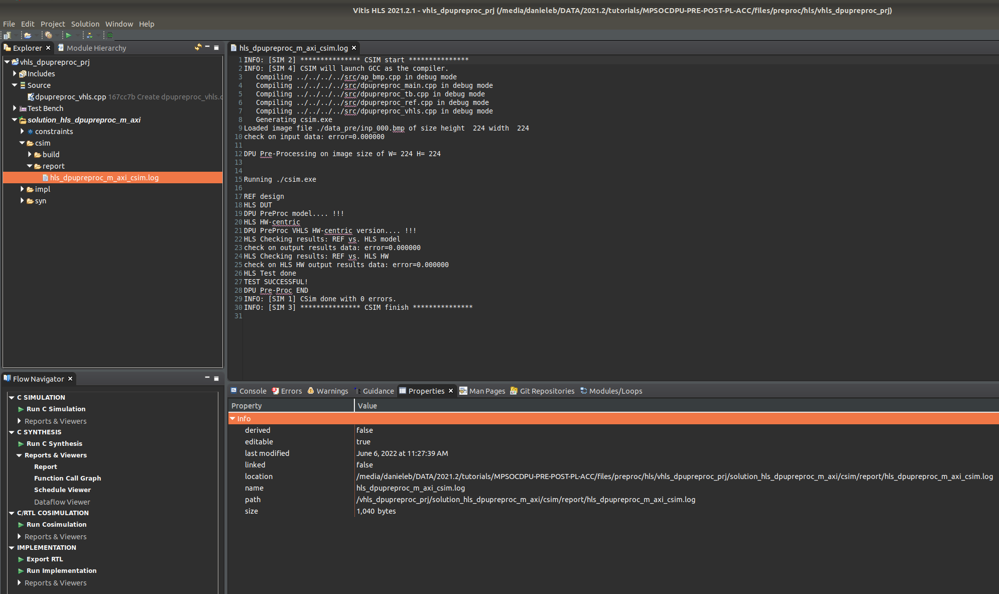

*Figure 1. Pre-processing design: CSIM step with Vitis HLS*


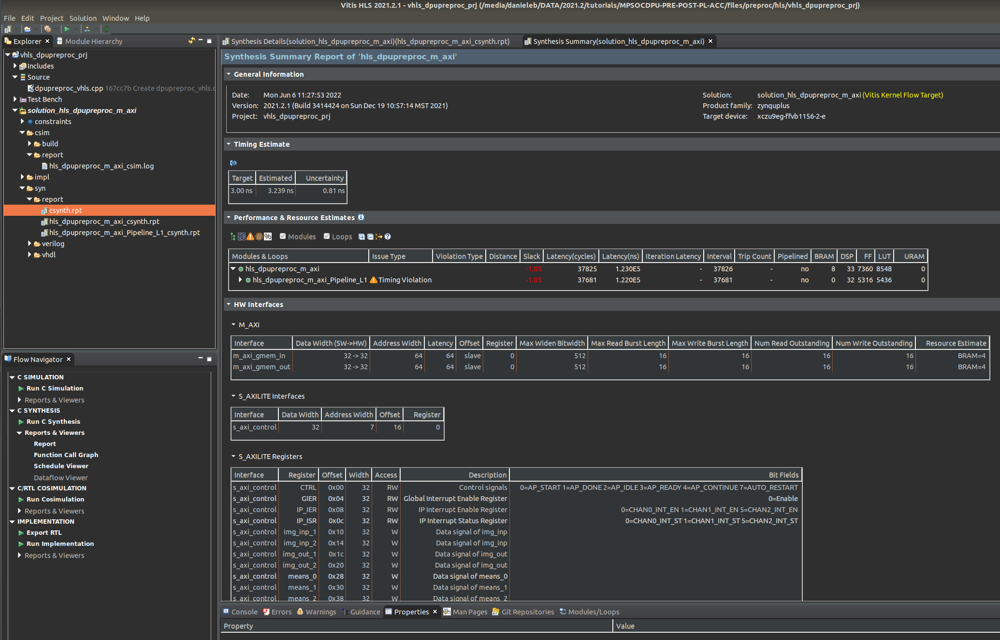

*Figure 2. Pre-processing design: SYN step with Vitis HLS*

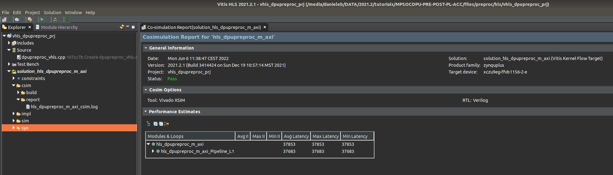

*Figure 3. Pre-processing design: coSIM step with Vitis HLS*

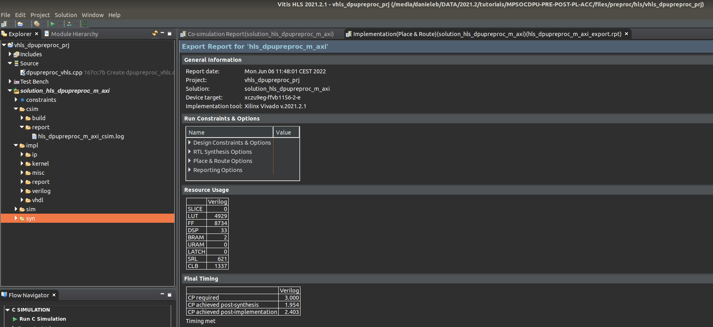

*Figure 4. Pre-processing design: IMP step with Vitis HLS*


Note that the file [dpupreproc_defines.h](files/preproc/hls/src/dpupreproc_defines.h) must have the line ``#define ARM_HOST`` commented.

As you see from figure 4, after Place-And-Route, the accelerator consumes the following resources: ~5000 LUT, ~8800 FF, 2 BRAM and 33 DSP from the  MPSoC ZU9 device  with a minimum clock period of 2.4ns, which corresponds to  ~416 MHz maximum clock frequency.

Figure 3 reports the cycle accurate simulation (coSIM step), considering the amount of clock cycles to process the whole image before sending it back to DDR memory, the latency of this kernel is  given by 37853 (cycles) x 2.4ns (clock period) = 0.0902ms.

Even assuming a longer clock period of 5ns (corresponding to 200MHz clock frequency) the latency would become 0.189ms.

Note that this latency is the time to process the entire frame (224x224x3) of pixels because this is the way Vitis HLS works if you want to do a functional cycle accurate simulation (acknowledged as "coSIM") of the accelerator. But in itself this core has a real latency of few dozens of clock cycles. Such effective latency could be exploited either by using AXI4 Streaming interfaces (which are not accepted by the DPU core, which is unable to work in a streaming mode) instead of full MAXI4 interfaces or by adding a ping-pong buffer of few image lines among the Pre-processing accelerator and the external DDR memory.  


### 2.2 Post-processing Kernel


#### 2.2.1 Kernel Functionality

In ML, the post-processing job has to present the "features map" generated by the CNN in a form that can be understood by human beings; in case of Semantic Segmentation this require to understand which pixel of the image belongs to which class.

In this application case there are 12 classes per each pixel, so the output tensor generated by the DPU is a 3D volume with the same horizontal and vertical size of the input images -that is 224 and 224 respectively- and 12 channels.

For each set of 12 values related to one pixel, the post-processing task computes first the Softmax classifier and then search for its maximum value and related index: the index of this max value represent the object class (coded with a number from 0 to 11) with the highest probability to be predicted by the CNN. This can be illustrated by looking at the C/C++ code of the file [dpupostproc_ref.cpp](files/postproc/common_src/dpupostproc_ref.cpp):

```text
void ref_SoftMax(signed char  *inp_data, float *out_data, float post_scale_factor, unsigned char size)
{
  float result[MAX_NUM_OF_CLASSES];
  float sum = 0.0f;
  for (int i=0; i<size; i++) {
	  int addr = 128+inp_data[i];
	  assert( (addr>=0) & (addr<=255) );
    float x = addr*post_scale_factor;
    result[i]= expf(x);
    sum += result[i];
  }
  float div = 1.0f / sum;
  for (int i=0; i<size; i++)
    out_data[i]=result[i] * div;
}

void ref_ArgMax(float *inp_data, unsigned char *out_max, unsigned char *out_index, unsigned char size)
{
  unsigned char  max=0, index=0;
  for (int i=0; i<size; i++) {
    float val = inp_data[i];
    val = val * 255.0f;
    int i_val = (int) val;
    assert( (i_val<=255) & (i_val>=0) );
    unsigned char u_val = i_val;
    if (u_val > max) {
    	max = u_val;
    	index = i;
    }
  }
  *out_index = index;
  *out_max = max;
}

void ref_dpupostproc(signed char *inp_data, unsigned char *out_max,
     unsigned char *out_index, float post_scale_factor, unsigned short int height, unsigned short int width)
{
  unsigned short int rows = height;
  unsigned short int cols = width;
  unsigned short int size = MAX_NUM_OF_CLASSES;

  float softmax[MAX_NUM_OF_CLASSES];
  signed char ch_vect[MAX_NUM_OF_CLASSES];
  unsigned char index, max;

  for (int r = 0; r < rows; r++) {
    for (int c = 0; c < cols; c++) {
      for(int cl=0; cl<size; cl++) {
    	  signed char  tmp_data  = inp_data[r*POST_MAX_WIDTH*MAX_NUM_OF_CLASSES + c*MAX_NUM_OF_CLASSES + cl];
    	  ch_vect[cl] =  tmp_data;
      }
      ref_SoftMax(ch_vect, softmax, post_scale_factor, size);
      ref_ArgMax(softmax, &max, &index, size);
      out_max[  r*POST_MAX_WIDTH + c] = (unsigned char) max;
      out_index[r*POST_MAX_WIDTH + c] = index;
    }
  }
}
```

As already done for the pre-processing, also in this case there is the need to scale the data generated by the DPU before inputting them into the SoftMax classifier and this is done with the ``post_scale_factor`` parameter that comes from a query to the DPU at run time, with Python code similar to this:

```python
output_fixpos = outputTensors[0].get_attr("fix_point")
post_scale_fact = 1 / (2**output_fixpos)
```

Note that ``output_fixpos`` is value from 1 to 7 because it represents the exponent ``i`` of a power of ``2,`` that is ``2^i``.    

The SoftMax function is computed by a Look Up Table (LUT), since there are 7 possible ``output_fixpos`` values the file [luts.h](files/postproc/common_src/luts.h) contains basically 7 different LUTs, one for each value.

In the HLS TB this parameter is fixed in the [dpupostproc_defines.h](files/postproc/vitis/kernels/dpupostproc_defines.h) file, to test the functionality of the core.


#### 2.2.2 HLS Design


After having setup the Vitis environment, just launch the command

```shell
cd MPSOCDPU-PRE-POST-PLACC/files # you are supposed to be here
cd postproc/hls
vitis_hls -f hls_script.tcl
```

and the whole HLS flow will run in its steps: CSIM, SYN, coSIM and IMP.
See the related screenshots of Figures 5, 6, 7 and 8 (those images can be related to a previous Vitis HLS release, and the numbers an be slightly different).

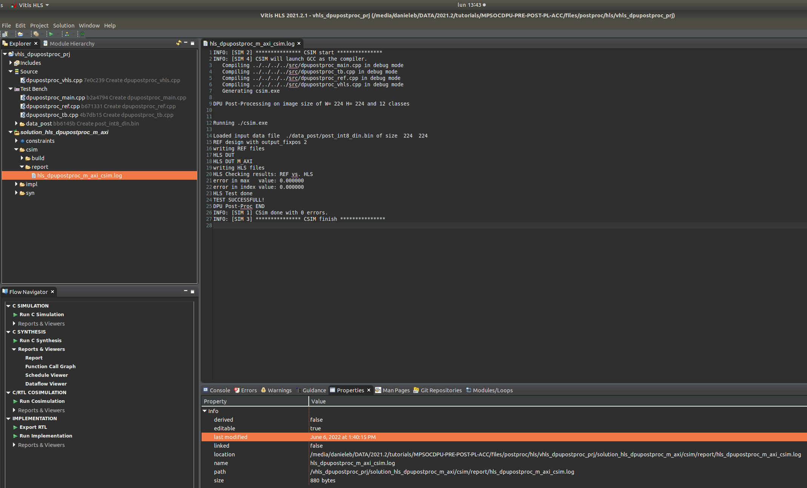

*Figure 5. Post-processing design: CSIM step with Vitis HLS*


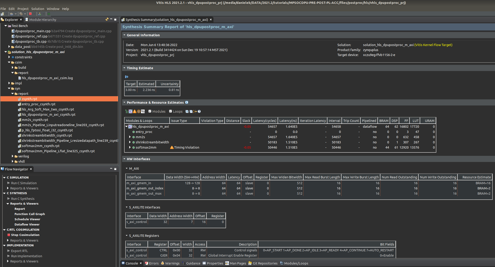

*Figure 6. Post-processing design: SYN step with Vitis HLS*

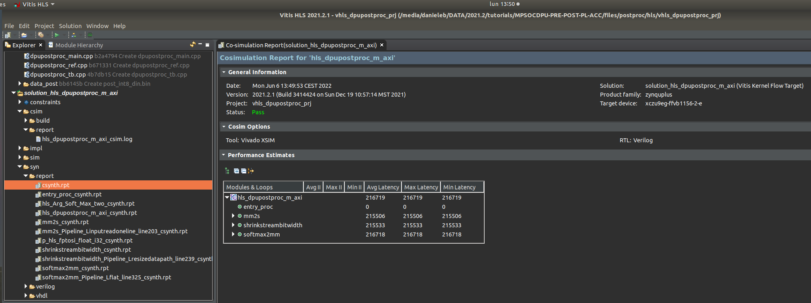

*Figure 7. Post-processing design: coSIM step with Vitis HLS*

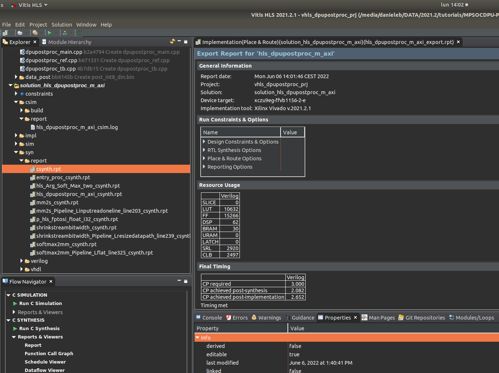

*Figure 8. Post-processing design: IMP step with Vitis HLS*


Note that the file [dpupostproc_defines.h](files/postproc/hls/src/dpupostproc_defines.h) must have the line ``#define ARM_HOST`` commented.

As you see from Figure 8, after Place-And-Route, the accelerator consumes the following resources: ~10700 LUT, ~15300 FF, 30 BRAM and 62 DSP from the  MPSoC ZU9 device  with a minimum clock period of 2.652, which corresponds to  377 MHz maximum clock frequency.

Figure 7 reports the cycle accurate simulation (coSIM step), considering the amount of clock cycles to process the whole image before sending it back to DDR memory, the latency of this kernel is  given by 216719 (cycles) x 2.652ns (clock period) = 0.574ms.

Even assuming a longer clock period of 5ns (corresponding to 200MHz clock frequency) the latency would become 1.08ms.

Note that this latency is the time to process the entire frame (224x224x12) of data because this is the way Vitis HLS works if you want to do a functional cycle accurate simulation (acknowledged as "coSIM") of the accelerator. But in itself this core has a real latency of few dozens of clock cycles. Such effective latency could be exploited either by using AXI4 Streaming interfaces (which are not accepted by the DPU core, which is unable to work in a streaming mode) instead of full MAXI4 interfaces or by adding a ping-pong buffer of few image lines among the Post-processing accelerator and the external DDR memory.  


## 4 Makefile based Design Flow

When adding also the DPU software application to the PL pre- and post-processing accelerators, you have to use the Vitis flow based on the usage of ``Makefiles``.


### 4.1 Compile the Host Applications

Assuming you have properly setup the Vitis environment, the complete software application (for the ARM CPU) with the cascade of the three kernels (pre-processing, DPU, post-processing)
can be compiled with the Vitis Makefile-based flow, by launching the following commands in the [Makefile](files/makefile_flow/host_apps/Makefile) from the [host_apps](files/makefile_flow/host_apps):

```shell
cd $WRK_DIR/MPSOCDPU-PRE-POST-PL-ACC/files # you are supposed to be here
cd makefile_flow
bash -x ./run_makefile_flow.sh
```

These commands will compile the ARM CPU host applications with a Makefile flow for the standalone pre-processing (``preproc`` folder, the application is named ``host_preproc_xrt``),
the standalone post-processing (``postproc`` folder, the application is named ``host_postproc_xrt``) and the cascade of "preprocessing -> DPU -> postprocessing" (``pre2dpu2post`` folder, the application is named ``pre2dpu2post``).


### 4.2 Compile the Whole Embedded HW/SW System


You should not touch the two Makefiles placed in folders [dpu_trd](files/dpu_trd) and [dpu_trd/sources](files/dpu_trd/sources): they were already prepared for you with the correctly set environmental variables.

The following command will create the entire embedded system (it requires some hours, depending on the computer you are using):

```shell
cd $WRK_DIR/MPSOCDPU-PRE-POST-PL-ACC/files/dpu_trd # you are supposed to be here
make all
```

as illustrated in Figure 9:

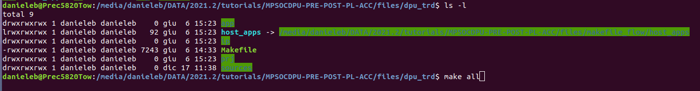

*Figure 9. Building the entire embedded hw-sw system*


The ``sd_card.img`` image file to boot the ZCU102 board SD-card will be produced in the ``$WRK_DIR/MPSOCDPU-PRE-POST-PL-ACC/files/dpu_trd/prj/Vitis/binary_container_1/`` folder.


You have to use an utility like ``Wind32DiskImager`` (on a Windows-OS PC) to burn such file on the SD card media, as illustrated in Figure 10:

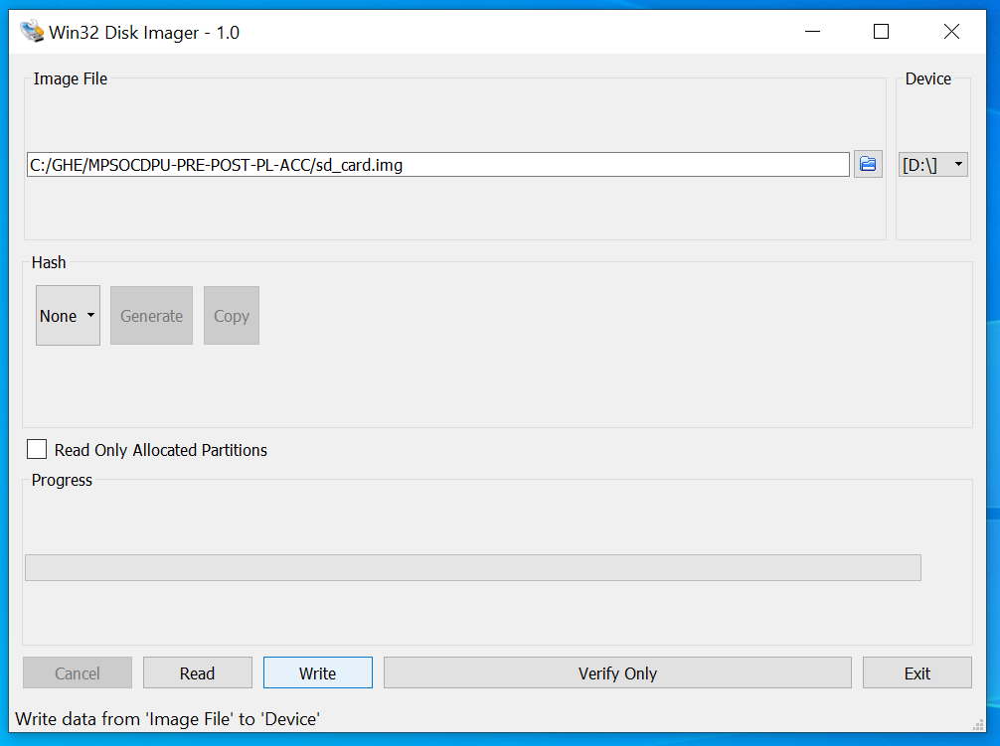

*Figure 10. writing the img file on the ZCU102 sd card*


## 5 Run on the Target Board


### 5.1 The CNN Model

For the runtime execution you will use the ``zcu102_unet2.xmodel`` file which contains all the weights and instructions of the UNET CNN that was trained and quantized in the  [05-Keras_FCN8_UNET_segmentation](https://github.com/Xilinx/Vitis-AI-Tutorials/blob/1.4/Design_Tutorials/05-Keras_FCN8_UNET_segmentation/README.md) Vitis-AI ML tutorial (you have to run it under Vitis AI 3.0). Such an ``xmodel`` is already available for your comfort in this repository, it will be executed by the Deep Processor Unit (DPU) using [XRT](https://github.com/Xilinx/XRT) APIs jointly with the MPSoC ARM CPU.

All the ``*.sh`` scripts that are placed in that ML tutorial are related to Vitis AI 1.4 release, but they work smoothly also with the latest Vitis AI 3.0 current release.

The UNET CNN performs Semantic Segmentation on images of size 224x224x3 and generates a segmented image with 12 classes; more details can be found in the ML tutorial itself.


### 5.2 Board Setup

Assuming you are using the ZCU102 board configured as illustrated in Figure 11, you need to setup a serial (UART) terminal between the board and your PC using either ``PuTTY`` (from Linux OS) or ``Tera Term`` (from Window OS). Figure 12 illustrates the second case.

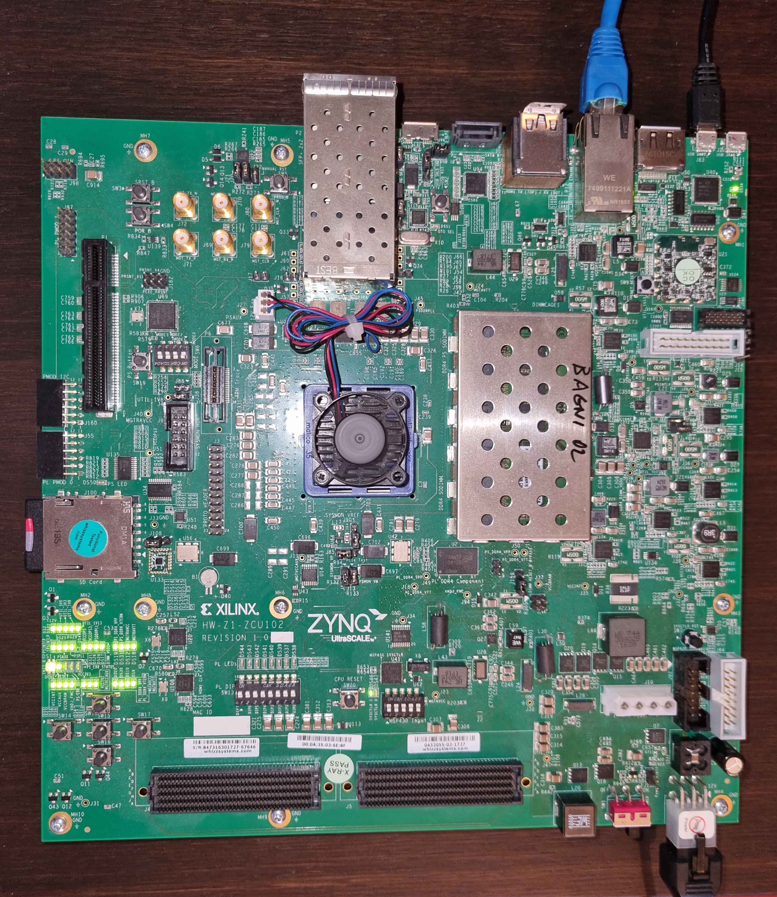

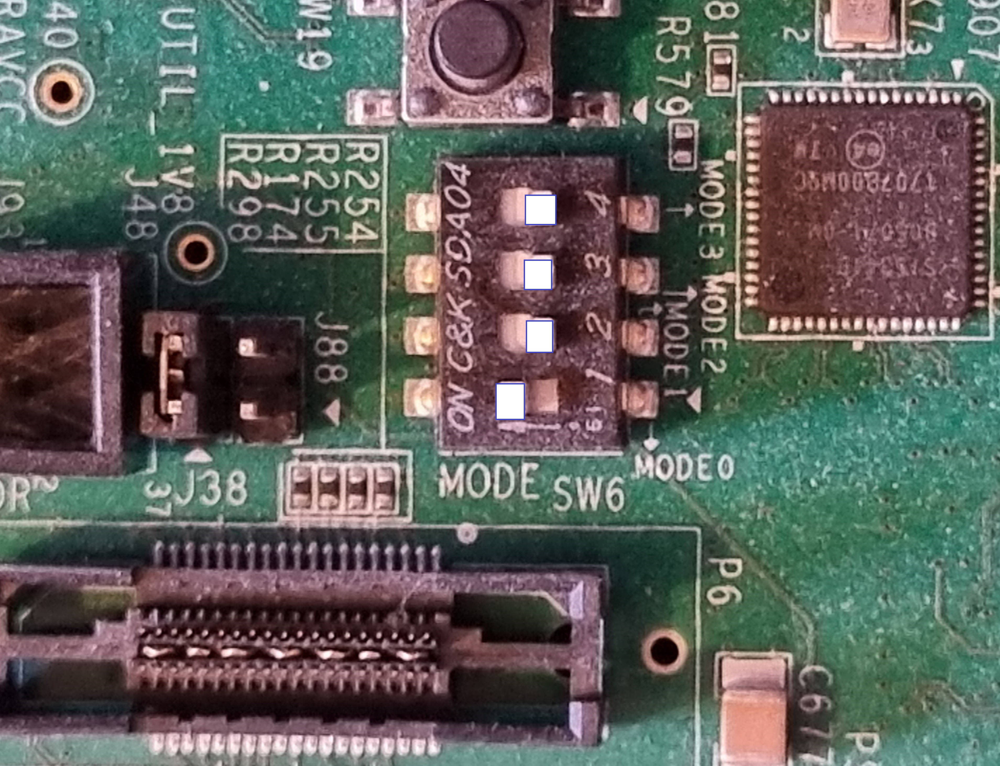

*Figure 11. (Top) ZCU102 board. (Bottom) SW6 setup to boot from sd-card*

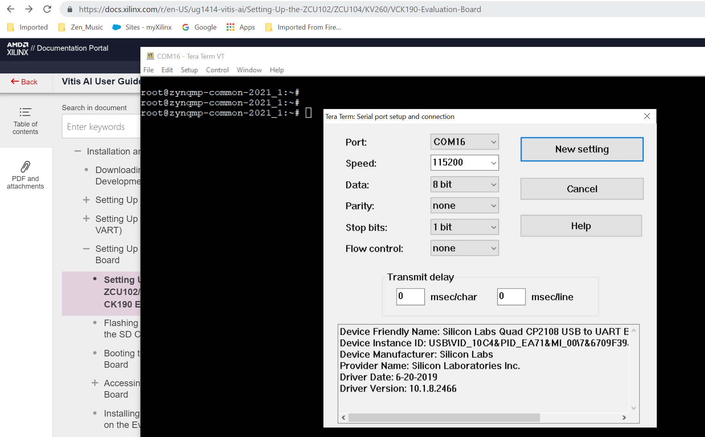

*Figure 12. Tera Term setup on a Windows OS PC*

Once you boot the board, launch the following commands to [install the Vitis AI libraries online](https://github.com/Xilinx/Vitis-AI/tree/master/tools/Vitis-AI-Recipes#to-install-the-vai20-online) on the board (note that your board must be connected to the internet):

```shell
# install the libraries online
dnf install vitis-ai-library
# make visible such libraries during dynamic loading
export LD_LIBRARY_PATH=/media/sd-mmcblk0p1/app/samples/lib
# optimize the dpu sw on the board
cd /media/sd-mmcblk0p1/app  
tar -xvf dpu_sw_optimize.tar.gz
cd dpu_sw_optimize/zynqmp
source ./zynqmp_dpu_optimize.sh
```


### 5.3 Run the Host Applications on the Target ZCU102 Board

All necessary files should be on FAT (BOOT) partition of the SD Card in the ``/mnt/sd-mmcblk0p1`` folder:

```shell
cd /mnt/sd-mmcblk0p1
ls -l
```

you should see the following files:

```text
-rwxrwxr-x 1 root users 28179592 Jan  1  2015 BOOT.BIN
-rwxrwxr-x 1 root users 21584384 Jan  1  2015 Image
drwxrwxr-x 4 root users      512 Jan  1  2015 app
-rwxrwxr-x 1 root users     2710 Jan  1  2015 boot.scr
drwxrwxr-x 2 root users     1024 Nov 16 16:05 data_post
drwxrwxr-x 2 root users      512 Nov 16 16:04 data_pre
drwxrwxr-x 2 root users      512 Jan  1  2015 data_pre2dpu2post
-rwxrwxr-x 1 root users 26601263 Jan  1  2015 dpu.xclbin
-rwxrwxr-x 1 root users   111024 Jan  1  2015 host_postproc_xrt
-rwxrwxr-x 1 root users  1645104 Jan  1  2015 host_pre2dpu2post_xrt
-rwxrwxr-x 1 root users   148800 Jan  1  2015 host_preproc_xrt
drwxrwxr-x 2 root users      512 Jan  1  2015 model
```

Alternatively, in case of changes to the ``host_apps`` running on the ARM CPU, you can create an archive and copy it on your ZCU102 target board with
``scp`` utility (assuming your board has a certain IP address ``ZCU102_IP_ADDRESS``):

```shell
#from HOST PC
cd MPSOCDPU-PRE-POST-PLACC/files # you are supposed to be here
cd makefile_flow
# -h to replace softlinks with real files
tar -chvf host_apps.tar ./host_apps
# transfer archive from host to target
scp host_apps.tar root@ZCU102_IP_ADDRESS:~/
```

Then you can work on the UART terminal of your target board with the following commands:
```shell
#FROM TARGET BOARD
tar -xvf host_apps.tar
cd host_apps
bash -x ./run_all_on_target.sh | tee logfile_host_apps_zcu102.txt
```

You should see something like what reported in the [logfile_host_apps_zcu102.txt](files/img/ logfile_host_apps_zcu102.txt) file.

Each host application generates an output that perfectly matches the reference:
- the standalone ``preproc`` PL kernel generates the  ``inp_000_out.bmp``  image that is bit-a-bit equal to the ``inp_000_ref.bmp``  image produced by the software task running on the ARM CPU as reference;

- the standalone ``postproc`` PL kernel generates the  ``pl_hls_index.bin``  binary file that is bit-a-bit equal to the ``arm_ref_index.bin``  binary file produced by the software task running on the ARM CPU as reference;

- the processing chain ``pre2dpu2post`` composed by the cascade of ``preproc`` ``dpu`` and ``postproc`` kernels produces the outputs of Figures 9 and 10 and the output files ``post_uint8_out_idx.bin`` (PL pre-precessing, DPU and PL post-processing kernels) and ``post_uint8_ref_idx.bin`` (DPU and ARM sw post-processing task) perfectly match each other.


*Figure 9. Pre-processing output data, represented  as an image.*


*Figure 10. Post-processing output data, represented  as an image. On the left the input image, on the right the output segmented image.*


<div style="page-break-after: always;"></div>


## License

The MIT License (MIT)

Copyright (c) 2022 Advanced Micro Devices, Inc.

Permission is hereby granted, free of charge, to any person obtaining a copy
of this software and associated documentation files (the "Software"), to deal
in the Software without restriction, including without limitation the rights
to use, copy, modify, merge, publish, distribute, sublicense, and/or sell
copies of the Software, and to permit persons to whom the Software is
furnished to do so, subject to the following conditions:

The above copyright notice and this permission notice shall be included in all
copies or substantial portions of the Software.

THE SOFTWARE IS PROVIDED "AS IS", WITHOUT WARRANTY OF ANY KIND, EXPRESS OR
IMPLIED, INCLUDING BUT NOT LIMITED TO THE WARRANTIES OF MERCHANTABILITY,
FITNESS FOR A PARTICULAR PURPOSE AND NONINFRINGEMENT. IN NO EVENT SHALL THE
AUTHORS OR COPYRIGHT HOLDERS BE LIABLE FOR ANY CLAIM, DAMAGES OR OTHER
LIABILITY, WHETHER IN AN ACTION OF CONTRACT, TORT OR OTHERWISE, ARISING FROM,
OUT OF OR IN CONNECTION WITH THE SOFTWARE OR THE USE OR OTHER DEALINGS IN THE
SOFTWARE.


<p align="center"><sup>XD106 | © Copyright 2022 Xilinx, Inc.</sup></p>
