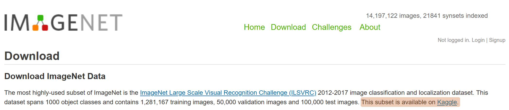
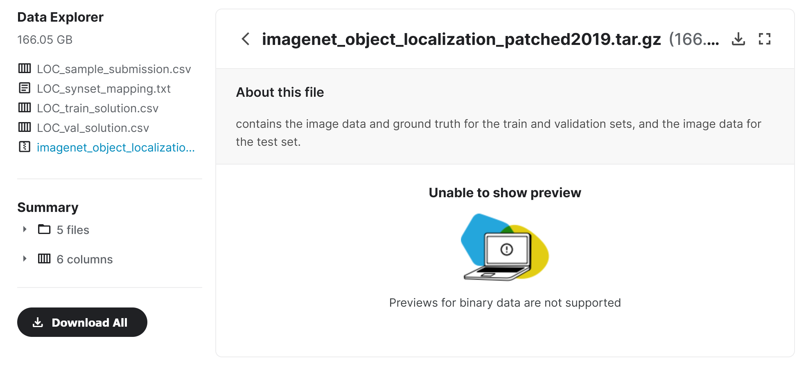

<table class="sphinxhide" width="100%">
 <tr width="100%">
    <td align="center">
    <h1>Training Neural Networks</h1>
    </td>
    </tr>
</table>

# Using the Kaggle ImageNet Subset for Training Neural Networks (XD146)

## Problem Statement

It seems that developers and enthusiasts with a non-edu domain (e.g. somecompany.com and *not* someuniv.edu) are unable to obtain the [ImageNet](https://image-net.org/index.php) dataset directly from that [site](https://image-net.org/download.php). The [ILSVRC 2012-2017](https://image-net.org/challenges/LSVRC/index.php) *subset*, with 1000 object classes, contains 1,281,167 training, 50,000 validation, and 100,000 test images, is accessible from [Kaggle](https://www.kaggle.com/c/imagenet-object-localization-challenge/overview/description).

|  |
|:--:| 
| *Fig. 1: ImageNet Download Page (src: [ImageNet](https://image-net.org/download.php))* |

The directory structure of the Kaggle download package is slightly different from previous ImageNet versions. This article highlights the steps required to use the ImageNet *subset* from Kaggle for training neural networks with PyTorch and TensorFlow.

## Downloading from Kaggle

Registration is required to download the ImageNet subset from [Kaggle](https://www.kaggle.com/).

|  |
|:--:|
| *Fig. 2: Kaggle Registration (src: [Kaggle](https://www.kaggle.com/c/imagenet-object-localization-challenge/overview/description#))* |

After registration, click on the **Download All** button on the [data](https://www.kaggle.com/competitions/imagenet-object-localization-challenge/data) page.

|  |
|:--:|
| *Fig. 3: Kaggle ImageNet Download (src: [Kaggle](https://www.kaggle.com/competitions/imagenet-object-localization-challenge/data))* |

This will download the five files shown in the `Data Explorer` pane. Note that the tarred and zipped collection of image files will require more than 166 GB of space.

## Directory Structure

Assuming that the download directory is named `ImageNet`, use the following command to untar the image files:

```Bash
$ tar zxvf imagenet_object_localization_patched2019.tar.gz
```

The resulting directory structure is shown below.

```
ImageNet
├── ILSVRC
│   ├── Annotations
│   │   └── CLS-LOC
│   │       ├── train
│   │       │   ├── n01440764
│   │       │   │   ├── n01440764_10040.xml
.................................................
│   │       └── val
│   │           ├── ILSVRC2012_val_00000001.xml
.................................................
│   ├── Data
│   │   └── CLS-LOC
│   │       ├── test
│   │       │   ├── ILSVRC2012_test_00000001.JPEG
.................................................
│   │       ├── train
│   │       │   ├── n01440764
│   │       │   │   ├── n01440764_10026.JPEG
.................................................
│   │       └── val
│   │           ├── ILSVRC2012_val_00000001.JPEG
.................................................   
│   └── ImageSets
│       └── CLS-LOC
│           ├── test.txt
│           ├── train_cls.txt
│           ├── train_loc.txt
│           └── val.txt
├── LOC_sample_submission.csv
├── LOC_synset_mapping.txt
├── LOC_train_solution.csv
└── LOC_val_solution.csv
```

There are 1000 folders under ``ImageNet/ILSVRC/Data/CLSLOC/train``. Each folder is a `wnid` (WordNet ID) of a class with its human-comprehensible equivalents listed in the `LOC_synset_mapping.txt` file.

```
n01440764 tench, Tinca tinca
n01443537 goldfish, Carassius auratus
n01484850 great white shark, white shark, man-eater, man-eating shark, Carcharodon carcharias
n01491361 tiger shark, Galeocerdo cuvieri
n01494475 hammerhead, hammerhead shark
n01496331 electric ray, crampfish, numbfish, torpedo
n01498041 stingray
```

Instead of the the typical 0~999 class indexing method (see example [here](https://gist.github.com/yrevar/942d3a0ac09ec9e5eb3a)), this dataset uses `wnid`.

Following are the first 10 lines of the `ImageNet/ILSVRC/ImageSets/CLS-LOC/train_cls.txt` file:

```
n01440764/n01440764_10026 1
n01440764/n01440764_10027 2
n01440764/n01440764_10029 3
n01440764/n01440764_10040 4
n01440764/n01440764_10042 5
n01440764/n01440764_10043 6
n01440764/n01440764_10048 7
n01440764/n01440764_10066 8
n01440764/n01440764_10074 9
n01440764/n01440764_10095 10
```

It is organized as:

```
{wnid}/{image_filename} line_number
```

>**Note**: The `image_filename` does not include the `JPEG` suffix and the line number entry is redundant.

## Preparing the Dataset

> **Note**: The validation images are not organized into classes. Thus, you must create labeled subdirectories under `Data/CLS-LOC/val` similar to that under the `train` directory, and move the images into them using [this script](https://raw.githubusercontent.com/soumith/imagenetloader.torch/master/valprep.sh).
> 
> ```Bash
> $ cd ImageNet/ILSVRC/Data/CLS-LOC
> $ cp -r val val_orig
> $ cd ImageNet/ILSVRC/Data/CLS-LOC/val
> $ wget https://raw.githubusercontent.com/soumith/> imagenetloader.torch/master/valprep.sh
> $ . valprep.sh
> $ mv valprep.sh ../../../../.
> ```

`val_orig` keeps the original directory structure and may be removed to save disk space.

## Training with PyTorch

[ImageNet training in PyTorch](https://github.com/pytorch/examples/tree/main/imagenet) is used in this example.

  1. Copy [main.py](https://github.com/pytorch/examples/blob/main/imagenet/main.py) [see [ref](https://www.wikihow.com/Download-a-File-from-GitHub)] and rename it to `imgnet_pt.py` in some convenient directory.

  2. In an appropriate conda environment [see [ref](https://www.gcptutorials.com/post/how-to-install-pytorch-with-conda)], run the following command to see the expected arguments:
   
   ```Bash
   $ python imgnet_pt.py -h
   usage: imgnet_pt.py [-h] [-a ARCH] [-j N] [--epochs N] [--start-epoch N] [-b N] [--lr LR] [--momentum M] [--wd W] [-p N] [--resume PATH] [-e] [--pretrained] [--world-size WORLD_SIZE] [--rank RANK] [--dist-url DIST_URL] [--dist-backend DIST_BACKEND] [--seed SEED] [--gpu GPU] [--multiprocessing-distributed] DIR

    PyTorch ImageNet Training

    positional arguments:
      DIR                   path to dataset (default: imagenet)

    optional arguments:
      -h, --help            show this help message and exit
      -a ARCH, --arch ARCH  model architecture: alexnet | convnext_base | convnext_large | convnext_small | convnext_tiny | densenet121 | densenet161 | densenet169 | densenet201 | efficientnet_b0 | efficientnet_b1 | efficientnet_b2 | efficientnet_b3 | efficientnet_b4 | efficientnet_b5 | efficientnet_b6 | efficientnet_b7 | googlenet | inception_v3 | mnasnet0_5 | mnasnet0_75 | mnasnet1_0 | mnasnet1_3 | mobilenet_v2 | mobilenet_v3_large | mobilenet_v3_small | regnet_x_16gf | regnet_x_1_6gf | regnet_x_32gf | regnet_x_3_2gf | regnet_x_400mf | regnet_x_800mf | regnet_x_8gf | regnet_y_128gf | regnet_y_16gf | regnet_y_1_6gf | regnet_y_32gf | regnet_y_3_2gf | regnet_y_400mf | regnet_y_800mf | regnet_y_8gf | resnet101 | resnet152 | resnet18 | resnet34 | resnet50 | resnext101_32x8d | resnext50_32x4d | shufflenet_v2_x0_5 | shufflenet_v2_x1_0 | shufflenet_v2_x1_5 | shufflenet_v2_x2_0 | squeezenet1_0 | squeezenet1_1 | vgg11 | vgg11_bn | vgg13 | vgg13_bn | vgg16 | vgg16_bn | vgg19 | vgg19_bn | vit_b_16 | vit_b_32 | vit_l_16 | vit_l_32 | wide_resnet101_2 | wide_resnet50_2 (default: resnet18)
      -j N, --workers N     number of data loading workers (default: 4)
      --epochs N            number of total epochs to run
      --start-epoch N       manual epoch number (useful on restarts)
      -b N, --batch-size N  mini-batch size (default: 256), this is the total batch size of all GPUs on the current node when using Data Parallel or Distributed Data Parallel
      --lr LR, --learning-rate LR initial learning rate
      --momentum M          momentum
      --wd W, --weight-decay W  weight decay (default: 1e-4)
      -p N, --print-freq N  print frequency (default: 10)
      --resume PATH         path to latest checkpoint (default: none)
      -e, --evaluate        evaluate model on validation set
      --pretrained          use pre-trained model
      --world-size WORLD_SIZE number of nodes for distributed training
      --rank RANK           node rank for distributed training
      --dist-url DIST_URL   url used to set up distributed training
      --dist-backend DIST_BACKEND distributed backend
      --seed SEED           seed for initializing training.
      --gpu GPU             GPU id to use.
      --multiprocessing-distributed Use multi-processing distributed training to launch N processes per node, which has N GPUs. This is the fastest way to use PyTorch for either single node or multi node data parallel training
  ```
  
Note the default values of some parameters.
  
For servers with multiple GPUS, all the GPUs will be used by default. The environment variable CUDA_VISIBLE_DEVICES may be used to specify which GPUs to use. The index of the available GPUs may be obtained by running the [nvidia-smi](https://developer.download.nvidia.com/compute/DCGM/docs/nvidia-smi-367.38.pdf) command. For example, to train [ResNet-18](https://arxiv.org/pdf/1512.03385.pdf) on a system with four GPUs indexed as 0,1,2,3; to use only 1 and 2:

  ```Bash
  $ CUDA_VISIBLE_DEVICES=1,2 python imgnet_pt.py {PATH_TO_IMAGENET}/ILSVRC/Data/CLS-LOC
  ```

Or use the `gpu` argument parameter.

  ```Bash
  $ python imgnet_pt.py --gpu 2 {PATH_TO_IMAGENET}/ILSVRC/Data/CLS-LOC
  ```

> **Note**: ResNet-18 is the default architecture.

This script uses the [`torchvision.datasets.ImageFolder`](https://pytorch.org/vision/main/generated/torchvision.datasets.ImageFolder.html) class which assumes the following directory structure

  ```Bash
  rootdir
  ├── class1
  │   ├── img_c1_1.png
  │   ├── img_c1_2.png
  │   ├── ...
  │   ├── some_dir1
  │   │   └── img_c1_N.png
  ├── class2
  │   ├── img_c2_1.png
  │   ├── img_c2_2.png
  │   ├── ...
  │   ├── some_dir2
  │   │   └── img_c2_M.png

  ```

## Training with TensorFlow

[ImageNet_ResNet_Tensorflow2.0](https://github.com/Apm5/ImageNet_ResNet_Tensorflow2.0) is used for training in this example. The training script requires a file associating each image with a class ID. Since the script uses [one-hot](https://en.wikipedia.org/wiki/One-hot) coding, `train_cls.txt` cannot be used as-is and must be modified to match the expected format of:

```Bash
[image file] [class ID (0~999)]
```

The script `gen_imglbl.py` creates the required files for training and validation.

1. Clone the [ImageNet_ResNet_Tensorflow2.0](https://github.com/Apm5/ImageNet_ResNet_Tensorflow2.0) repository into some appropriate directory.

    ```Bash
    $ git clone https://github.com/Apm5/ImageNet_ResNet_Tensorflow2.0 --depth 1   --branch=master
    $ cd ImageNet_ResNet_Tensorflow2.0
    ```

2. Modify `config.py` as required to match your environment.

3. Follow the instructions in `README.md` to setup the required directories and change the model to be trained.

## Support

GitHub issues will be used for tracking requests and bugs. For questions go to [forums.xilinx.com](http://forums.xilinx.com/).

## License

Licensed under the Apache License, Version 2.0 (the "License"); you may not use this file except in compliance with the License.

You may obtain a copy of the License at [http://www.apache.org/licenses/LICENSE-2.0]( http://www.apache.org/licenses/LICENSE-2.0 )

Unless required by applicable law or agreed to in writing, software distributed under the License is distributed on an "AS IS" BASIS, WITHOUT WARRANTIES OR CONDITIONS OF ANY KIND, either express or implied. See the License for the specific language governing permissions and limitations under the License.

<p align="center"><sup>&copy; Copyright 2022 Xilinx, Inc.</sup></p>
