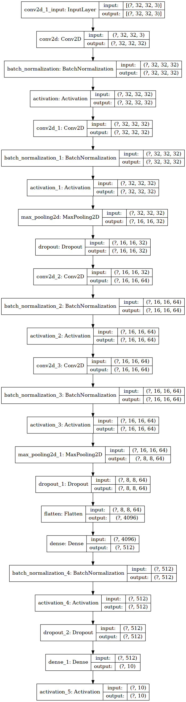

<!--

Copyright © 2023 Advanced Micro Devices, Inc. All rights reserved.
SPDX-License-Identifier: MIT

Author: Daniele Bagni, Xilinx Inc
-->


<table class="sphinxhide" width="100%">
 <tr width="100%">
    <td align="center"><h1>Vitis™ AI Tutorials</h1>
    </td>
 </tr>
</table>

# Deep Learning with Custom GoogleNet and ResNet in Keras and Xilinx Vitis AI


- Version:      Vitis AI 3.0 with Tensorflow 1.15
- Support:      ZCU10, ZCU104, VCK190, VEK280 boards
- Last update:  28 Apr. 2023


## Table of Contents

[1 Introduction](#1-introduction)

[2 Prerequisites](#2-prerequisites)

[3 The Docker Tools Image](#3-the-docker-tools-image)

[4 The Main Flow on the Host](#4-the-main-flow-on-the-host)

[5 Multithreading Application Code](#5-multithreading-application-code)

[6 Run on the Target Board](#6-run-on-the-target-board)

[7 Summary](#7-summary)

[Appendix](#appendix)


[References](#references)


[License](#license)


## 1 Introduction

[Vitis™ AI](https://www.xilinx.com/products/design-tools/vitis/vitis-ai.html) is a comprehensive AI inference development solution for AMD devices, boards, and Alveo™ data center acceleration cards. It consists of a rich set of AI models, optimized deep learning processor unit (DPU) cores, tools, libraries, and example designs for AI at the edge and in the data center. It is designed with high efficiency and ease of use in mind, unleashing the full potential of AI acceleration on AMD FPGAs and adaptive SoCs.

In this Deep Learning (DL) tutorial, you will quantize in fixed point some custom Convolutional Neural Networks (CNNs) and deploy them on the AMD FPGA boards as  [ZCU102](https://www.xilinx.com/products/boards-and-kits/ek-u1-zcu102-g.html), [ZCU104](https://www.xilinx.com/products/boards-and-kits/zcu104.html) and [VCK190](https://www.xilinx.com/products/boards-and-kits/vck190.html).

This tutorial deals with:
- four custom CNNs, from the simplest ``LeNet`` and ``miniVggNet`` to the intermediate ``miniGoogleNet`` and the more complex ``miniResNet``, as described in the [custom_cnn.py](files/code/custom_cnn.py) file;
- two different datasets, ``Fashion-MNIST`` and ``CIFAR-10``, each one with 10 classes of objects.

Once the selected CNN has been correctly trained in Keras, the [HDF5](https://www.hdfgroup.org/solutions/hdf5/) file of weights is converted into a TF checkpoint and inference graph file, such floating point frozen graph is then quantized by the Vitis AI Quantizer that creates an 8-bit (INT8) fixed point graph from which the Vitis AI Compiler generates the ``xmodel`` file of micro instructions for the Deep Processor Unit (DPU) of the Vitis AI platform. The final C++ application is executed at run time on the ZCU102 target board, which is the default one adopted in this tutorial (all the flow works transparently also for ZCU104 and VCK190 boards). The top-1 accuracy of the predictions computed at run time is measured and compared with the simulation results.

## 2 Prerequisites

- Ubuntu 18.04.5 host PC.

- The entire repository of [Vitis AI 3.0](https://github.com/Xilinx/Vitis-AI) stack from [www.github.com/Xilinx](https://www.github.com/Xilinx) web site.

-  Accurate reading of [Vitis AI User Guide 1414](https://docs.xilinx.com/r/en-US/ug1414-vitis-ai/Vitis-AI-Overview) (shortly UG1414).

- Accurate reading of [online Vitis AI](https://xilinx.github.io/Vitis-AI) documentation from [xilinx.github.io](https://xilinx.github.io) web site. In particular, pay attention to the installation and setup instructions for both host and target, it is recommended you build a GPU-based docker image with TensorFlow 1.15.

- A Vitis AI target board such as either:
    - [ZCU102](https://www.xilinx.com/products/boards-and-kits/ek-u1-zcu102-g.html), or
    - [ZCU104](https://www.xilinx.com/products/boards-and-kits/ek-u1-zcu104-g.html), or
    - [VCK190](https://www.xilinx.com/products/boards-and-kits/vck190.html), or
    - the newest Versal Edge **VEK280** board, still in an Early Access phase.

- Familiarity with Deep Learning principles.


### 2.1 Dos-to-Unix Conversion

In case you might get some strange errors during the execution of the scripts, you have to pre-process -just once- all the``*.sh`` shell and the python ``*.py`` scripts with the [dos2unix](http://archive.ubuntu.com/ubuntu/pool/universe/d/dos2unix/dos2unix_6.0.4.orig.tar.gz) utility.
In that case run the following commands from your Ubuntu host PC (out of the Vitis AI docker images):
```bash
sudo apt-get install dos2unix
cd <WRK_DIR> #your working directory
for file in $(find . -name "*.sh"); do
  dos2unix ${file}
done
```

### 2.2 Working Directory

In the following of this document it is assumed you have installed Vitis AI 3.0 somewhere in your file system and this will be your working directory ``<WRK_DIR>``, for example in my case ``<WRK_DIR>`` is set to
``~/DATA/VAI3.0``.  You have also created a folder named ``tutorials`` under such ``<WRK_DIR>`` and you have copied this tutorial there and renamed it ``VAI-KERAS-CUSTOM-GOOGLENET-RESNET``:

```text
VAI3.0  # your WRK_DIR

    ├── board_setup
    ├── demos
    ├── docker
    ├── docs
    ├── docsrc
    ├── dpu
    ├── examples
    ├── model_zoo
    ├── src
    ├── third_party
    └── tutorials      # created by you
       ├── VAI-KERAS-CUSTOM-GOOGLENET-RESNET
       ├── VAI-KERAS-FCN8-SEMSEG
       ├── VAI-SUBGRAPHS
```  


## 3 The Docker Tools Image

You have to know few things about [Docker](https://docs.docker.com/) in order to run the Vitis AI smoothly on your host environment.

### 3.1 Build the Image

From the Vitis AI 3.0 repository, run the following commands:

```shell
cd <WRK_DIR>
cd docker
./docker_build.sh -t gpu -f tf1
```

Once the process is finished, with the command ``docker images`` you should see something like this:

```text
REPOSITORY                       TAG         IMAGE ID       CREATED         SIZE
xilinx/vitis-ai-tensorflow-gpu   latest      3c6519018180   2 weeks ago     11.3GB
```

### 3.2 Launch the Docker Image

To launch the docker container with Vitis AI tools, execute the following commands from the ``<WRK_DIR>`` folder:

```bash
cd <WRK_DIR> # you are now in Vitis_AI subfolder
./docker_run.sh xilinx/vitis-ai-tensorflow-gpu:latest
conda activate vitis-ai-tensorflow
cd /workspace/tutorials/
cd VAI-KERAS-CUSTOM-GOOGLENET-RESNET/files #your current directory
```

Note that the container maps the shared folder ``/workspace`` with the file system of the Host PC from where you launch the above command, which is ``<WRK_DIR>`` in your case.
This shared folder enables you to transfer files from the Host PC to the docker container and vice versa.

The docker container does not have any graphic editor, so it is recommended that you work with two terminals and you point to the same folder, in one terminal you use the docker container commands and in the other terminal you open any graphic editor you like.


## 4 The Main Flow on the Host

The main flow is composed of seven major steps. The first six steps are executed from the tools container on the host PC by launching the script [run_all.sh](files/run_all.sh), which contains several functions. The seventh step can be executed directly on the target board. Here is an overview of each step.


1. Organize the data into folders, such as ``train`` for training, ``val`` for validation during the training phase, ``test`` for testing during the inference/prediction phase, and ``cal`` for calibration during the quantization phase, for each dataset. See [Organize the Data](#41-organize-the-data) for more information.

2. Train the CNNs in Keras and generate the HDF5 weights model. See [Train the CNN](#42-train-the-cnn) for more information.

3. Convert into TF checkpoints and inference graphs. See [Create TF Inference Graphs from Keras Models](#43-create-tf-inference-graphs-from-keras-models) for more information.

4. Freeze the TF graphs to evaluate the CNN prediction accuracy as the reference starting point. See [Freeze the TF Graphs](#44-freeze-the-tf-graphs) for more information.

5. Quantize from 32-bit floating point to 8-bit fixed point and evaluate the prediction accuracy of the quantized CNN. See [Quantize the Frozen Graphs](#45-quantize-the-frozen-graphs) for more information.

6. Run the compiler to generate the ``xmodel`` file for the target board from the quantized ``pb`` file. See [Compile the Quantized Models](#46-compile-the-quantized-models) for more information.

You can use either VART C++ or Python APIs to write the hybrid application for the ARM CPU, then compile it.  The application is called "hybrid" because the ARM CPU is executing some software routines while the DPU hardware accelerator is running the FC, CONV, ReLU, and BN layers of the CNN that were coded in the ``xmodel``file.

All explanations in the following sections are based only on the CIFAR-10 dataset; the commands for the  Fashion-MNIST dataset are very similar: just replace the sub-string "cifar10" with "fmnist".

Step 2, training, is the longest process and requires GPU support.


### 4.1 Organize the Data

As Deep Learning deals with image data, you have to organize your data in appropriate folders and apply some pre-processing to adapt the images to  the hardware features of the Vitis AI Platform. The first lines of script [run_all.sh](files/run_all.sh) call other python scripts to create the sub-folders ``train``, ``val``, ``test``, and ``cal`` that are located in the ``dataset/fashion-mnist`` and ``dataset/cifar10`` directories and to fill them with 50000 images for training, 5000 images for validation, 5000 images for testing (taken from the 10000 images of the original test dataset) and 1000 images for the calibration process (copied from the training images).

All the images are 32x32x3 in dimensions so that they are compatible with the two different datasets.


#### 4.1.1 Fashion MNIST

The [MNIST](http://yann.lecun.com/exdb/mnist/) dataset is considered the ``hello world`` of DL because it is widely used as a first test to check the deployment flow of a vendor of DL solutions. This small dataset takes relatively less time in the training of any CNN. However, due to the poor content of all its images, even the most shallow CNN can easily achieve from 98% to 99% of top-1 accuracy in Image Classification.

To solve this problem, the [Fashion-MNIST](https://github.com/zalandoresearch/fashion-mnist) dataset has been recently created for the paper [Fashion-MNIST: a Novel Image Dataset for Benchmarking Machine Learning Algorithms](arxiv.org/abs/1708.07747). It is identical to the MNIST dataset in terms of training set size, testing set size, number of class labels, and image dimensions, but it is more challenging in terms of achieving high top-1 accuracy values.

Usually, the size of the images is 28x28x1 (gray-level), but in this case they have been converted to 32x32x3 ("false" RGB images) to be compatible with the "true" RGB format of CIFAR-10.

#### 4.1.2 CIFAR-10

The [CIFAR-10](https://www.cs.toronto.edu/~kriz/cifar.html) dataset is composed of 10 classes of objects to be classified. It contains 60000 labeled RGB images that are 32x32 in size and thus, this dataset is more challenging than the MNIST and Fashion-MNIST datasets. The CIFAR-10 dataset was developed for the paper [Learning Multiple Layers of Features from Tiny Images](https://www.cs.toronto.edu/~kriz/learning-features-2009-TR.pdf).

### 4.2 Train the CNN

Irrespective of the CNN type, the data is processed, using the following Python code, to normalize it from 0 to 1. Such code has to be mirrored in the C++ application that runs in the ARM&reg; CPU of the target board.

```Python
# scale data to the range of [0, 1]
x_train = x_train.astype("float32") / cfg.NORM_FACTOR
x_test  = x_test.astype("float32") / cfg.NORM_FACTOR

# normalize
x_train = x_train -0.5
x_train = x_train *2
x_test  = x_test  -0.5
x_test  = x_test  *2
```


#### 4.2.1 LeNet

The model scheme of ```LeNet``` has 6,409,510 parameters as shown in the following figure:


*Figure 1. LeNet block diagram.*

For more details about this custom CNN and its training procedure, read the "Starter Bundle" of the [Deep Learning for Computer Vision with Python](https://www.pyimagesearch.com/deep-learning-computer-vision-python-book/) books by Dr. Adrian Rosebrock.

#### 4.2.2 miniVggNet

`miniVggNet` is a less deep version of the original `VGG16` CNN customized for the smaller Fashion-MNIST dataset instead of the larger [ImageNet-based ILSVRC](https://machinelearningmastery.com/introduction-to-the-imagenet-large-scale-visual-recognition-challenge-ilsvrc/). For more information on this custom CNN and its training procedure, read [Adrian Rosebrock's post](https://www.pyimagesearch.com/2019/02/11/fashion-mnist-with-keras-and-deep-learning/) from the PyImageSearch Keras Tutorials. ``miniVggNet`` is also explained in the "Practitioner Bundle" of the [Deep Learning for CV with Python](https://www.pyimagesearch.com/deep-learning-computer-vision-python-book/) books.

The model scheme of `miniVggNet` has 2,170,986 parameters as shown in the following figure:



*Figure 2. miniVggNet block diagram.*


#### 4.2.3 miniGoogleNet

`miniGoogleNet` is a customization of the original `GoogleNet` CNN. It is suitable for the smaller Fashion-MNIST dataset, instead of the larger ImageNet-based ILSVRC.

For more information on ``miniGoogleNet``, read the "Practitioner Bundle" of the [Deep Learning for CV with Python](https://www.pyimagesearch.com/deep-learning-computer-vision-python-book/) books by Dr. Adrian Rosebrock.

The model scheme of ```miniGoogleNet``` has 1,656,250 parameters, as shown in the following figure:


*Figure 3. miniGoogleNet block diagram.*


#### 4.2.4 miniResNet

`miniResNet` is a customization of the original `ResNet-50` CNN. It is suitable for the smaller Fashion-MNIST small dataset, instead of the larger ImageNet-based ILSVRC.

For more information on ``miniResNet``, read the "Practitioner Bundle" of the [Deep Learning for CV with Python](https://www.pyimagesearch.com/deep-learning-computer-vision-python-book/) books.

The model scheme of ```miniResNet``` has  886,102 parameters, as shown in the following figure:


*Figure 4. miniResNet block diagram.*


### 4.3 Create TF Inference Graphs from Keras Models

The function ``2_cifar10_Keras2TF()`` gets the computation graph of the TF backend representing the Keras model which includes the forward pass and training related operations.

The output files of this process, ``infer_graph.pb`` and ``float_model.chkpt.*``, will be stored in the folder ``tf_chkpts``. For example, in the case of ``miniVggNet``,  the TF input and output names that will be needed for [Freeze the TF Graphs](#44-freeze-the-tf-graphs) are named ``conv2d_1_input`` and ``activation_6/Softmax`` respectively.

### 4.4 Freeze the TF Graphs

The inference graph created in [Create TF Inference Graphs from Keras Models](#43-create-tf-inference-graphs-from-keras-models) is first converted to a [GraphDef protocol buffer](https://www.tensorflow.org/guide/extend/model_files), then cleaned so that the subgraphs that are not necessary to compute the requested outputs, such as the training operations, can be removed, and training variables can be converted to constants. This process is called "freezing the graph".

The routines  ``3a_cifar10_freeze()`` and ``3b_cifar10_evaluate_frozen_graph()`` generate the frozen graph and use it to evaluate the accuracy of the CNN by making predictions on the images in the `test` folder.

It is important to apply the correct ``input node`` and ``output node`` names in all the shell scripts, as shown in the following example with parameters when related to the ``miniVggNet`` case study:
```
--input_node  conv2d_1_input --output_node activation_6/Softmax
```
This information can be captured by the following python code:
```Python
# Check the input and output name
print ("\n TF input node name:")
print(model.inputs)
print ("\n TF output node name:")
print(model.outputs)
```

### 4.5 Quantize the Frozen Graphs

The routines ``4a_cifar10_quant()`` and ``4b_cifar10_evaluate_quantized_graph()``
generate the quantized graph and use it to evaluate the accuracy of the CNN by making predictions on the images in the `test` folder.


### 4.6 Compile the Quantized Models

The ``5_cifar10_vai_compile_zcu102()`` routine generates the ``xmodel`` file for the embedded system composed by the ARM CPU and the DPU accelerator in the ZCU102 board.

This file has to be loaded at run time from the C++ (or Python) application directly on the target board OS environment. For example, in case of ``LeNet`` for Fashion-MNIST, the ``xmodel`` file is named ``LeNet.xmodel``. A similar nomenclature is applied for the other CNNs.

Note that the Vitis AI Compiler tells you the names of the input and output nodes of the CNN that will be effectively implemented as a kernel subgraph on the DPU, therefore any layers not within this subgraph would typically be executed on the ARM CPU as a software kernel, for example in the case of `LeNet` CNN:
```text
Input Node(s)             (H*W*C)
conv2d_2_convolution(0) : 32*32*3

Output Node(s)      (H*W*C)
dense_2_MatMul(0) : 1*1*10
```


## 5 Multithreading Application Code

The C++ code for image classification [main.cc](files/target_zcu102/code/src/main.cc) is independent of the CNN type, thanks to the abstraction done by the VART APIs; it was derived from the [Vitis AI resnet50 VART demo](https://github.com/Xilinx/Vitis-AI/blob/master/demo/VART/resnet50/src/main.cc).

It is very important that the C++ code for pre-processing the images executes the same operations that you applied in the Python code of the training procedure. This is illustrated in the following C++ code fragments:

```c++
/*image pre-process*/
Mat image2 = cv::Mat(inHeight, inWidth, CV_8SC3);
resize(image, image2, Size(inHeight, inWidth), 0, 0, INTER_NEAREST);
for (int h = 0; h < inHeight; h++) {
  for (int w = 0; w < inWidth; w++) {
    for (int c = 0; c < 3; c++) {
      imageInputs[i * inSize + h * inWidth * 3 + w * 3 + c] = (int8_t)( (image2.at<Vec3b>(h, w)[c])/255.0f - 0.5f)*2) * input_scale ); //if you use BGR
      //imageInputs[i * inSize + h * inWidth * 3 + w * 3 +2-c] = (int8_t)( (image2.at<Vec3b>(h, w)[c])/255.0f - 0.5f)*2) * input_scale ); //if you use RGB

    }
  }
}
```

>**:pushpin: NOTE** The DPU API apply [OpenCV](https://opencv.org/) functions to read an image file (either ``png`` or ``jpg`` or whatever format) therefore the images are seen as BGR and not as native RGB. All the training and inference steps done in this tutorial treat images as BGR, which is true also for the above C++ normalization routine.
A mismatch in color space formats (BGR versus RGB) ``run_all_cifar10_target.sh``will result in incorrect predictions at run time on the target board.


## 6 Run on the Target Board

It is possible and straight-forward to compile the application directly on the target.
In fact this is what the script ``run_all_cifar10_target.sh``, when launched on the target.  

Turn on your target board and establish a serial communication with a ``putty`` terminal from Ubuntu or with a ``TeraTerm`` terminal from your Windows host PC.

Ensure that you have an Ethernet point-to-point cable connection with the correct IP addresses to enable ``ssh`` communication in order to quickly transfer files to the target board with ``scp`` from Ubuntu or ``pscp.exe`` from Windows host PC. For example, you can set the IP addresses of the target board to be ``192.168.1.100`` while the host PC is  ``192.168.1.101`` as shown in the following figure:


*Figure 5. Tera Term (Windows OS) connection.*

Once a ``tar`` file of the [target_zcu102](files/target_zcu102) folder has been created, copy it from the host PC to the target board. For example, in case of an Ubuntu PC, use the following command:
```
scp target_zcu102.tar root@192.168.1.100:~/
```

From the target board terminal, run the following commands:
```bash
tar -xvf target_zcu102.tar
cd target_zcu102
bash -x ./run_all_fmnist_target.sh
bash -x ./run_all_cifar10_target.sh
```

With this command, the ``fmnist_test.tar`` file with the 5000 test images will be uncompressed.
The single-thread application based on VART C++ APIs is built with the ``build_app.sh`` script and finally launched for each CNN, the effective top-5 classification accuracy is checked by a python script [check_runtime_top5_fmnist.py](files/target_zcu102/code/src/check_runtime_top5_fmnist.py).

Another script  [fps_fmnist.sh](files/target_zcu102/code/fps_fmnist.sh) launches a multi-threaded application based on VART Python APIs.  Such multi-threaded applications can be leveraged to measure effective fps.


## 7 Summary

The following [Excel table](files/doc/summary_results.xlsx) summarizes the CNN features for each dataset and for each network in terms of:

- elapsed CPU time for the training process
- number of CNN parameters and number of epochs for the training process
- TensorFlow output node names
- top-1 accuracies estimated for the TF frozen graph and the quantized graph
- top-1 accuracies measured on ZCU102 at run time execution
- frames per second (fps) -measured on ZCU102 at run time execution.  Note that this measurement INCLUDES the time for the ARM CPU to read images from the SDCARD, using the with OpenCV function.  In most real-world applications, these images will have been DMAed into DDR via a parallel process, and as such would not impact DPU inference time.


*Figure 6. Performance summary: ZCU102 (top) and VCK190 (bottom).*


Note that in the case of CIFAR-10 dataset, being more sophisticated than the Fashion-MNIST, the top-1 accuracies of the four CNNs are quite different, with the deepest network ``miniResNet`` being the most accurate.

To save storage space, the folder [target_zcu102](files/target_zcu102) contains only the ``xmodel`` files for the CIFAR10 dataset.  The motivation for this is simply that that the Fashion-MNIST dataset is more challenging and interesting than the CIFAR10 dataset.


## References
- https://www.pyimagesearch.com/2019/02/11/fashion-mnist-with-keras-and-deep-learning/
- https://www.pyimagesearch.com/deep-learning-computer-vision-python-book/
- https://github.com/Xilinx/Edge-AI-Platform-Tutorials/tree/master/docs/MNIST_tf
- https://www.dlology.com/blog/how-to-convert-trained-keras-model-to-tensorflow-and-make-prediction/
- https://github.com/Tony607/keras-tf-pb
- https://towardsdatascience.com/image-classifier-cats-vs-dogs-with-convolutional-neural-networks-cnns-and-google-colabs-4e9af21ae7a8
- https://blog.keras.io/building-powerful-image-classification-models-using-very-little-data.html
- https://machinelearningmastery.com/how-to-develop-a-convolutional-neural-network-to-classify-photos-of-dogs-and-cats/
- https://medium.com/datadriveninvestor/keras-imagedatagenerator-methods-an-easy-guide-550ecd3c0a92
- https://stats.stackexchange.com/questions/263349/how-to-convert-fully-connected-layer-into-convolutional-layer
- https://www.tensorflow.org/guide/extend/model_files


## Appendix

### A1 PyImageSearch Permission

```
From: Adrian at PyImageSearch [mailto:a.rosebrock@pyimagesearch.com]
Sent: Thursday, February 20, 2020 12:47 PM
To: Daniele Bagni <danieleb@xilinx.com>
Subject: Re: URGENT: how to cite / use your code in my new DL tutorials

EXTERNAL EMAIL
Hi Daniele,

Yes, the MIT license is perfectly okay to use. Thank you for asking :-)

All the best,


From: Adrian at PyImageSearch <a.rosebrock@pyimagesearch.com>
Sent: Friday, April 12, 2019 4:25 PM
To: Daniele Bagni
Cc: danny.baths@gmail.com

Subject: Re: how to cite / use your code in my new DL tutorials

Hi Daniele,
Thanks for reaching out, I appreciate it! And yes, please feel free to use the code in your project.
If you could attribute the code to the book that would be perfect :-)
Thank you!
--
Adrian Rosebrock
Chief PyImageSearcher

On Sat, Apr 6, 2019 at 6:23 AM EDT, Daniele Bagni <danieleb@xilinx.com> wrote:

Hi Adrian.

...

Can I use part of your code in my tutorials?
In case of positive answer, what header do you want to see in the python files?

...


With kind regards,
Daniele Bagni
DSP / ML Specialist for EMEA
Xilinx Milan office (Italy)
```


<div style="page-break-after: always;"></div>


## License

The MIT License (MIT)

Copyright (c) 2022 Advanced Micro Devices, Inc.

Permission is hereby granted, free of charge, to any person obtaining a copy
of this software and associated documentation files (the "Software"), to deal
in the Software without restriction, including without limitation the rights
to use, copy, modify, merge, publish, distribute, sublicense, and/or sell
copies of the Software, and to permit persons to whom the Software is
furnished to do so, subject to the following conditions:

The above copyright notice and this permission notice shall be included in all
copies or substantial portions of the Software.

THE SOFTWARE IS PROVIDED "AS IS", WITHOUT WARRANTY OF ANY KIND, EXPRESS OR
IMPLIED, INCLUDING BUT NOT LIMITED TO THE WARRANTIES OF MERCHANTABILITY,
FITNESS FOR A PARTICULAR PURPOSE AND NONINFRINGEMENT. IN NO EVENT SHALL THE
AUTHORS OR COPYRIGHT HOLDERS BE LIABLE FOR ANY CLAIM, DAMAGES OR OTHER
LIABILITY, WHETHER IN AN ACTION OF CONTRACT, TORT OR OTHERWISE, ARISING FROM,
OUT OF OR IN CONNECTION WITH THE SOFTWARE OR THE USE OR OTHER DEALINGS IN THE
SOFTWARE.


<p align="center"><sup>XD106 | © Copyright 2022 Xilinx, Inc.</sup></p>
