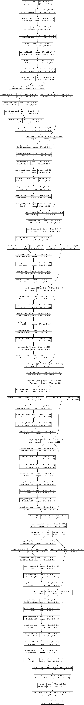
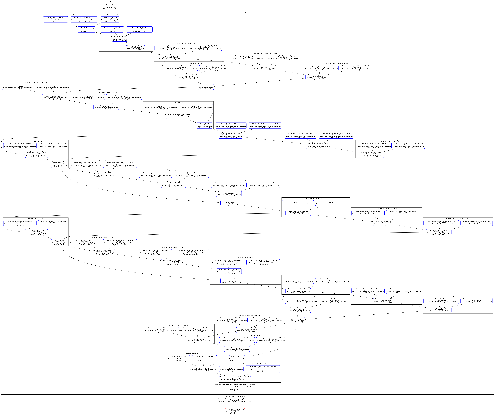
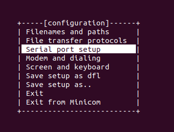
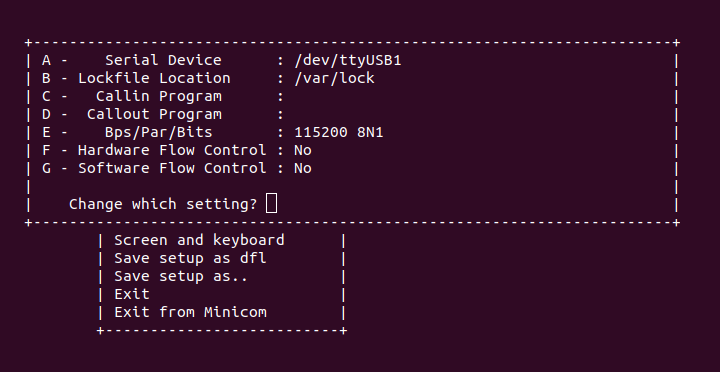
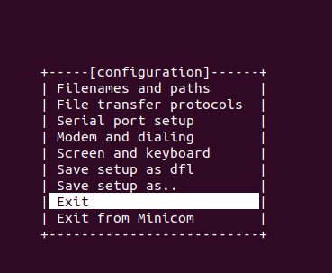
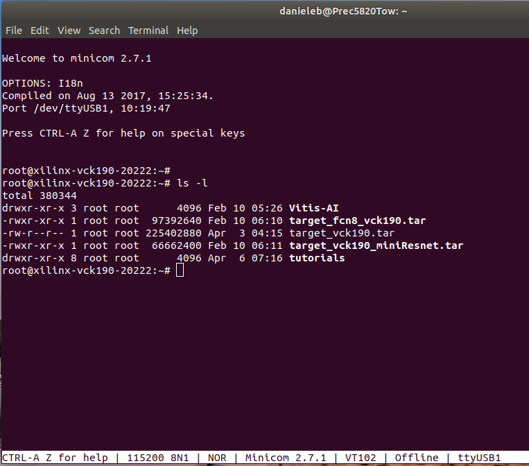

<!--

Copyright © 2023 Advanced Micro Devices, Inc. All rights reserved.
SPDX-License-Identifier: MIT

Author: Daniele Bagni, AMD/Xilinx Inc

-->


<table class="sphinxhide" width="100%">
 <tr width="100%">
    <td align="center"><h1>Vitis™ AI Tutorials</h1>
    </td>
 </tr>
</table>

#  Running ResNet18 CNN Through Vitis AI 3.5 Flow for ML


- Version:      Vitis AI 3.5 with TensorFlow 2.12.0

- Support:      ZCU102, ZCU102, VCK190, VEK280, Alveo V70

- Last update:  11 Aug 2023

## Table of Contents

[1 Introduction](#1-introduction)

[2 Prerequisites](#2-prerequisites)

[3 The Docker Tools Image](#3-the-docker-tools-image)

[4 CIFAR10 Dataset](#4-cifar10-dataset)

[5 ImageNet Dataset](#5-imagenet-dataset)

[Appendix](#appendix)

[License](#license)


## 1 Introduction

In this Deep Learning (DL) tutorial you will take a public domain Convolutional Neural Network (CNN) like [ResNet18](https://github.com/songrise/CNN_Keras/blob/main/src/ResNet-18.py), already trained
on the [ImageNet](https://www.image-net.org/) dataset, and run it through the [Vitis AI 3.5](https://github.com/Xilinx/Vitis-AI) stack to run DL inference on FPGA devices; you will use Keras on TensorFlow 2.12.0 (shortly TF2).

Assuming you have already trained your CNN and you own its original model, typically a [HDF5](https://www.hdfgroup.org/solutions/hdf5/) file with extension ``.h5``, you will deploy such CNN on the FPGA target boards by following these steps:

  1. (optional) Run the [Model Inspector](https://xilinx.github.io/Vitis-AI/3.5/html/docs/workflow-model-development.html?highlight=inspector#model-inspector) to check if the original model is compatible with the AMD [Deep Processor Unit (DPU)](https://xilinx.github.io/Vitis-AI/3.0/html/docs/workflow-system-integration.html)  architecture available on the target board (if not, you have to modify your CNN and retrain it).

  2. Run the [Model Quantization](https://xilinx.github.io/Vitis-AI/3.5/html/docs/workflow-model-development.html?highlight=quantizer#model-quantization) process to generate a 8-bit fixed point (shortly "int8") model from the original 32-bit floating point CNN. If you apply the so called *Post-Training Quantization* (PTQ), this will be a single step, otherwise you would need to re-train - or more properly said "fine-tune" - the CNN with the *Quantization-Aware-Training* (QAT).

  3. (optional) Run inference with the int8 model on the Vitis AI environment (running on the host desktop) to check the prediction accuracy: if the difference is not negligible (for example it is larger than 5%, you can re-do the quantization by replacing PTQ with QAT).  

  4. Run the [Model Compilation](https://xilinx.github.io/Vitis-AI/3.5/html/docs/workflow-model-development.html?highlight=quantizer#model-compilation) process  on the int8 model to generate the ``.xmodel`` microcode for the DPU IP soft-core of your target board.

  5. Compile the application running on the ARM CPU - tightly coupled with the DPU - of the target board, by using either C++ or Python code with the [Vitis AI RunTime (VART)](https://xilinx.github.io/Vitis-AI/3.5/html/docs/workflow-model-deployment.html#vitis-ai-runtime) APIs.  

Based on that you will be able to measure the inference performance both in terms of average prediction accuracy and frames-per-second (fps) throughput on your target board.


As a first example, in section [CIFAR10 Dataset](#4-cifar10-dataset) you will re-train the ResNet18 CNN with the [CIFAR10](https://www.cs.toronto.edu/~kriz/cifar.html) dataset, which contains small RGB images (32x32x3 size) with only 10 classes.

As a second example, in section [ImageNet Dataset](#5-imagenet-dataset)  you will use the ResNet18 CNN as it is, in order to classify the objects from the ImageNet dataset with its own 1000 classes; you will also compare its prediction accuracy vs. its parent ResNet50 CNN taken from the [Vitis AI Model Zoo](https://xilinx.github.io/Vitis-AI/3.5/html/docs/workflow-model-zoo.html).


## 2 Prerequisites

Here is what you need to have and do before starting with the real content of this tutorial.

- Familiarity with DL principles.

- Accurate reading of this [README.md](README.md) file from the top to the bottom, before running any script.

- Host computer with Ubuntu >= 18.04.5 (and possibly with GPU support to run the CNN training).

- Clone the entire repository of [Vitis AI 3.5](https://github.com/Xilinx/Vitis-AI) stack from [www.github.com/Xilinx](https://www.github.com/Xilinx) web site.

-  Accurate reading of [Vitis AI 3.5 User Guide 1414](https://docs.xilinx.com/r/en-US/ug1414-vitis-ai) (shortly UG1414).

- Accurate reading of [Vitis AI 3.5 Online Documentation](https://xilinx.github.io/Vitis-AI/3.5/html/index.html). In particular, pay attention to the installation and setup instructions for both host PC and target board, it is recommended you build a GPU-based docker image with TF2.

- An AMD target board such as either:
    - the Zynq® UltraScale+™ MPSoC [ZCU102](https://www.xilinx.com/products/boards-and-kits/ek-u1-zcu102-g.html), or
    - the Zynq® UltraScale+™ MPSoC [ZCU104](https://www.xilinx.com/products/boards-and-kits/ek-u1-zcu104-g.html), or
    - the Versal AI Core series [VCK190](https://www.xilinx.com/products/boards-and-kits/vck190.html), or
    - the Versal AI Edge series [VEK280](https://www.xilinx.com/products/boards-and-kits/vek280.html), or
    - the [Alveo V70 AI Accelerator](https://www.xilinx.com/applications/data-center/v70.html).

- The validation dataset archive with 50000 images named ``ILSVRC2012_img_val.tar`` as explained in Section [5 ImageNet Dataset](#5-imagenet-dataset).

- The [Model Zoo](https://github.com/Xilinx/Vitis-AI/tree/master/model_zoo) archive ``tf2_resnet50_3.5.zip`` of size 190473468 bytes. as explained in Section [5.2.1  Get ResNet50 from Vitis AI Model Zoo](#521-get-resnet50-from-vitis-ai-model-zoo).


### 2.1 Working Directory

In the following of this document it is assumed you have installed Vitis AI 3.5 (shortly ``VAI3.5``) somewhere in your file system and this will be your working directory ``${WRK_DIR}``, for example ``export WRK_DIR=/media/danieleb/DATA/VAI3.5``.  You have also created a folder named ``tutorials`` under such ``${WRK_DIR}`` and you have copied this tutorial there and renamed it ``RESNET18``. Using the command ``tree -d -L 2`` you should see the following directories:

```text
${WRK_DIR} # your Vitis AI 3.5 working directory
.
├── bck
├── board_setup
│   ├── v70
│   └── vek280
├── demos
├── docker
│   ├── common
│   ├── conda
│   └── dockerfiles
├── docs
│   ├── docs
│   ├── _downloads
│   ├── doxygen
│   ├── _images
│   ├── _sources
│   └── _static
├── docsrc
│   ├── build
│   └── source
├── dpu
├── examples
│   ├── custom_operator
│   ├── ofa
│   ├── OnBoard
│   ├── vai_library
│   ├── vai_optimizer
│   ├── vai_profiler
│   ├── vai_quantizer
│   ├── vai_runtime
│   ├── waa
│   └── wego
├── model_zoo
│   ├── images
│   └── model-list
├── src
│   ├── AKS
│   ├── vai_library
│   ├── vai_optimizer
│   ├── vai_petalinux_recipes
│   ├── vai_quantizer
│   └── vai_runtime
├── third_party
│   ├── tflite
│   └── tvm
└── tutorials # created by you
    ├── RESNET18
    ├── TF2-Vitis-AI-Optimizer
```

### 2.2 Dos-to-Unix Conversion

In case you might get some strange errors during the execution of the scripts, you have to process -just once- all the``*.sh`` shell and the python ``*.py`` scripts with the [dos2unix](http://archive.ubuntu.com/ubuntu/pool/universe/d/dos2unix/dos2unix_6.0.4.orig.tar.gz) utility.
In that case run the following commands from your Ubuntu host PC (out of the Vitis AI docker images):

```
sudo apt-get install dos2unix
cd ${WRK_DIR}/tutorials/RESNET18 #your repo directory
for file in $(find . -name "*.sh"); do
  dos2unix ${file}
done
for file in $(find . -name "*.py"); do
  dos2unix ${file}
done
for file in $(find . -name "*.c*"); do
  dos2unix ${file}
done
for file in $(find . -name "*.h*"); do
  dos2unix ${file}
done
```

These operations are already included in the script [clean_all.sh](files/scripts/clean_all.sh), launched by the [run_all.sh](files/run_all.sh) script, which collects all the commands shown in the rest of this document.

It is strongly recommended that you familiarize with the [run_all.sh](files/run_all.sh) script in order to understand all what it does, ultimately the entire Vitis AI flow on the host computer.


## 3 The Docker Tools Image

You have to know few things about [Docker](https://docs.docker.com/) in order to run the Vitis AI smoothly on your host PC environment.

### 3.1 Build the Image

From the Vitis AI 3.5 repository, run the following commands:

```
cd ${WRK_DIR}
cd docker
./docker_build.sh -t gpu -f tf2
```

Once the process is finished, with the command ``docker images`` you should see something like this:

```
REPOSITORY                      TAG                 IMAGE ID     CREATED     SIZE
xilinx/vitis-ai-tensorflow2-gpu 3.5.0.001-b56bcce50 3c5d174a1807 11-days-ago 14.4GB
```

### 3.2 Launch the Docker Image

To launch the docker container with Vitis AI tools, execute the following commands from the ``${WRK_DIR}`` folder:

```
cd ${WRK_DIR} # you are now in Vitis_AI subfolder

./docker_run.sh xilinx/vitis-ai-tensorflow2-gpu:3.5.0.001-b56bcce50

conda activate vitis-ai-tensorflow2

cd /workspace/tutorials/

cd RESNET18 # your current directory
```

Note that the container maps the shared folder ``/workspace`` with the file system of the Host PC from where you launch the above command.
This shared folder enables you to transfer files from the Host PC to the docker container and vice versa.

The docker container does not have any graphic editor, so it is recommended that you work with two terminals and you point to the same folder, in one terminal you use the docker container commands and in the other terminal you open any graphic editor you like.

If you need to add some further package, for example in this case I added:
```text
pip install image-classifiers
```

then remember to permanently save the modified docker image from a different terminal (a second one, besides the first one in which you are running the docker image),
by launching the following commands:

```
docker images

sudo docker ps -l

sudo docker commit -m"latest" d9f942cdf7de   \
     xilinx/vitis-ai-tensorflow2-gpu:latest

docker images
```

you should see something like this:

```
$ docker images
REPOSITORY                        TAG                  IMAGE ID       CREATED        SIZE
xilinx/vitis-ai-tensorflow2-gpu   3.5.0.001-b56bcce50  3c5d174a1807   11 days ago    14.4GB
xiinx/vitis-ai-gpu-tf2-base       latest               90d22054e565   3 weeks ago    6.43GB

$ sudo docker ps -l
[sudo] password for danieleb:
CONTAINER ID   IMAGE                                                 COMMAND                  CREATED          
d9f942cdf7de   xilinx/vitis-ai-tensorflow2-gpu:3.5.0.001-b56bcce50   "/opt/nvidia/nvidia_…"   43 minutes ago                

$ sudo docker commit -m"latest" d9f942cdf7de   xilinx/vitis-ai-tensorflow2-gpu:latest
sha256:d7af2c3ac4fb131054f9e326015d3572ceea1ec074caea0d50274ecfd76a3688

$ docker images
REPOSITORY                        TAG                                 IMAGE ID       CREATED          SIZE
xilinx/vitis-ai-tensorflow2-gpu   latest                              d7af2c3ac4fb   47 seconds ago   22.3GB
xilinx/vitis-ai-tensorflow2-gpu   3.5.0.001-b56bcce50                 3c5d174a1807   11 days ago      14.4GB
xiinx/vitis-ai-gpu-tf2-base       latest                              90d22054e565   3 weeks ago      6.43GB
```

### 3.3 Things to Know

1. In case you "[Cannot connect to the Docker daemon at unix:/var/d9f942cdf7de   xilinx/vitis-ai-tensorflow2-gpu:3.5.0.001-b56bcce50 run/docker.sock. Is the docker daemon running?](https://stackoverflow.com/questions/44678725/cannot-connect-to-the-docker-daemon-at-unix-var-run-docker-sock-is-the-docker)" just launch the following command:

  ```
  sudo systemctl restart docker
  ```

2. Note that docker does not have an automatic garbage collection system as of now. You can use this command to do a manual garbage collection:

  ```
  docker rmi -f $(docker images -f "dangling=true" -q)
  ```

3. In order to clean the (usually huge amount of) space consumed by Docker have a look at this post: [Docker Overlay2 Cleanup](https://bobcares.com/blog/docker-overlay2-cleanup/). The next commands are of great effect (especially the last one):

  ```
  docker system df
  docker image prune --all
  docker system prune --all
  ```


## 4 CIFAR10 Dataset

In this section you will use the ResNet18 CNN on the
[CIFAR10](https://www.cs.toronto.edu/~kriz/cifar.html) dataset, which is composed of 10 classes of objects to be classified. It contains 60000 labeled RGB images that are 32x32 in size. This dataset was developed for the paper [Learning Multiple Layers of Features from Tiny Images](https://www.cs.toronto.edu/~kriz/learning-features-2009-TR.pdf).


### 4.1 Train ResNet18 CNN on CIFAR10

The process of training is launched via the [run_all.sh](files/run_all.sh) script with the commands (they are all included in the subroutine ``main_cifar10()`` of the same script):

```
cd /workspace/tutorials/RESNET18/files # your current directory
source run_all.sh run_clean_dos2unix
source run_all.sh cifar10_dataset
source run_all.sh run_cifar10_training
```

#### 4.1.1 Prepare the data folders


As DL deals with image data, you have to organize your data in appropriate folders and apply some pre-processing to transform the images into data for the CNN. The subroutine ``cifar10_dataset()`` from [run_all.sh](files/run_all.sh) file calls other python scripts to create the sub-folders ``train``, ``valid``, ``test``, and ``calib`` that are located in the ``build/dataset/cifar10`` directory and to fill them with 50000 images for training, 5000 images for validation, 5000 images for testing (taken from the 10000 images of the original test dataset) and 1000 images for the calibration process (copied from the images used during the training).

#### 4.1.2 Preprocess the data

Typically, the CIFAR10 data are processed, using the following Python code, to normalize it from -1 to 1. Such code has to be mirrored in the C++ application that runs in the ARM&reg; CPU of the target board.

```
# scale data to the range of [0, 1]
x_train = x_train.astype("float32") / 255.0
x_test  = x_test.astype("float32")  / 255.0
# normalize between -1 and +1
x_train = x_train -0.5
x_train = x_train *2
x_test  = x_test  -0.5
x_test  = x_test  *2
```

#### 4.1.3 Training

There are two scripts that can be chosen alternatively for training ResNet18 on the CIFAR10 dataset: [train1_resnet18_cifar10.py](files/code/train1_resnet18_cifar10.py) and
[train2_resnet18_cifar10.py](files/code/train2_resnet18_cifar10.py); the first works on files of images stored into the hard disk, the second works on data loaded into the main memory of the host desktop computer. They are alternative to each other and the user can select just one.

In both cases the CNN is taken from the [Colab Classifiers](https://github.com/qubvel/classification_models.git), pre-trained on the ImageNet dataset; furthermore two new layers are added to the last ``Dense``  layer (with 1000 classes) of the original CNN: respectively a ``GlobalAveragePooling2D`` and another ``Dense`` layer (this one with 10 classes), as shown in the following python code fragment:

```
...
from classification_models.keras import Classifiers
ResNet18, preprocess_input = Classifiers.get("resnet18")
base_model = ResNet18(input_shape=(32,32,3), weights="imagenet", include_top=False)
...
x = keras.layers.GlobalAveragePooling2D()(base_model.output)
output = keras.layers.Dense(n_classes, activation="softmax")(x)
model = keras.models.Model(inputs=[base_model.input], outputs=[output])
...
```

Figure 1 shows the block diagram of the "new" ResNet18 trained on the CIFAR10 dataset.
The floating point models of the trained CNN are stored into the folder ``./build/float``.


>**:pushpin: NOTE** The ``subclassing`` code shown in [ResNet-18](https://github.com/songrise/CNN_Keras/blob/main/src/ResNet-18.py) file is not supported by the Vitis AI tools: only ``sequential`` and ``funcional`` CNN models are supported.




*Figure 1: ResNet18 CNN trained on CIFAR10 dataset*


### 4.2 Vitis AI Flow on the CNN Model

The [run_all.sh](files/run_all.sh) script contains all the commands illustrated in the next subsections.
The entire Vitis AI flow can be launched with the command:

```
cd /workspace/tutorials/RESNET18/files # your current directory
source run_all.sh quantize_resnet18_cifar10
source run_all.sh compile_resnet18_cifar10
source run_all.sh prepare_archives
```


#### 4.2.1 Model Inspection


The first thing to do is [inspecting the floating-point CNN model](https://docs.xilinx.com/r/en-US/ug1414-vitis-ai/Inspecting-the-Float-Model).

Vitis AI Inspector is an experimental new feature to inspect a floating-point model and show partition
results for a given DPU target architecture, together with some indications on why the layers might not be mapped to the DPU.

Being experimental, you can expect any possible behavior, good or bad it might be.
But if you pass it, at least you have a good chance to be able to deploy your CNN entirely on the DPU, which is certainly the optimal solution.

Here is a fragment of python code, taken from [inspect_resnet18_cifar10.py](files/code/inspect_resnet18_cifar10.py) file:

```
from tensorflow_model_optimization.quantization.keras import vitis_inspect
inspector = vitis_inspect.VitisInspector(target="/opt/vitis_ai/compiler/arch/DPUCZDX8G/ZCU102/arch.json")
inspector.inspect_model(model,
                       input_shape=[1,  1000, 32, 32],
                       plot=True,
                       plot_file="float_model.svg",
                       dump_results=True,
                       dump_results_file="inspect_results.txt",
                       verbose=2)
```

If all the layers are supported and they can so successfully mapped to the DPU, you should see something similar to these last lines:

```
[SUMMARY INFO]:
- [Target Name]: DPUCZDX8G_ISA1_B4096
- [Total Layers]: 88
- [Layer Types]: InputLayer(1) BatchNormalization(19) ZeroPadding2D(18) Conv2D<linear>(21) Activation<relu>(18) MaxPooling2D(1) Add(8) GlobalAveragePooling2D(1) Dense<softmax>(1)
- [Partition Results]: INPUT(1) DPU(86) DPU+CPU(1)
```


#### 4.2.2 Quantizing the Modified Model to int8

The quantization process is reported into [vai_q_resnet18_cifar10.py](files/code/vai_q_resnet18_cifar10.py) python script, launched from within the ``quantize_resnet18_cifar10()`` subroutine of
[run_all.sh](files/run_all.sh) script.

The generated int8 quantized model is placed in ``build/quantized/`` folder and must have extension ``.h5`` (which stays for [HDF5](https://www.hdfgroup.org/solutions/hdf5/) format).


#### 4.2.3 Compiling the Quantized Model for your Target DPU

Once the CNN has been correctly quantized in int8 format, you can compile it for the DPU architecture of your target boards,
in our case, respectively ``DPUCZDX8G`` for ``ZCU102`` and ``DPUCVDX8G`` for ``VCK190``, and so on for other boards.

Once the compilation process (see scripts [run_all.sh](files/run_all.sh) and [run_compile.sh](files/scripts/run_compile.sh) end, you should see something like this (related to ZCU102 only, for sake of conciseness):

```
[UNILOG][INFO] Target architecture: DPUCZDX8G_ISA1_B4096
[UNILOG][INFO] Graph name: model_1, with op num: 229
[UNILOG][INFO] Total device subgraph number 3, DPU subgraph number 1
[UNILOG][INFO] Compile done.
[UNILOG][INFO] The compiled xmodel is saved to "/workspace/tutorials/RESNET18/files/./build/compiled_zcu102/zcu102_q_train1_resnet18_cifar10_final.h5.xmodel"
```

The DPU code has been created into the ``build/target_zcu102/cifar10/train2_resnet18_cifar10.xmodel``
binary file and it contains only three subgraphs,
which is the sign that everything was fine: one subgraph for the input, another for the DPU, and the last one for the output.

As illustrated in Figure 2, you can visualize those three subgraphs with the [graph analysis](files/scripts/analyze_subgraphs.sh) script, called by the routine ``analyze_graphs()``  from the [run_all.sh](files/run_all.sh) script.




*Figure 2: Modified CNN model partitioned in three subgraphs by Vitis AI Compiler*

### 4.3 Run on the Target Board

You can use either [VART](https://github.com/Xilinx/Vitis-AI/tree/master/examples/vai_runtime) APIs written in Python or in C++.
The first option is maybe more useful for functional debugging with [Visual Studio Code](https://code.visualstudio.com/download) but gets less performance being interpreted.
The second option gets higher performance, being compiled, but it maybe less easy to be debugged.

The throughput measured in fps is shown only for the VEK280 board, just as a reference. For the other boards the results can be pretty different depending on the different DPU architectures and related batch size (BS).

All the commands illustrated in the following subsections are inside the script [run_all_cifar10_target.sh](files/target/cifar10/code/run_all_cifar10_target.sh), they are applied directly in the target board ``xxxyyy``
(i.e. zcu102, vck190, v70, vek280, etc) by launching the command ``run_all_target.sh xxxyyy``, which involves  the [run_all_target.sh](files/target/run_all_target.sh) higher level script.


#### 4.3.1 Multithreading C++ Application Code

The C++ code for image classification [main_int8.cc](files/target/cifar10/code/src/main_int8.cc) is independent of the CNN type, thanks to the abstraction done by the VART APIs; it was derived from the [Vitis AI ResNet50 VART demo](https://github.com/Xilinx/Vitis-AI/blob/master/examples/vai_runtime/resnet50/src/main.cc).

It is very important that the C++ code for pre-processing the images executes the same operations that you applied in the Python code of the training procedure. This is illustrated in the following C++ code fragments:

```
/*image pre-process*/
Mat image2 = cv::Mat(inHeight, inWidth, CV_8SC3);
resize(image, image2, Size(inHeight, inWidth), 0, 0, INTER_NEAREST);
for (int h = 0; h < inHeight; h++) {
  for (int w = 0; w < inWidth; w++) {
    for (int c = 0; c < 3; c++) {
      imageInputs[i * inSize + h * inWidth * 3 + w * 3 + c] = (int8_t)( (image2.at<Vec3b>(h, w)[c])/255.0f - 0.5f)*2) * input_scale ); //if you use BGR
    //imageInputs[i * inSize + h * inWidth * 3 + w * 3 +2-c] = (int8_t)( (image2.at<Vec3b>(h, w)[c])/255.0f - 0.5f)*2) * input_scale ); //if you use RGB
    }
  }
}
```

Note that the DPU API apply [OpenCV](https://opencv.org/) functions to read an image file (either ``png`` or ``jpg`` or whatever format) therefore the images are seen as BGR and not as native RGB. All the training and inference steps done in this tutorial treat images as BGR, which is true also for the above C++ normalization routine.


>**:pushpin: NOTE** Be aware that if there was a mismatch in the preprocessing done during the training process and the preprocessing done during the inference process the you would get incorrect predictions. In this context "mismatch" means different operations (for example different ways of normalizing data).


#### 4.3.2 Run-Time Execution

It is possible and straight-forward to compile the application directly on the target (besides compiling it into the host computer environment).
In fact this is what the script [run_all_cifar10_target.sh](files/target/cifar10/run_all_cifar10_target.sh)  does, when launched on the target.  

Turn on your target board and establish a serial communication with a ``putty`` terminal from Ubuntu or with a ``TeraTerm`` terminal from your Windows host PC.

Ensure that you have an Ethernet point-to-point cable connection with the correct IP addresses to enable ``ssh`` communication in order to quickly transfer files to the target board with ``scp`` from Ubuntu or ``pscp.exe`` from Windows host PC. For example, you can set the IP addresses of the target board to be ``192.168.1.217`` while the host PC is  ``192.168.1.140``.

Once a ``tar`` file of the ``build/target_zcu102`` (or ``build/target_vck190``, etc) folder has been created, copy it from the host PC to the target board. For example, in case of an Ubuntu PC, use the following command:
```
scp target_zcu102.tar root@192.168.1.217:~/
```

From the target board terminal, run the following commands (in case of VEK280):
```
tar -xvf target_vek280.tar
cd target_vek280
bash -x ./cifar10/run_all_cifar10_target.sh vek280
```

With this command, the ``cifar10_test.tar`` archive with the 5000 test images will be uncompressed.

The application based on VART C++ APIs is built with the [build_app.sh](files/target_cifar10/code/build_app.sh) script and finally launched for each CNN, the effective top-5 classification accuracy is checked by a python script [check_runtime_top5_cifar10.py](files/target_cifar10/code/src/check_runtime_top5_cifar10.py) which is launched from within
the [cifar10_performance.sh](files/target/cifar10/cifar10_performance.sh) script.


#### 4.3.3 Performance

On the VEK2800 board, the purely DPU performance (not counting the CPU tasks) measured in fps is:

- ~11011 fps with 1 thread,  

- ~17828 fps with 3 threads.

The top-1 and top-5 average prediction accuracy measured at run time are:

```
./rpt/predictions_cifar10_resnet18.log  has  35008  lines
number of total images predicted  4999
number of top1 false predictions  761
number of top1 right predictions  4238
number of top5 false predictions  42
number of top5 right predictions  4957
top-1 accuracy = 0.85
top-5 accuracy = 0.99
```


## 5 ImageNet Dataset

The [ImageNet](http://www.image-net.org/) dataset is very sophisticated in comparison with [CIFAR10](https://www.cs.toronto.edu/~kriz/cifar.html)  and it requires proper python scripts to run inference. To get practice with CNNs using the ImageNet dataset you will  start with ResNet50, then you will adapt its python code to the ResNet18 case.

For your information, an academic torrent can be used to download the whole [ImageNet](http://www.image-net.org/) since direct downloads are not supported any longer (note that you need a couple hundred GB of free disk space in order to do this); a few examples of such torrents are:
- https://academictorrents.com/collection/imagenet-2012
- https://academictorrents.com/collection/imagenet
- http://academictorrents.com/details/564a77c1e1119da199ff32622a1609431b9f1c47

The [run_all.sh](files/run_all.sh) script contains all the commands illustrated in the next subsections, with command ``source run_all main_imagenet`` (using the subroutine ``main_imagenet()`` from the same script).

Before running that script you have to generate the ``val_dataset.zip`` archive with 500 images (the last ones of the original 50000 dataset) resized to have one of their dimensions equal to 256, as explained in the following subsection 5.1.

### 5.1 Prepare the Test Images

#### 5.1.1 Download the ImageNet Validation Dataset

Since you do not need to re-train your CNN and you just want to make predictions (inference) with, you can download only the **ImageNet validation dataset**, named ``ILSVRC2012_img_val.tar``, from either [ImageNet 2012](http://academictorrents.com/collection/imagenet-2012) or [Download ImageNet Data](http://www.image-net.org/download.php) web sites.

The file [imagenet1000_clsidx_to_labels.txt](https://gist.github.com/yrevar/942d3a0ac09ec9e5eb3a) contains the objects that compose the 1000 classes of ImageNet dataset: the index class is the left column (from 0 to 999) and the class name is the right column string:

| Class index | Class name |
| :---: | --- |
| 0     |  'tench, Tinca tinca'            |
| 1     |  'goldfish, Carassius auratus'   |
| 2     |  'great white shark, white shark, man-eater, man-eating shark, Carcharodon carcharias' |
| . . .          | . . . |


#### 5.1.2 The "short val.txt" File

You need the [short val.txt](files/ImageNet/val.txt) file to map the validation images into the corresponding classes with a number. Again, for your comfort it is placed already in this repository just for the 500 images used in the test. Note that the ``original val.txt`` file lists 50000 images with their file name and class index.

Furthermore, for the ImageNet dataset, the name of the object related to the class  of [short val.txt](files/modelzoo/ImageNet/val.txt)  can be found in another file named [words.txt](files/modelzoo/ImageNet/words.txt);
in fact those two files can be considered a simplification of the information that can be found in the ``imagenet_class_index.json`` - available in the ``modelzoo/tf2_resnet50_3.5`` folder - which is related to the training dataset.

For example the ``goldfish`` class which appears in line 2 of [words.txt](files/modelzoo/ImageNet/words.txt) is coded as ``1`` in the second record  ``"1": ["n01443537", "goldfish"]``   of  ``imagenet_class_index.json`` and it appears at line 85 of [short val.txt](files/modelzoo/ImageNet/val.txt) file, regarding the image ``ILSVRC2012_val_00049585.JPEG``.

The code in [imagenet_config.py](files/code/config/imagenet_config.py) therefore creates a list  ``class_list`` where such class ``goldfish`` has class index ``1`` stored in the ``index_list`` which is indeed the second line of [words.txt](files/modelzoo/ImageNet/words.txt) file:

| Class name | Class index |
| :---: | --- |
| tench             |  0 |
| goldfish          |  1 |
| great white shark |  2 |
| tiger shark       |  3 |
| hammerhead        |  4 |
| . . .          | . . . |
| bolete            | 997|
| ear               | 997|
| toilet tissue     | 999|


Note that [imagenet_config.py](files/code/config/imagenet_config.py) also creates a dictionary ``labelNames_dict`` where such the ``goldfish`` image image ``ILSVRC2012_val_00049585.JPEG`` has indeed a class index of ``1`` :

| Class name | Class index |
| :---: | --- |
| . . .                   | . . . |
| ILSVRC2012_val_00049585 | 1     |
| . . .                   | . . . |


This way to encode the ImageNet classes is applied consistently in this tutorial by all the python scripts that evaluate the top-1 and top-5 average prediction accuracy of the CNN.

If you wish to download the ImageNet ``original val.txt`` file for all the 50000 images of the validation dataset, you have to execute the following commands (be careful not to overwrite the [short val.txt](files/ImageNet/val.txt) file of this repository):

```
mkdir tmp
cd tmp
wget -c http://dl.caffe.berkeleyvision.org/caffe_ilsvrc12.tar.gz
tar -xvf caffe_ilsvrc12.tar.gz
mv val.txt ..
cd ..
rm -r tmp
```

The file ``words.txt`` was generated with the following fragment of python code applied to the ``imagenet_class_index.json`` file:

```
def gen_dict(name2class_file):
    fr = open(name2class_file, 'r')
    class2name_dict = json.load(fr)
    print(class2name_dict)
    for k in range(1000):
        print(class2name_dict[str(k)][1])
    print(class2name_dict.values())
    print(class2name_dict.keys())
    name2class_dict = {}
    for key in class2name_dict.keys():
        name2class_dict[class2name_dict[key][0]] = key

    return name2class_dict
```

Alternatively, you can find the ``words.txt`` file in the [ResNet50 VART example](https://github.com/Xilinx/Vitis-AI/blob/master/examples/vai_runtime/resnet50) or in the [imagenet1000_clsidx_to_labels.txt](https://gist.github.com/yrevar/942d3a0ac09ec9e5eb3a) file.


#### 5.1.3 Generate the Test Images Archive

Having both original files, the (~6.7GB) ``ILSVRC2012_img_val.tar`` archive and the [short val.txt](files/ImageNet/val.txt) with the list of the last 500 images (from the 50000) and their class number, you can now create a smaller archive, ``val_dataset.zip``.

Here are the commands that you have to launch from within the docker image (they are already part of the ``prepare_imagenet_test_images()`` subroutine from the [run_all.sh](files/run_all.sh) script), see the self explaining comments:

```
# enter in the docker image
#cd ${WRK_DIR} # you are now in Vitis_AI subfolder
#./docker_run.sh xilinx/vitis-ai-tensorflow2-gpu:3.5.0.001-b56bcce50
#conda activate vitis-ai-tensorflow2
#cd /workspace/tutorials/

# starting directory
cd /workspace/tutorials/RESNET18/files/
cd modelzoo/ImageNet/ # your current directory
# the ILSVRC2012_img_val.tar is supposed to be already here, after your download

# make a temporary directory one level below
mkdir val_dataset
mv ILSVRC2012_img_val.tar ./val_dataset/
# expand the archive
cd val_dataset
tar -xvf ILSVRC2012_img_val.tar > /dev/null
# move back the archive one level above
mv ILSVRC2012_img_val.tar ../
cd ..
# check all the 50000 images are in val_dataset folder
ls -l ./val_dataset | wc
```

You should see the following text:

```
$ ls -l ./val_dataset | wc
  50001  450002 4050014
```

Now run the [imagenet_val_dataset.py](files/modelzoo/imagenet_val_dataset) script:

```
python3 imagenet_val_dataset.py
```

You should see the following text:
```
val_dataset.zip archive is ready with  500 images
```

Now copy that archive to the ``target/imagenet`` folder:

```
cp -i val_dataset.zip ../../target/imagenet
```

You are ready to work with both ResNet50 and ResNet18 CNNs.
If you are not interested into experimenting ResNet50, you can skip Section [5.2 ResNet50](#52-resnet50) and jump directly to the next Section [5.3 ResNet18](#53-resnet18).


### 5.2 ResNet50


#### 5.2.1  Get ResNet50 from Vitis AI Model Zoo

You have to download the ``tf2_resnet50_3.5.zip`` archive of ResNet50 model  reported in [model.yaml](https://github.com/Xilinx/Vitis-AI/blob/master/model_zoo/model-list/tf2_resnet50_3.5/model.yaml) file.
As the file name says, such CNN has been trained with [ImageNet](http://www.image-net.org/) dataset with RGB images of input size 224x224 and it requires a computation of 7.76 GOPs per image.

Put the ``tf2_resnet50_3.5.zip`` archive in the [modelzoo](files/modelzoo) folder and unzip it there to generate the new folder
``modelzoo/tf2_resnet50_3.5``.

Note that the original ResNet50 trained on the ImageNet dataset has the following parameters:
```
Total params:         25,636,712
Trainable params:     25,583,592
Non-trainable params:     53,120
```

#### 5.2.2 Evaluate Original and Quantized Models

The python script [eval_resnet50.py](files/code/eval_resnet50.py)
does the following actions:

1. it loads the original 32-bit floating point model from ``tensorflow.keras.applications``, note that such model is exactly the same which is already available inside the Vitis AI Model Zoo;

2. with such model, it evaluates the top1 and top5 average prediction accuracy on the 500 images available in the ``val_dataset.zip`` archive;

3. it quantizes the CNN into int8 fixed point and saves it in ``.h5``  format; again  such quantized model is exactly the same which is available inside the Vitis AI Model Zoo;

4. with such quantized model it evaluates the top1 and top5 average prediction accuracy on the same 500 images.

You have to execute the following commands directly from the Vitis AI docker tools image:

```
cd /workspace/tutorials/RESNET18/files
cd modelzoo/ImageNet
unzip val_dataset.zip
cd ../..
bash ./run_all.sh quantize_resnet50_imagenet
```

Note that the prediction accuracy is quite sensible to the image preprocessing, which is a cascade of aspect ratio preserving resize followed by image cropping (see file [eval_resnet50.py](files/code/eval_resnet50.py)), as shown in the following fragment:

```
img2 = cv2.imread(filename)
#B, G, R = cv2.split(img2)     #resnet18
#img = cv2.merge([R, G, B])    #resnet18
img = img2                     #resnet50
height, width = img.shape[0], img.shape[1]
img = img.astype(float)

# aspect_preserving_resize
smaller_dim = np.min([height, width])
_RESIZE_MIN = 256
scale_ratio = _RESIZE_MIN*1.0 / (smaller_dim*1.0)
new_height = int(height * scale_ratio)
new_width = int(width * scale_ratio)
resized_img = cv2.resize(img, (new_width, new_height), interpolation = cv2.INTER_LINEAR )
#resized_img = img

# central_crop
crop_height = 224
crop_width = 224
amount_to_be_cropped_h = (new_height - crop_height)
crop_top = amount_to_be_cropped_h // 2
amount_to_be_cropped_w = (new_width - crop_width)
crop_left = amount_to_be_cropped_w // 2
cropped_img = resized_img[crop_top:crop_top+crop_height, crop_left:crop_left+crop_width, :]

# sub mean
#_R_MEAN =     0 #resnet18
#_G_MEAN =     0 #resnet18
#_B_MEAN =     0 #resnet18
_R_MEAN = 123.68 #resnet50
_G_MEAN = 116.78 #resnet50
_B_MEAN = 103.94 #resnet50
_CHANNEL_MEANS = [_B_MEAN, _G_MEAN, _R_MEAN]
means = np.expand_dims(np.expand_dims(_CHANNEL_MEANS, 0), 0)
meaned_img = cropped_img - means
```

A possible, brutal, alternative is just rescaling the image without any cropping and aspect ratio preserving and related cropping, as shown in the following fragment of code:

```
img2 = cv2.imread(filename)
#B, G, R = cv2.split(img2)     #resnet18
#img = cv2.merge([R, G, B])    #resnet18
img = img2                     #resnet50

# rescale without preseving teh aspect ratio and with no crop
cropped_img = cv2.resize(img, (224, 224), interpolation = cv2.INTER_CUBIC)

# sub mean
#_R_MEAN =     0 #resnet18
#_G_MEAN =     0 #resnet18
#_B_MEAN =     0 #resnet18
_R_MEAN = 123.68 #resnet50
_G_MEAN = 116.78 #resnet50
_B_MEAN = 103.94 #resnet50
_CHANNEL_MEANS = [_B_MEAN, _G_MEAN, _R_MEAN]
means = np.expand_dims(np.expand_dims(_CHANNEL_MEANS, 0), 0)
meaned_img = cropped_img - means
```

From one hand, with the "original" preprocessing code  you should see something like this:

- original 32-bit floating point model

  ```
  Original  ResNet50 top1, top5:  0.750, 0.924
  ```
- quantized int8 model:

  ```
  Quantized ResNet50 top1, top5:  0.744, 0.920
  ```

On the other hand, with the "brutal" preprocessing code  you should see something like this:

- original 32-bit floating point model

  ```
  Original  ResNet50 top1, top5:  0.698, 0.908
  ```
- quantized int8 model:

  ```
  Quantized ResNet50 top1, top5:  0.689, 0.905
  ```

This is indeed quite a big difference, which highlights -once again- the importance of the right preprocessing.


### 5.3 ResNet18

Similarly to what done in the previous section 5.2.2, the python script [eval_resnet18.py](files/code/eval_resnet18.py) does the following actions:

1. it loads the original 32-bit floating point model from the [Colab Classifiers](https://github.com/qubvel/classification_models.git);

2. with such model, it evaluates the top1 and top5 average prediction accuracy on the 500 images available in the ``val_dataset.zip`` archive;

3. it quantizes the CNN into int8 fixed point and saves it in ``.h5``  format;

4. with such quantized model it evaluates the top1 and top5 average prediction accuracy on the same 500 images.

Note that the original ResNet18 trained on the ImageNet dataset has the following parameters:
```
Total params:         11,699,889
Trainable params:     11,691,947
Non-trainable params:      7,942
```

You have to execute the following commands directly from the Vitis AI docker tools image:

```bash
cd /workspace/tutorials/RESNET18/files
cd modelzoo/ImageNet
unzip val_dataset.zip
cd ../..
bash ./run_all.sh quantize_resnet18_imagenet
```

Similarly to what already done in the case of ResNet50 CNN, if you check the prediction accuracy of ResNet18 CNN with the original preprocessing code  you should see something like this:

- original 32-bit floating point model

  ```
  Original  ResNet18 top1, top5:  0.694, 0.902
  ```
- quantized int8 model

  ```
  Quantized ResNet18 top1, top5:  0.651, 0.873
  ```

On the other hand, with the "brutal" preprocessing code  you should see something like this:

- original 32-bit floating point model

  ```
  Original  ResNet18 top1, top5:  0.656, 0.882
  ```
- quantized int8 model

  ```
  Quantized ResNet18 top1, top5:  0.606, 0.859
  ```

Again, as in the case of ResNet50 CNN, you can see quite a big difference in the prediction accuracy, depending on the preprocessing method applied.


Furthermore, note that the pre-processing applied during the ResNet18 training is quite different from the one applied to train ResNet50:

1. the mean values are supposed to be ``0,0,0`` (ResNet18) instead of  ``123.68, 116.78, 103.94`` (ResNet50);

2. images are managed as RGB (ResNet18) and not as BGR (ResNet50).

You can easily verify this by looking at the code differences in the two files   [eval_resnet18.py](files/code/eval_resnet18.py) and
[eval_resnet50.py](files/code/eval_resnet50.py).


### 5.4 Run on the Target Board

The throughput measured in fps is shown only for the VEK280 board, just as a reference. For the other boards the results can be pretty different depending on the different DPU architectures and related batch size (BS).

All the commands illustrated in the following subsections are inside the script [run_all_imagenet_target.sh](files/target/imagenet/code/run_all_imagenet_target.sh), they are applied directly in the target board ``xxxyyy``
(i.e. zcu102, vck190, v70, vek280, etc) by launching the command ``run_all_target.sh xxxyyy``, which involves  the [run_all_target.sh](files/target/run_all_target.sh) higher level script.


#### 5.4.1 Multithreading C++ Application Code

The C++ code for image classification [main_resnet50.cc](files/target/imagenet/code_resnet50/src/main_resnet50.cc) can launch both ResNet18 and ResNet50 CNNs. The only difference is in the preprocessing and in the mean values, so the variable ``is_resnet50`` is used to check if ResNet50 (``is_resnet50==1``) or if ResNet18 (``is_resnet50==0``). Here is the C++ code fragment for pre-processing the images:

```c++
  float mean[3];
  if (is_resnet50==1)
  {
    // B G R format for ResNet50 CNN
    mean[0] = 104; mean[1] = 116.78; mean[2] = 123.68;
  }
  else //it is ResNet18 CNN
  {
    mean[0] = 0; mean[1] = 0; mean[2] = 0;
  }

  /*image pre-process*/
  Mat image2 = cv::Mat(inHeight, inWidth, CV_32FC3);
  resize(image, image2, Size(inHeight, inWidth),  interpolation=INTER_CUBIC);
  for (int h = 0; h < inHeight; h++)
  {
    for (int w = 0; w < inWidth; w++)
    {
      for (int c = 0; c < 3; c++)
      {
        int addr;
        if (is_resnet50==1) // resnet50 works in BGR format
          addr = c;
        else // resnet18 works in RGB format
          addr = 2-c;
        imageInputs[i*inSize + h*inWidth*3 + w*3 + addr] = (int8_t)((image2.at<Vec3b>(h, w)[c] - mean[c]) * input_scale);
        }
    }
  }
```

Note that the DPU API apply [OpenCV](https://opencv.org/) functions to read an image file (either ``png`` or ``jpg`` or whatever format) therefore the images are seen as BGR and not as native RGB. All the training and inference steps done in this tutorial treat images as BGR, which is true also for the above C++ normalization routine.


#### 5.4.2 Run-Time Execution

It is possible and straight-forward to compile the application directly on the target (besides compiling it into the host computer environment).
In fact this is what the script [run_all_imagenet_target.sh](files/target/imagenet/run_all_imagenet_target.sh)  does, when launched on the target.  

Turn on your target board and establish a serial communication with a ``putty`` terminal from Ubuntu or with a ``TeraTerm`` terminal from your Windows host PC.

Ensure that you have an Ethernet point-to-point cable connection with the correct IP addresses to enable ``ssh`` communication in order to quickly transfer files to the target board with ``scp`` from Ubuntu or ``pscp.exe`` from Windows host PC. For example, you can set the IP addresses of the target board to be ``192.168.1.217`` while the host PC is  ``192.168.1.140``.

Once a ``tar`` file of the ``build/target_zcu102`` (or ``build/target_vck190``) folder has been created, copy it from the host PC to the target board. For example, in case of an Ubuntu PC, use the following command:
```
scp target_zcu102.tar root@192.168.1.217:~/
```

From the target board terminal, run the following commands (in case of ZCU102):
```bash
tar -xvf target_zcu102.tar
cd target_zcu102
bash -x ./imagenet/run_all_imagenet_target.sh zcu102
```

With this command, the ``val_dataset.zip`` archive with the 500 test images will be uncompressed.

The application based on VART C++ APIs is built with the [build_resnet50.sh](files/target/imagenet/code_resnet50/build_resnet50.sh) script and finally launched for each CNN, the effective top-5 classification accuracy is checked by a python script [check_runtime_top1_imagenet.py](files/target/code/src/check_runtime_top1_imagenet.py) which is launched from within
the [imagenet_performance.sh](files/target/imagenet/imagenet_performance.sh) script.


#### 5.4.3 ResNet50 Performance

On the VEK280 board, the purely DPU performance (not counting the CPU tasks) measured in fps is:

- ~2997 fps with 1 thread,  

- ~4685 fps with 3 threads.

The top-1 average prediction accuracy measured at run time is:

```
./rpt/predictions_resnet50_imagenet.log  has  3510  lines
number of total images predicted  499
number of top1 false predictions  153
number of top1 right predictions  346
top1 accuracy = 0.690
```

The preprocessing applied in the C++ code top-1 accuracy is the "brutal" one, just applying the images resize without preserving the aspect ratio, as done in the training phase of the CNN algorithmic development.

The value of ``0.690`` is pretty closed to the ``0.698`` result we have got when evaluating the quantized model in the host Vitis AI environment; remember that by applying a better preprocessing in the C++ code you should achieve a result closed to ``0.750``.

Alternatively to changing the C++ code, you could prepare - once forever- test images that are already preprocessed in the same way which was applied during the CNN training.


#### 5.4.4 ResNet18 Performance


On the VEK280 board, the purely DPU performance (not counting the CPU tasks) measured in fps is:

- ~3964 fps with 1 thread,  

- ~7169 fps with 3 threads.

Indeed ResNet18 achieves higher fps being "smaller" than ResNet50, which is expected.

The top-1 average prediction accuracy measured at run time is:

```
./rpt/predictions_resnet18_imagenet.log  has  3510  lines
number of total images predicted  499
number of top1 false predictions  212
number of top1 right predictions  287
top1 accuracy = 0.580
```

Also this ``0.580`` top-1 result is achieved with the "brutal" preprocessing in the C++ application and it should be compared with the ``0.606`` obtained while evaluating the quantized model in the host environment (with a better preprocessing you should achieve a value closed to ``0.651``).

Similarly to the ResNet50 case, alternatively to changing the C++ code, you could prepare - once forever- test images already preprocessed in the same way that was applied during the CNN training.


## Appendix

### UART connectivity (PuTTY, minicom, etc)

For more details, see [5 Linux/Unix Commands For Connecting To The Serial Console](https://www.cyberciti.biz/hardware/5-linux-unix-commands-for-connecting-to-the-serial-console/).

Figure A1.1 illustrate some screeshot taken while using the ``minicom`` utility,
the following code illustrate how installing it or other alternative tools:

```
#sudo apt install setserial # alternative tool to minicom
#sudo apt install cu        # alternative tool to minicom
#sudo apt install putty     # alternative tool to minicom
sudo apt-get install minicom
sudo minicom -s
```










*Figure A1.1: Working with minicom tool*


<div style="page-break-after: always;"></div>


## License

The MIT License (MIT)

Copyright © 2023 Advanced Micro Devices, Inc. All rights reserved.

Permission is hereby granted, free of charge, to any person obtaining a copy
of this software and associated documentation files (the "Software"), to deal
in the Software without restriction, including without limitation the rights
to use, copy, modify, merge, publish, distribute, sublicense, and/or sell
copies of the Software, and to permit persons to whom the Software is
furnished to do so, subject to the following conditions:

The above copyright notice and this permission notice shall be included in all
copies or substantial portions of the Software.

THE SOFTWARE IS PROVIDED "AS IS", WITHOUT WARRANTY OF ANY KIND, EXPRESS OR
IMPLIED, INCLUDING BUT NOT LIMITED TO THE WARRANTIES OF MERCHANTABILITY,
FITNESS FOR A PARTICULAR PURPOSE AND NONINFRINGEMENT. IN NO EVENT SHALL THE
AUTHORS OR COPYRIGHT HOLDERS BE LIABLE FOR ANY CLAIM, DAMAGES OR OTHER
LIABILITY, WHETHER IN AN ACTION OF CONTRACT, TORT OR OTHERWISE, ARISING FROM,
OUT OF OR IN CONNECTION WITH THE SOFTWARE OR THE USE OR OTHER DEALINGS IN THE
SOFTWARE.


<p align="center"><sup>XD106 | © Copyright 2022 Xilinx, Inc.</sup></p>
