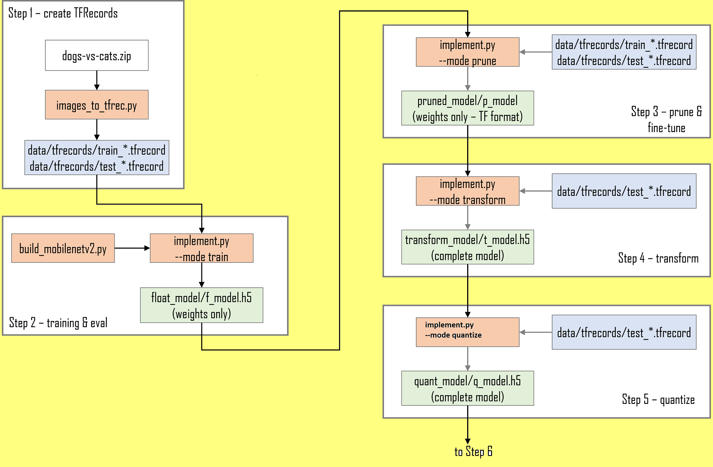
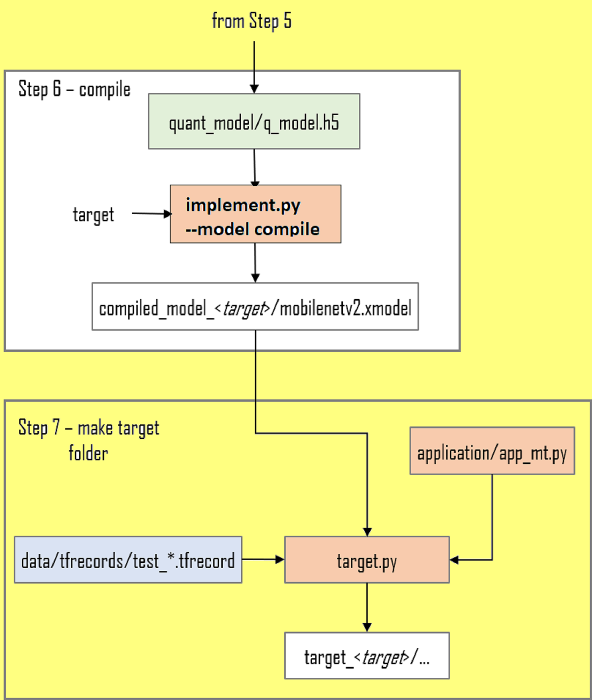
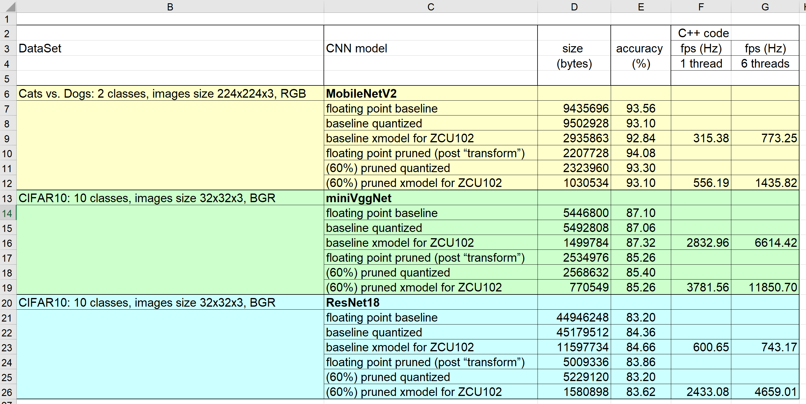

<!--

Copyright © 2023 Advanced Micro Devices, Inc. All rights reserved.
SPDX-License-Identifier: MIT

Author: Daniele Bagni, Xilinx Inc

-->


<table class="sphinxhide" width="100%">
 <tr width="100%">
    <td align="center"><h1>Vitis™ AI Tutorials</h1>
    </td>
 </tr>
</table>


#  TensorFlow2 Vitis AI Optimizer: Getting Started


### Current Status

- Author: Daniele Bagni

- Last update:  07 Aug 2023

- Target boards: ZCU102, ZCU104, VCK190, VEK280

- Tools: [Vitis AI](https://github.com/Xilinx/Vitis-AI) 3.5 with TensorFlow2

- Networks/Datasets:

  - MobileNetV2 on [Kaggle Dogs vs. Cats](https://www.kaggle.com/c/dogs-vs-cats/data)

  - ResNet18 on [CIFAR10](https://www.cs.toronto.edu/~kriz/cifar.html)


## Table of Contents

[1 Introduction](#1-introduction)

[2 Prerequisites](#2-prerequisites)

[3 Pruning MobileNetV2](#3-pruning-mobilenetv2)

[4 Pruning ResNet18](#4-pruning-resnet18)

[5 Run the Application](#5-run-the-application)

[6 Performance Summary](#6-performance-summary)

[Acknowledgement](#acknowledgement)

[License](#license)


##  1 Introduction

In this tutorial you will learn how getting started with the [Vitis AI Optimizer (release 3.5)](https://docs.xilinx.com/r/en-US/ug1414-vitis-ai/Vitis-AI-Optimizer) in the TensorFlow2 (TF2) environment with Keras.

The Vitis-AI Optimizer can optimize Convolutional Neural Networks (CNN) by exploiting redundancies and near-zero parameters to reduce the number of mathematical operations required to execute the CNN. This process is often known as **pruning**. The reduction of mathematical operations leads to several benefits:

  + Increased throughput in terms of frames-per-second (fps).
  + Reduced latency.
  + Reduced memory footprint of the compiled model.
  + Reduced number of accesses to memory.

The scripts provided in this design will allow users to either run a complete pruning flow or to run a baseline design without pruning. Having the baseline design is useful to provide a comparison of performance and accuracy with the pruned design.

The ``run_baseline.sh`` shell script creates the baseline design whereas ``run_pruning.sh`` will prune the CNN design. Users are invited to examine both scripts to get an idea of the differences between the two flows.

In order to familiarize with the pruning flow, you have two examples to optimize, each one has its own folder and its own proper python code:

1. ``MobileNetV2`` by [Keras Applications](https://github.com/keras-team/keras-applications/tree/master), re-trained from scratch on the [Kaggle Dogs vs. Cats](https://www.kaggle.com/c/dogs-vs-cats/data) dataset, composed of RGB images with 224x224x3 size, you will adopt **TFRecords and TFdata pipelines**, see the [dogs-vs-cats_mobilenetv2](files/dogs-vs-cats_mobilenetv2) folder;

2. ``ResNet18`` customized and re-trained from scratch on the [CIFAR10](https://www.cs.toronto.edu/~kriz/cifar.html) dataset, composed of RGB images with 32x32x3 size, you will use plain **numpy arrays**, see the [cifar10_customcnn](files/cifar10_customcnn) folder.

Once the CNN is optimized, it has to be quantized into 8-bit format: this tutorial adopts the so called "Post Training Quantization" (PTQ). Note that Vitis AI has different strategies to achieve an optimal 8-bit quantization of the CNN, describing all of them is out of the scope of this tutorial, you should have a look at the [Vitis AI Quantization examples](https://github.com/Xilinx/Vitis-AI/tree/master/examples/vai_quantizer).

Finally, you take the quantized CNN and compile it for the proper [DPU](https://xilinx.github.io/Vitis-AI/3.0/html/docs/workflow-system-integration.html) architecture.

The DPU is a soft-core IP whose only function is to accelerate the execution of CNNs. It acts as a co-processor to the host processor and has its own instruction set: the Vitis AI compiler will convert and optimize, where possible, the quantized model to a set of micro-instructions and then output them to an **xmodel** file for the DPU.


### 1.1 TensorFlow2 AI Optimizer Design Steps

Pruning a CNN is an iterative process and requires an initial analysis phase in which the trained CNN is analyzed using the test dataset and then is pruned in steps: in these examples each step applies a 10% pruning to the previous step. The diagrams of Figure 1 summarize the complete AI Optimizer flow when using Keras on TensorFlow2.






*Figure 1: Vitis AI Optimizer flow with TF2*

Note that you cannot know a-priori the amount of pruning your CNN is able to absorb without loosing too much prediction accuracy: the pruning process is an heuristic one and you have to proceeds with different trials.

For example, assuming that your CNN has a prediction accuracy of 0.84, when running pruning experiments you could see the following behavior:

- with 9 steps (90% pruning) the CNN accuracy drops from 0.84 (baseline floating point model) down to 0.70, which is too much;

- with 8 steps (80% pruning) the CNN accuracy drops from 0.84 down to 0.74;

- with 7 steps (70% pruning) the CNN accuracy drops from 0.84 down to 0.78.

Therefore, if you want to maintain the same accuracy, maybe you need to prune the custom CNN only of 60% or even less.


>**:pushpin: WARNING** The purpose of this tutorial is to explain the Vitis AI Optimization flow in detail and not how to get the maximum performance from the CNN. Indeed, performance depends on a lot of factors such as either the hyper-parameters adopted in the CNN training phase or the CNN efficiency when running on the DPU, or the DPU architecture itself and many others.


### 1.2 Working Directory

In the following of this document the repository folder is named ``TF2-Vitis-AI-Optimizer`` and it  looks like this:

```text
TF2-Vitis-AI-Optimizer
└── files
    ├── cifar10_customcnn
    │   ├── application
    │   ├── config
    │   └── dataset
    ├── dogs-vs-cats_mobilenetv2
    │   ├── application
    │   └── config
    │   ├── data
    ├── img
    ├── log
    └── scripts
```

## 2 Prerequisites


The host machine has several prerequisites that need to be met before you can effectively begin.

### 2.1 Setting up the Workspace, Dataset and AI Optimizer License

1. Clone the Vitis-AI 3.5 repository on your working directory ``${WRK_DIR}``, where ``${WRK_DIR}`` is the main folder from which you can access to all your work (for example ``export WRK_DIR=/media/danieleb/DATA/AIG-AI``), and rename it as ``VAI3.5``:

  ```text
cd ${WRK_DIR}
git clone --recursive https://github.com/Xilinx/Vitis-AI.git
mv Vitis-AI VAI3.5
mkdir VAI3.5/tutorials
cd VAI3.5
#git checkout v3.5
  ```

  Place this tutorial repository under the ``${WRK_DIR}/VAI3.5/tutorials`` folder.

  Here is the Vitis AI repository structure once you have cloned it on your local computer:

  ```text
VAI3.5
.
├── board_setup
├── demos
├── docker
├── docs
├── docsrc
├── dpu
├── examples
├── model_zoo
├── src
├── third_party
└── tutorials
    └── TF2-Vitis-AI-Optimizer # this tutorial
    ```

2. Download the Kaggle dogs-vs-cats dataset.

    + Go to the [Kaggle website](https://www.kaggle.com/c/dogs-vs-cats/data) and register a new account if necessary.
    + Download the [dataset](https://www.kaggle.com/c/dogs-vs-cats/data).
    + Move ``dogs-vs-cats.zip`` archive into the `files/dogs-vs-cats_mobilenetv2` folder.

    The Kaggle dog-vs-cats dataset consists of 25000 images of varying dimensions, divided into two classes: cat and dog. Each image is intrinsically labelled or classified in its filename (for example, `cat.12.jpg`).

    There is a set of unlabelled images which were part of the original Kaggle dogs-vs-cats challenge, but you will not use it in this tutorial. Only the 25000 images that are contained in the `train.zip` archive will be used.

3. This tutorial assumes the user is familiar with Python3, TensorFlow2 and has some knowledge of Machine Learning (ML) principles.

4. Have a look at the various ``README.md`` files available in the [optimizer source code](https://github.com/Xilinx/Vitis-AI/tree/master/src/vai_optimizer) folder  [here](https://github.com/Xilinx/Vitis-AI/blob/master/src/vai_optimizer/README.md) and [there](https://github.com/Xilinx/Vitis-AI/tree/master/src/vai_optimizer/tensorflow).


### 2.2 Build the Docker Image with TensorFlow2

You have to know few things about [Docker](https://docs.docker.com/) in order to run the Vitis AI smoothly on your host PC environment.

From the Vitis AI repository, run the following commands to build the docker image (with GPU support) from scratch:

```text
#cd ${WRK_DIR}/VAI3.5
cd docker
./docker_build.sh -t gpu -f tf2
```

Once the process is finished, type the command ``docker images`` and you  should see something like this:

```text
REPOSITORY                        TAG                    IMAGE ID       SIZE
xilinx/vitis-ai-tensorflow2-gpu   3.5.0.001-b56bcce50    9f119a36bab3   14.4GB
```

Note that docker does not have an automatic garbage collection system as of now. You can use this command to do a manual garbage collection:
```
docker rmi -f $(docker images -f "dangling=true" -q)
```

You have to install a new package with the command ``pip3 install image-classifiers``.
If you want to permanently save the modified docker image, open a different terminal
(a second one, besides the first one in which you are running the docker image you wish to modify), and launch the following commands:

```text
$ sudo docker ps -l
$ sudo docker commit -m"COMMENT" CONTAINER_ID DOCKER_IMAGE
```

you should see something like this:

```text
$ sudo docker ps -l
CONTAINER ID   IMAGE                                                               
8626279e926e   xilinx/vitis-ai-tensorflow2-gpu:3.5.0.001-b56bcce50

$ sudo docker commit -m"classifiers" 8626279e926e   xilinx/vitis-ai-tensorflow2-gpu:3.5.0.001-b56bcce50
```

### 2.3 Launch the Docker Image

If you have completed the previous steps, you can now launch the docker container with Vitis-AI tools, by executing the following commands:

```text
# from the Ubuntu Host PC
#cd ${WRK_DIR}/VAI3.5/ # you should be already here
./docker_run.sh xilinx/vitis-ai-tensorflow2-gpu:3.5.0.001-b56bcce50
# see what are the available envs
conda env list
# pick this one
conda activate vitis-ai-tensorflow2
# now you are inside the TF2 docker image
cd /workspace
```

Note that the container maps the shared folder ``/workspace`` with the file system of the Host PC from where you launched the above command
(``${WRK_DIR}/VAI3.5/`` in this particular case ).
This shared folder enables you to transfer files from the Host PC to the docker container and vice versa.

The docker container does not have any graphic editor, so it is recommended that you work with two terminals and you point to the same folder, in one terminal you use the docker container commands and in the other terminal you open any graphic editor you like.


## 3 Pruning MobileNetV2

This section and the next one use the MobileNetV2 CNN trained with the [Kaggle Dogs vs. Cats](https://www.kaggle.com/c/dogs-vs-cats/data) dataset. To speed up the training process, the RGB JPEG images (of size 224x224) will be converted into the TFRecord format.   

The pruning process is composed of seven major steps: they will be illustrated in the following sub-sections. All the commands are available also in the scripts
[mobilenetv2_run_all.sh](files/dogs-vs-cats_mobilenetv2/mobilenetv2_run_all.sh),  [run_baseline.sh](files/dogs-vs-cats_mobilenetv2/run_baseline.sh) and [run_pruning.sh](files/dogs-vs-cats_mobilenetv2/run_pruning.sh).

The [implement.py](files/dogs-vs-cats_mobilenetv2/implement.py) script is used at three different points in the pruning flow — in Step 2 for the initial training of the original network, in Step 3 for pruning & fine-tuning and in Step 4 for the transform from a sparse to a dense model.

The ``implement.py`` script has a ``--mode`` argument which defines what is executing:   
  - training,
  - pruning/fine-tuning,
  - transformation,
  - quantization or
  - compilation.

As training and evaluation progresses, the weights will be saved into an [HDF5](https://www.hdfgroup.org/solutions/hdf5/) format checkpoint if the validation accuracy (``val_acc``) improves. This is achieved using the ``ModelCheckpoint`` callback:

```
chkpt_call = ModelCheckpoint(filepath=output_ckpt,
                             monitor="val_accuracy",
                             verbose=1,
                             save_best_only=True,
                             save_weights_only=True)
```


From the the ``implement.py`` script, note also the following code fragment, which requires the [functools](https://www.learnpython.org/en/Partial_functions) package to create the partial function ``eval_fn`` from ``ana_eval``:

```
def ana_eval(model, test_dataset):
  return evaluate(model, test_dataset)[0]

def prune(model, ratio, test_dataset):
    input_spec = tf.TensorSpec((1, *input_shape), tf.float32)
    runner = IterativePruningRunner(model, input_spec)
    import functools
    eval_fn = functools.partial(ana_eval, test_dataset=test_dataset)
    runner.ana(eval_fn)
    return runner.prune(ratio)
```


### 3.1 (Step 1) Configuration

Remember to launch at first the [setup_env.sh](files/scripts/setup_env.sh) script.

Virtually all of the parameters and folder paths used in the flow are contained with the [config.py](files/dogs-vs-cats_mobilenetv2/config/config.py) configuration script. Users can modify this file as required.

The [run_pruning.sh](files/dogs-vs-cats_mobilenetv2/run_pruning.sh) scripts also sets up some variables which are need to point to the ``build_*`` and ``log`` folders:

```
export BUILD=./build_pr
export LOG=${BUILD}/logs

# make the necessary folders
mkdir -p ${LOG}

# to suppress too much TF2 verbosity
export  TF_CPP_MIN_LOG_LEVEL=3
```

Note the ``export  TF_CPP_MIN_LOG_LEVEL=3``  to [avoid TF messages printed on the standard error stream](https://stackoverflow.com/questions/35869137/avoid-tensorflow-print-on-standard-error), which can be very annoying.


### 3.2 (Step 2) Convert Kaggle Dataset to TFRecords

Run the following commands from within the docker image:

```
# conda activate vitis-ai-tensorflow2
# cd /workspace
# cd tutorials/TF2-Vitis-AI-Optimizer/files/dogs-vs-cats_mobilenetv2

python -u images_to_tfrec.py 2>&1 | tee ${LOG}/tfrec.log
```

The [images_to_tfrec.py](files/dogs-vs-cats_mobilenetv2/images_to_tfrec.py) script will do the following:

+ Unzip the ``dogs-vs-cats.zip`` archive into the folder set by the `data_dir` parameter in ``config.py``.
+ Split the images into the train and test datasets, ensuring a balance between classes.
+ Convert each image and label into a TFRecord. The TFRecord files are written into the folder defined by the `tfrec_dir` parameter in ``config.py``.

Each TFRecord has five fields that are defined by the feature dictionary:

```python
# features dictionary
feature_dict = {
  'label' : _int64_feature(label),
  'height': _int64_feature(image_shape[0]),
  'width' : _int64_feature(image_shape[1]),
  'chans' : _int64_feature(image_shape[2]),
  'image' : _bytes_feature(image)
}
```

The label is obtained by looking at the first part of the image file name and assigning either "0" for dog or "1" for cat:

```python
class_name,_ = filename.split('.',1)
if class_name == "dog":
  label = 0
else:
  label = 1
```

Once this script completes, you should find a folder called `data` that contains a subfolder called `tfrecords` with the training and test TFRecord files. They will be used to pre-process the test and train data with the ``tf.data`` pipelines:

```
train_dataset = input_fn_train(tfrec_dir,batchsize)
test_dataset  = input_fn_test( tfrec_dir,batchsize)
```


### 3.3 (Step 3) Initial Training

Run the following commands from within the docker image:

```
# conda activate vitis-ai-tensorflow2
# cd /workspace
# cd tutorials/TF2-Vitis-AI-Optimizer/files/dogs-vs-cats_mobilenetv2

python -u implement.py --mode train --build_dir ${BUILD} 2>&1 | tee ${LOG}/train.log
```

After training completes, the `dogs-vs-cats_mobilenetv2/build_pr/float_model` folder will contain the best weights in a file called `f_model.h5`.


### 3.4 (Step 4) Pruning and Fine-Tuning

Run the following commands from within the docker image:

```
# conda activate vitis-ai-tensorflow2
# cd /workspace
# cd tutorials/TF2-Vitis-AI-Optimizer/files/dogs-vs-cats_mobilenetv2

python -u implement.py --mode prune --build_dir ${BUILD} 2>&1 | tee ${LOG}/prune.log
```

Pruning is an iterative process in which you reduce the network by a certain amount (10% per iteration is used in this tutorial) and then fine-tuned it (i.e. retrain it) to bring its performance back to the original; for this reason, Step 3 actually contains two distinct operations (pruning then fine-tuning) that are run sequentially one after the other in a loop.

When ``implement.py`` is run with ``--mode`` set to ``prune``, the AI Optimizer tools will first run an analysis of the model and write the results to a folder named ``.vai``.

**Note**: You may need to enable viewing of hidden files to see the ``.vai`` folder as Linux usually treats any file or folder that begins with "." as  hidden.

At the first pruning iteration, the model will be pruned by the amount set by the ``init_prune_ratio`` variable in ``config.py``; in subsequent pruning iterations, the requested pruning ratio will be incremented by the amount defined by ``incr_prune_ratio``. So if you wish to prune the model by 60% in 6 steps of 10%, you would set the following values in config.py:

```python
init_prune_ratio=0.1
incr_prune_ratio=0.1
prune_steps=6
```

Each time the model is pruned, you need to fine-tune (i.e. retrain) it. One of the most important components of the ``implement.py`` script is the custom Keras callback that is used to exit fine-tuning when the validation accuracy reaches a certain value:

```python
class EarlyStoponAcc(tf.keras.callbacks.Callback):
  '''
  Early stop on reaching target accuracy
  '''
  def __init__(self, target_acc):
    super(EarlyStoponAcc, self).__init__()
    self.target_acc=target_acc

  def on_epoch_end(self, epoch, logs=None):
    accuracy=logs['val_acc']
    if accuracy >= self.target_acc:
      self.model.stop_training=True
      print('Reached target accuracy of',self.target_acc,'..exiting.')
```


At each pruning/fine-tuning iteration you set a target accuracy to be reached. For the initial iterations, you set a value that is lower than the original floating-point accuracy - this ensures that you spend less time in the initial iterations and focus our efforts on the final iteration. Users can adjust these values as they like - the final target accuracy could be set to ``1.0`` for example.

At the end of the pruning process you can use the ``grep`` Linux utility to check the amount of iterations and the achieved accuracy, by launching the following commands:

```
grep -ise          "Pruning iter" ${LOG}/prune.log
grep -ise "Pruned model accuracy" ${LOG}/prune.log
```

You should see something like this:

```
Pruning iteration 1 of 6  Pruning ratio: 0.1
Pruning iteration 2 of 6  Pruning ratio: 0.2
Pruning iteration 3 of 6  Pruning ratio: 0.30000000000000004
Pruning iteration 4 of 6  Pruning ratio: 0.4
Pruning iteration 5 of 6  Pruning ratio: 0.5
Pruning iteration 6 of 6  Pruning ratio: 0.6

Pruned model accuracy: 92.94%
```


### 3.5 (Step 5) Transform

Run the following commands from within the docker image:

```
# conda activate vitis-ai-tensorflow2
# cd /workspace
# cd tutorials/TF2-Vitis-AI-Optimizer/files/dogs-vs-cats_mobilenetv2

python -u implement.py --mode transform --build_dir ${BUILD} 2>&1 | tee ${LOG}/transform.log
```

This step will transform the sparse checkpoint that is created by the pruning/fine-tune iterations into a dense checkpoint. The final pruned and fine-tuned checkpoint created in step 3 contains exactly the same number of parameters as there were in the original model but many of them are now "zeroed out".  Running ``implement.py`` with ``--mode`` set to ``transform`` will create a reduced checkpoint that has all the zero values removed.


### 3.6 (Step 6) Quantization

Run the following commands from within the docker image:

```
# conda activate vitis-ai-tensorflow2
# cd /workspace
# cd tutorials/TF2-Vitis-AI-Optimizer/files/dogs-vs-cats_mobilenetv2

python -u implement.py --mode quantize --build_dir ${BUILD} 2>&1 | tee ${LOG}/quantize.log
```

The ``implement.py`` script creates a fixed-point 8-bit quantized model and saves it to ``dogs-vs-cats_mobilenetv2/build_pr/quant_model/q_model.h5``, as defined by the ``quant_output_chkpt`` variable in the ``config.py`` file. The quantized model will be evaluated with the test dataset so that its accuracy can be compared to the floating-point model accuracy.


### 3.7 (Step 7) Compile for Target Board

Run the following commands from within the docker image:

```
# conda activate vitis-ai-tensorflow2
# cd /workspace
# cd tutorials/TF2-Vitis-AI-Optimizer/files/dogs-vs-cats_mobilenetv2
for targetname in zcu102 zcu104 kv260 u280 vck190; do
  python -u implement.py --mode compile --build_dir ${BUILD} --target ${targetname} 2>&1 | tee ${LOG}/compile_${targetname}.log
done
```

Once the ``xmodel`` for your target board has been generated, you have to launch these commands to copy all the required files for running on the chosen target board into the ``dogs-vs-cats_mobilenetv2/build_pr/target_<board_name>`` folder:

```
# conda activate vitis-ai-tensorflow2
# cd /workspace
# cd tutorials/TF2-Vitis-AI-Optimizer/files/dogs-vs-cats_mobilenetv2
for targetname in zcu102 zcu104 vck190 vek280; do
  python -u target.py --build_dir  ${BUILD} --target ${targetname} 2>&1 | tee ${LOG}/target_${targetname}.log
done
```


## 4 Pruning ResNet18

This section and the next one use a custom ResNet18 CNN trained with the [CIFAR10](https://www.cs.toronto.edu/~kriz/cifar.html) dataset.
The RGB JPEG images, being of size 32x32 will be converted just as plain ``numpy`` arrays, without using the TFRecord format, as previously done for MobileNetV2 (this is just an alternative CNN training design choice, to giove you more freedom).

The pruning process steps will be illustrated in the following sub-sections. All the commands are available also in the scripts
[cifar10_run_all.sh](files/cifar10_customcnn/cifar10_run_all.sh),
[cifar10_run_baseline.sh](files/cifar10_customcnn/cifar10_run_baseline.sh) and [cifar10_run_pruning.sh](files/cifar10_customcnn/cifar10_run_pruning.sh).

The [cifar10_implement.py](files/cifar10_customcnn/cifar10_implement.py) script is used at three different points in the pruning flow: in Step 2 for the initial training of the original network, in Step 3 for pruning & fine-tuning and in Step 4 for the transform from a sparse to a dense model.

The ``cifar10_implement.py`` script has a ``--mode`` argument which defines if it is executing:   
  - training,
  - pruning/fine-tuning,
  - transformation,
  - quantization or
  - compilation.

As training and evaluation progresses, the weights will be saved into an [HDF5](https://www.hdfgroup.org/solutions/hdf5/) format checkpoint if the validation accuracy (``val_acc``) improves. This is achieved using the ``ModelCheckpoint`` callback:

```python
chkpt_call = ModelCheckpoint(filepath=output_ckpt,
                             monitor="val_accuracy",
                             verbose=1,
                             save_best_only=True,
                             save_weights_only=True)
```

From the the ``cifar10_implement.py`` script, note also the following code fragment, which requires the [functools](https://www.learnpython.org/en/Partial_functions) package to create the partial function ``eval_fn`` from ``ana_eval`` (note also the differences from the code adopted in the MobileNetV2 case):

```python
def ana_eval(x_test, y_test, model):
  model.compile(loss="categorical_crossentropy",
          #loss=SparseCategoricalCrossentropy(from_logits=True),
          optimizer="adam",
          metrics=["accuracy"])
  scores = model.evaluate(x_test, y_test,
                          batch_size=batchsize,
                          steps=None,
                          verbose=0)
  print("ANA EVAL accuracy: {0:.4f}".format(scores[1]*100),"%")
  return scores[1]

def prune(model, ratio, x_test, y_test):
    input_spec = tf.TensorSpec((1, *input_shape), tf.float32)
    runner = IterativePruningRunner(model, input_spec)
    import functools
    # https://www.learnpython.org/en/Partial_functions
    eval_fn = functools.partial(ana_eval, x_test, y_test)
    runner.ana(eval_fn)
    return runner.prune(ratio)
```


### 4.1 (Step 1) Configuration

Remember to launch at first the [setup_env.sh](files/scripts/setup_env.sh) script.

Virtually all of the parameters and folder paths used in the flow are contained with the [cifar10_config.py](files/cifar10_customcnn/config/cifar10_config.py)  configuration script. Users can modify this file as required.

The ``cifar10_run_*.sh`` scripts also sets up some variables which are need to point to the ``build_*`` and ``log`` folders, which indeed is the step 1.

### 4.2 (Step 3) CIFAR10 Dataset

The
[CIFAR10](https://www.cs.toronto.edu/~kriz/cifar.html) dataset is composed of 10 classes of objects to be classified. It contains 60000 labeled RGB images that are 32x32 in size. This dataset was developed for the paper [Learning Multiple Layers of Features from Tiny Images](https://www.cs.toronto.edu/~kriz/learning-features-2009-TR.pdf).

As Deep Learning deals with image data, you have to organize your data in appropriate folders and apply some pre-processing to transform the images into data for the CNN. The script [cifar10_generate_images.py](files/cifar10_customcnn/cifar10_generate_images.py) creates the sub-folders ``train``, ``valid``, ``test``, and ``calib`` that are located in the ``dataset/cifar10`` sub-directory and to fill them with 50000 images for training, 5000 images for validation, 5000 images for testing (taken from the 10000 images of the original test dataset) and 1000 images for the calibration process (copied from the images used during the training).

Run the following commands from within the docker image:

```
conda activate vitis-ai-tensorflow2
cd /workspace
cd tutorials/TF2-Vitis-AI-Optimizer/files/cifar10_customcnn

python -u cifar10_generate_images.py 2>&1 | tee ${LOG}/cifar10_generate_images.log
```


### 4.3 (Step 3) Initial Training

Run the following commands from within the docker image:

```
# conda activate vitis-ai-tensorflow2
# cd /workspace
# cd tutorials/TF2-Vitis-AI-Optimizer/files/cifar10_customcnn

python -u cifar10_implement.py --mode train --build_dir ${BUILD} -n ResNet18 2>&1 | tee ${LOG}/cifar10_train.log
```


After training completes, the ``cifar10_customcnn/build_pr/float_model`` folder will contain the best weights in a file called ``f_model.h5``.


### 4.4 (Step 4) Pruning and Fine-Tuning

Run the following commands from within the docker image:

```
# conda activate vitis-ai-tensorflow2
# cd /workspace
# cd tutorials/TF2-Vitis-AI-Optimizer/files/cifar10_customcnn

python -u cifar10_implement.py --mode prune --build_dir ${BUILD} -n ResNet18 2>&1 | tee ${LOG}/prune.log
```

Pruning is an iterative process in which you reduce the network by a certain amount (10% per iteration is used in this tutorial) and then fine-tuned it (i.e. retrain it) to bring its performance back to the original; for this reason, Step 3 actually contains two distinct operations (pruning then fine-tuning) that are run sequentially one after the other in a loop.

When ``cifar10_implement.py`` is run with ``--mode`` set to ``prune``, the AI Optimizer tools will first run an analysis of the model and write the results to a folder named ``.vai``.

**Note**: You may need to enable viewing of hidden files to see the ``.vai`` folder as Linux usually treats any file or folder that begins with '.' as  hidden.

At the first pruning iteration, the model will be pruned by the amount set by the ``init_prune_ratio`` variable in ``cifar10_config.py``; in subsequent pruning iterations, the requested pruning ratio will be incremented by the amount defined by ``incr_prune_ratio``. So if you wish to prune the model by 90% in 6 steps of 10%, you would set the following values in ``cifar10_config.py`` file:

```python
init_prune_ratio=0.1
incr_prune_ratio=0.1
prune_steps=9
```

Each time the model is pruned, you need to fine-tune (i.e. retrain) it. One of the most important components of the ``cifar10_implement.py`` script is the custom Keras callback that is used to exit fine-tuning when the validation accuracy reaches a certain value:

```python
class EarlyStoponAcc(tf.keras.callbacks.Callback):
  '''
  Early stop on reaching target accuracy
  '''
  def __init__(self, target_acc):
    super(EarlyStoponAcc, self).__init__()
    self.target_acc=target_acc

  def on_epoch_end(self, epoch, logs=None):
    accuracy=logs['val_acc']
    if accuracy >= self.target_acc:
      self.model.stop_training=True
      print('Reached target accuracy of',self.target_acc,'..exiting.')
```

At each pruning/fine-tuning iteration you set a target accuracy to be reached. For the initial iterations, you set a value that is lower than the original floating-point accuracy - this ensures that you spend less time in the initial iterations and focus our efforts on the final iteration. Users can adjust these values as they like - the final target accuracy could be set to ``1.0`` for example.


### 4.5 (Step 5) Transform

Run the following commands from within the docker image:

```text
# conda activate vitis-ai-tensorflow2
# cd /workspace
# cd tutorials/TF2-Vitis-AI-Optimizer/files/cifar10_customcnn

python -u cifar10_implement.py --mode transform --build_dir ${BUILD} -n ResNet18 2>&1 | tee ${LOG}/transform.log
```

This step will transform the sparse checkpoint that is created by the pruning/fine-tune iterations into a dense checkpoint. The final pruned and fine-tuned checkpoint created in step 3 contains exactly the same number of parameters as there were in the original model but many of them are now "zeroed out".  Running ``cifar10_implement.py`` with ``--mode`` set to ``transform`` will create a reduced checkpoint that has all the zero values removed.


### 4.6 (Step 6) Quantization

Run the following commands from within the docker image:

```
# conda activate vitis-ai-tensorflow2
# cd /workspace
# cd tutorials/TF2-Vitis-AI-Optimizer/files/cifar10_customcnn
python -u cifar10_implement.py --mode quantize --build_dir ${BUILD} -n ResNet18 2>&1 | tee ${LOG}/quantize.log
```

The ``cifar10_implement.py`` script creates a quantized model and saves it to ``cifar10_customcnn/build_pr/quant_model/q_model.h5``, as defined by the ``quant_output_chkp`` variable in the ``cifar10_config.py`` file. The quantized model will be evaluated with the test dataset so that its accuracy can be compared to the floating-point model accuracy.


### 4.7 (Step 7) Compile for Target Board

Run the following commands from within the docker image:

```
# conda activate vitis-ai-tensorflow2
# cd /workspace
# cd tutorials/TF2-Vitis-AI-Optimizer/files/cifar10_customcnn

for targetname in zcu102 zcu104 vck190 vek280; do
  python -u cifar10_implement.py --mode compile --build_dir ${BUILD} --target ${targetname} -n ResNet18 2>&1 | tee ${LOG}/compile_${targetname}.log
done
```

Once the ``xmodel`` for your target board has been generated, you have to launch these commands to copy all the required files for running on the chosen target board into the ``cifar10_customcnn/build_pr/target_<board_name>`` folder:

```text
# conda activate vitis-ai-tensorflow2
# cd /workspace
# cd tutorials/TF2-Vitis-AI-Optimizer/files/cifar10_customcnn

source ./cifar10_run_pruning make_target
```


## 5 Run the Application

The flow explained so far is the same for all the mentioned target boards: ZCU102, ZCU104, VCK190 and VEK280. Now the differences are only for the choice of the proper image SDCard to booth the board.

For the sake of conciseness
only the measurements done on ZCU102 will be reported, as the procedure on the other boards remains the same.


### 5.1 Flash the SDCard

#### ZCU102

Ensure that the ZCU102 SDCard has been flashed with the correct version of the image file (``xilinx-zcu102-dpu-v2022.2-v3.0.0.img.gz``) and boots correctly before proceeding:

- Vitis AI 3.5 uses [the same ZCU102 image files adopted already in Vitis AI 3.0](https://xilinx.github.io/Vitis-AI/3.0/html/docs/quickstart/mpsoc.html), build with Vitis/Petalinux 2022.2 release, in case of MPSoC (ZCU102, ZCU104, KV260) boards;

- once the board is on, follow the instructions reported in [Run The Vitis-AI (3.0) Examples](https://xilinx.github.io/Vitis-AI/3.0/html/docs/quickstart/mpsoc.html#run-the-vitis-ai-examples) to complete the Vitis-AI setup on the board.


#### VCk190

Ensure that the VCK190 SDCard has been flashed with the correct version of the image file (``xilinx-vck190-dpu-v2022.2-v3.0.0``) and boots correctly before proceeding:

- Vitis AI 3.5 uses yet [the same VCK190 image files adopted already in Vitis AI 3.0](https://xilinx.github.io/Vitis-AI/3.0/html/docs/quickstart/vck190.html), build with Vitis/Petalinux 2022.2 release, in case of VCK190 board;

- once the board is on, follow the instructions reported in [Run The Vitis-AI (3.0) Examples](https://xilinx.github.io/Vitis-AI/3.0/html/docs/quickstart/vck190.html#run-the-vitis-ai-examples)
to complete the Vitis-AI setup on the board.

### 5.2 Flash the VEK280 SDCard

For the VEK280 board you have to follow the official [Setup the Target](https://xilinx.github.io/Vitis-AI/3.5/html/docs/quickstart/vek280.html#setup-the-target) instructions and download the ``amd-vek280-dpu-v2023.1-v3.5.0.img.gz`` image file.


### 5.3 Python Application Code

The python application code is exactly  the same for all the boards cited in this tutorials: the host CPU loads the ``xmodel`` from the disk to the DPU and takes from such model all the information it needs about the CNN graph.

However, since the two CNNs were trained on different datasets with different amount of classes, they need also different application code, mainly in the **pre-processing** (normalizing somehow the data in the range [0..1]) and in the **post-processing** part (checking somehow the prediction accuracy at run time).

#### 5.3.1 Post-processing

#####  Code for MobileNetV2

Here is the post-processing code fragment taken the from [app_mt.py](files/dogs-vs-cats_mobilenetv2/application/app_mt.py) file for the ``MobileNetV2`` case with two classes:

```python
''' post-processing '''
classes = ['dog','cat']
correct = 0
wrong = 0
for i in range(len(out_q)):
    prediction = str(out_q[i])
    ground_truth, _ = listimage[i].split('_',1)
    if (ground_truth==prediction):
        correct += 1
    else:
        wrong += 1
accuracy = correct/len(out_q)
print('Correct:%d, Wrong:%d, Accuracy:%.4f' %(correct,wrong,accuracy))
```

#####  Code for ResNet18

Here is the post-processing code fragment taken the from [cifar10_app_mt.py](files/cifar10_customcnn/application/cifar10_app_mt.py) file for the ``ResNet18`` case with ten classes:

```python
''' post-processing '''
classes = ["airplane", "automobile", "bird", "cat", "deer", "dog", "frog", "horse", "ship", "truck"]
correct = 0
wrong = 0
print('Post-processing',len(out_q),'images..')
for i in range(len(out_q)):
    prediction_index = int(out_q[i])
    prediction = classes[prediction_index]
    ground_truth = listimage[i].strip().split("_")[0]
    if (ground_truth==prediction):
        correct += 1
    else:
        wrong += 1
accuracy = correct/len(out_q)
print('Correct:%d, Wrong:%d, Accuracy:%.4f' %(correct,wrong,accuracy))
```

#### 5.3.2 Pre-processing

Remember that the pre-processing done to the images loaded into the DPU at runtime must be **perfectly equal** to what done during the training process, otherwise the mismatch could generate very bad prediction accuracy at runtime.

#####  Code for MobileNetV2

Here is the pre-processing code fragment taken the from [app_mt.py](files/dogs-vs-cats_mobilenetv2/application/app_mt.py) file for the ``MobileNetV2`` case
(using RGB images):

```python
def preprocess_fn(image_path, fix_scale):
    '''
    Image pre-processing.
    Rearranges from BGR to RGB then normalizes to range 0,1
    and then scales by input quantization scaling factor
    input arg: path of image file
    return: numpy array
    '''
    image = cv2.imread(image_path)
    image = cv2.cvtColor(image, cv2.COLOR_BGR2RGB)
    image = (image/255.0) * fix_scale
    image = image.astype(np.int8)
    return image
```

It matches what done in the ``input_fn_train`` routine from [dataset_utils.py](files/dogs-vs-cats_mobilenetv2/dataset_utils.py) module as applied in the
[implement.py](files/dogs-vs-cats_mobilenetv2/implement.py) module during the training phase
(with data stored as **tf.data pipelines of TFRecords**):

```python
# tf.data pipelines with pre-processed data (from implement.py)
train_dataset = input_fn_train(tfrec_dir,batchsize)
test_dataset = input_fn_test(tfrec_dir,batchsize)
```

#####  Code for ResNet18

Here is the pre-processing code fragment taken the from [cifar10_app_mt.py](files/cifar10_customcnn/application/cifar10_app_mt.py) module for the ``ResNet`` case (using BGR images):

```python
def Normalize(x_test):
    x_test  = np.asarray(x_test)
    x_test = x_test.astype(np.float32)
    x_test = x_test/255.0
    x_test = x_test -0.5
    out_x_test = x_test *2
    return out_x_test

def preprocess_fn(image_path, fix_scale):
    image = cv2.imread(image_path)
    # images are used in BGR format
    image = Normalize(image) * fix_scale
    image = image.astype(np.int8)
    return image
```

It matches what done in the ``Normalize`` routine from [cifar10_config.py](files/cifar10_customcnn/config/cifar10_config.py) module as applied in the
[cifar10_implement.py](files/cifar10_customcnn/cifar10_implement.py) module during the training phase
(with data stored as plain ``numpy`` arrays):

```python
# from cifar10_config.py

def Normalize(x_test):
    x_test = x_test/NORM_FACTOR
    x_test = x_test -0.5
    out_x_test = x_test *2
    return out_x_test

# from cifar10_implement.py
print("\n[DB INFO] Preprocessing images ...\n")
x_train = cfg.Normalize(x_train)
x_test  = cfg.Normalize(x_test)
x_valid = cfg.Normalize(x_valid)
```

### 5.4 C++ Application Code

Instead of using the multi-threaded application code in python, you can write it also in C++. For example look at the [main_int8.cc](files/cifar10_customcnn/application/code/src/main_int8.cc) file related to the ``ResNet18`` case: in such file you compute the top-5 average accuracy of the CNN predictions on the input images.

Note that the [get_dpu_fps.cc](files/cifar10_customcnn/application/code/src/get_dpu_fps.cc) file is very similar to the previous one and it can be used to compute the throughput in ``fps`` (frames per second, measured in Hz), without the need of injecting any input image.

The [application/code](files/cifar10_customcnn/application/code) folder contains also the shell scripts to compile the code directly on the target board file system.

All the comments already done for the python application code (related to pre- and post-processing of data)  are valid also in the C++ case, with the major difference that the fps performance are higher, being C++ compiled and not interpreted as python.

Note that the same C++ code will be used either for the ``MobileNetV2`` or the ``ResNet18`` case.

Finally, the C++ code provided here is just an example: you can certainly try to write better code than that.


### 5.4 Runtime Execution

If the target board is connected to a network and reachable by the host machine, the application archive can be copied using the ``scp`` command. If you connect directly from your host machine to the board using ethernet, you might need to set up a static IP addresses.

Assuming that your board IP address is set to 192.168.1.227 (with the command ``ifconfig eth0 192.168.1.227`` launched directly from the board, at the end of its boot process, the ``scp`` command will be like this: ``scp archive_name.tar root@192.168.1.227:~/``.
Adjust this and the path to the target folder as appropriate for your system.
If the password is asked for, enter ``root``.

Now you are ready to issue the commands to launch the application.

**Note**: This process is done on the target board, not the host machine, so it requires a connection to the board, such as a serial connection to the UART or an SSH connection via Ethernet.


#### 5.4.1 ResNet18


If you have both baseline and pruned ``.xmodel`` files you can create an application archive  
with the following commands, related to your ``<targetboard>`` (either ZCU102 or VCK190 or whatever):

```text
# assuming you are in this folder
# cd /workspace/tutorials/TF2-Vitis-AI-Optimizer/files/

#create archive
tar -cvf cifar10_customcnn.tar ./cifar10_customcnn/<targetboard>_build_*.tar
```

Then copy the archive to the target board with the command

```text
scp cifar10_customcnn.tar root@192.168.1.227:~/.
```
assuming that the IP address is 192.168.1.227.

Log into the board with the command ``ssh -X root@192.168.1.227`` and then execute the following commands:

```text
# organize the archives
cd ~
mkdir TF2-VAI-Optimizer/
cd TF2-VAI-Optimizer
mv ~/cifar10_customcnn.tar .
tar -xvf cifar10_customcnn.tar
cd cifar10_customcnn/
tar -xvf <targetboard>_build_np.tar
tar -xvf <targetboard>_build_pr.tar

# measure performance on baseline
cd build_np/target_<targetboard>/
source ./run_all_cifar10_target.sh 2>&1 | tee logfile_<targetboard>_baseline_cifar10.txt

# measure performance on pruned
cd ../../cd build_pr/target_<targetboard>/
source ./run_all_cifar10_target.sh 2>&1 | tee logfile_<targetboard>_pruned_cifar10.txt

# save results in a new archive
cd ~/TF2-VAI-Optimizer/
tar -cvf new_cifar10_customcnn.tar ./cifar10_customcnn
mv new_cifar10_customcnn.tar ~/
```

Now you can copy the new archive from the target board to the host computer, by running these commands directly in the host computer itself:

```text
#from host computer
scp root@192.168.1.227:~/new_cifar10_customcnn.tar  .
```


#### 5.5.2 MobileNetV2


If you have both baseline and pruned ``.xmodel`` files you can create an application archive  
with the following commands, related to your ``<targetboard>`` (either ZCU102 or VCK190 or whatever):

```text
# assuming you are in this folder
# cd /workspace/tutorials/TF2-Vitis-AI-Optimizer/files/

#create archive
tar -cvf dogs-vs-cats_mobilenetv2.tar ./dogs-vs-cats_mobilenetv2/<targetboard>_build_*.tar
```

Then copy the archive to the target board with the command

```text
scp dogs-vs-cats_mobilenetv2.tar root@192.168.1.227:~/.
```
assuming that the IP address is 192.168.1.227.

Log into the board with the command ``ssh -X root@192.168.1.227`` and then execute the following commands:

```text
# organize the archives
cd ~
mkdir TF2-VAI-Optimizer/
cd TF2-VAI-Optimizer
mv ~/dogs-vs-cats_mobilenetv2.tar .
tar -xvf dogs-vs-cats_mobilenetv2.tar
cd dogs-vs-cats_mobilenetv2/
tar -xvf <targetboard>_build_np.tar
tar -xvf <targetboard>_build_pr.tar

# measure performance on baseline
cd build_np/target_<targetboard>/
source ./run_all_mobilenetv2_target.sh 2>&1 | tee logfile_<targetboard>_baseline_mobilenetv2.txt

# measure performance on pruned
cd ../../cd build_pr/target_<targetboard>/
source ./run_all_mobilenetv2_target.sh 2>&1 | tee logfile_<targetboard>_pruned_mobilenetv2.txt

# save results in a new archive
cd ~/TF2-VAI-Optimizer/
tar -cvf new_dogs-vs-cats_mobilenetv2.tar ./dogs-vs-cats_mobilenetv2
mv new_dogs-vs-cats_mobilenetv2.tar ~/
```

Now you can copy the new archive from the target board to the host computer, by running these commands directly in the host computer itself:

```text
#from host computer
scp root@192.168.1.227:~/new_dogs-vs-cats_mobilenetv2.tar  .
```


## 6 Performance Summary

Figure 2 illustrates the performance of the two adopted CNNs in terms of ``xmodel`` size (in bytes), throughput (fps measured either with C++ application code) for one or multiple threads, and mean top-1 prediction accuracy (in %).

Some comments:

1. The 8-bit format of the final ``.xmodel`` is nearly 69-75% smaller than the original 32-bit floating point model for the baseline case and 53-68% smaller for the pruned case.

2. Six iterations of pruning (at 10% each one) are quite effective in reducing the size of the final ``.xmodel``, from 53% to 88% depending on the CNN.

3. Smaller the CNN model - in terms of 32-bit floating point size in bytes - and smaller the fps performance improvement of the pruned CNN, in particular:

  - ``miniVggNet``, being the smallest with size of ~5MB, achieves "only" 33% with 1 thread and a "good" 79% improvement with 6 threads;

  - ``MobileNetV2``, with intermediate size of ~9MB, achieves a "good" 76% (1 thread) and 85% (6 threads) fps improvement;

  - ``ResNet18``, the largest CNN with size of ~44MB, achieves a "remarkable" 300% (1 thread) and 500% (6 threads) fps improvement.




*Figure 2: ZCU102 performance summary of Vitis AI Optimizations*


##  Acknowledgement

Part of this tutorial was originally developed by Mark Harvey, before he left AMD.


<div style="page-break-after: always;"></div>


## License

The MIT License (MIT)

Copyright © 2023 Advanced Micro Devices, Inc. All rights reserved.

Permission is hereby granted, free of charge, to any person obtaining a copy
of this software and associated documentation files (the "Software"), to deal
in the Software without restriction, including without limitation the rights
to use, copy, modify, merge, publish, distribute, sublicense, and/or sell
copies of the Software, and to permit persons to whom the Software is
furnished to do so, subject to the following conditions:

The above copyright notice and this permission notice shall be included in all
copies or substantial portions of the Software.

THE SOFTWARE IS PROVIDED "AS IS", WITHOUT WARRANTY OF ANY KIND, EXPRESS OR
IMPLIED, INCLUDING BUT NOT LIMITED TO THE WARRANTIES OF MERCHANTABILITY,
FITNESS FOR A PARTICULAR PURPOSE AND NONINFRINGEMENT. IN NO EVENT SHALL THE
AUTHORS OR COPYRIGHT HOLDERS BE LIABLE FOR ANY CLAIM, DAMAGES OR OTHER
LIABILITY, WHETHER IN AN ACTION OF CONTRACT, TORT OR OTHERWISE, ARISING FROM,
OUT OF OR IN CONNECTION WITH THE SOFTWARE OR THE USE OR OTHER DEALINGS IN THE
SOFTWARE.


<p align="center"><sup>XD106 | © Copyright 2022 Xilinx, Inc.</sup></p>
