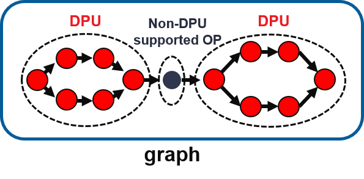
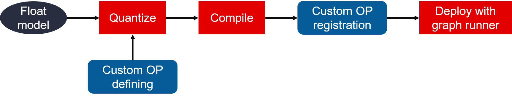

<!--
Copyright 2022 Advanced Micro Devices, Inc.

Licensed under the Apache License, Version 2.0 (the "License");
you may not use this file except in compliance with the License.
You may obtain a copy of the License at

http://www.apache.org/licenses/LICENSE-2.0

Unless required by applicable law or agreed to in writing, software
distributed under the License is distributed on an "AS IS" BASIS,
WITHOUT WARRANTIES OR CONDITIONS OF ANY KIND, either express or implied.
See the License for the specific language governing permissions and
limitations under the License.

Author: Jon Cory, Advanced Micro Devices, Inc.
-->

<table>
 <tr>
   <td align="center"><h1>Vitis AI Tutorials</h1>
   </td>
 </tr>
 <tr>
 <td align="center"><h3>VCK190 Custom Lambda Operator Tutorial</h3>
 </td>
 </tr>
</table>

### Current status

 + Tested with Vitis AI 2.0 and Tensorflow 2.6
 + Tested on the following platforms: Production VCK190 with Vitis AI 2.0 Board Image
  + If using an ES1 board, you'll need to build the board image from scratch targeting an ES1 platform, and make sure to apply the workaround described in the [XVDPU TRD](https://github.com/Xilinx/Vitis-AI/tree/master/dsa/XVDPU-TRD) under the Known Issue section 

### Introduction
The general concept behind the custom operator flow is to make  Vitis AI and the DPU more extensible - both for supporting custom layers as well as framework layers that are currently unsupported in the toolchain. The custom operator flow enables the user to define layers which are unsupported, and ultimately deploy those layers either on the CPU or an accelerator.

As can be seen from the graphic below, the custom op flow intersects the Vitis AI toolchain during quantization, where a dictionary of custom objects are passed to the quantizer based on the classes of those custom objects defined in the floating point model.

<table>
<td align="center">


</table>


Note that the [Vitis AI User Guide](https://www.xilinx.com/support/documentation/sw_manuals/vitis_ai/2_0/ug1414-vitis-ai.pdf) already provides an example of a custom operator defined and trained in Tensorflow 2.x and the [host training code](https://www.xilinx.com/bin/public/openDownload?filename=tf2_custom_op_demo.tar.gz) is also available for download.

A [custom op demo](https://github.com/Xilinx/Vitis-AI/tree/v2.0/demo/Custom_OP_Demo) is also provided as part of the Vitis AI git repository.

The intent of this tutorial is then to demonstrate how the custom operator plugin flow can be used to deploy models that have unsupported framework operators (which are then treated as custom operators).  The model used for this tutorial is taken from the [DeepWaterMap](https://github.com/isikdogan/deepwatermap) repository.  The deepwatermap model uses a lambda depth to space operator in 4 places which is not supported on the DPU.

In order to quantize and compile the model, we make use of the custom_objects flag within the quantizer, which tells the quantizer to leave the depth to space layers as float32 while quantizing the other layers that are supported to int8.  A [graph of the resultant model](./files/pictures/customcnn.png) shows the layers that are ultimately compiled to target the DPU in blue and the lambda operator (targeted to the CPU) is shown in red.

In order to run custom ops on in software, the graph_runner API is leveraged from the vitis_ai_library package (see the provided [software example](./files/vck190/lambda_test_inference.py)).  

In addition, there are actually a number of [pre-defined CPU framework ops](https://github.com/Xilinx/Vitis-AI/tree/master/tools/Vitis-AI-Library/cpu_task/ops) already defined in the vitis_ai_library package.  That means that if you are training a model that uses one of these ops in TF2.x or PyTorch, you don't need to define the op!  It's already done, and will be called automatically when running your model.

Furthermore, you can use these ops as an example starting point when defining your own custom operator.  Some of the ops even contain trainable weights which are stored in the compiled xmodel file and can be extracted by the software for use in the calculation ([see depthwise convolution as an example](https://github.com/Xilinx/Vitis-AI/blob/master/tools/Vitis-AI-Library/cpu_task/ops/depthwise-conv2d/depthwise-conv2d.cpp)).

### Deployment Flow (HOST)
1. The first step to deploy this model is to copy the [files/host](./files/host) directory to the environment where you will be quantizing and compiling the model.

2. Next, we assume that you have already setup and installed the Vitis AI Docker environment per the instructions from the [Vitis AI repository](https://github.com/Xilinx/Vitis-AI/tree/v2.0).

3. Launch the Vitis AI GPU Docker and activate the vitis-ai-tensorflow2 conda environment

4. Setup the repository for the model by running the script provided

  ```
    source init_workspace.sh
  ```

  This script will clone the DeepWaterMap repository and copy in the additional files which are used for quantization, compilation, dumping results, and compiling the model.

5. Download the [pre-trained model checkpoint](https://utexas.app.box.com/s/j9ymvdkaq36tk04be680mbmlaju08zkq/file/565662752887) from the DeepWaterMap repository and extract it inside the deepwatermap directory.  If done correctly, you should see the following two files in the deepwatermap/checkpoint directory:

  + cp.135.ckpt.data-00000-of-00001
  + cp.135.ckpt.index


6. [Optional Step] If desired, you can download the full [DeepWaterMap dataset](https://utexas.app.box.com/s/j9ymvdkaq36tk04be680mbmlaju08zkq/folder/94459511962).  This is a time-consuming process and requires ~200GB of storage, but it is required if you would like to retrain the model, evaluate the model accuracy on the host machine, or use the dateset for calibration during quantization or Quantize Aware Training (QAT)/Fast Finetuning.

7. Quantize the model using the command below.  In order to avoid downloading the entire dataset, this python script will simply use randomly generated data for quantization calibration.
  ```
    python quantize.py
  ```

8. [Optional Step] If you downloaded the dataset, you can optionally evaluate the accuracy of the quantized model using the following command:

  ```
    python eval_quantized_model.py
  ```

9. Compile the model using the following command:

  ```
    source compile.sh
  ```
This should produce a compiled xmodel file in the deepwatermap/compiled_model directory

10. Generate a png of the xmodel file.  The generated [png file](./files/pictures/customcnn.png) depicts the model connectivity and highlights DPU layers in blue and CPU layers in red.     

  ```
    cd compiled_model
    xir png customcnn.xmodel customcnn.png
  ```

### Deployment Flow (VCK190)
1. The first step to deploy the model on the VCK190 is to copy the customcnn.xmodel file generated from step 9 above to the [./files/vck190/compile_model](./files/vck190/compile_model)

2. Next copy the entire [./files/vck190](./files/vck190) folder to the target board using scp

3. Install the Lambda Operator on the target using the following commands:
  ```
    cd vck190/Lambda_layer
    source op_registration.sh
  ```

  About this step: If running on the CPU, the custom operator must be defined using either Python or C++ code so that it can be deployed.  In the case of the lambda operator in this tutorial, the layer has been defined in  [./files/vck190/Lambda_layer/vart_op_imp/Lambda.py](./files/vck190/Lambda_layer/vart_op_imp/Lambda.py).

  In addition to the layer definition, there is a python init file which allows the layer to be interpreted as a python module.  

  There are strict coding guidelines and procedures that need to be adhered to for enabling the deployment of the layer on the CPU.  These guidelines are spelled out in some detail in the [op registration](https://github.com/Xilinx/Vitis-AI/blob/v2.0/demo/Custom_OP_Demo/op_add/README.md) section of the [custom op demo](https://github.com/Xilinx/Vitis-AI/tree/v2.0/demo/Custom_OP_Demo).

  A couple key requirements are:

  - If using python, the op definition needs to have an init function and calculate function (which takes the input tensor and produces the output tensor)

  - If using C++. the op should be defined as a class and should have a public member variable named 'op' as well as a member function 'calculate'

  The operator needs then to be installed on the target.
  - For C++ this involves compiling the op to shared library and linking to it

  - For python, a library called libvart_op_imp_python-cpu-op.so has already been provided which can link the python op to the VART runtime.  As can be seen by examining the op_registration.sh script, the op needs a softlink with its name appended to this library, and the python definition for the op itself needs to be copied into the python site packages folder on the target.

      ```
      ln -sf /usr/lib/libvart_op_imp_python-cpu-op.so /usr/lib/libvart_op_imp_Lambda.so
      cp -r vart_op_imp/ /usr/lib/python3.8/site-packages/
      ```

4. Run the model on the target with randomly generated data:
  ```
    python3 lambda_test_inference.py
  ```

### Cross Checking Results
The results between the host machine and target can be cross checked via the following procedure.  Essentially the approach is to perform a single inference on the host machine and dump the results.  This will include an input stimulus file which can then be used as a stimulus when running the model on the target.  The final output binaries can then be compared to ensure the results match.

1. Run inference on the host machine while dumping the results to a folder from each layer using the following command:

  ```
      python dump_data_host.py
  ```

  This will produce a dumped binary and text file for each layer and weights using randomized data as an input.  The dumped files will appear in the deepwatermap/dump_results folder.

2. Copy the /dump_results_0/quant_input_1.bin file to the target under the vck190 folder

3. Enable dumping of results on the target by setting the following two environment variables:

  ```
    export XLNX_ENABLE_DPU_DEBUG=1
    export XLNX_ENABLE_DUMP=1
  ```

4. Run inference on the target with the -c flag:

  ```
    python3 lambda_test_inference -c quant_input_1.bin
  ```
  This will produced dumped results on the target under the vck190 folder

5. Copy the output files to a host machine or to the target and diff them using the diff command or a hex editor such as beyond compare.  Diff'ing The final output file should be sufficient to ensure that the results match.  The output file names for this particular model are as follows:

***On the host machine:***
+ quant_activation_18_sigmoid_float.bin

***On the Target:***
+ quant_activation_18_sigmoid_fix_.bin


### One Proposed Methodology for Developing the Custom Layer Code
You're likely wondering how to go about developing the custom layer code to run on the CPU.  In the case of a truly custom layer, it would be best to write the layer initially with python libraries that are already supported on the ARM target such as numpy.  Many libraries can be installed on the ARM embedded target using pip as well.  If such libraries are used in the development of your custom layer, then defining the operator should largely be a copy/paste from your training code.

If however, you are using a framework operator which just happens to be unsupported, you find yourself in a situation where you need to redefine the operator using C++ or Python libraries which are supported on the target (such as in the case of the lambda depth to space operator).

Remember as well from the into section that there are actually a number of [pre-defined CPU framework ops](https://github.com/Xilinx/Vitis-AI/tree/master/tools/Vitis-AI-Library/cpu_task/ops) already defined in the vitis_ai_library package.  That means that if you are training a model that uses one of these ops in TF2.x or PyTorch, you don't need to define the op!  It's already done, and will be called automatically when running your model.

Remember also that you can use these ops as an example starting point when defining your own custom operator.  Some of the ops even contain trainable weights which are stored in the compiled xmodel file and can be extracted by the software for use in the calculation ([see depthwise convolution as an example](https://github.com/Xilinx/Vitis-AI/blob/master/tools/Vitis-AI-Library/cpu_task/ops/depthwise-conv2d/depthwise-conv2d.cpp)).

All that said, one proposed methodology for developing and testing the custom layer code is as follows:

1. Use the dump procedure on the host machine with a single inference to produce golden results layer by layer

2. Copy the dumped files to the target

3. Use VSCode remote debugging to debug/develop the application and check the results against the stimulus (an example is only provided here in python for the Lambda layer, but it is also possible to use C++ with a similar methodology)

Let's walk through an example starting with the files we dumped.  

First, let's launch a remote SSH debug session with VS Code from the host machine where we trained the model to the target.  This assumes you have the target connected either directly to the host machine or to a router visible by the host machine.

***Connecting with VSCode:***

1. In VSCode, select View -> Command Pallete -> Remote-SSH: Connect to Host

2. Now enter root@IPADDR - in my case the IP address of the board is 192.168.1.37, so I entered "root@192.168.1.37"

3. Select "connect" in the lower right when prompted

4. select continue and then enter 'root' as the board password and select continue when prompted

5. Go to File -> open folder and browse to the Lambda_layer/vart_op_imp folder

6. Enter the 'root' password again and elect to trust the authors

***Debugging the Custom Op in VSCode:***

7. Drag and drop the dump_results_0 folder from the host to the vart_op_imp folder on the target (see section on cross checking results for how to dump the files on the host machine)

8. In the terminal window, cd to compile_model directory and run `xir png customcnn.xmodel customcnn.png` - This will generate a graph that shows the useful nodes for debugging (take note specifically of the inputs and outputs from the red subgraphs).

9. Click on the extensions (4 squares on the left hand side of the menu) in VSCode and install the python extension in the remote SSH session

10. Browse to the Lambda.py file, Open it, and Select Run -> Debug

11. Review the Lambda.py file source code and notice how the python dictionary is used to control the input tensors and output tensors.  Note the shapes defined there correspond to the model shapes for the inputs and outputs to each custom layer.  

Note also the commented out basic test case included in the Lambda.py file.  It might be necessary to create a very basic test case such as this and run it both on the host machine with the framework operator as well as the target to try to understand the layer operation.

### Model Accuracy
A common concern is to understand how quantization affects the model's accuracy.  I benchmarked the floating point and quantized models using both random data as well as data from the dataset, and the results are as follows:

##### Floating Point Model:
+ binary_accuracy: 0.9468 - running_precision: 0.8904 - running_recall: 0.8479 - running_f1: 0.8570

##### Quantized Model (Calibrated with Dataset):
+ binary_accuracy: 0.9407 - running_precision: 0.8723 - running_recall: 0.8237 - running_f1: 0.8386

##### Quantized Model (Calibrated with Random Data):
+ binary_accuracy: 0.9347 - running_precision: 0.8540 - running_recall: 0.8719 - running_f1: 0.8601

Note that by default, the quantization process only uses 100 samples.  An accuracy improvement could likely be seen by using more quantization samples for calibration from the actual dataset (up to 1000).  Additional accuracy improvements could likely also be seen by performing Quantize Aware Training or Fast Finetuning.  Refer to [UG1414](https://www.xilinx.com/support/documentation/sw_manuals/vitis_ai/2_0/ug1414-vitis-ai.pdf) p.60 for additional details.

## Citations:
- L. F. Isikdogan, A.C. Bovik, and P. Passalacqua, "Seeing Through the Clouds with DeepWaterMap," IEEE Geoscience and Remote Sensing Letters, 2019. [Read at IEEExplore], [PDF]
- F. Isikdogan, A.C. Bovik, and P. Passalacqua, "Surface Water Mapping by Deep Learning," IEEE Journal of Selected Topics in Applied Earth Observations and Remote Sensing, 2017. [Read at IEEExplore], [PDF]
