<table class="sphinxhide">
 <tr width="100%">
    <td align="center"><h1>Leveraging the Vitis™ AI DPU in the Vivado® Workflow (XD155)</h1>
    <a href="https://www.xilinx.com/products/design-tools/vitis.html">See Vitis™ Development Environment on xilinx.com</br></a>
    <a href="https://www.xilinx.com/products/design-tools/vitis/vitis-ai.html">See Vitis-AI™ Development Environment on xilinx.com</a>
    </td>
 </tr>
</table>

### Current Status

*	Tested with Vitis&trade; AI 2.0,  Vivado&reg; 2021.2, PetaLinux v2021.2
*	Tested on the following platform: Zynq&reg; UltraScale+&trade; MPSoC ZCU102 Evaluation Kit
*	Host Operating System: Red Hat 7.8 Linux 

# Introduction

This tutorial demonstrates the steps to build the Vitis AI Targeted Reference Design (TRD) using the Vivado flow. It aims to help you garner a better understanding of the configuration and build flow for both the DPU IP and and PetaLinux by walking you through the steps required to build a PetaLinux image from the ZCU102 BSP that is provided in the TRD archive. The process to add Vitis AI package support to PetaLinux is also explained in this tutorial. 

A reference script that illustrates how to build PetaLinux while enabling support for Vitis AI has been provided in the appendices.

## Prerequisites

:pushpin: **Note:** All Xilinx&reg; tools can be found on the Xilinx Support Download page, located [here](https://www.xilinx.com/support/download/index.html/content/xilinx/en/downloadNav/vivado-design-tools/2021-2.html).

### Vivado

* Confirm that your host machine's OS is supported by the Xilinx tools. For reference, see the [Requirements and Setup](https://docs.xilinx.com/access/sources/dita/topic?Doc_Version=2021.2%20English&url=ug973-vivado-release-notes-install-license&resourceid=roe1549384083026.html) section in the *Vivado Design Suite User Guide: Release Notes, Installation, and Licensing* ([UG973](https://docs.xilinx.com/access/sources/dita/map?Doc_Version=2021.2%20English&url=ug973-vivado-release-notes-install-license)).

* Install Vivado Design Suite 2021.2. This is required to compile the DPU IP.

### PetaLinux

From the Xilinx download page, download the Xilinx Unified Installer for Linux OS, then run the installer.

For more information regarding the installation process, refer to the *PetaLinux Tools Documentation: Reference Guide* ([UG1144](https://docs.xilinx.com/access/sources/dita/map?Doc_Version=2021.2%20English&url=ug1144-petalinux-tools-reference-guide)).

### Targeted Reference Design (TRD) Download

Download the TRD files from the Vitis AI GitHub repo located [here](https://github.com/Xilinx/Vitis-AI/tree/2.0/dsa/DPU-TRD). To do this, follow these steps:

1. Open a Linux terminal. 
2. Ensure that the Linux shell is Bash, then run the following commands:

    ```bash
    git clone https://github.com/Xilinx/Vitis-AI
    cd Vitis-AI
    cd checkout v2.0
    ```

## Building the Vivado TRD

:pushpin: **Note:** This tutorial assumes that the $TRD_HOME environment variable is set as given below.

  ```bash
  % export TRD_HOME=<Your Vitis AI path>/DPU-TRD
  ```
Follow these steps to build the Vivado TRD:

1. To compile the hardware platform, open a Linux terminal in Bash mode, then run the following script to ensure that your environment is set up for Vivado.

    ```bash
    % source <Vivado install path>/Vivado/2021.2/settings64.sh
    ```

2. To configure and build the TRD using the DPU IP, use the following Tcl script:

    ```bash
    $TRD_HOME/prj/Vivado/scripts/trd_prj.tcl 
    ```

3. Open ``trd_prj.tcl`` in a text editor and review the settings. The following table provides a detailed breakdown of each setting and how they are used. 

    :pushpin: **Note:** Some options will require you to recompile your ML model. For this tutorial, leave the DPU options as default.


    | Configurations Options for DPUCZDX8G | TRD Default (ZCU102) | Valid Configuration Options                        | Model Recompile Required | Definition |
    |:------------------------------------:|:--------------------:|:--------------------------------------------------:|:-------------------------|:----------|
    |DPU_CLK_MHz                           |325 MHz               |325 MHz or lower                                     |No                        |To modify frequency of *m_axi_dpu_aclk*.|
    |DPU_NUM                               |2                     |4 or lower                                          |No                        |Number of DPU cores to be used. The DPU needs lots of LUTs and RAMs. Use of 3 or more DPU may cause resource and timing issues.|
    |DPU_ARCH                              |4096                  |B512, B800, B1024, B1152, B1600, B2304, B3136, B4096|Yes                       |The DPU IP can be configured with various convolution architectures which are related to the parallelism of the convolution unit.|
    |DPU_RAM_USAGE                         |low                   |low / high                                          |Yes                       |The RAM usage option determines the total amount of on-chip memory used in different DPU architectures, and the setting is for all the DPU cores in the DPU IP. High RAM usage means that the on-chip memory block will be larger, allowing the DPU more flexibility to handle the intermediate data. High RAM usage also implies higher performance in each DPU core.
    |DPU_CHN_AUG_ENA                       |low                   |0 = disable, 1 = enabled                            |Yes                       |Channel augmentation is an optional feature for improving the efficiency of the DPUCZDX8G when the number of input channels is much lower than the available channel parallelism.|
    |DPU_DWCV_ENA                          |1                     |0 = disable, 1 = enabled                            |Yes                       |Depthwise convolution: This option determines wether the depthwise convolution operation will be performed on the DPU or not.|
    |DPU_ELEW_MULT_ENA                     |0                     |0 = disable, 1 = enabled                            |Yes                       |Elementwise multiplication: Enables dot multiplication on at most two input feature maps. The input channel of EM ranges from 1 to 256.|
    |DPU_AVG_POOL_ENA                      |1                     |0 = disable, 1 = enabled                            |Yes                       |This option determines whether the average pooling operation will be performed on the DPUCZDX8G. The supported sizes range from 2x2 to 8x8, with only square sizes supported. Extra logic is used, if enabled.|
    |DPU_CONV_RELU_TYPE                    |3                     |2 = ReLU + ReLU6, 3 = RELU + LeakyReLU + ReLU6      |Yes                       |This option determines which kind of ReLU function can beused in the DPU. ReLU and ReLU6 are supported by default.|
    |DPU_SFM_NUM                           |1                     |0 = disable, 1 = enabled                            |No                        |Softmax function: It is a separate accelerator which has its own interface and runtime with INT8 input and floating-point output data format. This softmax HW option is just packaged into a DPU wrapper. The hardware implementation of softmax can be 160 times faster than a software implementation on MPSoC Arm in some application cases. Enabling this option depends on the customer chosen algorithm model and desired throughput. Extra logic is used, if enabled.|
    |DPU_DSP48_USAGE                       |high                  |low / high                                          |No                        |This option allows you to select whether DSP48E slices will be used for accumulation in the DPUCZDX8G convolution module. When low DSP usage is selected, the DPUCZDX8G IP will use DSP slices only for multiplication in the convolution. In high DSP usage mode, the DSP slice will be used for both multiplication and accumulation. Thus, the high DSP usage consumes more DSP slices and less LUTs.|
    |DPU_URAM_PER_DPU                      |0                     |0 - 84                                              |No                         |The DPUCZDX8G uses block RAM as the memory unit by default. For a target device with both block RAM and UltraRAM, configures the number of UltraRAM that are used to replace some block RAMs. The number of UltraRAM should be set as a multiple of the number of block RAMs required for a memory unit in the DPUCZDX8G.|
    |REG_CLK_MHz                           |100                   |100 MHz                                              |No                         |The *input s_axi_clk* is used for the register configure module. This module receives the DPU conigure data throughte S_AXI interface adn the related clock of S_AXI is *s_axi_clk*. THe S_AXI clock can be configued as common with the M-AXI clock or as an independent clock. THe register for DPU configuration is updated at a very low fequency and most of those registers are configured at the start of a task. The M-AXI is used as a high-frequency clock, Xilinx recommends setting the S-AXI clock as an independent clock with a frequency of 100 Mhz.|
    |DPU_SAXICLK_INDPD                     |1                     |0 = disable, 1 = enabled                            |No                         |Enabling this option measn the S-AXI clock is an independent clock from the M_axi_clock and you can set arbitrary frequency for *s_axi_aclk*. When the option is disabled, the S-AXI interface uses the same m_axi_aclk clock with M-AXI interface.
    |DPU_CLK_GATING_ENA                    |1                     |0 = disbale, 1 = enabled                            |No                         |When this option is enabled, a port named *dpu_2x_clk_ce* appears for each DPUCZDX8G core. The *dpu_2x_clk_ce* port should be connected to the *clk_dsp_ce* port in the dpu_clk_wiz IP. the *dpu_2x_clk_ce* signal can shut down the *dpu_2x_clk* when the computing engine in the DPUCZDX8G is idle. To generate the *clk_dsp_ce* port in the dpu_clk_wiz IP, the clocking wizard IP should be configured with specific options.|
    |DPU_DSP48_MAX_CASC_LEN                |4                     |1 - 7                                               |No                         |The maximum lenght of the DSP48E slice cascade chain can be set using this option. Longer cascade lengths typically use fewer logic resources but might have worse timing. Shorter cascade lengths might not be suitable for small devices asthey require more hardware resources. Xilinx recommends selecting the mid-value, which is four, in the first iteration and adjust the value as needed to meet timing requirements.|
    |DPU_TIMESTAMP_ENA                     |1                     |1 - 7                                               |No                         |When enabled, the DPUCZDX8G records the time that the DPUCZDX8G project was synthesized. When disable,d the timestamp keeps the value at the moment of the last IP update.|
    |DPU_CONV_WP                           |1                     |1 = all architectures, 2 = B512/B800/B1152, 4 = B1024/B1600/B2304|Yes           |The DPU supoorts additional write-parallel acceleration for the PointPillar models.|

    -------------------------

    **:warning: IMPORTANT:** During model compilation, Vitis AI parses metadata from a file named ``arch.json``. It is through this mechanism that the Vitis AI compiler extracts details of the target DPU instruction set and features. This file is key to ensuring successful deployment of the model on the DPU.

    In the above table, the column "Model Recompile Required" provides information on whether the model must be recompiled when modifications are made to the DPU configuration. 

    If YES - The model must be recompiled with the latest arch.json </br>
    If NO - The model does not need to be recompiled.

    You can see from this that modifications to the DPU configuration may require recompilation of the model. For additional information on the ``arch.json`` file, refer to step 6 below.

    -------------------------

4. Build the hardware design:

    ```bash
    % cd $TRD_HOME/prj/Vivado
    % vivado -source scripts/trd_prj.tcl&
    ```

    If you are accessing the host machine remotely, additional tools such as VNC might be used to improve overall GUI performance. After executing the script, the Vivado IPI block design should now be displayed as shown in the following figure.  If so, the script has successfully rebuilt the hardware platform design.

    

5. Click **Generate Bitstream**.

    :pushpin: **Note:** If a pop-up with “No implementation results available” is displayed, click **Yes** to run implementation. Then, if a pop-up with “Launch runs” is displayed, click **OK**.

6. After the bitstream is generated, go to **File > Export > Export Hardware**. In the Export Hardware window, select **Include Bitstream** and click **OK**.

    The XSA file is created at

    ```bash
    $TRD_HOME/prj/Vivado/prj/top_wrapper.xsa
    ```

    :pushpin: **Note:** The ``arch.json`` file that is needed by the Vitis AI Compiler has been created by the Vivado tool and is located at this path:

      ```bash
      $TRD_HOME/prj/Vivado/srcs/top/ip/top_DPUCZDX8G_0/arch.json
      ```


### Optional: Custom Hardware Steps

Additional steps are required to use the DPU IP in your custom design. The DPU IP is not released in the Vivado IP catalog and can only be found in this TRD. Therefore, you will be required to copy the DPU IP repo to your custom design and add this IP to the Vivado IP catalog manually. Follow these steps to complete this task:

1. Locate the DPU IP in the Vitis AI Vivado TRD. The DPU IP is located at ``/Vitis-AI/dsa/DPU-TRD/dpu_ip/DPUCZDX8G_v3_4_0/``. This can be confirmed by noting the ``component.xml`` file located in the root of this directory.
  
    1. Copy this folder local to your Vivado design.
    2. Add the DPU IP to your Vivado design as shown in the following steps.

2. Click on **Settings**.

    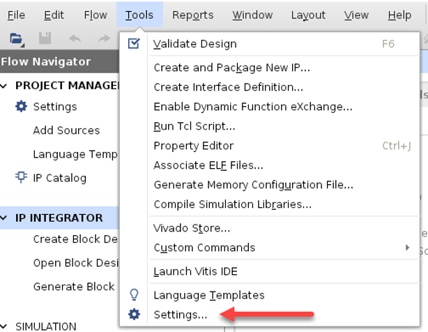

3. Under **IP**, select **Repository** and click the **+** toolbar button.

    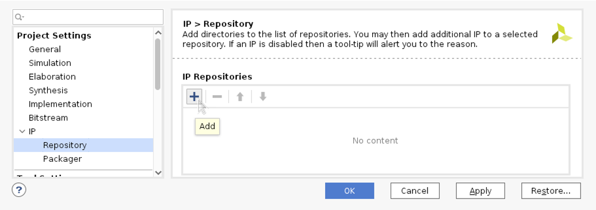

4. Point to the DPU IP you copied local to your Vivado design and click **Select**.

    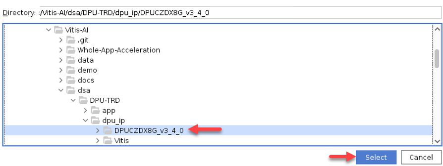


The TCL console provides the status of the IP repo update as shown in the following figure:

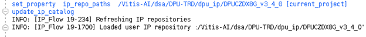

Vivado shows the updated IP repo and the addition of the DPU IP core upon completion.


:pushpin: **Note:** For correct operation and optimum performance of your DPU implementation, it is important to follow the recommendations outlined in the *DPUCZDX8G for Zynq UltraScale+ MPSoCs Product Guide* [PG338](https://docs.xilinx.com/access/sources/dita/map?isLatest=true&ft:locale=en-US&url=pg338-dpu). It is extremely important that you review and understand the clocking, reset, and I/O bandwidth requirements of the DPU when integrating this IP into your system. 

## Installing PetaLinux

This part of the tutorial shows how to build the Linux and boot images using the PetaLinux build tool.

:pushpin: **Note:** Refer to the *PetaLinux Tools Documentation: Reference Guide* ([UG1144](https://docs.xilinx.com/access/sources/dita/map?Doc_Version=2021.2%20English&url=ug1144-petalinux-tools-reference-guide)) for more information.

1. Run the user login shell command.

    - For Bash as user login shell, run the following command.

      ```bash
      source <path-to-installed-PetaLinux>/settings.sh
      ```

    - For C shell as user login shell, run the following command.

      ```bash
      source <path-to-installed-PetaLinux>/settings.csh
      ```

2. Verify that the working environment has been set:

    ```bash
    echo $PETALINUX
    ```

3. Configure and build the PetaLinux project:

    ```bash
    cd $TRD_HOME/prj/Vivado/dpu_petalinux_bsp
    ./download_bsp.sh
    petalinux-create -t project -s xilinx-zcu102-trd.bsp
    ```

The following commands take you into the project directory and configure PetaLinux using your Vivado project .XSA file created earlier in this tutorial:

```bash
cd xilinx-zcu102-trd
petalinux-config --get-hw-description=$TRD_HOME/prj/Vivado/prj/ --silentconfig
```

For this example, add the Vitis AI packages and the correct files will be inserted into rootfs when generating the system image by PetaLinux.
In order to enable Vitis AI packages, follow these steps:

1. Edit the following file:

    ```bash
    <petalinux project>/project-spec/meta-user/conf/user-rootfsconfig 
    ```

2. Append the following lines:

    ```bash
    CONFIG_vitis-ai-library
    CONFIG_vitis-ai-library-dev
    CONFIG_vitis-ai-library-dbg
    ```

3. To enable the Vitis AI packages, run the following command:

    ```bash
    petalinux-config -c rootfs
    ```

4. Select **"user packages"** and enable the three Vitis AI packages as shown in the following figure:

    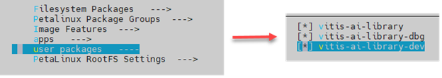

    After you run the above successfully, the ``vitis-ai-library``, VART2.0 and the dependent packages will be installed into rootfs image.

    If you want to compile the example on the target hardware, select the following package groups as well. This package group provides some commonly used utilities like Make, GCC, G++, and cross compiler. 

    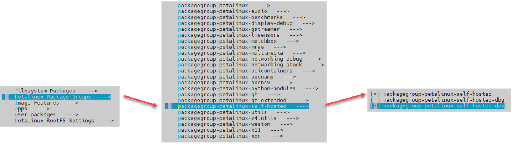

5. Save and exit, then build PetaLinux.

    ```bash
    petalinux-build
    ```

    *Optional: If you want to use the TRD prebuilt Vivado design, use the path for ``--get-hw-description`` as shown below.*

    ```bash
    petalinux-config --get-hw-description=$TRD_HOME/prj/Vivado/pre-built/ --silentconfig
    ```

6. Upon successful completion of the PetaLinux build, create a boot image (BOOT.BIN) including FSBL, ATF, bitstream, and U-boot.  

    ```bash
    cd images/linux
    petalinux-package --boot --fsbl zynqmp_fsbl.elf --u-boot u-boot.elf --pmufw pmufw.elf --fpga system.bit
    ```

7. Use the following command to create a WIC image. This file is used by a third party flash tool, such as Etcher (https://etcher.io/) to burn the WIC image and create a bootable system memory for the target. 

    ```bash
    petalinux-package --wic 
    ```

    :pushpin: **Note:** This command uses a default ``rootfs.wks`` file located at ``$DPU-TRD/prj/Vivado/dpu_petalinux_bsp/xilinx-zcu102-trd/build/``.

8. Burn the WIC file to a 16G SD card using the following steps.

    1. Download Etcher from https://etcher.io/ and install on your host computer.
    2. Use the Etcher software to burn the image file onto the SD card.

### Building Petalinux for Custom Hardware (Optional)

If you want to build PetaLinux for custom hardware, see [Customizing the Project](https://docs.xilinx.com/access/sources/dita/topic?Doc_Version=2021.2%20English&url=ug1144-petalinux-tools-reference-guide&resourceid=customizing-project-an364401.html) in the *PetaLinux Tools Documentation: Reference Guide* ([UG1144](https://docs.xilinx.com/access/sources/dita/map?Doc_Version=2021.2%20English&url=ug1144-petalinux-tools-reference-guide)).

## Testing Your Design

### ZCU102 Target Setup

For this tutorial, use the ZCU102 evaluation board. For more information regarding the ZCU102, click [here](https://www.xilinx.com/products/boards-and-kits/ek-u1-zcu102-g.html).

Set up the ZCU102 board as in the following figure:

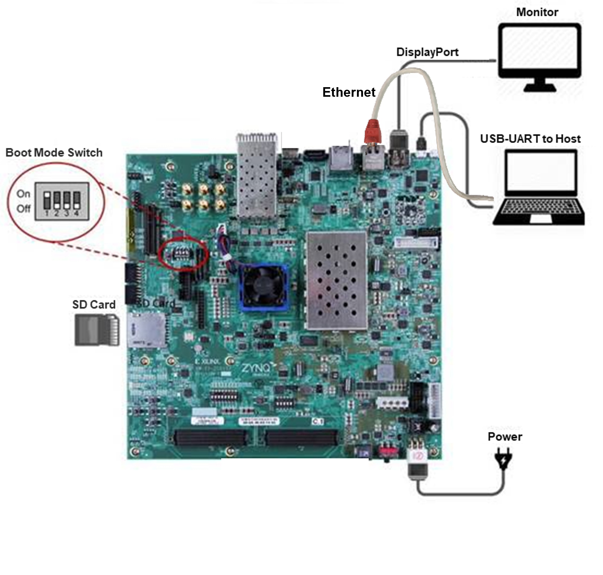

1. Insert the newly imaged SD card into the ZCU102.

2. Connect all required peripherals to the target as shown in the above figure.

3. Review the Boot Mode dip switch settings.

4. Create a serial connection to the target hardware using a tool such as [MobaXterm](https://download.mobatek.net/2102021022292334/MobaXterm_Installer_v21.0.zip).

    * The serial connection should have the following configuration:
        * Baud Rate: 115200 bps
        * Data bits: 8
        * Stop bit: 1
        * Parity: None

    The ZCU102 supports four virtual serial connections over the USB-UART port.  These will be installed as a series of COM ports on your host machine (ie COM11, COM12, COM13, COM14).  If you choose, you can simply open four terminal connections, one for each of these ports.  In any case, you will know that you are using the correct port when you see the Linux boot messages (DMESG logging) on that port.  This is the port that you will use for the next steps.

    :pushpin: **Note:** If you are connecting to the board and executing example applications via this USB-UART connection, you may need to execute ```export DISPLAY=:0.0``` in order to successfully execute (and display) results from the example applications in the steps that follow.  Many configurations are possible for use of this image, including ssh over Ethernet, or connecting a USB keyboard directly to the board to run applications. The need to export the DISPLAY will vary depending on the methodology used.

5. Ensure your host computer and target hardware are on the same LAN network, or connected via a point-to-point Ethernet cable. The ZCU102 is DHCP enabled and will be assigned an IP if connected to a router.

  * Using the serial port, type ```% ifconfig```
    
    This will dump the IP address of the target and enable you to establish a network connection. As needed, you can establish a point-to-point Ethernet connection by simply reconfiguring the ip address of the board by executing "ifconfig eth0 xxx.xxx.xxx.xxx" on the board via the serial terminal.

6. Once you have the IP address of the target, open an SSL (or SSH) connection to the target’s IP address (user = root, password = root) to provide a stable and highspeed connection to transfer files to and from the target hardware.

### Running the TRD Resnet50 Example

The Vivado TRD has a simple ResNet-50 example that you can run to verify that the DPU, runtime, and other components are operating as expected. At the target hardware Linux prompt, enter the following commands:

```bash
$ cd ./app
$ cp ./model/resnet50.xmodel .
$ env LD_LIBRARY_PATH=samples/lib samples/bin/resnet50 img/bellpeppe-994958.JPEG
```

You should see the Top 5 prediction scores and classes dumped to the console.  The scores and class predictions will vary depending on the image used:

```bash
score[945]  =  0.992235     text: bell pepper,
score[941]  =  0.00315807   text: acorn squash,
score[943]  =  0.00191546   text: cucumber, cuke,
score[939]  =  0.000904801  text: zucchini, courgette,
score[949]  =  0.00054879   text: strawberry,
```

These results reflect the classification of an image located in the ```/home/root/app/img/``` directory.

### VART and Vitis AI Library Examples

Both VART and the Vitis AI library are located within the Vitis AI Github repo at the following paths.

```bash
Vitis-AI/demo/VART
Vitis-AI/demo/Vitis-AI-Library
```

To run these examples, you will need the Vitis AI Runtime packages, VART samples, Vitis-AI-Library samples, and ML models of choice. These requirements can be installed in different stages of the tool flow. In this tutorial, the Vitis AI runtime packages were install via Yocto recipes during the PetaLinux build. Therefore, only the VART examples, Vitis-AI-Library examples, and ML models will be needed.  Also, you have two options for building the example application code: 

- Host machine
- Target hardware

The following section describes how to set up the cross-compiler on both the host machine and target hardware to enable you to build these application examples.

:pushpin: **Note:** If you are using a Xilinx evaluation board TRD image, all of these packages and the hardware cross-compiler are built into the board image.

### Application Compilation

VART and the Vitis AI Library provide the application code and a build script for you to build these application examples on your host machine or target hardware. The cross-compiler should be installed on the target, or the image built with the PetaLinux “self-hosted” option selected as shown earlier in this tutorial. 

Skip this step if you have already compiled your application code on your host machine.

If you have access to your target hardware from your host machine simply copy the VART and Vitis-AI-Library directories to your target hardware. However, if you do not have access to your hardware from the host, clone the Vitis AI repo again on your target hardware. Ensure you have adequate storage space in the rootfs file system (approximately 3 Gb).

### Building ML Applications on the Target Hardware

Open a Linux terminal on your target hardware. Run the following command:

```bash
% git clone https://github.com/Xilinx/Vitis-AI
```

You may get the following SSL warning:

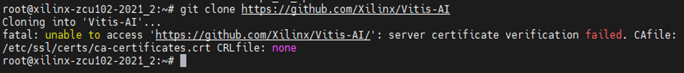

To turn off the SSL certificates check, use the following commands:

```bash
% git config --global http.sslverify false 
% cd Vitis-AI
% git checkout v2.0
```

This clones the Vitis AI repo which includes VART examples and the Vitis AI Library examples.

### Building ML Applications on the Host Machine 

#### Set up the Cross-Compiler

Refer to the following Vitis AI repo path for details and scripts to install the cross-compilation system environment. This compiler is to be installed on your local host Linux system, not in the Docker system. Note that the cross compiler will be installed in the ``~/petalinux_sdk_2021.2`` directory by default. You can edit the ``host_cross_compiler_setup.sh`` file line 25 to change the installation directory. 

1. Vitis AI Repo path to this script:

    ```bash
    /Vitis-AI/setup/mpsoc/VART/
    ```

2. On your Host machine, run the following script to setup the cross-compiler:

    ```bash
    % ./host_cross_compiler_setup.sh
    ```

3. When the installation is complete, follow the prompts and execute the following command:

    ```bash
    % source ~/petalinux_sdk_2021.2/environment-setup-cortexa72-cortexa53-xilinx-linux
    ```

Note that if you close the current terminal, you need to re-execute the above instructions in the new terminal interface.

#### Running VART Examples

Go to the Resnet50 example located in the Vitis-AI Library at the following path:

```bash
/home/root/Vitis-AI/demo/VART/resnet50/
```

This directory contains a build script, a ``src`` directory with the application code ``main.c`` and a ``readme`` file. Open the ``readme`` file and download the model using the command provided. Model download can also be accomplished by reviewing the Vitis AI Model Zoo documentation. Review the model-list directory for each model. The model name follows the below naming rules:

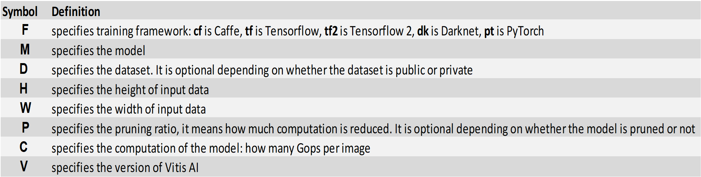

For example, ``cf_refinedet_coco_360_480_0.8_25G_2.0`` is a RefineDet model trained with Caffe using COCO dataset, input activation dimensions are 360 * 480, 80% pruned, the computation per image is 25 Gops and Vitis AI version is 2.0.

Each model folder has a ``model.yaml`` file which provides links to the float and quantized model for retraining purposes. This folder also has precompiled models for specific Xilinx demonstration cards for evaluation purposes. 

Use the following commands to download the ResNet50 model from the model zoo.

```bash
% sudo mkdir /usr/share/vitis_ai_library/models
% cd /usr/share/vitis_ai_library/models
% wget https://www.xilinx.com/bin/public/openDownload?filename=resnet50-zcu102_zcu104_kv260-r2.0.0.tar.gz -O resnet50-zcu102_zcu104_kv260-r2.0.0.tar.gz
```

:pushpin: **Note:** In some cases, you might get the following Error regarding SSL certificates.

  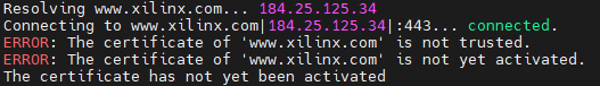

  To disable SSL, update the above command with the following switch:

  ```bash
  wget --no-check-certificate https://www.xilinx.com/bin/public/openDownload?filename=resnet50-zcu102_zcu104_kv260-r2.0.0.tar.gz -O resnet50-zcu102_zcu104_kv260-r2.0.0.tar.gz
  ```

Then decompress the model:

```bash
% tar -xzvf resnet50-zcu102_zcu104_kv260-r2.0.0.tar.gz
```

#### Building ML Applications on the Target Hardware

In the ```/home/root/Vitis-AI/demo/VART/resnet50/``` directory enter the command: 

```bash
% ./build.sh
```

Once complete, you will see the compiled applications in the same directory. The ResNet-50 example design needs a set of test images copied to the SD card. Using Mobaterm, drag and drop your images of choice to the following directory (``/home/root/Vitis-AI/demo/VART``). These are the images that will be classified by the example design. The ResNet-50 neural network as deployed in this example requires images of resolution 224x224 in order to match the input dimensions of the first layer of the network.  However, you can use higher resolution images. Software downscaling, built into the application examples, will address the difference in resolution at the cost of some performance. For higher performance applications, you should consider using the Vitis Vision Libraries, Whole Application Acceleration examples, or the Xilinx VPSS IP to accelerate such pre-processing functions in the programmable logic.

To run the ResNet-50 application, enter this command:

```bash
% ./resnet50 /usr/share/vitis_ai_library/models/resnet50/resnet50.xmodel
```

This command will launch ResNet-50 and run inference on the first image in your image directory.

The following image shows an example result.

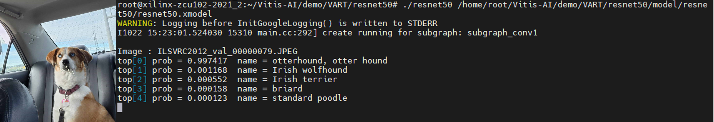

### Running Vitis AI Library Examples

The Vitis AI Library is a set of high-level libraries and APIs built for efficient AI inference with Deep-Learning Processor Unit (DPU). It leverages the Vitis AI Runtime with Unified APIs, and it fully supports XRT 2020.2.

The Vitis AI Library provides an easy-to-use and unified interface by encapsulating many efficient and high-quality neural networks. This simplifies the use of deep-learning neural networks, even for users without knowledge of deep-learning or FPGAs. The Vitis AI Library allows users to focus more on the development of their applications, rather than the underlying hardware.

Like the VART examples, the Vitis-AI-Library examples provide application code and build scripts for different ML examples.  These can be found at the following path:

```bash
/home/root/Vitis-AI/demo/Vitis-AI-Library/samples
```

#### OpenPose Video Example

Execute the following command to run the OpenPose model on the downloaded sample video clip.

```bash
% ./test_video_openpose openpose_pruned_0_3 /home/root/Vitis-AI/demo/Vitis-AI-Library/apps/seg_and_pose_detect/pose_960_540.avi -t 8
```

:pushpin: **Note:** The -t switch provides control over the number of CPU threads employed.

The result should be the following image:

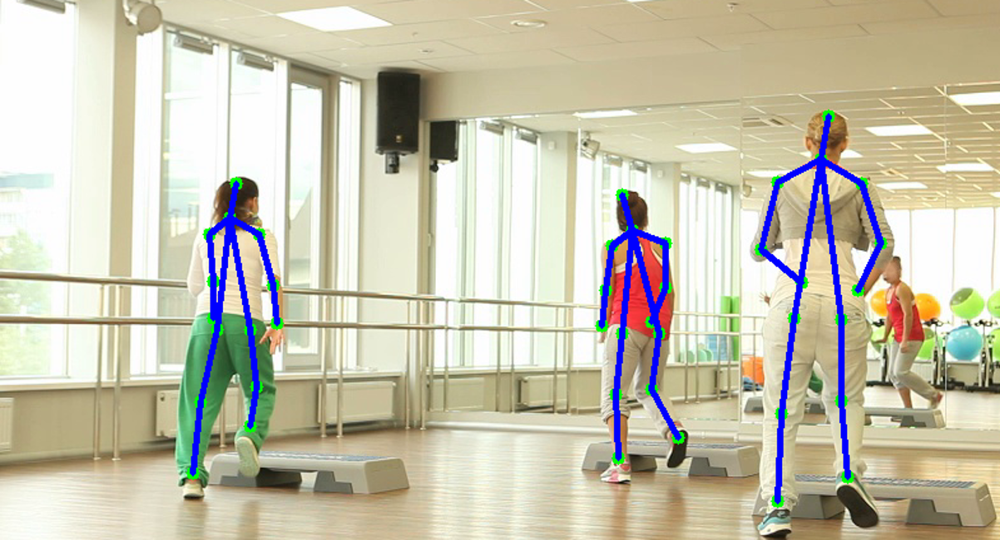

For additional details and examples using the Vitis-AI-Library review the following link [here](https://github.com/Xilinx/Vitis-AI/blob/master/tools/Vitis-AI-Library/README.md#running-vitis-ai-library-examples).

## Appendix

The following appendices provide further explanation of the processes used earlier in this tutorial. 

### PetaLinux Build Script for Vitis AI Designs

This script is an example of building PetaLinux for the Vitis AI Vivado TRD. This illustrates the packages needed for Vitis AI and can be used as a reference for custom hardware BSPs.

```bash
#!/bin/bash

export PATH_TO_BSP=/your/path/to/petalinux/bsp/xilinx-zcu102-v2021.2-final.bsp #set your path to peta_linux BSP download from downloads.xilinx.com

export PROJ_HOME=`pwd`
export TRD_HOME=$PROJ_HOME/Vitis-AI/dsa/DPU-TRD

echo "Using BSP: $PATH_TO_BSP"
echo "PROJ_HOME: $PROJ_HOME"
echo "TRD_HOME: $TRD_HOME" 


echo "Cloning Vitis-AI Repo"
git clone https://github.com/Xilinx/Vitis-AI.git

echo "Done" 

echo "Downloading and extracting contents of xilinx-zcu102-trd.bsp" 
cd $TRD_HOME/prj/Vivado/dpu_petalinux_bsp
./download_bsp.sh
tar -xzf xilinx-zcu102-trd.bsp
mv xilinx-zcu102-trd xilinx-zcu102-trd-bsp-contents
cd $PROJ_HOME
echo "Done" 

echo "Creating New Petalinux Project"
mkdir zcu102_2021.2_bsp
cd zcu102_2021.2_bsp
petalinux-create -t project -s $PATH_TO_BSP -n petalinux
cd petalinux
petalinux-config --get-hw-description=$TRD_HOME/prj/Vivado/pre-built/ --silentconfig 

echo "Done"

echo "Customizing project" 
cp -r  $TRD_HOME/prj/Vivado/dpu_petalinux_bsp/xilinx-zcu102-trd-bsp-contents/project-spec/meta-user/recipes-vitis-ai project-spec/meta-user/
cp -r  $TRD_HOME/prj/Vivado/dpu_petalinux_bsp/xilinx-zcu102-trd-bsp-contents/project-spec/meta-user/recipes-tools project-spec/meta-user/
cp -r  $TRD_HOME/prj/Vivado/dpu_petalinux_bsp/xilinx-zcu102-trd-bsp-contents/project-spec/meta-user/recipes-modules project-spec/meta-user/

echo 'IMAGE_ROOTFS_EXTRA_SPACE = "1048576"
MAGE_INSTALL_append = " nfs-utils "
IMAGE_INSTALL_append = " cmake "
IMAGE_INSTALL_append = " auto-resize "
IMAGE_INSTALL_append = " tree "
IMAGE_INSTALL_append = " dpuclk "
IMAGE_INSTALL_append = " dpu-sw-optimize "
IMAGE_INSTALL_append = " packagegroup-petalinux-self-hosted "
IMAGE_INSTALL_append = " dpu "
IMAGE_INSTALL_append = " vitis-ai-library "
IMAGE_INSTALL_append = " vitis-ai-library-dev "' >> project-spec/meta-user/conf/petalinuxbsp.conf
echo "Done"

echo "Building Petalinux Project"
petalinux-build

echo "Creating SD Card Image"
cd images/linux
petalinux-package --boot --fsbl zynqmp_fsbl.elf --u-boot u-boot.elf --pmufw pmufw.elf --fpga system.bit --force

echo "Creating Single SD Card burn .WIC Image"
petalinux-package --wic
echo "Done"

```

### PetaLinux Configuration for the Vitis AI Profiler

The following instructions can be used to enable the Vitis AI Profiler in the PetaLinux image. The Xilinx prebuilt SD card images and this TRD both come with these settings enabled. This section is provided as reference for custom designs.

1. Access the kernel with the following command:

    ```bash
    % petalinux-config -c kernel
    ```

2. Enable the following settings for the Linux kernel.

    - [x] General architecture-dependent options
        - [x] Kprobes
    - [x] Kernel hacking
        - [x] Tracers
            - [x] Enable kprobes-based dynamic events
            - [x] Enable uprobes-based dynamic events

3. Access the settings for rootfs:

    ```bash
    % petalinux-config -c rootfs 
    ```
    - [x] User packages
        - [x] modules
            - [x] packagegroup-petalinux-self-hosted

4. Rebuild Linux.

    ```bash
    % petalinux-build
    ```


<div style="page-break-after: always;"></div>

## License

Licensed under the Apache License, Version 2.0 (the "License"); you may not use this file except in compliance with the License. You may obtain a copy of the License at http://www.apache.org/licenses/LICENSE-2.0 Unless required by applicable law or agreed to in writing, software distributed under the License is distributed on an "AS IS" BASIS, WITHOUT WARRANTIES OR CONDITIONS OF ANY KIND, either express or implied. See the License for the specific language governing permissions and limitations under the License.

## AMD-Xilinx Disclaimer and Attribution

The information contained herein is for informational purposes only and is subject to change without notice. While every precaution has been taken in the preparation of this document, it may contain technical inaccuracies, omissions and typographical errors, and AMD is under no obligation to update or otherwise correct this information. Advanced Micro Devices, Inc. makes no representations or warranties with respect to the accuracy or completeness of the contents of this document, and assumes no liability of any kind, including the implied warranties of non infringement, merchantability or fitness for particular purposes, with respect to the operation or use of AMD hardware, software or other products described herein. No license, including implied or arising by estoppel, to any intellectual property rights is granted by this document. Terms and limitations applicable to the purchase or use of AMD’s products are as set forth in a signed agreement between the parties or in AMD's Standard Terms and Conditions of Sale.

© Copyright 2022 Advanced Micro Devices, Inc.  All rights reserved.  Xilinx, the Xilinx logo, AMD, the AMD Arrow logo, Alveo, Artix, Kintex, Kria, Spartan, Versal, Vitis, Virtex, Vivado, Zynq, and other designated brands included herein are trademarks of Advanced Micro Devices, Inc.  Other product names used in this publication are for identification purposes only and may be trademarks of their respective companies.  
