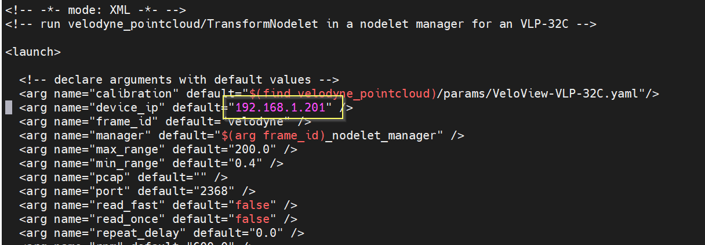

<table>
 <tr>
   <td align="center"><h1>LIDAR + Camera Fusion on KV260</h1>
   </td>
 </tr>
 <tr>
 <td align="center"><h1>KV260 ROS Tutorial</h1>
 </td>
 </tr>
</table>


# Introduction

The KV260 development board is a low-cost kit that allows the developer to very quickly begin developing applications for the Zynq Ultrascale+ SoC. While the kit comes with numerous pre-built applications, it can also be easily scaled to support custom application development. Xilinx and Canonical have enabled official Ubuntu support for this board which provides very familiar user/development environment. This tutorial will show how to install Ubuntu on the KV260 then build ROS, bring in multiple sensors, and deploy FPGA-accelerated neural network to process the data before displaying the data using RViz. All of this is possible without ever using FPGA tools.

## Tutorial Overview

This is a sensor fusion design that showcases the process of extending the KV260 to support FPGA-accelerated application development using readily available and familiar software stack. This design showcases the following features:
* Installing Ubuntu on the KV260
* Installing and running the applications and tools that Xilinx provides for the KV260
* Installing ROS
* Bringing up Velodyne VLP-32C-A LIDAR in ROS
* Displaying point cloud in RViz
* Adding a camera to ROS RViz
* Accelerating neural network inference for object detection on the camera data
* Accelerating neural network inference for object detection on the LIDAR data
* Using LIDAR to give range to objectes detected by the camera 

# Before You Begin

This tutorial targets the [KV260 board](https://www.xilinx.com/products/boards-and-kits/kv260.html). You will also need the [Kria KV260 Power Supply and Adapter](https://www.xilinx.com/products/som/kria/kv260-vision-starter-kit/power-supply-adapter.html) and the [Kria KV260 Basic Acessory Pack](https://www.xilinx.com/products/som/kria/kv260-vision-starter-kit/basic-accessory-pack.html). This tutorial also makes use of the Vitis AI stack implicitly. There are numerous other tutorials on using Vitis AI and thus will not be covered in detail here.

## *Documentation*: Explore the KV260

* [Kria KV260 Vision AI Starter Kit](https://www.xilinx.com/products/boards-and-kits/kv260.html)  
* [Getting Started with the KV260](https://www.xilinx.com/products/som/kria/kv260-vision-starter-kit/kv260-getting-started/getting-started.html)  
* [KV260 Applications Documentation](https://xilinx.github.io/kria-apps-docs/home/build/html/index.html)  
* [KV260 Wiki](https://xilinx-wiki.atlassian.net/wiki/spaces/A/pages/1641152513/Kria+K26+SOM)  
* [Kria KV260 Vision AI Starter Kit User Guide](https://www.xilinx.com/content/dam/xilinx/support/documentation/user_guides/som/1_0/ug1089-kv260-starter-kit.pdf)  
* [Kria KV260 Vision AI Starter Kit Datasheet](https://www.xilinx.com/content/dam/xilinx/support/documentation/data_sheets/ds986-kv260-starter-kit.pdf)  
* [Canonical Ubuntu Xilinx Wiki](https://xilinx-wiki.atlassian.net/wiki/spaces/A/pages/1413611532/Canonical+Ubuntu)  
* [NLP Smartvision App Documentation](https://xilinx.github.io/kria-apps-docs/2020.2/build/html/docs/nlp-smartvision/nlp_smartvision_landing.html)  
* [NLP Smartvision App Source](https://github.com/Xilinx/nlp-smartvision)  
* [Vitis AI Snap Wiki](https://xilinx-wiki.atlassian.net/wiki/spaces/A/pages/2068283453/Snaps+-+xlnx-vai-lib-samples+Snap+for+Certified+Ubuntu+on+Xilinx+Devices)  

# Preparing the Board

## Installing Ubuntu on the SD card  

1. Download the latest [KV260 Ubuntu image](https://ubuntu.com/download/xilinx)
2. Follow the [Wiki instructions](https://xilinx-wiki.atlassian.net/wiki/spaces/A/pages/2037317633/Getting+Started+with+Certified+Ubuntu+20.04+LTS+for+Xilinx+Devices#Installing-the-Image) to burn the image to a microSD card


## Setting up the Hardware

1. Plug the SD card into the microSD card slot (J11)
2. Plug an Ethernet cable to the RJ45 connector (J10)
3. Connect HDMI cable from the HDMI connector on the KV260 (J5) to a 1080p capable monitor
4. Connect a USB keyboard/mouse to one of the USB 3.0 connectors (U44 and U46)
5. Connect a USB webcam to one of the USB3.0 connectors (U44 and U46) - this design was tested using a Logitech C920
      or
   Connect the MIPI camera from the [Kria KV260 Basic Acessory Pack](https://www.xilinx.com/products/som/kria/kv260-vision-starter-kit/basic-accessory-pack.html) to IAS connector (J8)
6. Connect a Micro USB cable to (J4) and to your host PC and open a serial console (i.e. Tera Term, PuTTY) on your host PC with 115200 baud
7. Connect Velodyne VLP-32C LIDAR to the network via Ethernet

## Booting the Board

1. Plug in the power connector to power on the board.
2. Once boot is complete, the serial terminal will present a login prompt. Also, the HDMI display will also have an Ubuntu login screen. Using either interface, log into the board using the following credentials:
```
Username: ubuntu
Password: ubuntu
```
You will be prompted to change the password at first login.
3. Clone this repository
```bash
cd ~
git clone <url for this repo>
```

# Quick Start

<details>
<summary>Click to see steps</summary>

If you'd like to skip the discussion about the design and setup, you can use the scripts provided in the root directory of this repository to run the demos. First, install the software stack and build everything
```bash
cd kv260_lidar_cam_fusion
sudo ./install.sh
sudo ./build.sh
```

Then you can run any one of the demos with one of the following commands
```bash
./run.sh <demo_name>
```

where `demo_name` can be replaced by any of the demos in the `kv260_lidar_cam_fusion/src` directory. For example
```bash
./run.sh lidar_cam_detection
```
Note that this will take several seconds to launch RViz and several more seconds for the data to show up in the windows.

</details>

# Installing the Software Stack

**Note!** If you ran the `install.sh` script from the *Quick Start* section, you can skip this section.

<details>
<summary>Click to see steps</summary>

## Installing some useful utilities

```bash
sudo apt-get install -y net-tools mlocate python libgoogle-glog-dev
```

## Install ROS

```bash
sudo sh -c 'echo "deb http://packages.ros.org/ros/ubuntu $(lsb_release -sc) main" > /etc/apt/sources.list.d/ros-latest.list'
curl -s https://raw.githubusercontent.com/ros/rosdistro/master/ros.asc | sudo apt-key add -
sudo apt update
sudo apt install -y ros-noetic-desktop-full
sudo apt install -y python3-rosdep python3-rosinstall python3-rosinstall-generator python3-wstool build-essential
sudo rosdep init
rosdep update
```

Prior to using ROS commands, the environment must be set up. This is done by sourcing `/opt/ros/noetic/setup.bash`. We'll add this to our login script
```bash
echo "source /opt/ros/noetic/setup.bash" >> ~/.bashrc
source ~/.bashrc
```

## Download, Build, and Install the Latest Velodyne ROS Package

The Velodyne VLP-32C is supported by the [ROS Velodyne package](http://wiki.ros.org/velodyne). However, the version provided by the Ubuntu package feeds does not include all the necessary files for this specific Velodyne model. So to build the package from source
```bash
mkdir velodyne_ws && cd velodyne_ws
git clone https://github.com/ros-drivers/velodyne.git src
catkin_make
source devel/setup.bash
```		

The VLP-32C comes from the factory with a static ip address set to `192.168.1.201`. Add a static route. **Note!** This needs to be done each time the KV260 is power cycled.
```bash
sudo route add 192.168.1.201 eth0
```

You can make this run on startup by adding the following contents to a new script in `/etc/systemd/network/20-wired.network`
```bash
[Match]
Name=eth0

[Network]
DHCP=yes

[Route]
Destination=192.168.1.201
```

Then running
```bash
sudo systemctl restart systemd-networkd.service
```

The VLP-32C ROS launch file also needs to be modified to specify this IP address
```bash
vi src/velodyne_pointcloud/launch/VLP-32C_points.launch
```



## Install cv_camera ROS Package

There are several ways to use a camera in ROS. Since both MIPI and USB cameras are V4L2, they can be easily used in OpenCV. Therefore, this tutorial will use the [cv_camera](http://wiki.ros.org/cv_camera) package. Install it with
```bash
sudo apt-get install ros-noetic-cv_camera
```

## Install the Xilinx KV260 Apps

Install the xlnx-config snap
```bash
sudo snap install xlnx-config --edge --classic
```

Run xilinx-specific initialization and accept when prompted
```bash
xlnx-config.sysinit
```

Install nlp-smartvision snap. We are using this firmware set because it has DPU in the PL for machine learning. While we won't be using the app itself, we will want the DPU in the PL for accelerating our own application.
```bash
sudo snap install xlnx-nlp-smartvision
xlnx-config -q
sudo xlnx-config --install nlp-smartvision
sudo xlnx-config --xmutil listapps
sudo xlnx-config --xmutil loadapp nlp-smartvision
```

It might be useful to do the last command at startup also so that you don't need to re-load the firmware each time the board boots. Do this by adding the following systemctl script `/usr/local/bin/load_firmware.sh`
```bash
sudo echo "xlnx-config --xmutil loadapp nlp-smartvision" > /usr/local/bin/load_firmware.sh
```
and add a systemctl service script in /etc/systemd/system/load_firmware.service
```bash
[Unit]
After=network.service

[Service]
ExecStart=/usr/local/bin/load_firmware.sh

[Install]
WantedBy=default.target

```
Then enable it at boot with:
```bash
sudo systemctl enable load_firmware
```

Select microphone for the NLP Smartvision app
```bash
xlnx-nlp-smartvision.set-mic
```

Install Vitis AI samples
```bash
sudo snap install xlnx-vai-lib-samples
```

</details>

# Running the Demos

## Pre-canned Xilinx Demos

<details>
<summary>Click to see steps</summary>

First, run the demos that Xilinx provides with the KV260. This is useful to ensure that everything is set up correctly.

### NLP Smartvision demo

This is not a ROS demo. It's simply the stock NLP Smartvision app that Xilinx ships for the kit. Run it to make sure DPU firmware is loaded correctly.

**Note!** This demo must run from the full desktop environment; X11 forwarding over SSH won't work without extra steps
```bash
xlnx-nlp-smartvision.nlp-smartvision -u
```

*Note!* Change the `-u` switch to `-m` above to use the MIPI camera instead of USB camera

### Vitis AI Sample demo

This is not a ROS demo. It's simply a stock Vitis AI sample that Xilinx ships for the kit.

To see what modelzoo models are supported, run
```bash
xlnx-vai-lib-samples.info
```

Run with
```bash
xlnx-vai-lib-samples.test-video yolov3 yolov3_bdd 0
```

The demos will use the files provided from this repository. From the board, clone this repository
```bash
cd ~
git clone <url for this repo>
cd kv260_lidar_cam_fusion/demos
export ROS_PACKAGE_PATH=${ROS_PACKAGE_PATH}:${PWD}
```

</details>

## Fusion Demos

* [Display LIDAR Point Cloud and Camera Frames Simultaneously in RViz](src/show_lidar_cam)  
* [Object Detection on Camera Frames Displayed in RViz](src/cam_detection)
* [Object Detection on LIDAR Point Cloud Displayed in RViz](src/lidar_detection)
* [Simultaneous Object Detection on LIDAR Point Cloud and Camera Frames Displayed in RViz](src/lidar_and_cam_detection)

# Debugging

<details>
<summary>Click to see steps</summary>

* *Issue*: No point cloud shows up in Rviz  
  *Solution*: Make sure you have added the static route to the LIDAR's IP address  
```bash
sudo route add 192.168.1.201 eth0
```
  *Solution*: Power-cycle the LIDAR, kill and re-launch roscore, re-launch the app  
* *Issue*: Vitis AI sample application (i.e. xlnx-vai-lib-samples.test-video) fails with `Error Reading DPU Fingerprint`  
  *Solution*: DPU firmware is not loaded. Run these steps and try again  
```bash
sudo xlnx-config --xmutil loadapp nlp-smartvision
```
* *Issue*: "dpu_controller.cpp:44] Check failed: !the_factory_methods.empty()"  
  *Solution*: DPU firmware is not loaded. Run these steps and try again  
```bash
sudo xlnx-config --xmutil loadapp nlp-smartvision
```

</details>

## Useful ROS Utilities
* *rostopic list* - List the topics that are currently being published  
* *rostopic echo* - Print the messages (i.e. raw data and/or metadata) from a specific topic to the console  
* *rostopic hz* <topic> - Print the rate at which messages are being published on that topic
* *rqt_graph* - Show graph of scubscribers and publishers  
* *rosrun rqt_tf_tree rqt_tf_tree* - See structure of TF frames  

# Support

GitHub issues will be used for tracking requests and bugs. For questions go to [forums.xilinx.com](http://forums.xilinx.com/).

# License

Licensed under the Apache License, Version 2.0 (the "License"); you may not use this file except in compliance with the License.

You may obtain a copy of the License at [http://www.apache.org/licenses/LICENSE-2.0]( http://www.apache.org/licenses/LICENSE-2.0 )


Unless required by applicable law or agreed to in writing, software distributed under the License is distributed on an "AS IS" BASIS, WITHOUT WARRANTIES OR CONDITIONS OF ANY KIND, either express or implied. See the License for the specific language governing permissions and limitations under the License.

<p align="center"> XD016 | &copy; Copyright 2021–2022 Xilinx, Inc.</p>
