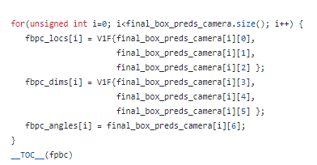
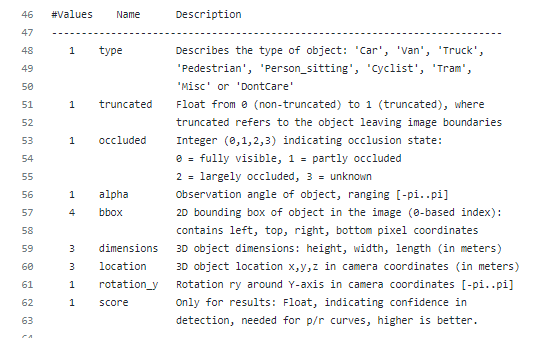

<table>
 <tr>
   <td align="center"><h1>LIDAR + Camera Fusion on KV260</h1>
   </td>
 </tr>
 <tr>
 <td align="center"><h1>KV260 ROS Tutorial</h1>
 </td>
 </tr>
</table>

# Object Detection on LIDAR Point Cloud Displayed in RViz

In this page, we will not again discuss ROS basic concepts or general organizational information which were discussed in the [cam_detection](../cam_detection) section. Instead, we will highlight key topics regarding LIDAR point cloud processing with Vitis AI.

First, make sure to download the two pointpillars models to the correct location where Vitis AI will look for it in `/usr/share/vitis_ai_library/models`. If it's not there, download them with
```bash
mkdir -p /usr/share/vitis_ai_library/models
wget https://www.xilinx.com/bin/public/openDownload?filename=pointpillars_kitti_12000_0_pt-DPUCZDX8G_ISA0_B3136_MAX_BG2-1.3.1-r241.tar.gz -O ~/Downloads/pointpillars_kitti_12000_0_pt-DPUCZDX8G_ISA0_B3136_MAX_BG2-1.3.1-r241.tar.gz
tar -xvf ~/Downloads/pointpillars_kitti_12000_0_pt-DPUCZDX8G_ISA0_B3136_MAX_BG2-1.3.1-r241.tar.gz -C /usr/share/vitis_ai_library/models
wget https://www.xilinx.com/bin/public/openDownload?filename=pointpillars_kitti_12000_1_pt-DPUCZDX8G_ISA0_B3136_MAX_BG2-1.3.1-r241.tar.gz -O ~/Downloads/pointpillars_kitti_12000_1_pt-DPUCZDX8G_ISA0_B3136_MAX_BG2-1.3.1-r241.tar.gz
tar -xvf ~/Downloads/pointpillars_kitti_12000_1_pt-DPUCZDX8G_ISA0_B3136_MAX_BG2-1.3.1-r241.tar.gz -C /usr/share/vitis_ai_library/models
```

The source code for this demonstration is provided in the `kv260_lidar_cam_fusion/src/lidar_detection` directory. It has the following directory structure:
```bash
.
├── CMakeLists.txt
├── launch
│   └── lidar_detection.launch
├── package.xml
├── README.md
├── rviz
│   └── lidar_detection.rviz
└── src
    ├── lidar_detection.cpp
    ├── lidar_detection.hpp
    └── lidar_detection_node.cpp
```

We will start by discussing the source code itself then cover the details for building and launching the node.

## Writing the Code for the New Node
<details>
<summary>Click to see details</summary>

The code for the new node has largely the same structure as `cam_detection`. `lidar_detection_node.cpp` launches the node in the same way.

Again, `lidar_detection.hpp` defines the main API for the `lidar_detection` node. The key differences from the `cam_detection` node start with the interface for the pointcloud processor class is included
```C++
#include "../../common/include/process_pointcloud.hpp"
```

For the lidar processing, we will be publishing two different representations of the output detected objects in addition to the performance (fps) of the model
```C++
ros::Publisher _pub_boxes;
ros::Publisher _pub_pointcloud_2d_projection_image;
```
`_pub_boxes` will be a vector of bounding box coordinates for detected objects. These are 3D coordinates which RViz can use to draw the boxes in 3D point cloud. Other algorithms can use this information as well.

`_pub_pointcloud_2d_projection_image` is an 2D image of the projection of the point cloud in the X-Y plane. In PointPillars parlance, this is called the Birds Eye View (BEV) image.

Now we can look at the implementation of the `lidar_detection` class.

The constructor again initializes our subscribers and publishers. Note the topic names and types that are being subscribed to and published.

```C++
lidar_detection::lidar_detection(ros::NodeHandle n, ros::NodeHandle pn)
{
	_sub_pointcloud = n.subscribe<sensor_msgs::PointCloud2>("/velodyne_points", 10, &lidar_detection::recv_pointcloud_callback, this);
	_pub_boxes = n.advertise<jsk_recognition_msgs::BoundingBoxArray>("/lidar_boxes", 1);
	_pub_pointcloud_2d_projection_image = n.advertise<sensor_msgs::Image>("/lidar_object_img", 1);
	_pub_ml_task_fps = n.advertise<std_msgs::Float32>("/lidar_fps", 1);
}
```

The message containing the actual point cloud from the LIDAR is of type `sensor_msgs::PointCloud2`. For the bounding boxes, we use `jsk_recognition_msgs::BoundingBoxArray` which was a separate package that we installed previously (it is useful because it contains RViz plugin for visualization of the bounding box in 3D). Finally, we will publish the BEV image as a type `sensor_msgs::Image` so it can be easily displayed in RViz like any other image.

The main processing callback is very similar in structure to that of `cam_detection`
```C++
void lidar_detection::recv_pointcloud_callback(const sensor_msgs::PointCloud2ConstPtr& msg)
{
	_pointcloud_processor.run(msg);
	publish_boxes(msg->header, _pointcloud_processor.get_result());
	publish_output_image(msg->header, _pointcloud_processor.get_bevmat());
	publish_fps(_pointcloud_processor.get_fps());
}
```

The pointcloud processor first operates on newly received point clouds to do the neural network inferencing. Then several subroutines are called to publish the output messages. Again, we will discuss the implementation of the `process_pointcloud` object in detail in the next subsection.

While the publishing of the BEV image and the fps calculation is similar to what we've discussed already in `cam_detection`, the 3D bounding box message is new so it warrants extra examination. The implementation is shown below
```C++
void lidar_detection::publish_boxes(const std_msgs::Header header, vitis::ai::PointPillarsResult* result)
{
	jsk_recognition_msgs::BoundingBoxArray boxes;
	boxes.header = header;
	for (int ii = 0; ii < result->ppresult.final_box_preds.size(); ii++)
	{
		jsk_recognition_msgs::BoundingBox box;
		box.header = header;		
		box.pose.position.x = result->ppresult.final_box_preds[ii][0];
		box.pose.position.y = result->ppresult.final_box_preds[ii][1];
		box.pose.position.z = result->ppresult.final_box_preds[ii][2];
		box.pose.orientation.w = 1.0;
		box.dimensions.x = result->ppresult.final_box_preds[ii][3];
		box.dimensions.y = result->ppresult.final_box_preds[ii][4];
		box.dimensions.z = result->ppresult.final_box_preds[ii][5];
		box.value = result->ppresult.final_scores[ii];
		box.label = ii;

		boxes.boxes.push_back(box);
	}
	
	_pub_boxes.publish(boxes);
}
```

First, the `publish_boxes()` function receives as an argument the result of the PointPillar network that Vitis AI is executing. This is of type `vitis::ai::PointPillarsResult`. This is a data structure that is defined in [Vitis AI Library User Guide](https://www.xilinx.com/support/documentation/sw_manuals/vitis_ai/2_0/ug1354-xilinx-ai-sdk.pdf). However, you should also refer to the KITTI dataset documentation for the details about the meanings of the various fields in this structure.

The following to references are very useful for understanding this structure.
1. [Vitis AI PointPillars display parsing code](https://github.com/Xilinx/Vitis-AI/blob/1.3.2/tools/Vitis-AI-Library/pointpillars/src/postprocess/parse_display_result.cpp)  

2. [Kitti development kit documentation](https://github.com/bostondiditeam/kitti/blob/master/resources/devkit_object/readme.txt)  


With this understanding, we can now parse the `vitis::ai::PointPillarsResult` argument in the `publish_boxes()` method above. To do this, we simply loop over the vector of results from Vitis AI and use each individual result to construct a message of type `jsk_recognition_msgs::BoundingBox`. This message contains similar pose information about the bounding box in 3D space. Finally, each bounding box is pushed into an vector that is published as the final output message array.

### Pointcloud Processor Class

The `lidar_detection` node uses an instance of the `process_pointcloud` class to handle the pointcloud processing task (in this case, object detection). This provides a simple abstraction around the Vitis AI library and other housekeeping tasks. This interface is defined in `kv260_lidar_cam_fusion/src/common/include/process_pointcloud.hpp` which is very similar to the `process_image.hpp` for the corresponding processing class used in the `cam_detection` node with some key differences.

First, several headers are included for using the PointPillars model in Vitis AI
```C++
#include <velodyne_pcl/point_types.h>
#include <vitis/ai/pointpillars.hpp>
```

as well as a header that contains translation matrices which define the reference frame of the point cloud relative to the camera in the KITTI dataset. Since we are not using the KITTI dataset, these translations are irrelevant to this design. However, the Vitis AI function which we use to draw the BEV image (`do_pointpillar_display()`) simultaneously draws BEV image and an RGB image containing the original camera image with 3D bounding boxes drawn on it. Because of this, the `do_pointpillar_display()` function requires these translation matrices even when not using them because we're only drawing the BEV image. Therefore, we include these matrices *as original from the KITTI dataset* so we can still use the `do_pointpillar_display()` to draw the BEV image, but we won't discuss them further. The interested user should refer to KITTI dataset documentation for explanation.
```C++
#include "../include/display_transform_matrices.hpp"
```

Next, we define a structure which is used for parsing the point cloud ROS message
```C++
typedef struct msg_offsets
{
	int x;
	int y;
	int z;
	int intensity;
} msg_offsets_t;
```

This structure is populated once at initialization time and will hold indices into the message where desired pieces of information exist. That is, x, y, z coordinates of the point as well as its intensity.


One member variable that deserves special attention is shown below
```C++
vitis::ai::V1F _converted_pointcloud;
```

`V1F` is a typedef of a 1-Dimensional vector of floats defined in the Vitis AI library. This is the data type of the input to the Vitis AI PointPillars `run()` method. This contains a flattened/serialized point cloud as a 1D vector of floats that replicates the structure of the .bin files for the raw point cloud data in the KITTI dataset. That is, it is a 1D vector of floats with the following format
```
{x0, y0, z0, i0, x1, y1, z1, i1, x2, ...}
```
where `x,y,z` contain the point location in 3D space and `i` contains the intensity of that point.

There is an additional private member function to parse the ROS pointcloud message into this V1F format
```C++
void convert_pointcloud_msg_to_v1f(const sensor_msgs::PointCloud2ConstPtr& msg);
```

The implementation of the pointcloud processing class is contained in
`kv260_lidar_cam_fusion/src/common/src/process_pointcloud.cpp`

The constructor again initializes the Vitis AI instance but with the PointPillars model
```C++
process_pointcloud::process_pointcloud()
{
	_ml_task = vitis::ai::PointPillars::create("pointpillars_kitti_12000_0_pt", "pointpillars_kitti_12000_1_pt");
}
```

The run method first converts the pointcloud to V1F format as described above, then runs the neural network inferencing, and generates the BEV display
```C++
void process_pointcloud::run(const sensor_msgs::PointCloud2ConstPtr& msg)
{
	convert_pointcloud_msg_to_v1f(msg);
	detect_objects();
	generate_display();
}
```

The implementation of the `convert_pointcloud_msg_to_v1f()` method is shown below
```C++
void process_pointcloud::convert_pointcloud_msg_to_v1f(const sensor_msgs::PointCloud2ConstPtr& msg)
{
	// Convert to V1F format V1F is defined in <vitis/ai/pointpillars.hpp> and is only a vector of floats
	msg_offsets_t msg_offsets;
	get_msg_offsets(msg, msg_offsets);
	
	_converted_pointcloud.clear();
	for (int ii = 0; ii < msg->width; ii++)
	{
		float x, y, z, intensity;
		x = *(float*)(&msg->data[0] + (msg->point_step*ii) + msg_offsets.x);
		y = *(float*)(&msg->data[0] + (msg->point_step*ii) + msg_offsets.y);
		z = *(float*)(&msg->data[0] + (msg->point_step*ii) + msg_offsets.z);
		intensity = *(float*)(&msg->data[0] + (msg->point_step*ii) + msg_offsets.intensity);
		
		_converted_pointcloud.push_back(x);
		_converted_pointcloud.push_back(y);
		_converted_pointcloud.push_back(z);
		_converted_pointcloud.push_back(intensity/255.0); // HDL64E is different from VLP32C. HDL64E is a float value. VLP32C is int8
	}
}
```

This function simply loops over the entire received `sensor_msgs::PointCloud2ConstPtr` message, extracts the x, y, z, coordinates and intensity at each point, then pushes each one-by-one into a V1F vector. Note that while the received x, y, and z coordinates in the message are floats, intensity if an 8-bit integer for the VLP32C but may be different depending on the specific LIDAR unit that is used. Therefore, we convert it to a float on the range of \[0.0, 1.0).

Also note the use of the `get_msg_offsets()` method to determine how to read the fields in the pointcloud. This is shown below
```C++
void process_pointcloud::get_msg_offsets(const sensor_msgs::PointCloud2ConstPtr& msg, msg_offsets_t& msg_offsets)
{
	for (int ii = 0; ii < msg->fields.size(); ii++)
	{		
		if (msg->fields[ii].name == "x")
		{
			msg_offsets.x = msg->fields[ii].offset;
		}
		if (msg->fields[ii].name == "y")
		{
			msg_offsets.y = msg->fields[ii].offset;
		}
		if (msg->fields[ii].name == "z")
		{
			msg_offsets.z = msg->fields[ii].offset;
		}
		if (msg->fields[ii].name == "intensity" || msg->fields[ii].name == "i") // HDL64E is different from VLP32C
		{
			msg_offsets.intensity = msg->fields[ii].offset;
		}
	}
}
```

For each new point cloud message that comes in, this function is called to search the structure for the desired field string names (i.e. "x", "y", "z", and "intensity"). Then the corresponding `offset` member tells us how we can index the message to retrieve that point using pointer arithmetic which was used as previously shown in the `convert_pointcloud_msg_to_v1f()` method.

The `detect_objects()` method is again very simple
```C++
void process_pointcloud::detect_objects()
{
	ros::Time begin = ros::Time::now();
	_result = _ml_task->run(_converted_pointcloud);
	ros::Time end = ros::Time::now();
	
	_ml_task_fps = 1/((end-begin).toSec());
}
```

and finally, the BEV image is generated
```C++
void process_pointcloud::generate_display()
{
	vitis::ai::ANNORET annoret;
	cv::Mat rgbmat;
	
	_bevmat = vitis::ai::bev_preprocess(_converted_pointcloud);
	_ml_task->do_pointpillar_display(_result, vitis::ai::E_BEV, _display_transform_matrices.get_display_data(), rgbmat, _bevmat, 1242, 375, annoret);
}
```

The `generate_display()` method simply uses Vitis AI utility functions to do the 2D projection and draw the bounding boxes.

</details>

## Building the New Node
<details>
<summary>Click to see steps</summary>

Building the node is very similar to `cam_detection` with the addition of a few different libraries that are used as shown below
```cmake
cmake_minimum_required(VERSION 3.0.2)
project(lidar_detection)

set(CMAKE_CXX_STANDARD 17)
set(CMAKE_CXX_STANDARD_REQUIRED ON)
set(CMAKE_CXX_EXTENSIONS OFF)

find_package (catkin REQUIRED COMPONENTS
	roscpp
	pcl_ros
	cv_bridge
	velodyne_pcl
)
find_package(OpenCV REQUIRED)
find_package(vitis_ai_library REQUIRED)

catkin_package(
	DEPENDS OpenCV	
)

include_directories(
	${catkin_INCLUDE_DIRS}
	${OpenCV_INCLUDE_DIRS}
	${vitis_ai_library_INCLUDE_DIRS}
	${velodyne_pcl_INCLUDE_DIRS}
	../common/include
)

add_executable(lidar_detection
	../common/src/display_transform_matrices.cpp
	../common/src/process_pointcloud.cpp
	src/lidar_detection.cpp
	src/lidar_detection_node.cpp
)

add_dependencies(lidar_detection
	${catkin_EXPORTED_TARGETS}
)
target_link_libraries(lidar_detection
	${catkin_LIBRARIES}
	${OpenCV_LIBRARIES}
	${vitis_ai_library_LIBRARIES}
	vitis_ai_library-pointpillars
	glog
)
```

Now we are ready to build
```bash
cd kv260_lidar_cam_fusion/
catkin_make
```

</details>

## Launching the New Node
<details>
<summary>Click to see steps</summary>

Again, the launch file and package manifest are very similar from `cam_detection` except we launch the Velodyne driver instead of the camera driver node

```xml
<?xml version="1.0"?>
<launch>
	<!-- Static TF transforms -->
	<node pkg="tf2_ros" type="static_transform_publisher" name="map_to_velodyne" args="0.0 0.0 0.0 0.0 0.0 0.0 map velodyne" />
	
	<!-- Launch Lidar node (optional based on command line - if not, expects you to play a .bag file) -->
	<group if="$(eval arg('omit_sensor') == 0)">
		<include file="$(find velodyne_pointcloud)/launch/VLP-32C_points.launch"/>
	</group>

	<!-- Launch Lidar processing node -->
	<node pkg="lidar_detection" type="lidar_detection" name="lidar_detection" output="screen" />
	
	<!-- Launch ml task FPS display node -->
	<group ns="fps_lidar">
		<remap from="/fps" to="/lidar_fps" />
		<remap from="/fps_marker" to="/lidar_fps_marker" />
		<include file="$(find display_fps)/launch/display_fps.launch" />
	</group>
</launch>
```

We can now run the demonstration
```bash
roslaunch lidar_detection lidar_detection.launch &
```

Once the node is up and running, launch RViz
```bash
rviz -d src/lidar_detection/rviz/lidar_detection.rviz
```

</details>

# Support

GitHub issues will be used for tracking requests and bugs. For questions go to [forums.xilinx.com](http://forums.xilinx.com/).

# License

Licensed under the Apache License, Version 2.0 (the "License"); you may not use this file except in compliance with the License.

You may obtain a copy of the License at [http://www.apache.org/licenses/LICENSE-2.0]( http://www.apache.org/licenses/LICENSE-2.0 )


Unless required by applicable law or agreed to in writing, software distributed under the License is distributed on an "AS IS" BASIS, WITHOUT WARRANTIES OR CONDITIONS OF ANY KIND, either express or implied. See the License for the specific language governing permissions and limitations under the License.

<p align="center"> XD016 | &copy; Copyright 2021–2022 Xilinx, Inc.</p>
