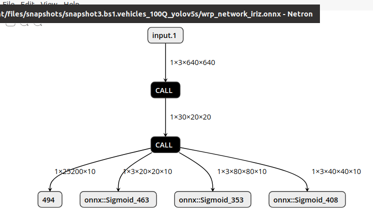
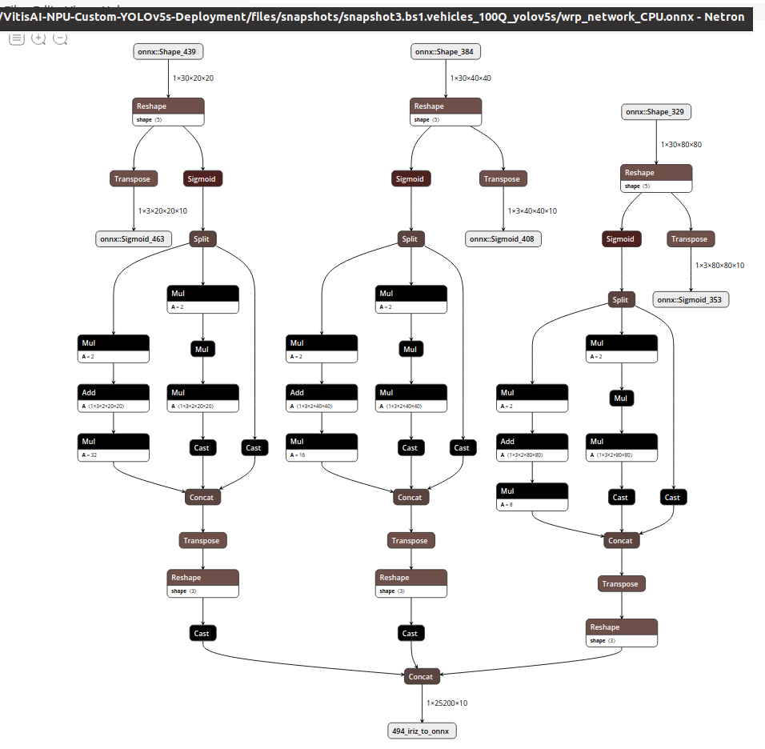

<!--
Copyright © 2025 Advanced Micro Devices, Inc. All rights reserved.
MIT License

-->

<table class="sphinxhide" style="width:100%;">
  <tr>
    <td align="center">
      <picture>
        <source media="(prefers-color-scheme: dark)" srcset="https://raw.githubusercontent.com/Xilinx/Image-Collateral/main/logo-white-text.png">
        
      </picture>
      <h1>Vitis AI Tutorials</h1>
    </td>
  </tr>
</table>

# Deploying a Custom YOLOv5s on Vitis-AI NPU


#### Current Status

- Release:      `5.1`
- Host OS:      Ubuntu 22.04.5 LTS (Jammy Jellyfish)
- Target Board: VEK280 revB3

- Last update:  23 Oct. 2025


## Table of Contents


[Introduction](#introduction)

[1 Getting Started with Vitis AI](#1-getting-started-with-vitis-ai)
- [1.1 Directories Organization](#11-directories-organization)
- [1.2 Setup the Ubuntu Host PC](#12-setup-the-ubuntu-host-pc)
- [1.3 Setup the VEK280 Target Board](#13-setup-the-vek280-target-board)
- [1.4 Before Running Any Applications](#14-before-running-any-application)


[2 The COCO Dataset](#2-the-coco-dataset)
- [2.1 JSON COCO Annotation File](#21-json-coco-annotation-file)
- [2.2 YOLOv5 Predictions](#22-yolov5-predictions)
- [2.3 Non Maximum Suppression](#23-non-maximum-suppression)
- [2.4 pycocotools](#24-pycocotools)
- [2.5 mAP Evaluation Metric](#25-map-evaluation-metric)


[3 COCO YOLOv5s](#3-coco-yolov5s)
- [3.1 Start Vitis AI Docker](#31-start-vitis-ai-docker)
- [3.2 Clone Ultralytics YOLOv5](#32-clone-ultralytics-yolov5)
- [3.3 Install New Packages](#33-install-new-packages)
- [3.4 COCO YOLOv5s Reference mAP on Host PC](#34-coco-yolov5s-reference-map-on-host-pc)


[4 Custom YOLOv5s](#4-custom-yolov5s)
- [4.1 Vehicles Dataset](#41-vehicles-dataset)
- [4.2 Effective reTraining](#42-effective-retraining)
- [4.3 Vehicles Ground Truth File in JSON COCO Format](#43-vehicles-ground-truth-file-in-json-coco-format)
- [4.4 Custom YOLOv5s reference mAP on Host PC](#44-custom-yolov5s-reference-map-on-host-pc)


[5 Deploying from Host to Target](#5-deploying-from-host-to-target)
- [5.1 Overview](#51-overview)
- [5.2 Generate the COCO YOLOv5s Snapshot](#52-generate-the-coco-yolov5s-snapshot)
- [5.3 Generate the Custom YOLOv5s Snapshot](#53-generate-the-custom-yolov5s-snapshot)
- [5.4 Test the Snapshots on the Target Board](#54-test-the-snapshots-on-the-target-board)


[6 mAP on Target Board](#6-map-on-target-board)
- [6.1 Python Applications](#61-python-applications)
- [6.2 Inference with COCO YOLOv5s](#62-inference-with-coco-yolov5s)
- [6.3 Get mAP of COCO YOLOv5s](#63-get-map-of-coco-yolov5s)
- [6.4 Inference with Custom YOLOv5s](#64-inference-with-custom-yolov5s)
- [6.5 Get mAP of Custom YOLOv5s](#65-get-map-of-custom-yolov5s)


[Additional Resources and Legal Notices](#additional-resources-and-legal-notices)
- [Supported Resources](#supported-resources)
- [Revision History](#revision-history)
- [Please Read: Important Legal Notices](#please-read-important-legal-notices)
- [AUTOMOTIVE APPLICATIONS DISCLAIMER](#automotive-applications-disclaimer)
- [Copyright](#copyright)


## Introduction

This tutorial shows you how to deploy a Convolutional Neural Network (NN) model for **Object Detection** with the 
**Vitis AI 5.1**
development flow, from the host PC to the
Versal VEK280 which contains the NPU (**Neural Processing Unit**).

The NN is a **YOLOv5 Small** (shortly **YOLOv5s**), originally trained on the
[COCO](https://cocodataset.org/#detection-2019)
dataset with 80 classes in the PyTorch framework.
It is then re-trained using the
[Vehicles-OpenImages](http://arxiv.org/pdf/1811.00982)
dataset. This allows the model to detect objects for what concerns the following five vehicles: `Car, Bus, Ambulance, Motorcycle, Truck`.

Both datasets share the same "COCO format JSON file" for the ground truth annotations and the predictions (or detections).

The re-trained NN file will be stored in the [weights](files/weights) folder of this repository.
Such training process is done following the 
[Training the YOLOv5 Object Detector on a Custom Dataset](https://pyimagesearch.com/2022/06/20/training-the-yolov5-object-detector-on-a-custom-dataset)
public tutorial from [PyImageSearch](https://pyimagesearch.com/).

The NPU is an inference accelerator from AMD.
Its architecture  is a combination of FPGA Programmable Logic (shortly PL) and
[AI-Engine](https://www.xilinx.com/products/technology/ai-engine.html#overview) (shortly AIE)
technology.
In the following of this document, we might refer to the Versal NPU alternatively as
the "Vitis AI NPU",
both terms are equivalent (as you cannot work on the Versal NPU without the Vitis AI flow).

The target board running the Versal NPU for this tutorial is the [Versal AI Edge VEK280](https://www.xilinx.com/products/boards-and-kits/vek280.html).


## 1 Getting Started with Vitis AI

The following document assumes you have installed
Vitis AI 5.1 using the `vitis-ai-5.1.tar` archive somewhere in
your file system, one level below a designated working directory
`{WRK_DIR}` on the Ubuntu Host PC. For example, this document uses a structure
like this:

```bash
# your working directory
export WRK_DIR=~/Public/VAI5.1/bash
# VITIS-ai is one level below the working dir
export VITIS_AI_REPO=${WRK_DIR}/Vitis-AI
```

**Note:** The `${VITIS_AI_REPO}` variable points to the folder that stores the current Vitis AI release.

### 1.1 Directories Organization

After expanding the `vitis-ai-5.1.tar` archive in your `${WRK_DIR}` directory,  go to its
`${VITIS_AI_REPO}` sub-directory. You should see the following folders:

```
${WRK_DIR} # ~/Public/VAI5.1/bash
.
|
├── ${WRK_DIR}/Vitis-AI # ${VITIS_AI_REPO}

              ├── bin
              ├── docker
              ├── examples
              ├── npu_ip
              ├── src
              └── tools
```

Create a folder named `tutorials` under the `${WRK_DIR}` directory.
Copy this tutorial into that folder and renamed it as
`${WRK_DIR}/tutorials/VitisAI-NPU-Custom-YOLOv5s-Deployment`.


### 1.2 Setup the Ubuntu Host PC

If you are working on an Ubuntu PC, set it up using the following steps:

1. Install the Docker image.
   Note that without the `--gpus all` flag, the Docker image runs on your host CPU without any GPU support.
   Also note that the `--ipc=host` flag increases the shared memory size, as described in the [Using pre-built images](https://github.com/pytorch/pytorch?tab=readme-ov-file#using-pre-built-images) section of the [PyTorch](https://github.com/pytorch/pytorch) official GitHub page.


   ```shell
   cd ${VITIS_AI_REPO}

    source npu_ip/settings.sh VE2802_NPU_IP_O00_A304_M3 --nofallback

   ./docker/run.bash --gpus all --ipc=host -v ${WRK_DIR}:/workspace
   # real example:
   #./docker/run.bash --gpus all --ipc=host -v /home/danieleb/Public/VAI2025.1/release:/workspace
   ```

   **WARNING:** AT THE END OF THESE COMMANDS YOU ARE INSIDE THE DOCKER IMAGE (BE CAREFUL: NO PROMPT SIGNALs IT).

2. If you need a package that is not included in the Docker image, add it by manually editing the `$VITIS_AI_REPO/docker/*.dockerfile` file. Insert your changes around line 598, immediately after the `ENV MISPO_DOCKER=1` line, as shown in the following example:

   ```shell
    # line 596
    ENV MISPO_DOCKER=1
    # add my own python package for TF2
    RUN python3 -m pip install --no-cache-dir install image-classifiers
    # add my own python package for PyTorch
    RUN python3 -m pip install --no-cache-dir install tqdm
    RUN python3 -m pip install --no-cache-dir install onnxruntime
    RUN python3 -m pip install --no-cache-dir install torch
    RUN python3 -m pip install --no-cache-dir install torchvision
    RUN python3 -m pip install --no-cache-dir install torchsummary
    RUN python3 -m pip install --no-cache-dir install torchinfo
    RUN python3 -m pip install --no-cache-dir install randaugment
    RUN python3 -m pip install --no-cache-dir install utils
    #RUN python3 -m pip install --no-cache-dir install onnx_tool
    #RUN python3 -m pip install --no-cache-dir install jupyter
   ```

3. Install the Cross Compiler or "VitisAI SDK"  with these commands:

   ```shell
    cd ${WRK_DIR}/bck
    # make it executable
    chmod 777 ./sdk.sh
    # install the VitisAI SDK into folder
    bash -x ./sdk.sh -d ../sdk_vai5.1
   ```
   
   **Note**: Use [setup_sdk.sh](files/scripts/setup_sdk.sh) to setup the VitisAI SDK when needed.

After you complete these actions, your Vitis AI setup on the Host Computer should look like this:

  ```
  # this is the ${WRK_DIR}
  .
  ├── bck
  |
  ├── sdk_vai5.1
  |
  ├── tutorials     # where this repository goes
  |
  └── Vitis-AI      # this is the ${VITIS_AI_REPO}
      ├── bin
      ├── docker
      ├── examples
      ├── npu_ip
      ├── src
      └── tools
  ```


### 1.3 Setup the VEK280 Target Board

After obtaining the IP address of the target board (for example, `192.168.1.217`) using the `ifconfig` command, establish a remote connection between the host and the target with a command such as `ssh -X root@192.168.1.217`.

To transfer files from the host to the target, use a command similar to the following:

    ```
    scp myfile root@192.168.1.217:/home/root
    ```


To transfer files from the target to the host, use a command similar to the following:

    ```
    scp root@192.168.1.217:/home/root/myfile
    ```

If you do not have a `/home/root` folder, create it with the following commands:

   ```shell
   cd /
   mkdir /home
   mkdir /home/root
   export HOME=/home/root
   ```

### 1.4 Before Running Any Application

Before launching any application on the target VEK280 board, execute the following procedure exactly in this order:


1.  Copy the entire `$VITIS_AI_REPO` from the Ubuntu Host PC to the target board with this command:

    ```shell
    cd ${VITIS_AI_REPO}
    cd ..
    scp -r ${VITIS_AI_REPO} root@192.168.1.16:/home/root # renamed as Vitis-AI for ease of use
    ```

2. Take the [target_setup_vai.sh](files/scripts/target_setup_vai.sh) bash script, and copy it
(via `scp`)  into the `/home/root` folder of the target board.
You have to execute it every time you have just booted the board (once forever until next shutdown).
Note the following lines:

    ```shell
    export VAISW_INSTALL_DIR=/etc/vai
    export PYTHONPATH=$VAISW_INSTALL_DIR/lib/python

    # enable statistics
    #export VAISW_RUNSESSION_SUMMARY=all

    # this is the currently available snapshot
    export RESNET50_SNAPSHOT=/run/media/mmcblk0p1/snapshot.VE2802_NPU_IP_O00_A304_M3.resnet50.TF
    ```

3. Run these instructions once connected via `ssh` to the target board:

    ```shell
    cd /home/root/

    # make new folders
    mkdir snapshots
    mkdir datasets
    mkdir datasets/imagenet
    mkdir datasets/imagenet/val
    mkdir datasets/vcor
    mkdir datasets/vcor/test

    # check
    ls -l
    ```

    You should see -at least- the following files and folders below `/home/root` level:

    ```
    . # /home/root
    |
    ├── snapshots
    ├── Vitis-AI
    ├── datasets
    ├── target_setup_vai.sh
    ```


4. Transfer via `scp` both the following folders from the host computer to the target board (assuming 192.168.1.217 as its IP address):

    ```shell
    # host computer side
    cd ${WRK_DIR}/tutorials/VitisAI-NPU-Custom-YOLOv5s-Deployment/files
    scp -r app scripts root@192.168.1.217:/home/root/
    scp -r snapshots root@192.168.1.217:/home/root/
    ```

5.  Transfer there the `validation` images from your datasets (once you have them in your host computer, see next sections).


## 2 The COCO Dataset

If you read the public tutorial titled
[COCO Dataset: All You Need to Know to Get Started](https://www.v7labs.com/blog/coco-dataset-guide),
you can find the complete list of the 80 classes that COCO has to offer, as well as the description of
the **JSON annotation file** with the Ground Truth (often shortened as "GT") labels,
which contains a list of all the object annotations for each image, including the object category,
bounding box coordinates, and segmentation masks (if available).

For your reference see the [instances_val2017.json](files/datasets/coco/annotations/instances_val2017.json), which normally is placed in a folder like this:

```
datasets/coco/annotations/instances_val2017.json
```

related to the images stored in:

```
datasets/coco/images/val2017
```

From the [COCO download area](https://cocodataset.org/#download) take the first four archives (the last two are optional):

- http://images.cocodataset.org/zips/val2017.zip
- http://images.cocodataset.org/zips/train2017.zip
- http://images.cocodataset.org/annotations/annotations_trainval2017.zip
- http://images.cocodataset.org/annotations/stuff_annotations_trainval2017.zip

- http://images.cocodataset.org/zips/test2017.zip
- http://images.cocodataset.org/annotations/image_info_test2017.zip

and put them into the
[datasets/coco](files/datasets/coco) folder. Once unzipped all the archives you should see at least the following folders:

```shell
# tree -L 3 -d
.
├── annotations
├── images
│   ├── test
│   ├── test2017
│   └── val2017
└── labels
    ├── train2017
    └── val2017
```


### 2.1 JSON COCO Annotation File

The predictions or detections (usually shortened as "DT") are stored in a proper COCO JSON
annotation file - different from the GT file - according to this format:

```json
[{
"image_id" : int,
"category_id" : int,
"bbox" : [x,y,width,height],
"score" : float,
}]
```
Note that `category_id` is the class index (integer value) pointing to the class name (a string), for example:

```text
[
    {
        "image_id": 1,
        "category_id": 2,
        "bbox": [100, 150, 50, 80],
        "score": 0.95
    },
    {
        "image_id": 1,
        "category_id": 4,
        "bbox": [200, 210, 60, 90],
        "score": 0.89
    }
]
```

In the COCO dataset the `image_id` is an integer value (but in another dataset you can use a string),
whereas `score` is a 32-bit floating point value representing the highest probability.
The `image_id` must be unique per each image.

The `bbox` field refers to the **bounding box** coordinates for an object in an image. The bounding box is represented by four values:
- the x and y coordinates of the top-left corner `(X1, Y1)` and
- the width and height of the box `W, H`
- `X1, Y1, W, H` are not normalized values (in the COCO JSON annotation file).

Note: box coordinates are 32-bit floating point values, measured from the top left image corner (and are 0-indexed).
COCO recommends rounding coordinates to the nearest tenth of a pixel to reduce resulting JSON file size (but nobody seems to do it,
in the various public repositories).


### 2.2 YOLOv5 Predictions

The bbox predictions coming from the YOLOv5 detector are usually normalized,
representing them as fractions of the image width and height (often shortened as `Xc Yc W H`), in the so called **center-based** format.

Here is an example of the "bbox" field if stored in the JSON file:

```json
{
   "annotations": [
       {
           "id": 1,
           "image_id": 1,
           "category_id": 1,
           "bbox": [0.1, 0.2, 0.3, 0.4],
           "area": 0.12,
           "iscrowd": 0
       },
       {
           "id": 2,
           "image_id": 1,
           "category_id": 2,
           "bbox": [0.5, 0.6, 0.7, 0.8],
           "area": 0.42,
           "iscrowd": 0
       }
   ]
}
```
Note that each annotation `id` must be a unique number even if the `image_id` is the same: all in all you can have more than one object per each image.

In this example, the first annotation has a bounding box with the top-left corner at (0.1, 0.2) and a width and height of 0.3 and 0.4, respectively.
The second annotation has a bounding box with the top-left corner at (0.5, 0.6) and a width and height of 0.7 and 0.8, respectively.

Note that when you want to draw the bounding box over the input image you must move from the center-based format (`Xc Yc W H`)
to the **corner-based** format (`X1 Y1 X2 Y2`) and apply a proper scaling, which is the ratio between the original image size
(for example 320x280) and the image size in input to the YOLOv5 detector (which is 640x640).

Here are different formulas in python code:

```python
   boxes = pred[..., :4]
   # Convert center-based format to corner-based format
   boxes[:, 0] = boxes[:, 0] - boxes[:, 2] /2  # X1
   boxes[:, 1] = boxes[:, 1] - boxes[:, 3] /2  # Y1
   boxes[:, 2] = boxes[:, 0] + boxes[:, 2] /2  # X2
   boxes[:, 3] = boxes[:, 1] + boxes[:, 3] /2  # Y2
   # Scale to original image size
   scale_x = original_size[1] / input_size[1]
   scale_y = original_size[0] / input_size[0]
   boxes[:, [0, 2]] *= scale_x
   boxes[:, [1, 3]] *= scale_y
```

or alternatively (same content, different style):

```python
x_center, y_center, width, height, conf, *class_probs = detection.tolist()
# Get the class index (highest probability class)
class_index = class_probs.index(max(class_probs))
# Calculate bounding box coordinates from Xc, Yc, idth, height
x1 = int( (x_center - width  / 2) * scale_x )
y1 = int( (y_center - height / 2) * scale_y )
x2 = int( (x_center + width  / 2) * scale_x )
y2 = int( (y_center + height / 2) * scale_y )
```

If you need to generate the `X1 Y1 W H` not-normalized values (used in the COCO GT annotation file) starting from
the `Xc Yc W H` normalized  values (generated by the YOLOv5 detector) you must apply this conversion function:

```python
def bbox_X1Y1WH_to_XcYcWH(bbox, original_size, input_size):
	# grab the bounding box values
	(x, y, w, h) = bbox
    hRatio = original_size[1] / input_size[1]
	wRatio = original_size[0] / input_size[0]
	xMin = int(round(x - (w / 2)))
	yMin = int(round(y - (h / 2)))
	# scale them as per the original image size
	return (xMin * wRatio, yMin * hRatio, w * wRatio, h * hRatio)
```

There is also the opposite conversion, among not-normalized values,
from  `X1 Y1 W H` to `X1 Y1 X2 Y2`, as shown in this function:

```python
# Load COCO ground truth data
def load_coco_ground_truth(coco_json_path):
    coco_gt = COCO(coco_json_path)
    ground_truths = defaultdict(list)
    for annotation in coco_gt.dataset['annotations']:
        image_id = annotation['image_id']
        bbox = annotation['bbox']  # [x1, y1, width, height]
        x1 = bbox[0]
        y1 = bbox[1]
        x2 = bbox[0] + bbox[2]
        y2 = bbox[1] + bbox[3]
        ground_truths[image_id].append([x1, y1, x2, y2])
    return ground_truths
```

Therefore, be careful with the different bbox data formats, when doing the evaluation of the **mean Average Prediction (mAP)**.


### 2.3 Non Maximum Suppression

The `nms` function from the `torchvision.ops` module is used to perform
**Non-Maximum Suppression** (shortened as "NMS"), which is a technique commonly used in object
detection to filter out overlapping boxes resulting from detections on the same object.

The `nms` function generally takes the following input parameters:

- `boxes`:
        a `torch.Tensor` of shape `(N, 4)` where `N` is the number of boxes
        (detections). Each box is represented by its coordinates in the format
        `X1, Y1, X2, Y2` (not-normalized values) , which correspond to the
        top-left `(X1, Y1)` and bottom-right `(X2, Y2)` corners.

- `scores`:
        a `orch.Tensor` of shape `(N,)` containing the confidence scores for each
        detection. These scores indicate the likelihood that a box contains an
        object of interest.

- `iou_threshold`: (optional) a float value that defines the threshold for the
        **Intersection over Union (IoU)**.
        Boxes with an IoU greater than this threshold will be suppressed.
        Default: Typically set to `0.5`, but it can be adjusted based on the desired
        level of overlap you want to allow.

The `nms` function generates the following output:

- `selected_indices`:
        a `torch.Tensor` containing the indices of the boxes that were selected after applying NMS.
        These indices correspond to the input boxes. The output tensor will have a
        shape of `(K,)`, where `K` is the number of boxes that were selected.
        The boxes at these indices should be considered for further processing,
        such as drawing on an image or further evaluation.


### 2.4 pycocotools

The COCO Dataset comes with a powerful set of tools with various APIs among which the very popular
[pycocotools](https://github.com/cocodataset/cocoapi/tree/master/PythonAPI/pycocotools), which is a short name for the "COCO Python APIs".

To show some pycocotools APIs, here is the code of `compute_map()` function which computes mAP using COCO class and related evaluation methods (all from pycocotools):
(all bbox are in X1 Y1 W H format)

```python
def compute_map(annotations_file, predictions_file):

    # use the COCO class to load and read the ground-truth annotations
    coco_gt = COCO(annotations_file)
    # Load the detections made by the model from the JSON file
    coco_dt = coco_gt.loadRes(predictions_file)
    # Initialize the COCO evaluation object with ground truth and detection results
    coco_eval = COCOeval(coco_gt, coco_dt, "bbox")
    # Run the evaluation on the predictions
    coco_eval.evaluate()
    coco_eval.accumulate()  # Accumulate metrics across images
    coco_eval.summarize()   # Display the evaluation metrics in a summarized form
    print()

    # Extracting per-class AP from COCOeval
    # Get category IDs
    cat_ids = coco_gt.getCatIds()  # Get category IDs from GT
    category_names = [coco_gt.loadCats(cat_id)[0]['name'] for cat_id in cat_ids]  # Get category names
    num_classes = len(category_names)
    # The mAP results are stored in the "precisions" array of COCOeval
    # Shape of precisions: [num_iou_thrs, num_classes, max_detections]
    # Use IoU thresholds [0.5:0.95] and [0.50]
    print(f"Average Precision (AP) for Class mAP50 mAP50-0.95")
    ap_data = coco_eval.eval['precision']  # Get the precision values from COCOeval
    print("Shape of ap_data:", ap_data.shape)
    # Print the header
    print(f"{'Class':<15} {'mAP50':<10} {'mAP50-0.95':<15}")
    print("=" * 40)
    for i, cat_id in enumerate(cat_ids):
        ap_mAP50 = ap_data[0, i, :, :, :].mean()  # AP at IoU=0.50 across all max_dets and area ranges
        ap_mAP50_95 = ap_data[1:, i, :, :, :].mean()  # AP for IoU=0.5:0.95 across all max_dets and area range
        print(f"{category_names[i]:<15}: {ap_mAP50:<10.5f} {ap_mAP50_95:<15.5f}")
```


<br>

### 2.5 mAP Evaluation Metric

Computing the mAP is very important to check the accuracy of the predictions done by the Object Detector NN (YOLOv5s in our case).


According to the
[COCO Detection evaluation metric](https://cocodataset.org/#detection-eval), having
a single IoU threshold to assess the detection model
might not be a good idea since a single threshold can induce a bias in the
evaluation metric. Therefore, the COCO mAP evaluator
(`coco_eval.evaluate()`) averages the mAP of 80
classes over 10 IoU thresholds from 0.5 to 0.95 with a step
size of 0.05 (`AP@[0.5:0.05:0.95]`).

The IoU thresholdis used to determine whether a predicted bounding box is a true positive or a false positive. During evaluation (e.g., when computing metrics like mean Average Precision, mAP), the IoU threshold is set to assess if the predicted bounding box overlaps sufficiently with a ground truth box. A common IoU threshold is 0.5, meaning that a prediction is considered a correct detection if the IoU between predicted and ground truth boxes is greater than or equal to 0.5.

The confidence threshold helps filter out weak predictions. During inference, the model outputs bounding boxes along with a confidence score indicating the likelihood of an object being present. Only the predictions with confidence scores above this threshold are retained for further processing. This helps reduce the number of false positives that are outputted. A typical value might be set at 0.4 or 0.5, but it can be adjusted based on the application requirements.

Note these definitions of "small", "medium" and "large" objects:
- small objects: area < 322
- medium objects: 322 < area < 962
- large objects: area > 962

<br>


The `AP@[IoU=50]` scores mostly benchmark the model's ability to classify objects into the correct classes.
The `AP@[IoU=.50:.95]` scores mostly benchmark the model's precise ability to localize the objects.

Note that the
[Ultralytics YOLOv5](https://github.com/ultralytics/yolov5)
NN that you will use, starting from next section, does not use the pycocotools for computing the mAP.
The  mAP results claimed by Ultralytics are obtained with their own libraries (the main file is `val.py`).
But such libraries are not portable in the VEK280 target board embedded environment; therefore you need to compute the mAP
in a different way, this is why I have designed the [coco_mean_ap.py](files/app/coco_mean_ap.py) and [vehicles_mean_ap.py](files/app/vehicles_mean_ap.py) applications using the pycocotools.

However, note the following issue 11779:
[Pycocotools gives very less mAP value compared to (Ultralytics) yolov5 mAP](https://github.com/ultralytics/yolov5/issues/11779) where it is stated that:

*The difference in mAP values between what you get from `val.py` and when using pycocotools to calculate mAP might be due to a few reasons.*

*Firstly, it's important to note that `val.py` computes mAP using a specific set of default parameters and thresholds. On the other hand, when you use pycocotools to calculate mAP, the parameters and thresholds might differ, leading to variations in the results.*

*Additionally, `val.py` in YOLOv5 employs a simplified evaluation process where anchors and aspect ratios are pre-defined. This can yield different results compared to running evaluation with custom configurations using pycocotools.*

*Moreover, the mAP values obtained from `val.py` are computed on the validation set, which the model has seen during training. pycocotools, on the other hand, calculates mAP on the test set, which the model hasn't seen before. This can also contribute to the difference in mAP values.*

*It's worth mentioning that the mAP values are influenced by various factors, including the quality of ground truth annotations, the sizes of objects, the dataset's diversity, and the specific evaluation methodology employed.*

*Ultimately, both `val.py` and pycocotools provide valuable insights into model performance, but it's normal to observe slight variations in the mAP values they produce.*

To summarize shortly:

- you will use the pycocotools to compute the mAP, even if the results will be lower than the ones published by Ultralytics (which, from a certain point of view, they can be seen as the "best case");

- the two applications [coco_mean_ap.py](files/app/coco_mean_ap.py) and [vehicles_mean_ap.py](files/app/vehicles_mean_ap.py) exploit the pycocotools for the mAP computation and they can both run either on the target board or on the host computer.


## 3 COCO YOLOv5s

The original YOLOv5 Small NN was trained on the
[COCO](https://cocodataset.org/#detection-2019)
dataset, so it is shortened as "COCO YOLOv5s" in the following of this document.

### 3.1 Start Vitis AI Docker

Launch the usual commands to enter into the docker container environment from the host computer.

### 3.2 Clone Ultralytics YOLOv5

Clone the
[Ultralytics YOLOv5](https://github.com/ultralytics/yolov5)
repository with the following command:

```shell
cd /workspace/tutorials/VitisAI-NPU-Custom-YOLOv5s-Deployment/files
git clone https://github.com/ultralytics/yolov5.git
cd yolov5
```

Note the following
[Inference Settings](https://docs.ultralytics.com/yolov5/tutorials/pytorch_hub_model_loading/#detailed-example) of YOLOv5:

```python
model.conf  = 0.25   # NMS confidence threshold
iou         = 0.45   # NMS IoU threshold
agnostic    = False  # NMS class-agnostic
multi_label = False  # NMS multiple labels per box
max_det     = 1000   # maximum number of detections per image
amp         = False  # Automatic Mixed Precision (AMP) inference
```

In the Ultralytics YOLOv5 repository, the following two scripts serve different purposes related to inference and evaluation of the YOLOv5 model:

- choose `detect.py` for running inference and visualizing predictions on individual images or video streams.

- Choose `val.py` for evaluating the model against a labeled validation set to determine its overall performance metrics, such as mAP and recall.


### 3.3 Install New Packages

Give a look at `yolov5/requirements.txt`
file and uncomment packages you might want to install, then launch this command:

```shell
# install jupyter notebook
python3 -m pip install jupyter
# install all other packages
python3 -m pip install -qr requirements.txt comet_ml
```

you should see this warning:

```
#WARNING: The script cpuinfo is installed in '${HOME}/.local/bin' which is not on PATH.
```

then launch the following command because of the previous warning

```shell
export PATH=${PATH}:${HOME}/.local/bin
```

The script [setup_docker.sh](files/scripts/setup_docker.sh) contains all the previous commands and
it can be used any time you start from scratch the docker container tp install such packages.


### 3.4 COCO YOLOv5s Reference mAP on Host PC

Validate a model's accuracy on the
[COCO](https://cocodataset.org/#home)
dataset's
with the `yolov5/val.py` script: models are downloaded automatically from the
[latest YOLOv5 release](https://github.com/ultralytics/yolov5/releases);
to show results by class use the `--verbose` flag.

You can run the  
[ipython](https://ipython.org/citing.html) 
interpreter: 

```shell
# you should be already here:
cd /workspace/tutorials/VitisAI-NPU-Custom-YOLOv5s-Deployment/files
# now go to Ultralytics folder 
cd yolov5
# launch interpreter
ipython

# Download COCO validation dataset
torch.hub.download_url_to_file('https://github.com/ultralytics/assets/releases/
download/v0.0.0/coco2017val.zip', 'tmp.zip')  # download (780M - 5000 images)
unzip -q tmp.zip -d ../datasets

# Validate YOLOv5s on COCO validation
run val.py --weights yolov5s.pt --data data/coco.yaml --img 640 --half
```

In case you get a `SyntaxError: invalid syntax` (which is unexpected, being the syntax perfectly correct)
exit from the interpreter (with `quit()`) and then launch it again.


If you do not want to use the `ipython` interpreter, just launch this command:

```shell
# you should be already here:
cd /workspace/tutorials/VitisAI-NPU-Custom-YOLOv5s-Deployment/files/yolov5
python3 val.py --weights yolov5s.pt --data data/coco.yaml --img 640
```

You should see the following output text, generated with these default values
for the IoU and confidence thresholds (adopted in both `val.py` and `detect.py` files):

```python
# default Ultralytics values
IOU_THRESHOLD  = 0.45
CONF_THRESHOLD = 0.25
```

```
Average Precision  (AP) @[ IoU=0.50:0.95 | area=   all | maxDets=100 ] = 0.374
Average Precision  (AP) @[ IoU=0.50      | area=   all | maxDets=100 ] = 0.572
Average Precision  (AP) @[ IoU=0.75      | area=   all | maxDets=100 ] = 0.402
Average Precision  (AP) @[ IoU=0.50:0.95 | area= small | maxDets=100 ] = 0.211
Average Precision  (AP) @[ IoU=0.50:0.95 | area=medium | maxDets=100 ] = 0.423
Average Precision  (AP) @[ IoU=0.50:0.95 | area= large | maxDets=100 ] = 0.489
Average Recall     (AR) @[ IoU=0.50:0.95 | area=   all | maxDets=  1 ] = 0.311
Average Recall     (AR) @[ IoU=0.50:0.95 | area=   all | maxDets= 10 ] = 0.516
Average Recall     (AR) @[ IoU=0.50:0.95 | area=   all | maxDets=100 ] = 0.566
Average Recall     (AR) @[ IoU=0.50:0.95 | area= small | maxDets=100 ] = 0.378
Average Recall     (AR) @[ IoU=0.50:0.95 | area=medium | maxDets=100 ] = 0.625
Average Recall     (AR) @[ IoU=0.50:0.95 | area= large | maxDets=100 ] = 0.723
Results saved to runs/val/exp
```

Now you can exit from the ipython interpreter:

```shell
quit()
```


## 4 Custom YOLOv5s

In this section you will work with a YOLOv5s model re-trained on a dataset different from
[COCO](https://cocodataset.org/#home),
namely the
[Vehicles-OpenImages](https://public.roboflow.com/object-detection/vehicles-openimages) dataset.

In the following of this document you will use the "custom YOLOv5s" shortcut to mean such re-trained YOLOv5s NN.


### 4.1 Vehicles Dataset


The
[Vehicles-OpenImages](https://public.roboflow.com/object-detection/vehicles-openimages),
 datataset is indeed available from [Roboflow](https://roboflow.com) website,
which provides a great
platform to train your models with various datasets in the Computer
Vision domain. Even more interesting is that you can download the
datasets in multiple formats like COCO JSON, YOLO Darknet TXT, and
YOLOv5 PyTorch. This saves time for writing helper functions for converting the
ground-truth annotations to the format required by the model.

The dataset contains only 627 images of various vehicle classes for
object detection like `Car, Bus, Ambulance, Motorcycle, Truck`. These
images are derived from the
[Open Images](https://arxiv.org/pdf/1811.00982)
open-source computer vision datasets. The dataset falls under the
[Creative Commons License](https://creativecommons.org/licenses/by/4.0),
which allows you to share and adapt the dataset, and even use it
commercially.

There are 1194 regions of interest (objects) in 627 images, meaning
there
are at least 1.9 objects per image. The `Car` class contributes to more
than 50% of the objects (more than 600 objects). In contrast, the
remaining classes: `Bus, Truck, Motorcycle, Ambulance`  are
under-represented relative to the `Car` class (less than 200 objects each
of the remaining classes).

Since you are using a PyTorch model, you will download the
datasets in
[YOLOv5 format](https://roboflow.com/formats/yolov5-pytorch-txt),
which is a modified version of YOLO Darknet annotations that adds a YAML
file for model config.

The ground-truth annotation format of YOLOv5 is pretty simple:
there is one text file (`*.txt`) with a single line for each bounding box for each
image. For example, if there are four objects in one image, the text
file
would have four rows containing the class label and bounding box
coordinates. The format of each row is
`class_id center_x center_y width height`
where fields are space-delimited, and the coordinates are
normalized from 0 to 1.

Run the following commands to download the dataset (out of the docker image):

```shell
cd ${WRK_DIR}/tutorials
cd VitisAI-NPU-Custom-YOLOv5s-Deployment/files/datasets

mkdir vehicles_open_image
cd vehicles_open_image
curl -L "https://public.roboflow.com/ds/2Tb6yXY8l8?key=Eg82WpxUEr" > vehicles.zip
unzip vehicles.zip
#rm vehicles.zip

# go back to the Ultralytics yolov5 folder
cd ../yolov5
```

The parent directory `vehicles_open_image` has three files,
out of which only `data.yaml` is essential, and three sub-directories:

- `data.yaml`: It has the data-related configurations like the train
and valid data directory path, the total number of classes in the
dataset, and the name of each class.

- `train`: Training images along with training labels.

- `valid`: Validation images with annotations.

- `test`: Test images and labels. Assessing your model’s performance
becomes easy if test data with labels are available.

It also defines the number of classes (`nc`) and their names:

```python
"nc": 5,
"names": ["Ambulance", "Bus", "Car", "Motorcycle", "Truck"]
```

Edit the [setup_data_yaml.py](files/code/setup_data_yaml.py)
to have the path and absolute path for train and valid images, as for
example:

```
"path" : "/workspace/tutorials/VitisAI-NPU-Custom-YOLOv5s-Deployment/files/datasets/vehicles_open_image",
"train": "/workspace/tutorials/VitisAI-NPU-Custom-YOLOv5s-Deployment/files/datasets/vehicles_open_image/train",
"val"  : "/workspace/tutorials/VitisAI-NPU-Custom-YOLOv5s-Deployment/files/datasets/vehicles_open_image/valid",
```

Now start the docker container in the as usual way and then launch the following commands:

```shell
cd /workspace/tutorials/VitisAI-NPU-Custom-YOLOv5s-Deployment/files/yolov5
# setup the ./data.yaml file
cp ../code/setup_data_yaml.py .
python3 ./setup_data_yaml.py
```

### 4.2 Effective reTraining

From inside the docker image search where the original `summary.py` is located, 
probably something like  

```
/usr/local_*/lib/python3.10/site-packages/torch/utils/tensorboard/summary.py
```

Locate these lines

```python
def make_image(tensor, rescale=1, rois=None, labels=None):
    """Convert a numpy representation of an image to Image protobuf"""
    from PIL import Image
```

and then add these new added lines:

```python
    import PIL
    from pkg_resources import parse_version
    if parse_version(PIL.__version__)>=parse_version('10.0.0'):
        Image.ANTIALIAS=Image.LANCZOS
```

Save the file.

This action will prevent you from having this runtime error message:
```
AttributeError: module 'PIL.Image' has no attribute 'ANTIALIAS'
```

Now you can launch the following commands to train the CNN, as in the following:

```shell
# re-train the NN
bash -x ../scripts/retrain.sh

MODEL="/workspace/tutorials/VitisAI-NPU-Custom-YOLOv5s-Deployment/files/yolov5/weights/yolov5s.pt"
DATA_YAML=/workspace/tutorials/VitisAI-NPU-Custom-YOLOv5s-Deployment/files/yolov5/data.yaml

python3 train.py --img 640 --batch 32 --epochs 20 \
    --data ${DATA_YAML} --weights ${MODEL} --workers 1  --name ${MODEL}_size640_epochs20_batch32_small \
    --exist-ok --project weights
```

You can change the `batch` size and number of `epochs` and see what happens, for example try
either `--batch 32 --epochs 20` or `--batch 30 --epochs 1`.

You should see the following output text related to `weights/vcor_yolov5s_ep20_bs32.pt` file:

```
Model summary: 157 layers, 7023610 parameters, 0 gradients, 15.8 GFLOPs
Class     Images  Instances        P          R      mAP50   mAP50-95
all        250        454      0.665      0.597      0.631      0.446
Ambulance  250         64      0.789       0.82      0.858      0.655
Bus        250         46      0.611      0.696      0.723      0.545
Car        250        238      0.617      0.529      0.509      0.342
Motorcycle 250         46      0.686      0.609      0.642      0.380
Truck      250         60      0.620      0.333      0.421      0.307
```

and you should see the following text related to `weights/vcor_yolov5s_ep30_bs1.pt` file:

```
Class     Images  Instances        P          R      mAP50   mAP50-95
all        250        454      0.611      0.559      0.555      0.366
Ambulance  250         64      0.616      0.812      0.787      0.622
Bus        250         46      0.669      0.652      0.677      0.497
Car        250        238      0.563      0.471      0.464      0.293
Motorcycle 250         46      0.627      0.658      0.553      0.233
Truck      250         60      0.578      0.200      0.293      0.183
```

The re-trained NN will be generated as `weights/yolov5s.pt_size640_epochs20_batch32_small/weights/best.pt` (depending on the values of `BATCH_SIZE` and `EPOCHS` in the script).

Note that - before training - the input images are converted from unsigned 8-bit integer format (with pixel values ranging from 0 to 255) to 32-bit floating point values in
the range of 0.0 to 1.0. This occurs in this line of `train.py`:

```python
imgs = imgs.to(device, non_blocking=True).float() / 255
```

For more information on this process you can look at the
[Training the YOLOv5 Object Detector on a Custom Dataset](https://pyimg.co/fq0a3)
public tutorial by [PyImageSearch](https://pyimagesearch.com).


### 4.3 Vehicles Ground Truth File in JSON COCO Format

Creating the ground truth annotations file in the
[COCO dataset JSON format](https://docs.aws.amazon.com/rekognition/latest/customlabels-dg/md-coco-overview.html),
starting from the many text files of annotations available in the original Vehicles Dataset,
can be done via the
[convert2_text_gt_into_coco_json.py](files/code/convert2_text_gt_into_coco_json.py)
 script, by following these steps:

- Step 1: Set Up COCO JSON Structure

    The COCO dataset format requires a specific JSON structure that includes information such as images, annotations, and categories.
    Here’s a basic structure you need to follow:

    ```json
    {
        "info": {
            "description": "Your dataset description",
            "url": "http://yourdataset.url",
            "version": "1.0",
            "year": 2025,
            "contributor": "Your Name",
            "date_created": "2025-01-31"
        },
        "licenses": [
            {
                "id": 1,
                "name": "Attribution-NonCommercial 4.0 International (CC BY-NC 4.0)",
                "url": "http://creativecommons.org/licenses/by-nc/4.0/"
            }
        ],
        "images": [],
        "annotations": [],
        "categories": []
    }
    ```

- Step 2: Define Your Categories

    Define the categories based on your dataset. For example, if you have five classes:

    ```python
    categories = [
        {"id": 1, "name": "Ambulance"},
        {"id": 2, "name": "Bus"},
        {"id": 3, "name": "Car"},
        {"id": 4, "name": "Motorcycle"},
        {"id": 5, "name": "Truck"}
    ]
    ```

- Step 3: Define the Images List

    here is an example with only the mandatory fields (all the missing ones are indeed optional):

    ```json
    "images": [
        {
        "id": "eb8054a03e86ba71_jpg.rf.ijvrEHArAZuYiPmwP3Vc",
        "width": 416,
        "height": 416,
        "file_name": "eb8054a03e86ba71_jpg.rf.ijvrEHArAZuYiPmwP3Vc.jpg",
        "date_captured": "2025-01-31 02:53:27"
       },
       {
        etc
       }
    ]
    ```

- Step 4: Convert YOLO Annotations to COCO Format

    Using Python, read your YOLO annotations from text files and convert them to the COCO format into a single JSON file, see the following two functions
    inside the [convert2_text_gt_into_coco_json.py](files/code/convert2_text_gt_into_coco_json.py) script.

    ```python
    def load_yolo_annotations(annotations_path):
        # code

    def create_coco_format(yolo_annotations, image_dir, output_json, image_width, image_height):
        # code
    ```

    Here is an example of annotation field:

    ```json
    {
      "id": 78,
      "category_id": 2,
      "iscrowd": 0,
      "image_id": "085f98b55ebd3fd7_jpg.rf.SShIhlhBUnlsNqYsmqm4",
      "bbox": [
        0.10456730769230765,
        0.29747596153846156,
        0.7427884615384616,
        0.484375
      ]
    }
    ```


    You can execute the following commands from the host computer docker container:

    ```shell
    # go to the YOLOv5 folder
    cd /workspace/tutorials/VitisAI-NPU-Custom-Yolov5s_Deployment/files/yolov5

    python3 ../code/convert2_text_gt_into_coco_json.py
    ```

    The COCO JSON file with Vehicles-OpenImage dataset Ground Truth is generated and stored locally as
    [gt_vehicles_val.json](files/datasets/vehicles_open_image/gt_vehicles_val.json).


### 4.4 Custom YOLOv5s Reference mAP on Host PC

You can now launch the inference process to compute the mAP with the following commands:

```shell
cd /workspace/tutorials/VitisAI-NPU-Custom-YOLOv5s-Deployment/files/yolov5

python3 val.py --weights ../weights/vcor_yolov5s_ep30_bs1.pt --data ./data.yaml --img 640 --save-json
```

You should see the following output text:
```
Class     Images  Instances        P          R      mAP50   mAP50-95:
all        250        454      0.604      0.560      0.555      0.366
Ambulance  250         64      0.615      0.812      0.787      0.622
Bus        250         46      0.651      0.652      0.677      0.497
Car        250        238      0.553      0.471      0.460      0.291
Motorcycle 250         46      0.629      0.665      0.561      0.235
Truck      250         60      0.572      0.200      0.290      0.182

Evaluating pycocotools mAP... saving runs/val/exp15/best_predictions.json...
loading annotations into memory...
Done (t=0.84s)
creating index...
index created!
Loading and preparing results...
pycocotools unable to run: Results do not correspond to current coco set
```


The last argument `--save-json` allows the detections to be saved in a JSON file with name
[best_predictions.json](files/datasets/vehicles_open_image/best_predictions.json) 
 where the `bbox` values are formatted as `X1, Y1, W, H` format,
such file will be reused to compute the mAP with the `pycocotools`.


You will see more details in the following of this document.

Once again, note that the above mAP values are obtained with Ultralytics `val.py`,
and the values  generated by pycocotools will be smaller.

Note that if you trained the NN with BS=32 and 20 Epochs (`vcor_yolov5s_ep20_bs32.pt`),
you would see a better result like this:

```
Class     Images  Instances        P          R      mAP50   mAP50-95
all        250        454      0.666      0.597      0.630      0.444
Ambulance  250         64      0.789      0.820      0.858      0.654
Bus        250         46      0.611      0.696      0.723      0.537
Car        250        238      0.623      0.529      0.509      0.342
Motorcycle 250         46      0.688      0.609      0.641      0.380
Truck      250         60      0.620      0.333      0.421      0.307

Speed: 0.4ms pre-process, 3.6ms inference, 1.9ms NMS per image at shape (32, 3, 640, 640)
```

In this case the detections are saved in the [ep20_bs32_best_predictions.json](files/datasets/vehicles_open_image/ep20_bs32_best_predictions.json) file.


#### 4.4.1 Alternative Way to Get the Reference mAP

The script [vehicle_dt_vs_gt_mAP.py](files/code/vehicle_dt_vs_gt_mAP.py) will compute the mAP using the pycocotools.

It takes the `best_predictions.json` file created by Ultralytics `val.py` and convert it
in the more conventient format of
`new_best_predictions.json` compliant with the pycocotools
(without remapping the `category_id` as it seems the correct one already).

Then it computes the mAP agains the GT file, created by [convert2_text_gt_into_coco_json.py](files/code/convert2_text_gt_into_coco_json.py).

Launch the following commands:

```shell
cd /workspace/tutorials/VitisAI-NPU-Custom-YOLOv5s-Deployment/files/yolov5
python3 ../code/vehicle_dt_vs_gt_mAP.py --inp_json best_predictions.json
```

You should see the following text, related to `vcor_yolov5s_ep32_bs1.pt` NN:

```
Average Precision  (AP) @[ IoU=0.50:0.95 | area=   all | maxDets=100 ] = 0.365
Average Precision  (AP) @[ IoU=0.50      | area=   all | maxDets=100 ] = 0.554

Average Precision (AP) for Class mAP50 mAP50-0.95
Class           mAP50      mAP50-0.95
========================================
Ambulance      : 0.475      0.345
Bus            : 0.475      0.345
Car            : 0.475      0.343
Motorcycle     : 0.475      0.341
Truck          : 0.465      0.333
```

You should see the following text, related to `vcor_yolov5s_ep20_bs32.pt` NN:

```
Average Precision  (AP) @[ IoU=0.50:0.95 | area=   all | maxDets=100 ] = 0.441
Average Precision  (AP) @[ IoU=0.50      | area=   all | maxDets=100 ] = 0.628

Average Precision (AP) for Class mAP50 mAP50-0.95
Class           mAP50      mAP50-0.95
========================================
Ambulance      : 0.588      0.469
Bus            : 0.588      0.465
Car            : 0.588      0.460
Motorcycle     : 0.588      0.459
Truck          : 0.588      0.451
```

It is clear that the `vcor_yolov5s_ep20_bs32.pt` is  more accurate than `vcor_yolov5s_ep30_bs1.pt`
and as such it will be the only custom YOLOv5s used in the following of this document.


## 5 Deploying from Host to Target

### 5.1 Overview

To run a neural network model on the Versal NPU, complete the **Model Preparation** step, which requires Vitis AI to create a **snapshot** from the Ubuntu x86 host PC.

During the snapshot generation process, the Vitis AI flow tries to convert the model into an ONNX format. If this conversion fails, the models are not supported by the NPU. There is nothing specific for you to do. This requirement defines the scope of supported models and is one of the reasons compilation might fail.

#### 5.1.1 Snapshots

Snapshots describe NPU kernel configurations for specific machine learning networks. These files contain all the necessary information to replay inference execution, including the neural network's structure, weights, calibration results, and any fine-tuning execution. When using a snapshot, the original weight file is not needed. Additionally, the snapshot includes the input sizes, and the batch size, indicating that it is tailored for batch size execution. You run inference and generate a snapshot. The flow assumes that a Python inference script is ready, as you need this to verify the trained model. For now, the snapshot generation process only supports Python.

Assume you have a Python script, `test.py`, that runs inference on your floating point model (for example, a `resnet50` neural network) with a command like `python3 test.py`. This script must include the correct pre-processing and post-processing routines and must point to the original floating point model and the test dataset used during its original training to achieve the best average prediction accuracy.

Set up the Vitis AI environment by running the command `source npu_ip/settings.sh`. To create a snapshot in Vitis AI, add the prefix `VAISW_SNAPSHOT_DIRECTORY=path_name_of_your_snapshot` to your inference command. The complete command looks like this:

```shell
VAISW_SNAPSHOT_DIRECTORY=path_name_of_your_snapshot python3 test.py
```
The inference process starts, and Vitis AI generates the snapshot of your model. This approach does not require any changes to your original test.py code. In previous Vitis AI releases (<=3.5), you had to add many APIs to the original inference code to generate the snapshot.


#### 5.1.2 Number of Quantization Images

If the amoung of images set with

```shell
VAISW_QUANTIZATION_NBIMAGES=2
```

are not available from the images folder set for example with

```shell
--source data/images
```

the shapshot creation might fail. 

All what you need to do is to put there more images or to decrease the amount of images in `VAISW_QUANTIZATION_NBIMAGES`, a good rule of thumb is to use twice the amount of images (for example `--NbImages  4`) of the quatization (for example `VAISW_QUANTIZATION_NBIMAGES=2`).


### 5.2 Generate the COCO YOLOv5s Snapshot


Start the docker image with the usual way of [subsection 1.5](#15-summary-about-how-to-start),
then launch the following commands:

```shell
# setup VitisAI env
cd ${VITIS_AI_REPO}
source ./npu_ip/settings.sh VE2802_NPU_IP_O00_A304_M3  --nofallback

# generate snapshot of coco yolov5s
cd /home/demo/yolov5

# using two images for calibration (bus.jpg and zidane.jpg)
VAISW_SNAPSHOT_DIRECTORY=./snapshot.bs1.coco_yolov5s VAISW_QUANTIZATION_NBIMAGES=2 python3 detect.py --weights /workspace/tutorials/VitisAI-NPU-Custom-YOLOv5s-Deployment/files/yolov5/weights/yolov5s.pt --imgsz 640x640 --source data/images --out_file ./out

# with 100 images for calibration you need to change the source folder:
VAISW_SNAPSHOT_DIRECTORY=./snapshot.bs1.coco_yolov5s VAISW_QUANTIZATION_NBIMAGES=100 python3 detect.py --weights /workspace/tutorials/VitisAI-NPU-Custom-YOLOv5s-Deployment/files/yolov5/weights/yolov5s.pt --imgsz 640x640 --source /workspace/tutorials/VitisAI-NPU-Custom-YOLOv5s-Deployment/files/datasets/coco/images/val2017/ --out_file ./out

mv ./snapshot.bs1.coco_yolov5s /workspace/tutorials/VitisAI-NPU-Custom-YOLOv5s-Deployment/files/snapshots
```

There are different snapshots: one created by using only 1 image for the calibration of quantization (`_1Q_` in the file name) and another using 100 0r 240 images (`_100Q_` or `250Q` in the file name), following the idea that more the images (in both cases taken from the COCO validation folder) in the calibration phase and better the quantization result.

Unfortunately, more the image and much longer the entire snapshot generation process.

Note the item 4 in Appendix [A0 Troubleshooting](#a0-troubleshooting).

Note that you can generate the snapshot also using the [host_yolov5_coco_inference.py](files/app/host_yolov5_coco_inference.py)
inference script, for example as in the following:

```shell
## setup VitisAI env
cd ${VITIS_AI_REPO}
source ./npu_ip/settings.sh VE2802_NPU_IP_O00_A304_M3  --nofallback

cd /workspace/tutorials/VitisAI-NPU-Custom-YOLOv5s-Deployment/files/yolov5

# select one of the following:
# two images (bus.jpg and zidane.jpg)
VAISW_SNAPSHOT_DIRECTORY=./snapshot.bs1.coco_yolov5s VAISW_QUANTIZATION_NBIMAGES=2 \
    python3 ../app/host_yolov5_coco_inference.py \
    --images_dir /workspace/datasets/coco/images/test \
    --json ../app/host_res/json_coco/snap.bs1.2Q_coco_4images_detections_conf025_iou045.json \
    --NbImages 4 --dump_out True

# 100 images
VAISW_SNAPSHOT_DIRECTORY=./snapshot3.bs1.coco_yolov5s VAISW_QUANTIZATION_NBIMAGES=100 \
    python3 ../app/host_yolov5_coco_inference.py \
    --images_dir /workspace/datasets/coco/images/test \
    --json ../app/host_res/json_coco/snap.bs1.100Q_coco_200images_detections_conf025_iou045.json \
    --NbImages 200 --dump_out False
```


### 5.3 Generate the Custom YOLOv5s Snapshot


Start the docker container without GPUs (as described in
[subsection 1.5](#15-summary-about-how-to-start)
but without `--gpus all`), or it will not work.

Then, launch the following commands
(this process will take quite some time on your PC, relax and drink a cup of tea):

```shell
# setup VitisAI env
cd /workspace/Vitis-AI
source ./npu_ip/settings.sh VE2802_NPU_IP_O00_A304_M3  --nofallback

# go to your yolov5 folder
cd /workspace/tutorials/VitisAI-NPU-Custom-YOLOv5s-Deployment/files/yolov5
# you might need to re-install packages
source ../scripts/setup_docker.sh
#python3 -m pip install -qr requirements.txt comet_ml
#export PATH=${PATH}:${HOME}/.local/bin

## generate snapshot: method 2 with detect.py: it will generate a graph with input tensor shape (1x3x640x640)

# with two images
VAISW_SNAPSHOT_DIRECTORY=./snapshot.bs1.vehicles_yolov5s VAISW_QUANTIZATION_NBIMAGES=2  python3 detect.py  --weights ../weights/vcor_yolov5s_ep30_bs1.pt --imgsz 640 --source ../datasets/vehicles_open_image/train/images/


VAISW_SNAPSHOT_DUMPIOS=5  VAISW_SNAPSHOT_DIRECTORY=./snapshot.bs1.vehicles_yolov5s_ep30_bs1 VAISW_QUANTIZATION_NBIMAGES=10 python3 detect.py --weights /workspace/tutorials/VitisAI-NPU-Custom-YOLOv5s-Deployment/files/weights/vcor_yolov5s_ep30_bs1.pt --imgsz 640 --source /workspace/tutorials/VitisAI-NPU-Custom-YOLOv5s-Deployment/files/datasets/vehicles_open_image/train/images

mv ./snapshot.bs1.vehicles_*_yolov5s* /workspace/VitisAI/snapshots
```

The process ends with the following output text:

```
[VAISW] 	 878 batches of 1 sample (the first batch is not used to compute the detailed times)
[VAISW] 	 1 input per batch (1x3x640x640)
[VAISW] 	 4 output per batchs (1x25200x85, 1x3x80x80x85, 1x3x40x40x85, 1x3x20x20x85)
[VAISW] 	 2 total subgraphs:
[VAISW] 		 1 VAISW (FPGA) subgraph
[VAISW] 		 1 Framework (CPU) subgraph
[VAISW] 	 [INFO]:  snapshot directory dumped in ./snapshot.bs1.vehicles_10Q_yolov5s_ep20_bs32
[VAISW] 	 [INFO]:  snapshot dumped for VE2802_NPU_IP_O00_A304_M3
[VAISW] 	 878 samples
[VAISW] 	 from 06/04/2025 16:11:58 to 06/04/2025 16:16:48
```


### 5.4 Test the Snapshots on the Target Board


Copy the two YOLOv5s snapshots from the host to the target with the usual `scp` command:

```shell
scp -r /workspace/Vitis-AI/snapshots/*yolov5s* root@IP_ADDRESS:/home/root/snapshots/
```

Copy also the entire [app](files/app) folder from the host to the target board:

```
scp /workspace/tutorials/VitisAI-NPU-Custom-YOLOv5s-Deployment/files/app root@IP_ADDRESS:/home/root/
```

Install the following Python dependencies on the target:

```shell
# setup environment on target
cd /home/root
source ~/target_setup_vai.sh

# install python dependencies
python3 -m pip install onnx
python3 -m pip install onnxruntime
python3 -m pip install Pillow
python3 -m pip install tqdm
python3 -m pip install torch
python3 -m pip install torchvision
```

The simplest way to check the yolov5s snapshot is with the two
 `yolov5_npu_runner.py` and `yolov5_postprocess.py` scripts in cascade:

```shell
# bus.jpg input image
# run object detection
VAISW_USE_RAW_OUTPUTS=1 python3 ./app/yolov5_npu_runner.py --snapshot ./snapshots/snapshot.bs1.coco_yolov5s --image ./datasets/images/bus.jpg --dump_output
cp /tmp/yolov5_output0_0.raw ./bus_coco_yolov5_output0_0.raw
# run postprocessing
python3 ./app/yolov5_postprocess.py --pred_data ./bus_coco_yolov5_output0_0.raw --image ./datasets/images/bus.jpg

# zidane.jps input image
# run object detection
VAISW_USE_RAW_OUTPUTS=1 python3 ./app/yolov5_npu_runner.py --snapshot ./snapshots/snapshot.bs1.coco_yolov5s --image ./datasets/images/zidane.jpg --dump_output
cp /tmp/yolov5_output0_0.raw ./zidane_coco_yolov5_output0_0.raw
# run postprocessing
python3 ./app/yolov5_postprocess.py --pred_data ./zidane_output0_0.raw --image ./datasets/images/zidane.jpg
```

You should the following final part of the output text:

```
Found snapshot for IP VE2802_NPU_IP_betaH_O0_A304_M3 matching running device
Snapshot fully parsed, FPGA networks contains 1 input layer and 3 output layer:
  input 0 input.1 with shape ( 1 3 640 640 ) and ddr offsets:
    bufferId 0:
        batch 0 @ 0x8ffe70000 with size 1638400
  output 0 Conv_206 with shape ( 1 255 80 80 ) and ddr offsets:
    bufferId 0:
        batch 0 @ 0x8ffce0000 with size 1638400
  output 1 Conv_245 with shape ( 1 255 40 40 ) and ddr offsets:
    bufferId 0:
        batch 0 @ 0x8ffc7c000 with size 409600
  output 2 Conv_284 with shape ( 1 255 20 20 ) and ddr offsets:
    bufferId 0:
        batch 0 @ 0x8ffc63000 with size 102400
Creating runner for subGraph wrp_network_CPU
Loading model of type CPU from /home/root/snapshots/snapshot_demo.yolov5s/wrp_network_CPU.onnx

Number of images: 2

Processing image 1/2Annotated image saved to: bus_detection_results.jpg
Class: person, Score: 0.91, Box: [228.53497314453125, 398.93963623046875,  341.1045837402344, 863.
07629394531]
Class: person, Score: 0.87, Box: [ 56.34232711791992, 395.05902099609375,  234.7292480468750, 911.
34930419921]
Class: person, Score: 0.86, Box: [670.43927001953120, 393.21041870117190,  808.2222290039062, 884.
32519531250]
Class: bus,    Score: 0.56, Box: [  0.52617216110229, 204.13690185546875,  801.6676025390625, 789.
17041015625]

Processing image 2/2Annotated image saved to: zidane_detection_results.jpg
Class: person, Score: 0.53, Box: [167.54635620117188, 198.26596069335938, 1176.4536132812500, 721.
46649169921]
```


#### 5.4.1 Look at the Snapshot

Figures 5-1  and 5-2 respectively show how the YOLOv5s shapshot was split
into parts running on NPU (for example with filename `wrp_network_iriz.onnx`)
and parts running on the ARM CPU
(for example with filename `wrp_network_CPU.onnx`),
by opening them
with the [Netron](https://netron.app) utility:



*[Figure 5-1] Sub-graph running on the NPU.*



*[Figure 5-2] Sub-graph running on the CPU.*

This is also printed at runtime once the application has loaded the snapshot:

```
Parsing with path /home/root/YOLOv5s/snapshots/snapshot.bs1.vehicles_yolov5s
Found snapshot for IP VE2802_NPU_IP_O0_A304_M3 matching running device

Read input quantization coefficient 128
Input shape: (1,3,640,640)
Read input offset 0x8ffe70000

Read output unquantization coefficient 16
Out shape: (1,30,80,80)
Out strides: (192000,6400,80,1)
Read output offset 0x8ffe3e000
Read output unquantization coefficient 16
Out shape: (1,30,40,40)
Out strides: (48000,1600,40,1)
Read output offset 0x8ffe31800
Read output unquantization coefficient 8
Out shape: (1,30,20,20)
Out strides: (12000,400,20,1)
Read output offset 0x8ffe2e600

Snapshot fully parsed, FPGA networks contains 1 input layer and 3 output layer:
  input 0 input.1 with shape ( 1 3 640 640 ) and ddr offsets:
    bufferId 0:
        batch 0 @ 0xaaa1a3bf65a9 with size 1638400
  output 0 Conv_204 with shape ( 1 30 80 80 ) and ddr offsets:
    bufferId 0:
        batch 0 @ 0xaaa1a3bf65a9 with size 204800
  output 1 Conv_248 with shape ( 1 30 40 40 ) and ddr offsets:
    bufferId 0:
        batch 0 @ 0xaaa1a3bf65a9 with size 51200
  output 2 Conv_292 with shape ( 1 30 20 20 ) and ddr offsets:
    bufferId 0:
        batch 0 @ 0xaaa1a3bf65a9 with size 12800
Creating runner for subGraph wrp_network_CPU
```

These three subgraphs are the YOLOv5s Heads and they are normally
shortened by  `Framework CPU (1 sub-graph)`

when you enable the `npu_runner.py` with `export VAISW_RUNSESSION_SUMMARY=all`.

Ideally they should be put in the FPGA PL as accelerators to improve performance.


## 6 mAP on Target Board


This section is about computing the mAP with pycocotools from the snapshots running on the target board.

### 6.1 Python Applications

The main python applications are here listed:

1. [host_quick_test.py](files/app/host_quick_test.py)

2. [host_yolov5_coco_inference.py](files/app/host_yolov5_coco_inference.py) and its related
[target_yolov5_coco_inference.py](files/app/target_yolov5_coco_inference.py) for the COCO dataset. Similarly, you will use
[host_yolov5_vehicles_inference.py](files/app/host_yolov5_vehicles_inference.py) and its related
[target_yolov5_vehicles_inference.py](files/app/target_yolov5_vehicles_inference.py) for the Vehicles dataset.

3. [coco_mean_ap.py](files/app/coco_mean_ap.py) for the COCO dataset and [vehicles_mean_ap.py](files/app/vehicles_mean_ap.py) for the Vehicles dataset.

They use python packages that can run both in the embedded Linux environment of the
target board (with file name like `target_*.py`) and in the host Linux computer
(with file name like `host_*.py`),
to allow an easy comparison between them. Note that the target board will run the 8-bit quantized NN, whereas the host runs the 32-bit floatint point original NN.

Developing the code was not trivial, due to the several differences of format related to the `bbox`  and `category_id` fields and also on the structure of the output
generated by the object detection in the host or in the target.

More details:

1. [host_quick_test.py](files/app/host_quick_test.py) is needed to understand what is the format of
the detections computed by the YOLOv5 loaded from Ultralytics Hub in comparison with a locally
stored YOLOv5 loaded with the `attempt_load()` experimental method.
It runs only on the host computer.

    - The detections are quite different in format, with the Ultralytics one having proper methods
like `results.pandas().xyxy[0]`, which are not available otherwise.

    - Running this app **at first** with a couple of images (`bus.jpg` and `zidane.jpg`) helped a
lot in veryfing that the `bbox` values I was computing (both in `Xc Yc W H` and `X1 Y1 X2 Y2`
format) are quite similar to the ones computed by Ultralytics and it was a first test for
checking the routines `preprocess_image` `post_process` (this last one with `nms`), then adopted in the other `*_yolov5_coco_inference.py` applications.


2. [host_yolov5_coco_inference.py](files/app/host_yolov5_coco_inference.py) computes the detections
and can annotate the `bbox` in the images (if `--dump_out True`) for easy visualization.
It runs only on the host computer.

    - First, using only the two images was helpful to check the quality of the detected objects and
their classes.

    - Second, using only 10 images from the COCO Val dataset gave me even more confidence once
looking at the generated images with annotations. In particular I was checking the `bbox`
position, the class name and the score, by looking at each visualized image.

    - Finally,  using all the 5000 images of the COCO val dataset allowed to compute the JSON file of detections needed as input for the next application.

    - Furthermore, this application helped me in developing the code to save the JSON file of
detections in `X1 Y1 X2 Y2` format.

3. [coco_mean_ap.py](files/app/coco_mean_ap.py) can run only if the detections JSON file is
generated by the `*_yolov5_coco_inference.py` applications.
It can run either on the host computer (`--mode host`) or on the target board (`--mode target`).

    - It converts the detections from `X1 Y1 X2 Y2` format, by removing information
not needed, to the `X1 Y1 W H` format mandatory to use the COCO annotation
files.

    - This application helped me a lot in understanding that the `category_id` computed by the
YOLOv5 detector is different from what used in the COCO annotation files and needs to be
re-mapped. I got the COCO `category_mean_ap` with the following code fragment:

    ```python
    # Get all categories
    categories = coco_gt.loadCats(coco_gt.getCatIds())
    # Create a dictionary to map category names to category IDs
    category_mean_ap = {category['name']: category['id'] for category in categories}
    # Print the category map
    print("Category Name to ID Mapping:")
    for name, cat_id in category_mean_ap.items():
        print(f"{name}: {cat_id}")
    ```

4. Note that [target_yolov5_coco_inference.py](files/app/target_yolov5_coco_inference.py)
is  almost equal to
[host_yolov5_coco_inference.py](files/app/host_yolov5_coco_inference.py),
but it applies the `VART` APIs necessary to load the 8-bit quantized NN, and
therefore it can run only on the target board.

Note that [target_yolov5_coco_inference.py](files/app/target_yolov5_coco_inference.py)
was designed first, as the merging of the two `yolov5_npu_runner.py` and `yolov5_postprocess.py` original VitisAI target application files. Then it was copied as
[host_yolov5_coco_inference.py](files/app/host_yolov5_coco_inference.py) and further modified to add more functionalities from the host computer side.


Similar comments are valid also for the [host_yolov5_vehicles_inference.py](files/app/host_yolov5_vehicles_inference.py)
and [target_yolov5_vehicles_inference.py](files/app/target_yolov5_vehicles_inference.py) and [vehicles_mean_ap.py](files/app/vehicles_mean_ap.py) files.


### 6.2 Inference with COCO YOLOv5s


#### 6.2.1 First 10 Images from COCO Validation Dataset

With these commands from the host computer you will use the very first 10 images from the COCO validation dataset
(placed in `datasets/coco/images/val2017` folder), sorted in order of file names:

```shell
# you are still in the yolov5 folder from last host commands
# cd /workspace/tutorials/VitisAI-NPU-Custom-YOLOv5s-Deployment/files/yolov5
python3 ../app/host_yolov5_coco_inference.py --images_dir ../datasets/coco/images/val2017/ --json ../app/host_res/json_coco/coco_10images_detections_conf025_iou045.json --dump_out True --NbImages 10
# move annotated images
mv *.jpg ../app/host_res/jpg_coco/
```

The results are stored in the `coco_10images_detections_conf025_iou045.json`  file with bounding boxes in the format `X1 Y1 X2 Y2` (not-normalized values),
which si placed in the `logs/host_res.zip` archive for your reference.

On the target board you will launch a similar command:
```shell
# you are still in tha app folder from last target commands
# cd /home/root/app
python3 ./target_yolov5_coco_inference.py --images_dir ~/datasets/coco/images/val2017/ --json target_res/json_coco/snap_100Q_coco_10images_detections_conf025_iou045.json --snap ../snapshots/snapshot.bs1.coco_yolov5s --NbImages 10 --dump_out True
```


#### 6.1.2 All 5000 Images from COCO Val Dataset

With these commands  from the host computer you will use all the 5000 images
from the COCO validation dataset
(placed in `datasets/coco/images/val2017` folder), sorted in order of file names:

```shell
# you are still in the yolov5 folder from last host commands
# cd /workspace/tutorials/VitisAI-NPU-Custom-YOLOv5s-Deployment/files/yolov5
python3 ../app/host_yolov5_coco_inference.py --images_dir  ../datasets/coco/images/val2017 --json ../app/host_res/json_coco/coco_5000images_detections_conf025_iou045.json  --NbImages 5000 --dump_out False
```

The results are stored in the
`host_res/coco_5000images_detections_conf025_iou045.json` file with bounding boxes in the format `X1 Y1 X2 Y2` (not-normalized values).

On the target board you will launch a similar command:
```shell
# you are still in tha app folder from last target commands
# cd /home/root/YOLOv5s/app
python3 ./target_yolov5_coco_inference.py --images_dir ~/datasets/coco/images/val2017/ --json target_res/json_coco/snap_100Q_coco_5000images_detections_conf025_iou045.json --snap ../snapshots/snapshot.bs1.coco_yolov5s --NbImages 5000 --dump_out False
```

### 6.3 Get mAP of COCO YOLOv5s

#### 6.3.1 On the Host Computer

If you launch the [coco_mean_ap.py](files/app/coco_mean_ap.py) application on the host with this command

```shell
# you are still in the yolov5 folder from last host commands
# cd /workspace/tutorials/VitisAI-NPU-Custom-YOLOv5s-Deployment/files/yolov5
cd ../
python3 ./app/coco_mean_ap.py
```

after having set the following variables:

```python
# Configuration and paths
BASE_PATH          = "/workspace/tutorials/VitisAI-NPU-Custom-YOLOv5s-Deployment/files"    # starting folder
COCO_GT_ANNOTATION = os.path.join(BASE_PATH, "datasets/coco/annotations/instances_val2017.json") # COCO Ground Truth path

COCO_VAL_PRED_X1Y1X2Y2 = os.path.join(BASE_PATH, "app/host_res/json_coco/coco_5000images_detections_conf025_iou045.json") # input predictions in X1 Y1 X2 Y2 format
```

you will see a new JSON file with the detections in the `X1 Y1 W H` format, named
`host_res/json_coco/coco_5000images_detections_conf025_iou045_x1y1wh.json` necessary to use the `pycocotools` to compute the `mAP`,
by comparing such detections with the COCO ground truth annotations contained in the
`instances_val2017.json` file.


Assuming these two variables with their default values:

```python
# default values
IOU_THRESHOLD  = 0.45
CONF_THRESHOLD = 0.25
```

you will see the following `map` results:

```
IOU_THRESHOLD  = 0.45
CONF_THRESHOLD = 0.25
 Average Precision  (AP) @[ IoU=0.50:0.95 | area=   all | maxDets=100 ] = 0.293
 Average Precision  (AP) @[ IoU=0.50      | area=   all | maxDets=100 ] = 0.435
 Average Precision  (AP) @[ IoU=0.75      | area=   all | maxDets=100 ] = 0.322
 Average Precision  (AP) @[ IoU=0.50:0.95 | area= small | maxDets=100 ] = 0.155
 Average Precision  (AP) @[ IoU=0.50:0.95 | area=medium | maxDets=100 ] = 0.342
 Average Precision  (AP) @[ IoU=0.50:0.95 | area= large | maxDets=100 ] = 0.376
 Average Recall     (AR) @[ IoU=0.50:0.95 | area=   all | maxDets=  1 ] = 0.249
 Average Recall     (AR) @[ IoU=0.50:0.95 | area=   all | maxDets= 10 ] = 0.355
 Average Recall     (AR) @[ IoU=0.50:0.95 | area=   all | maxDets=100 ] = 0.359
 Average Recall     (AR) @[ IoU=0.50:0.95 | area= small | maxDets=100 ] = 0.187
 Average Recall     (AR) @[ IoU=0.50:0.95 | area=medium | maxDets=100 ] = 0.411
 Average Recall     (AR) @[ IoU=0.50:0.95 | area= large | maxDets=100 ] = 0.465
```

The resulting values are lower than what computed by the Ultralytics library
and reported in section
[3.6 COCO YOLOv5s Reference mAP](#36-coco-yolov5s-reference-map), as expected.

Note for example the values of `mAP@[IoU=0.50:0.95]`: you get `0.293` with pycocotools vs.
 `0.374` with Ultralytics; same for `mAP@[IoU=0.50]`:  `0.435` with pycocotools vs. `0.572` with Ultralytics.


#### 6.3.2 On the Target Board

You can launch the [coco_mean_ap.py](files/app/coco_mean_ap.py) application on the
host using the detection file generated from the target, with this command:

```shell
# you are still in the files folder from last host commands
# cd /workspace/tutorials/VitisAI-NPU-Custom-YOLOv5s-Deployment/files
python3 ./app/coco_mean_ap.py -inp_pred app/target_res/json_coco/coco_5000images_detections_conf025_iou045.json
```

Here are the `map` results obtained by running inference on the target board with the
`snapshot.bs1.coco_yolov5s` snapshot file:

```
IOU_THRESHOLD  = 0.45
CONF_THRESHOLD = 0.25
 Average Precision  (AP) @[ IoU=0.50:0.95 | area=   all | maxDets=100 ] = 0.244
 Average Precision  (AP) @[ IoU=0.50      | area=   all | maxDets=100 ] = 0.374
 Average Precision  (AP) @[ IoU=0.75      | area=   all | maxDets=100 ] = 0.274
 Average Precision  (AP) @[ IoU=0.50:0.95 | area= small | maxDets=100 ] = 0.117
 Average Precision  (AP) @[ IoU=0.50:0.95 | area=medium | maxDets=100 ] = 0.295
 Average Precision  (AP) @[ IoU=0.50:0.95 | area= large | maxDets=100 ] = 0.317
 Average Recall     (AR) @[ IoU=0.50:0.95 | area=   all | maxDets=  1 ] = 0.212
 Average Recall     (AR) @[ IoU=0.50:0.95 | area=   all | maxDets= 10 ] = 0.299
 Average Recall     (AR) @[ IoU=0.50:0.95 | area=   all | maxDets=100 ] = 0.303
 Average Recall     (AR) @[ IoU=0.50:0.95 | area= small | maxDets=100 ] = 0.134
 Average Recall     (AR) @[ IoU=0.50:0.95 | area=medium | maxDets=100 ] = 0.358
 Average Recall     (AR) @[ IoU=0.50:0.95 | area= large | maxDets=100 ] = 0.402
```


A better result could be obtained when using more images for quantization
instead of using only 1 image, which is expected
(intuitively: more the images and better the quantization process).

#### 6.3.3  mAP Summary

On the average, the mAP drops as shown in the following:

```
map@[IoU=0.50:0.95]: from 0.293 (host computer) to 0.244 (target board)
mAP@[IoU=0.50     ]: from 0.435 (host computer) to 0.374 (target board)
```

having in mind that the host computer runs the 32-bit floating point original NN whereas
the target board runs the 8-bit quantized snapshot.


### 6.4 Inference with Custom YOLOv5s

#### 6.4.1 On the Host Computer

With these commands  from the host computer you will use all the 250 images
from the Vehicles validation dataset
(placed in `datasets/vehicles_open_image/valid/images/` folder), sorted in order of file names:

```shell
# from the host computer
cd ${VITIS_AI_REPO}
# start VitisAI docker and map ${WRK_DIR} as "/workspace"
./docker/run.bash --ipc=host -v ${WRK_DIR}:/workpace #--gpus all

# set the environment
cd /workspace/tutorials/VitisAI-NPU-Custom-YOLOv5s-Deployment/files
source ./scripts/setup_docker.sh

# be sure you have the following folders
mkdir app/host_res
mkdir app/host_res/json_vehicles
mkdir app/host_res/jpg_vehicles

# effecvive inference with 250 images not to be annotated
cd yolov5
python3 ../app/host_yolov5_vehicles_inference.py --images_dir ../datasets/
vehicles_open_image/valid/images --json ../app/host_res/json_vehicles/
vehicles_250images_detections_conf025_iou045_ep20_bs32.json  --NbImages 250 --dump_out False --weights ../weights/ep20_bs32_best.pt
```

The results are stored in the
`host_res/json_vehicles/vehicles_*images_detections_conf025_iou045*.json`
file with bounding boxes in the format `X1 Y1 X2 Y2` (not-normalized values).

#### 6.4.2 On the Target Board

On the target board you will launch similar commands:
```shell
cd /home/root/YOLOv5s
cd app
# make sure you have the following folders
mkdir ./target_res
mkdir ./target_res/json_vehicles
mkdir ./target_res/jpg_vehicles
# inference with only 10 images
python3 ./target_yolov5_vehicles_inference.py --images_dir ~/datasets/vehicles_open_image/valid/images --json target_res/json_vehicles/snap100Q_vehicles_10images_detections_conf025_iou045.json --snap ../snapshots/snapshot.bs1.vehicles_yolov5s --NbImages 10 --dump_out True
# move images
mv *.jpg ./target_res/jpg_vehicles

# inference with all 250 images
python3 ./target_yolov5_vehicles_inference.py --images_dir ~/datasets/vehicles_open_image/valid/images --json target_res/json_vehicles/snap3ep20bs32_100Q_vehicles_250images_detections_conf025_iou045.json --snap ../snapshots/snapshot3.bs1.vehicles_yolov5s_ep20_bs32 --NbImages 250 --dump_out False
```


### 6.5 Get mAP of Custom YOLOv5s


#### 6.5.1 On the Host Computer

If you launch the [vehicles_mean_ap.py](files/app/vehicles_mean_ap.py) application on the
host with this command

```shell

cd /workspace/tutorials/VitisAI-NPU-Custom-YOLOv5s-Deployment/files

python3 app/vehicles_mean_ap.py --inp_ann datasets/vehicles_open_image/gt_vehicles_coco_format.json --inp_pred app/host_res/json_vehicles/vehicles_250images_detections_conf025_iou045_ep20_bs32.json
```

after having set the following variables:

```python
# Configuration and paths
BASE_PATH          = "/workspace/tutorials/VitisAI-NPU-Custom-YOLOv5s-Deployment/files"    # starting folder
COCO_GT_ANNOTATION = os.path.join(BASE_PATH, "datasets/vehciles_open_image/gt_vehicles_val.json") # COCO Ground Truth path

COCO_VAL_PRED_X1Y1X2Y2 = os.path.join(BASE_PATH, "app/host_res/vehicles_250images_detections_conf025_iou045.json") # output predictions in X1 Y1 X2 Y2 format
```

you will see a new JSON file with the detections in the `X1 Y1 W H` format, named
`app/host_res/vehicles_2500images_detections_x1y1wh_conf025_iou045.json` necessary to use the `pycocotools` to compute the `mAP`,
by comparing such detections with the COCO ground truth annotations contained in the
`doc/gt_vehicles_val.json` file.


Assuming these two variables with their default values:

```python
# default values
IOU_THRESHOLD  = 0.45
CONF_THRESHOLD = 0.25
```

You will see the following `map` results related to `vehicles_250images_detections_ep20_bs32_conf025_iou045.json` file
(generated by running inference with `weights/ep20_bs32_best.py`):

```
 Average Precision  (AP) @[ IoU=0.50:0.95 | area=   all | maxDets=100 ] = 0.374
 Average Precision  (AP) @[ IoU=0.50      | area=   all | maxDets=100 ] = 0.497
 Average Precision  (AP) @[ IoU=0.75      | area=   all | maxDets=100 ] = 0.439
 Average Precision  (AP) @[ IoU=0.50:0.95 | area= small | maxDets=100 ] = 0.014
 Average Precision  (AP) @[ IoU=0.50:0.95 | area=medium | maxDets=100 ] = 0.254
 Average Precision  (AP) @[ IoU=0.50:0.95 | area= large | maxDets=100 ] = 0.449
 Average Recall     (AR) @[ IoU=0.50:0.95 | area=   all | maxDets=  1 ] = 0.378
 Average Recall     (AR) @[ IoU=0.50:0.95 | area=   all | maxDets= 10 ] = 0.452
 Average Recall     (AR) @[ IoU=0.50:0.95 | area=   all | maxDets=100 ] = 0.452
 Average Recall     (AR) @[ IoU=0.50:0.95 | area= small | maxDets=100 ] = 0.028
 Average Recall     (AR) @[ IoU=0.50:0.95 | area=medium | maxDets=100 ] = 0.295
 Average Recall     (AR) @[ IoU=0.50:0.95 | area= large | maxDets=100 ] = 0.523
```

As expected, these results are lower than what computed by the Ultralytics library
and reported in section
[4.4 Custom YOLOv5s Reference mAP on Host PC](#44-custom-yolov5s-reference-map-on-host-pc):
for  `mAP@[IoU=0.50:0.95]` you get `0.374` with pycocotools vs.  `0.444` with Ultralytics, same for `mAP@[IoU=0.50]`:  `0.497` with pycocotools vs. `0.630` with
Ultralytics, in both cases assuming to have used the `weights.pt` model.


#### 6.5.2 On the Target Board

You can launch the [vehicles_mean_ap.py](files/app/vehicles_mean_ap.py) application on the
host using the detection file generated from the target board, with this command:

```shell
# you are still in the files folder from last host commands
# cd /workspace/tutorials/VitisAI-NPU-Custom-YOLOv5s-Deployment/files
python3 ./app/vehicles_mean_ap.py -inp_pred ./app/target_res/json_vehicles/vehicles_250images_detections_conf025_iou045.json
```

Here are the `map` results obtained by running inference on the target board with the
`snapshot3.bs1.vehicles_yolov5s_ep20_bs32` snapshot file (generated from `ep20_bs32_best.pt` model):

```
DONE (t=0.03s).
 Average Precision  (AP) @[ IoU=0.50:0.95 | area=   all | maxDets=100 ] = 0.344
 Average Precision  (AP) @[ IoU=0.50      | area=   all | maxDets=100 ] = 0.479
 Average Precision  (AP) @[ IoU=0.75      | area=   all | maxDets=100 ] = 0.430
 Average Precision  (AP) @[ IoU=0.50:0.95 | area= small | maxDets=100 ] = 0.012
 Average Precision  (AP) @[ IoU=0.50:0.95 | area=medium | maxDets=100 ] = 0.061
 Average Precision  (AP) @[ IoU=0.50:0.95 | area= large | maxDets=100 ] = 0.420
 Average Recall     (AR) @[ IoU=0.50:0.95 | area=   all | maxDets=  1 ] = 0.348
 Average Recall     (AR) @[ IoU=0.50:0.95 | area=   all | maxDets= 10 ] = 0.416
 Average Recall     (AR) @[ IoU=0.50:0.95 | area=   all | maxDets=100 ] = 0.416
 Average Recall     (AR) @[ IoU=0.50:0.95 | area= small | maxDets=100 ] = 0.028
 Average Recall     (AR) @[ IoU=0.50:0.95 | area=medium | maxDets=100 ] = 0.087
 Average Recall     (AR) @[ IoU=0.50:0.95 | area= large | maxDets=100 ] = 0.497

Average Precision (AP) for Class mAP50 mAP50-0.95
Shape of ap_data: (10, 101, 5, 4, 3)
Class           mAP50      mAP50-0.95
========================================
Ambulance      : 0.40143    0.31902
Bus            : 0.40143    0.31874
Car            : 0.40143    0.31824
Motorcycle     : 0.40143    0.31793
Truck          : 0.40143    0.31583
```

Here are the `map` results obtained by running inference on the target board with the
`snapshot3.bs1.vehicles_yolov5s_ep20_bs32` snapshot file (generated from `ep20_bs32_best.pt` model):

```
 Average Precision  (AP) @[ IoU=0.50:0.95 | area=   all | maxDets=100 ] = 0.354
 Average Precision  (AP) @[ IoU=0.50      | area=   all | maxDets=100 ] = 0.487
 Average Precision  (AP) @[ IoU=0.75      | area=   all | maxDets=100 ] = 0.417
 Average Precision  (AP) @[ IoU=0.50:0.95 | area= small | maxDets=100 ] = 0.025
 Average Precision  (AP) @[ IoU=0.50:0.95 | area=medium | maxDets=100 ] = 0.059
 Average Precision  (AP) @[ IoU=0.50:0.95 | area= large | maxDets=100 ] = 0.429
 Average Recall     (AR) @[ IoU=0.50:0.95 | area=   all | maxDets=  1 ] = 0.350
 Average Recall     (AR) @[ IoU=0.50:0.95 | area=   all | maxDets= 10 ] = 0.424
 Average Recall     (AR) @[ IoU=0.50:0.95 | area=   all | maxDets=100 ] = 0.424
 Average Recall     (AR) @[ IoU=0.50:0.95 | area= small | maxDets=100 ] = 0.025
 Average Recall     (AR) @[ IoU=0.50:0.95 | area=medium | maxDets=100 ] = 0.090
 Average Recall     (AR) @[ IoU=0.50:0.95 | area= large | maxDets=100 ] = 0.504

Average Precision (AP) for Class mAP50 mAP50-0.95
Shape of ap_data: (10, 101, 5, 4, 3)
Class           mAP50      mAP50-0.95
========================================
Ambulance      : 0.41667    0.33558
Bus            : 0.41366    0.33258
Car            : 0.41366    0.33258
Motorcycle     : 0.40672    0.32491
Truck          : 0.40672    0.31724
```

#### 6.5.3 mAP Summary

On the average, the mAP drops as shown in the following:

```
map@[IoU=0.50:0.95]: from 37.4% (host computer) to 35.4% (target board)
mAP@[IoU=0.50     ]: from 49.7% (host computer) to 48.7% (target board)
```

having in mind that the host computer runs the 32-bit floating point original NN whereas
the target board runs the 8-bit quantized snapshot.

The difference in absolute terms is 2 for `map@[IoU=0.50:0.95]`and 1 for `mAP@[IoU=0.50]`,
whereas in relative terms it is respectively 5.34% and 2%.

Such difference is less than what happens with the COCO dataset (it was respectively 19.1% and 10.8%), and this is expected:
the retrained custom YOLOv5s has less classes (5 instead of 80) and therefore is more precise
and thus less sensitive to the quantization process.


<div style="page-break-after: always;"></div>


### License 

The MIT License (MIT)

Copyright © 2025 Advanced Micro Devices, Inc. All rights reserved.

Permission is hereby granted, free of charge, to any person obtaining a copy
of this software and associated documentation files (the "Software"), to deal
in the Software without restriction, including without limitation the rights
to use, copy, modify, merge, publish, distribute, sublicense, and/or sell
copies of the Software, and to permit persons to whom the Software is
furnished to do so, subject to the following conditions:

The above copyright notice and this permission notice shall be included in all
copies or substantial portions of the Software.

THE SOFTWARE IS PROVIDED "AS IS", WITHOUT WARRANTY OF ANY KIND, EXPRESS OR
IMPLIED, INCLUDING BUT NOT LIMITED TO THE WARRANTIES OF MERCHANTABILITY,
FITNESS FOR A PARTICULAR PURPOSE AND NONINFRINGEMENT. IN NO EVENT SHALL THE
AUTHORS OR COPYRIGHT HOLDERS BE LIABLE FOR ANY CLAIM, DAMAGES OR OTHER
LIABILITY, WHETHER IN AN ACTION OF CONTRACT, TORT OR OTHERWISE, ARISING FROM,
OUT OF OR IN CONNECTION WITH THE SOFTWARE OR THE USE OR OTHER DEALINGS IN THE
SOFTWARE.
