<!--
Copyright 2021 Xilinx Inc.

Licensed under the Apache License, Version 2.0 (the "License");
you may not use this file except in compliance with the License.
You may obtain a copy of the License at

http://www.apache.org/licenses/LICENSE-2.0

Unless required by applicable law or agreed to in writing, software
distributed under the License is distributed on an "AS IS" BASIS,
WITHOUT WARRANTIES OR CONDITIONS OF ANY KIND, either express or implied.
See the License for the specific language governing permissions and
limitations under the License.

Author: Daniele Bagni, Xilinx Inc
-->


<div style="page-break-after: always;"></div>
<table style="width:100%">
  <tr>
    <th width="100%" colspan="6"><h1> Partitioning Vitis AI SubGraphs on CPU/DPU </h1>
</th>
  </tr>
</table>
</div>


- Version:      Vitis AI 2.5
- Support:      ZCU102
- Last update:  21 Mar. 2023


# 1 Introduction

In this Deep Learning (DL) tutorial, you will learn how to deploy a CNN on
either the [VCK190](https://www.xilinx.com/products/boards-and-kits/vck190.html) or [ZCU102](https://www.xilinx.com/products/boards-and-kits/ek-u1-zcu102-g.html) Xilinx&reg; board using Vitis&trade; AI, which is a set of
optimized IP, tools libraries, models and example designs valid for AI inference on both Xilinx edge devices
and [Alveo](https://www.xilinx.com/products/boards-and-kits/alveo.html) cards.

The Vitis AI deployment process requires to quantize the floating point CNN model into INT8 (8-bit) fixed point and then compile the application and run it on the
embedded system composed by the Deep Processor Unit (DPU) and the ARM CPU of the target board.
In particular the VCK190 board applies the DPUCVDX8G IP soft core.

The CNN of this example has some layers not yet supported by the DPU, therefore the Vitis AI compiler has to split the CNN into subgraphs and the user has to manually partition such subgraphs among the ARM CPU and the DPU tasks. **This tutorial aims to illustrate the procedure to create and test the target board application with such CPU/DPU subgraphs manual partitioning**.

The training is done using the PyTorch virtual environment inside  Vitis AI, in order to correctly classify two similar objects - ``automobile`` and ``truck`` - taken from the [CIFAR10](https://www.cs.toronto.edu/~kriz/cifar.html)  dataset, a collection of 32x32x3 RGB images with ten different classes.

This repository is organized in the following folders:

- [doc](files/doc): it  contains the figures of this README.md file;

- [build](files/build): it holds the outputs produced at any step of the Vitis AI flow, there is also the pre-trained CNN floating point model, named ``cnn_float.pt``, and placed in the subfolder [data](files/build/data), in case you want to skip the training process to save time;

- [application](files/application):  the application to be launched on the target board.


# 2 Prerequisites

- Ubuntu 18.04.5 host PC and PyTorch 1.7.1 within either [Vitis AI 2.0](https://github.com/Xilinx/Vitis-AI/tree/v2.0) or [Vitis AI 2.5](https://github.com/Xilinx/Vitis-AI).

- The entire repository of either [Vitis AI 2.0](https://github.com/Xilinx/Vitis-AI/tree/v2.0) or [Vitis AI 2.5](https://github.com/Xilinx/Vitis-AI) stack from [www.github.com/Xilinx](https://www.github.com/Xilinx).

-  Accurate reading of [Vitis AI User Guide](https://docs.xilinx.com/v/u/en-US/ug1431-vitis-ai-documentation). In particular, pay attention to:

    1. DPU naming and guidelines to download the tools container available from [docker hub](https://hub.docker.com/r/xilinx/vitis-ai/tags) and the Runtime Package for edge (MPSoC) devices.

    2. Installation and Setup instructions for both host and target, it is recommended you build a GPU-based docker image.

    3. Quantizing and compiling the CNN model.

    4. Programming with VART APIs.

    5. Setting Up the Target boards as described either in [Step2: Setup the Target (Vitis AI 2.0)](https://github.com/Xilinx/Vitis-AI/tree/v2.0/setup/mpsoc/VART#step2-setup-the-target) or [Step2: Setup the Target (Vitis AI 2.5)](https://github.com/Xilinx/Vitis-AI/tree/master/setup/mpsoc#step2-setup-the-target).  

- A Vitis AI target board such as either:
    - [ZCU102](https://www.xilinx.com/products/boards-and-kits/ek-u1-zcu102-g.html), or
    - [ZCU104](https://www.xilinx.com/products/boards-and-kits/ek-u1-zcu104-g.html), or
    - [VCK190](https://www.xilinx.com/products/boards-and-kits/vck190.html).

- [GNU Octave](https://www.gnu.org/software/octave/index) just to launch the only ``*.m`` script in this repository (alternatively to it [MATLAB](https://uk.mathworks.com/products/matlab.html)).

- (Optional) [Visual Studio Code](https://code.visualstudio.com) (shortly VSC), for SSH remote debugging the application on the target board from the host PC.

- Familiarity with Deep Learning principles.


### Dos-to-Unix Conversion

In case you might get some strange errors during the execution of the scripts, you have to pre-process -just once- all the``*.sh`` shell and the python ``*.py`` scripts with the [dos2unix](http://archive.ubuntu.com/ubuntu/pool/universe/d/dos2unix/dos2unix_6.0.4.orig.tar.gz) utility.
In that case run the following commands from your Ubuntu host PC (out of the Vitis AI docker images):
```bash
sudo apt-get install dos2unix
cd <WRK_DIR> #your working directory
for file in $(find . -name "*.sh"); do
  dos2unix ${file}
done
```

### Working Directory

In the following of this document it is assumed you have installed Vitis AI somewhere in your file system and this will be your working directory ``<WRK_DIR>``, for example in my case ``<WRK_DIR>`` is set to
``~/ML/VAI2.0``.  You have also created a folder named ``tutorials`` under such ``<WRK_DIR>`` and you have copied this tutorial there and renamed it ``VAI-SUBGRAPHS``:

```text
VAI2.0  # your WRK_DIR
   ├── data
   ├── demo
   ├── docs
   ├── dsa
   ├── examples
   ├── external
   ├── models
   ├── setup
   ├── tools
   └── tutorials      # created by you
       ├── VAI-KERAS-CUSTOM-GOOGLENET-RESNET
       ├── VAI-KERAS-FCN8-SEMSEG
       ├── VAI-SUBGRAPHS # this repo
           ├── files
               ├── application
               ├── build
                   ├── ref_log
               ├── doc
```  

In case of Vitis-AI 2.5:

```text
 VAI2.5
  ├── docker
  ├── docs
  ├── examples
  ├── model_zoo
  ├── reference_design
  ├── setup
  ├── src
  ├── third_party
  └── tutorials # created by you
      ├── VAI-KERAS-CUSTOM-GOOGLENET-RESNET
      ├── VAI-KERAS-FCN8-SEMSEG
      ├── VAI-SUBGRAPHS # this repo
          ├── files
              ├── application
              ├── build
                ├── ref_log
              ├── doc
```

Note that for your comfort the reference log files for each step of the flow are placed in the [ref_log](files/build/ref_log) folder.  

## 2.1 From Vitis-AI 2.0 to 2.5

There are only two differences when running this tutorial on either Vitis AI 2.0 or 2.5:

  1. you have to replace the following lines in the application [main_subgraphs.py](files/application/main_subgraphs.py):
  ```
  execute_async(
      dpu_1, {
          "CNN__input_0_fix": img_org,
          #"CNN__CNN_Conv2d_conv1__213_fix": out1 # Vitis_AI 2.0
          "CNN__CNN_Conv2d_conv1__201_fix": out1 # Vitis_AI 2.5
      })
      ...
  # run DPU
  execute_async(
      dpu_3, {
          #"CNN__CNN_Tanh_act1__214_fix": out2,   # Vitis_AI 2.0
          "CNN__CNN_Tanh_act1__202_fix": out2,    # Vitis_AI 2.5
          #"CNN__CNN_Conv2d_conv2__247_fix": out3 # Vitis_AI 2.0
          "CNN__CNN_Conv2d_conv2__235_fix": out3  # Vitis_AI 2.5
      })
  ...
  # run DPU
  execute_async(
      dpu_5, {
          #"CNN__CNN_Sigmoid_act2__248_fix": out4, # Vitis_AI 2.0
          "CNN__CNN_Sigmoid_act2__236_fix": out4,  # Vitis_AI 2.5
          #"CNN__CNN_Linear_fc1__270_fix":   out5  # Vitis_AI 2.0
          "CNN__CNN_Linear_fc1__255_fix":   out5   # Vitis_AI 2.0      
      })
  ...
  #cnn_out = Linear(out6)
  execute_async(
      dpu_7, {
          "CNN__CNN_Sigmoid_act3__input_fix_reshaped_inserted_fix_3": out6,
           #"CNN__CNN_Linear_fc2__275_fix":   out7 # Vitis_AI 2.0
          "CNN__CNN_Linear_fc2__257_fix":   out7   # Vitis_AI 2.5
      })
  ```
  2. release 2.5 does not need any patch to be applied as the release 2.0 (see [run_all.sh](files/run_all.sh)).


# 3 The Docker Tools Image

You have to know few things about [Docker](https://docs.docker.com/) in order to run the Vitis AI smoothly on your host environment.

## 3.1 Installing Docker Client/Server

To [install docker client/server](https://docs.docker.com/engine/install/ubuntu/)  for Ubuntu, execute the following commands:

```shell
sudo apt-get remove docker docker-engine docker.io containerd runc
sudo apt-get update
sudo apt-get install apt-transport-https ca-certificates curl gnupg lsb-release
curl -fsSL https://download.docker.com/linux/ubuntu/gpg | sudo gpg --dearmor -o /usr/share/keyrings/docker-archive-keyring.gpg
echo "deb [arch=amd64 signed-by=/usr/share/keyrings/docker-archive-keyring.gpg] https://download.docker.com/linux/ubuntu $(lsb_release -cs) stable" | sudo tee /etc/apt/sources.list.d/docker.list > /dev/null
sudo apt-get update
sudo apt-get install docker-ce docker-ce-cli containerd.io
sudo docker run hello-world
docker version
```

Once done, in my case, I could see the following:
```
Client: Docker Engine - Community
 Version:           20.10.5
 API version:       1.41
 Go version:        go1.13.15
 Git commit:        55c4c88
 Built:             Tue Mar  2 20:18:15 2021
 OS/Arch:           linux/amd64
 Context:           default
 Experimental:      true

Server: Docker Engine - Community
 Engine:
  Version:          20.10.5
  API version:      1.41 (minimum version 1.12)
  Go version:       go1.13.15
  Git commit:       363e9a8
  Built:            Tue Mar  2 20:16:12 2021
  OS/Arch:          linux/amd64
  Experimental:     false
 containerd:
  Version:          1.4.4
  GitCommit:        05f951a3781f4f2c1911b05e61c160e9c30eaa8e
 runc:
  Version:          1.0.0-rc93
  GitCommit:        12644e614e25b05da6fd08a38ffa0cfe1903fdec
 docker-init:
  Version:          0.19.0
  GitCommit:        de40ad0
```

## 3.2 Build the Docker GPU Image

Download the [Vitis AI](https://github.com/Xilinx/Vitis-AI) and execute the [docker_build_gpu.sh](https://github.com/Xilinx/Vitis-AI/tree/master/setup/docker/docker_build_gpu.sh) script.

Once done that, to list the currently available docker images run:
```bash
docker images # to list the current docker images available in the host pc
```
and you should see something like in the following text:
```text
REPOSITORY            TAG                               IMAGE ID       CREATED         SIZE
xilinx/vitis-ai-gpu   latest                            7623d3de1f4d   6 hours ago     27.9GB
```

Note that docker does not have an automatic garbage collection system as of now. You can use this command to do a manual garbage collection:
```
docker rmi -f $(docker images -f "dangling=true" -q)
```

## 3.3 Launch the Docker Image

To launch the docker container with Vitis AI tools, execute the following commands from the ``<WRK_DIR>`` folder:

```bash
cd <WRK_DIR> # you are now in Vitis_AI subfolder
./docker_run.sh xilinx/vitis-ai-gpu:latest
conda activate vitis-ai-pytorch
cd /workspace/tutorials/
cd VAI-SUBGRAPHS/files #your working directory
```

Note that the container maps the shared folder ``/workspace`` with the file system of the Host PC from where you launch the above command, which is ``<WRK_DIR>`` in your case.
This shared folder enables you to transfer files from the Host PC to the docker container and vice versa.

The docker container does not have any graphic editor, so it is recommended that you work with two terminals and you point to the same folder, in one terminal you use the docker container commands and in the other terminal you open any graphic editor you like.


## 3.4 Install Packages  on the Vitis AI Tools Container  

This tutorial requires also some packages that were not included in the original Vitis AI tools container.
Following the previous commands, here are the further commands to include such packages:
```bash
sudo su
conda activate vitis-ai-pytorch
pip install torchsummary
conda deactivate
exit # to exit from root
conda activate vitis-ai-pytorch # as normal user, enter into Vitis AI TF (anaconda-based) virtual environment
```

## 3.5 Save Permanently The Changes Done on the Docker Image   

Note that if you exit from the current Docker Vitis AI tools image you will lose all the installed packages, so to save all changes in a new docker image open a new terminal and run the following commands:

```bash
sudo docker ps -l # To get the Docker CONTAINER ID
```
you will see the following text (the container ID might have a different number):

```text
CONTAINER ID        IMAGE                        COMMAND                CREATED             STATUS              NAMES
7c9927375b06        xilinx/vitis-ai-gpu:latest   "/etc/login.sh bash"   30 minutes ago      Up 30 minutes       heuristic_lamport
```
now save the modified docker image:

```bash
sudo docker commit -m"comment" 7c9927375b06 xilinx/vitis-ai-gpu:latest
```


# 4 DPU and CPU SubGraphs of the CNN

The CNN model pytorch description is placed in the file [common.py](files/common.py), there are nine layers:

```
        Layer (type)               Output Shape         Param #
================================================================
            Conv2d-1           [-1, 16, 32, 32]             448
              Tanh-2           [-1, 16, 32, 32]               0
         MaxPool2d-3           [-1, 16, 16, 16]               0
            Conv2d-4            [-1, 8, 16, 16]           1,160
           Sigmoid-5            [-1, 8, 16, 16]               0
         MaxPool2d-6              [-1, 8, 8, 8]               0
            Linear-7                   [-1, 32]          16,416
           Sigmoid-8                   [-1, 32]               0
            Linear-9                    [-1, 2]              66
================================================================
Total params: 18,090
Trainable params: 18,090
```

The three [activation](https://medium.com/@omkar.nallagoni/activation-functions-with-derivative-and-python-code-sigmoid-vs-tanh-vs-relu-44d23915c1f4) layers - ``Tanh-2`` ``Sigmoid-5`` and ``Sigmoid-9`` -  are not supported by the DPU and therefore they need to be implemented into the ARM CPU either in Python or in C++ code, whereas all the remaining layers can run directly on the DPU soft core.

The whole flow, from training to quantization and compilation with Vitis AI can be launched with the command:

```shell
source ./run_all.sh
```

If you want to skip the training just comment the lines:
```shell
# clean folders
bash ./clean_all.sh
# run training
python -u train.py --epochs 300  2>&1 | tee ./build/train.log
```

After 300 epochs of training, you will get the following average prediction accuracy:

```text
Training on cuda device.
2022-06-16 08:46:52.643038 Epoch   1, Training loss 0.694751
. . .
2022-06-16 08:50:42.429153 Epoch 290, Training loss 0.343831
2022-06-16 08:50:50.424161 Epoch 300, Training loss 0.329556

Elapsed time for training (s):  239.425797

----------------------------------------------------------------
Trained model written to  ./build/data/cnn_float.pt
Accuracy train: 84.75(%)
Accuracy val  : 82.90(%)
```

Once launched the quantization, the average prediction accuracy on the validation data becomes:

```text
Accuracy train: 84.29(%)
Accuracy val  : 82.70(%)
```

The related reference log files for each step of the flow are placed in the [ref_log](files/build/ref_log) folder.  In particular the ``compile.log`` file reports nine subgraphs of which three running on the DPU as illustrated in the following text fragment:

```text
COMPILING MODEL FOR ZCU102..
. . .
[UNILOG][INFO] Total device subgraph number 9, DPU subgraph number 4
. . .
```

Figure 1, related to [cnn_int8_xmodel.png](files/doc/images/cnn_int8_xmodel.png), shows  the nine subgraphs:
- the first green colored block is related to the input tensor,
- the four macro-blocks containing blue colored sub-blocks are the four subgraphs running on the DPU,
- the remaining four macro-blocks containing red colored sub-blocks are the four subgraphs that have to run on the ARM CPU (once the user has written the related software routines).

The same information more or less can be found also in the text file [cnn_int8_subgraph_tree.txt](files/doc/images/cnn_int8_subgraph_tree.txt). Both files were generated by the script [analyze_subgraphs.sh](files/analyze_subgraphs.sh), which makes use of the Vitis AI ``XIR`` (Xilinx Intermediate Representation) APIs.

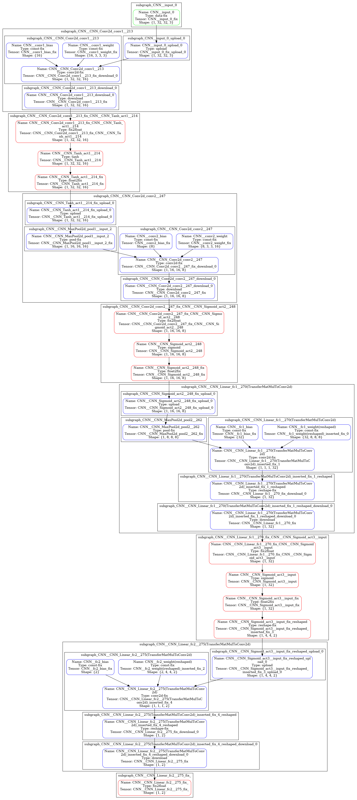

*Figure 1: CNN block diagram with nine subgraphs (Vitis-AI 2.0).*


# 5 Target Application

The python application running on the target board is in the [main_subgraphs.py](files/application/main_subgraphs.py) file, such application mirrors what illustrated in the  [cnn_int8_xmodel.png](files/doc/images/cnn_int8_xmodel.png) block diagram of the DPU/CPU subgraphs (or alternatively in [cnn_int8_subgraph_tree.txt](files/doc/images/cnn_int8_subgraph_tree.txt)),
in particular for what concerns the names of input and output tensors.

Once identified the four DPU subgraphs that follow the input layer and its related subgraph in the ``app()`` subroutine, you assign each of them to a DPU Runner and launch all of them,  as shown in the following fragment of code:
```python
...
dpu_1 = vart.Runner.create_runner(dpu_subgraph1, "run")
dpu_3 = vart.Runner.create_runner(dpu_subgraph3, "run")
dpu_5 = vart.Runner.create_runner(dpu_subgraph5, "run")
dpu_7 = vart.Runner.create_runner(dpu_subgraph7, "run")
...
runDPU(dpu_1, dpu_3, dpu_5, img)
```

Note that in the ``runDPU()`` subroutine you have to execute them asynchronously via the ``execute_async()`` function, as illustrated in the following code:
```python
...
# run DPU1 for layer1 with Conv2d-1
execute_async(
    dpu_1, {
        "CNN__input_0_fix": inputData[0],
        "CNN__CNN_Conv2d_conv1__213_fix": out1
    })
inp2 = out1.copy()
# run CPU2 for layer2 with Tanh-2
out2 = Tanh(inp2)
# run DPU3 for layer3 with MaxPool2d-3 + Conv2d-4
execute_async(
    dpu_3, {
        "CNN__CNN_Tanh_act1__214_fix": out2,
        "CNN__CNN_Conv2d_conv2__247_fix": out3
    })
inp4 = out3.copy()
# run CPU4 for layer4 with Sigmoid-5
out4 = Sigmoid1(inp4)
# run DPU5 for layer5 with MaxPOool2d-6 + Linear-7
execute_async(
    dpu_5, {
        "CNN__CNN_Sigmoid_act2__248_fix": out4,
        "CNN__CNN_Linear_fc1__270_fix":   out5
    })
inp6 = out5.copy()
# run CPU6 for layer6 with Sigmoid-8
out6 = Sigmoid2(inp6)
# run DPU7 for layer7 with Linear-9
execute_async(
    dpu_7, {
        "CNN__CNN_Sigmoid_act3__input_fix_reshaped_inserted_fix_3": out6,
        "CNN__CNN_Linear_fc2__275_fix":   out7
    })
cnn_out = out7.copy()
...
```

The same happens for line 8 related to the second DPU subgraph ``subgraph_CNN__CNN_Conv2d_conv2__247`` with input ``CNN__CNN_Tanh_act1__214_fix`` and output ``CNN__CNN_Conv2d_conv2__247_fix`` tensors and for line 14 related to the third DPU subgraph ``subgraph_CNN__CNN_Linear_fc1__270`` with input ``CNN__CNN_Sigmoid_act2__248_fix`` and output ``CNN__CNN_Linear_fc1__270_fix`` tensors and finally for line 21 related to the fourth DPU
subgraph ``subgraph_CNN__CNN_Linear_fc2__275`` with input ``CNN__CNN_Sigmoid_act3__input_fix_reshaped_inserted_fix_3`` and output ``CNN__CNN_Linear_fc2__275_fix``.

 All these names can change when using different releases of the Vitis AI Compiler and you have to manually change application [main_subgraphs.py](files/application/main_subgraphs.py) file.

For example line 3 of [cnn_int8_subgraph_tree.txt](files/doc/images/cnn_int8_subgraph_tree.txt) file contains the input and output tensors of the first DPU subgraph ``subgraph_CNN__CNN_Conv2d_conv1__213``, which are named respectively ``CNN__input_0_fix`` and ``CNN__CNN_Conv2d_conv1__213_fix``.

The  subgraphs running on the ARM CPU are: ``Tanh()``, ``Sigmoid1()`` and ``Sigmoid2()``.  The last two routines are the same, but they were renamed differently to make easier the debug process.

**The output of each DPU subgraph is copied as input tensor to the next CPU subgraph. Be very careful with the names of the tensors, there must be no mismatches at all.**

Note that the size of the output buffers was set accordingly to [cnn_int8_subgraph_tree.txt](files/doc/images/cnn_int8_subgraph_tree.txt) as illustrated in the following code fragment:

```python
...
outputTensor_1 = dpu_1.get_output_tensors()
...
output_1_ndim = tuple(outputTensor_1[0].dims)
...
out1 = np.zeros(output_1_ndim, dtype='float32')
...
```

If you set the output format for ``float32``, you do not need to convert from ``int8`` to ``float32``, because ``VART`` APIs will do it automatically. But if you write:

```python
out1 = np.zeros(output_1_ndim, dtype=‘int8’)
```
as opposed to:

```python
out1 = np.zeros(output_1_ndim, dtype='float32')
```
then you would need to manually convert the data from ``int8`` to ``float32`` with code similar to this one:

```python
fix_points = [ -1 * t.get_attr('fix_point') for t in dpu_1.get_output_tensors() ]
print("fix_points dpu1={}".format(fix_points))
scales = np.exp2(fix_points, dtype=np.float32)
print("scales dpu1={}".format(scales))
print("\n".join([t.name for t in dpu_1.get_input_tensors()]))
print("\n".join([t.name for t in dpu_1.get_output_tensors()]))
o1_cvrt = fix2float(fix_points[0], out1)
print("output1 tensor={}".format(outputTensor_1[0]))
print("output1 converted: \n")
print(o1_cvrt)
```


# 6 Functional Debug

To check the correct functional behavior of the CPU/DPU subgraphs partitioning at run-time on the board, you have to save the tensors passed between the CPU and DPU (at runtime) and compare them numerically with what simulated on the host environment (offline). All those tensors are saved and then compared in 32-bit floating point accuracy, for ease of use.

The entire procedure can be detailed in the following steps:


1. From the host, launch the command (for your comfort it is already included in the script [prepare_target.sh](files/prepare_target.sh) called by the main [run_all.sh](files/run_all.sh) script itself):

  ```shell
  cd /workspace/tutorials/VAI-SUBGRAPHS/files/ # your working directory
  python -c "import common; dbg_model=common.RUN_CNN_DEBUG('./build/target/application/test')" \
      2>&1 | tee ./build/log/functional_debug1_on_host.log
  mv *.bin.npy ./build/target/application/
  ```
  and collect the ``ref_*.bin.npy``  reference intermediate results, to be compared later against the respective ones computed on the target.

2. Copy with ``scp`` utility the ``target.tar`` archive from the host to the target board, then launch the application on the target board and collect the ``*.bin.npy`` output intermediate results. Store the results on a tar archive and copy it back from the target to the host PC in the ``build/target/application`` subfolder. You can launch the application using either VSC GUI (see [Appendix A1](#a1-ssh-debug-with-visual-studio-code)) or the following commands:

  ```shell
  # from host PC assuming target board IP address would be 192.168.1.40)
  cd /workspace/tutorials/VAI-SUBGRAPHS/files/ # your working directory
  scp ./build/target.tar root@192.168.1.40:~/
  ssh -X root@192.168.1.40 # password: root

  # from target board
  tar -xvf target.tar
  cd ./target/application/
  # launch the target python application
  python3 main_subgraphs.py --model CNN_int_zcu102.xmodel 2>&1 | tee target_run.log

  #from host
  cd ./build/target/application /
  scp root@192.168.1.40:~/target/application/*.bin.npy .     # copy output npy files
  scp root@192.168.1.40:~/target/application/*.log ../../log # copy log file
  ```
  You should see something like this:
  ```
  cnn_out.bin.npy                  100%  136   281.2KB/s   00:00    
fc2_bias.bin.npy                   100%  136   116.8KB/s   00:00    
fc2_weight.bin.npy                 100%  384   395.4KB/s   00:00    
ref_cnn_out.bin.npy                100%  136   169.2KB/s   00:00    
ref_sigm1_data_inp.bin.npy         100% 8320     4.7MB/s   00:00    
ref_sigm1_data_out.bin.npy         100% 8320     4.4MB/s   00:00    
ref_sigm2_data_inp.bin.npy         100%  256   300.0KB/s   00:00    
ref_sigm2_data_out.bin.npy         100%  256   268.8KB/s   00:00    
ref_tanh_data_inp.bin.npy          100%   64KB  11.3MB/s   00:00    
ref_tanh_data_out.bin.npy          100%   64KB  11.5MB/s   00:00    
sigm1_data_inp.bin.npy             100% 8320     8.6MB/s   00:00    
sigm1_data_out.bin.npy             100% 8320     8.8MB/s   00:00    
sigm2_data_inp.bin.npy             100%  256   681.2KB/s   00:00    
sigm2_data_out.bin.npy             100%  256   658.6KB/s   00:00    
tanh_data_inp.bin.npy              100%   64KB  23.1MB/s   00:00    
tanh_data_out.bin.npy              100%   64KB  23.5MB/s   00:00    
```

3. Launch the [run_debug.py](files/build/application/run_debug.py) python script on the host to generate the ``*.csv`` files that can be read also in MATLAB or GNU Octave (or also MS Excel):
  ```shell
  cd /workspace/tutorials/VAI-SUBGRAPHS/files/ # your working directory
  cd ./build/target/application
  python3 run_debug.py 2>&1 | tee ../../log/functional_debug2_on_host.log
  ```
  You should see something like this:

  ```text
  ref_cnn_out.bin.npy (1, 2)
  cnn_out.bin.npy (1, 2)
  diff     min  -0.025555164
  diff     max  0.038468003
  sum_abs_diff  0.03201158344745636
  ref_sigm1_data_inp.bin.npy (16, 16, 8)
  sigm1_data_inp.bin.npy (16, 16, 8)
  diff     min  -0.13647246
  diff     max  0.08591369
  sum_abs_diff  0.03409777581691742
  ref_sigm1_data_out.bin.npy (16, 16, 8)
  sigm1_data_out.bin.npy (16, 16, 8)
  diff     min  -0.02494523
  diff     max  0.021246701
  sum_abs_diff  0.005721326917409897
  ref_sigm2_data_inp.bin.npy (1, 32)
  sigm2_data_inp.bin.npy (32,)
  diff     min  -0.02502942
  diff     max  0.013040608
  sum_abs_diff  0.006925767753273249
  ref_sigm2_data_out.bin.npy (1, 32)
  sigm2_data_out.bin.npy (32,)
  diff     min  -0.006244451
  diff     max  0.003260076
  sum_abs_diff  0.0017095217481255531
  ref_tanh_data_inp.bin.npy (32, 32, 16)
  tanh_data_inp.bin.npy (32, 32, 16)
  diff     min  -0.051754475
  diff     max  0.048462868
  sum_abs_diff  0.011226503178477287
  ref_tanh_data_out.bin.npy (32, 32, 16)
  tanh_data_out.bin.npy (32, 32, 16)
  diff     min  -0.03750041
  diff     max  0.040613145
  sum_abs_diff  0.009198149666190147
  weight Transposed =
  [[-0.13976638   0.23850377 ]
  [ 0.57605636  -0.81962705 ]
  [ 0.61858493  -0.45290408 ]
  [ 0.013074064  0.24663034 ]
  [ 0.90845245  -0.96385163 ]
  [-0.3572389    0.4553204  ]
  [ 0.21030675  -0.47997707 ]
  [-0.21580726  -0.026585301]
  [-0.65612465   0.54490805 ]
  [ 0.07984386  -0.045983564]
  [ 0.15514174  -0.40313148 ]
 [-0.08978751   0.20510764 ]
 [-0.8175937    0.8453936  ]
 [ 0.17828953   0.100985855]
 [ 0.78292435  -0.801085   ]
 [ 0.025350276 -0.03460282 ]
 [-0.45417738   0.438889   ]
 [-0.2724426    0.15482584 ]
 [ 0.7949256   -0.91377985 ]
 [-0.32223013   0.43169767 ]
 [ 0.3064981   -0.49820557 ]
 [ 0.11162284   0.06427411 ]
 [-0.22123398   0.42612377 ]
 [-0.65790886   0.6089345  ]
 [-1.246498     1.2499713  ]
 [ 0.09743387  -0.26428133 ]
 [-0.43355694   0.5378892  ]
 [-0.6447369    0.641791   ]
 [ 0.19320314   0.07518287 ]
 [ 0.021510655 -0.025312457]
 [-0.20228927   0.30443    ]
 [ 0.7857785   -0.68237656 ]]

  bias =  [0.01971396   0.0063765887]
```

4. Launch the [run_debug.m](files/build/application/run_debug.m) MATLAB script either directly from [MATLAB](https://uk.mathworks.com/products/matlab.html) or [GNU Octave](https://www.gnu.org/software/octave/index)) GUIs. This script computes the differences between reference host results and actual target results (from ``*.csv`` files) and plot them on the next Figures from 3 to 15.

For step 2 I have found [Visual Studio Code](https://code.visualstudio.com) very useful, as illustrated in the screenshot of Figure 2:

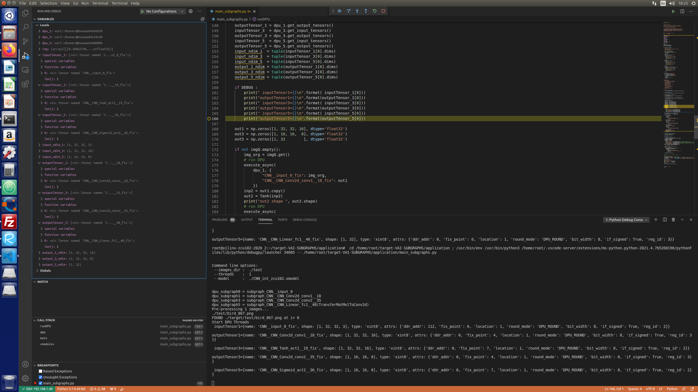

*Figure 2: SSH remote debugging with Visual Studio Code.*

Note that in the [main_subgraphs.py](files/build/target/application/main_subgraphs.py) python file the following variable ``DEBUG = True`` has to be set, in order to launch the ``DEBUG_runDPU()`` subroutine.


## 6.1 Inspect Tensors with XIR APIs

Running the following fragment of python application code (from [main_subgraphs.py](files/build/target/application/main_subgraphs.py) file) on the target:
```python
  inputTensor_1  = dpu_1.get_input_tensors()
  outputTensor_1 = dpu_1.get_output_tensors()
  inputTensor_3  = dpu_3.get_input_tensors()
  outputTensor_3 = dpu_3.get_output_tensors()
  inputTensor_5  = dpu_5.get_input_tensors()
  outputTensor_5 = dpu_5.get_output_tensors()
  inputTensor_7  = dpu_7.get_input_tensors()
  outputTensor_7 = dpu_7.get_output_tensors()

if DEBUG:
    print(" inputTensor1\n", inputTensor_1)
    print("outputTensor1\n", outputTensor_1)
    print(" inputTensor3\n", inputTensor_3)
    print("outputTensor3\n", outputTensor_3)
    print(" inputTensor5\n", inputTensor_3)
    print("outputTensor5\n", outputTensor_3)
    print(" inputTensor7\n", inputTensor_7)
    print("outputTensor7\n", outputTensor_7)    
```
will show the following outputs:

```text
inputTensor1={name: 'CNN__input_0_fix', shape: [1, 32, 32, 3], type: 'xint8',
attrs: {'location': 1, 'ddr_addr': 112, 'if_signed': True, 'reg_id': 2, 'fix_point': 6, 'bit_width': 8, 'round_mode': 'DPU_ROUND'}}

outputTensor1={name: 'CNN__CNN_Conv2d_conv1__213_fix', shape: [1, 32, 32, 16], type: 'xint8',
attrs: {'location': 1, 'ddr_addr': 0, 'reg_id': 3, 'fix_point': 5, 'bit_width': 8, 'round_mode': 'DPU_ROUND', 'if_signed': True}}

inputTensor3={name: 'CNN__CNN_Tanh_act1__214_fix', shape: [1, 32, 32, 16], type: 'xint8',
attrs: {'location': 1, 'ddr_addr': 0, 'if_signed': True, 'reg_id': 2, 'fix_point': 7, 'bit_width': 8, 'round_mode': 'DPU_ROUND'}}

outputTensor3={name: 'CNN__CNN_Conv2d_conv2__247_fix', shape: [1, 16, 16, 8], type: 'xint8',
attrs: {'location': 1, 'ddr_addr': 0, 'reg_id': 3, 'fix_point': 4, 'if_signed': True, 'bit_width': 8, 'round_mode': 'DPU_ROUND'}}

inputTensor5={name: 'CNN__CNN_Sigmoid_act2__248_fix', shape: [1, 16, 16, 8], type: 'xint8',
attrs: {'location': 1, 'ddr_addr': 0, 'if_signed': True, 'reg_id': 2, 'fix_point': 7, 'round_mode': 'DPU_ROUND', 'bit_width': 8}}

outputTensor5={name: 'CNN__CNN_Linear_fc1__270_fix', shape: [1, 32], type: 'xint8',
attrs: {'location': 1, 'ddr_addr': 0, 'reg_id': 3, 'fix_point': 6, 'round_mode': 'DPU_ROUND', 'bit_width': 8, 'if_signed': True}}

inputTensor7={name: 'CNN__CNN_Sigmoid_act3__input_fix_reshaped_inserted_fix_3', shape: [1, 4, 4, 2], type: 'xint8',
attrs: {'location': 1, 'ddr_addr': 0, 'if_signed': True, 'reg_id': 2, 'fix_point': 7, 'bit_width': 8, 'round_mode': 'DPU_ROUND'}}

outputTensor7={name: 'CNN__CNN_Linear_fc2__275_fix', shape: [1, 2], type: 'xint8',
attrs: {'location': 1, 'ddr_addr': 0, 'bit_width': 8, 'round_mode': 'DPU_ROUND', 'if_signed': True, 'reg_id': 3, 'fix_point': 5}}

```


## 6.2 Check Numerical Results

Figures 3 to 15 illustrate the small numerical differences between the results computed by the CNN model running on the host PC in floating point (files named ``ref_*.csv``) and the results computed by the DPU/CPU  partitioning on the target board (same ``*.csv`` file names without the prefix ``ref_``).  Since this last one computation is a mix of floating point (ARM CPU) and fixed point (DPU), the difference is really small and as expected.

In conclusion there is a very good match in the numerical results and so you can state that the target application works correctly as expected.

Note that although the [run_debug.m](files/application/run_debug.m) script checks the differences between few I/O tensors at every layer, the [run_debug.py](files/application/run_debug.py) computes the absolute differences for all the I/O tensors and then it computes also the sum of such absolute differences (SAD), normalized to the size of the 2D or 3D tensor. The SAD values are always very small, as expected.

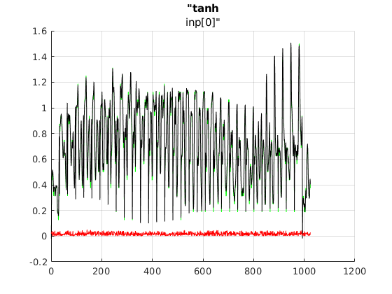

*Figure 3:  tensor 0 in input to Tanh layer, float32 (black) int8 (green) and their difference (red)*

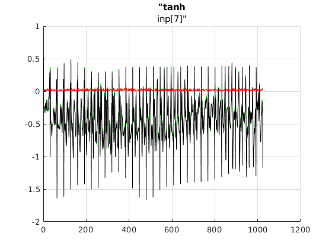

*Figure 4:  tensor 7 in input to Tanh layer, float32 (black) int8 (green) and their difference (red)*

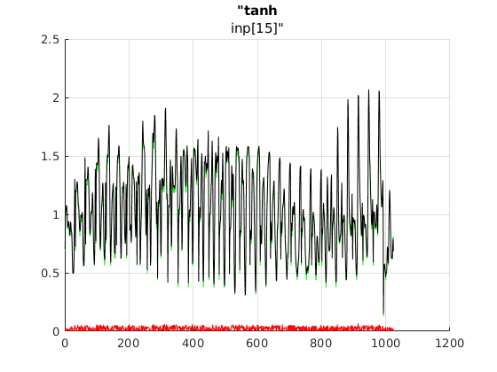

*Figure 5:  tensor 15 in input to Tanh layer, float32 (black) int8 (green) and their difference (red)*

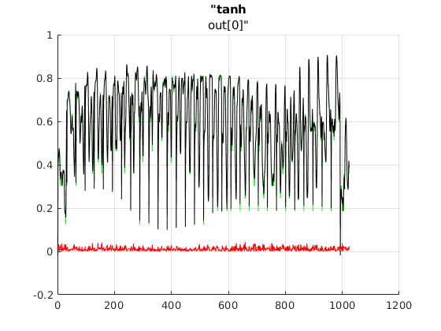

*Figure 6:  tensor 0 output from Tanh layer, float32 (black) int8 (green) and their difference (red)*


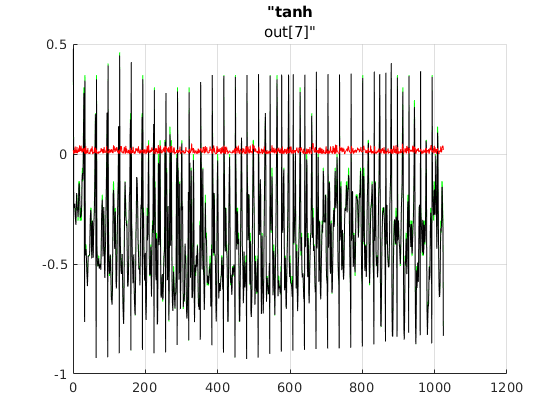

*Figure 7:  tensor 7 output from Tanh layer, float32 (black) int8 (green) and their difference (red)*

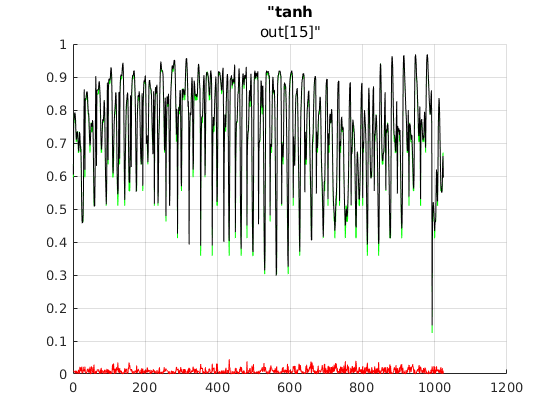

*Figure 8:  tensor 15 output from Tanh layer, float32 (black) int8 (green) and their difference (red)*

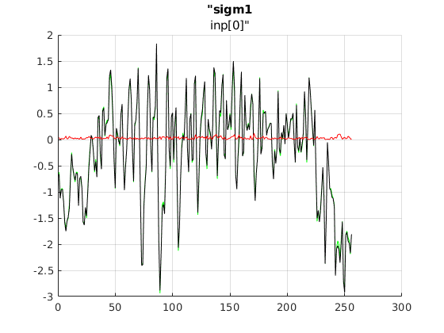

*Figure 9:  tensor 0 in input to first Sigmoid layer, float32 (black) int8 (green) and their difference (red)*

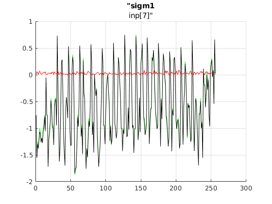

*Figure 10:  tensor 7 in input to first Sigmoid layer, float32 (black) int8 (green) and their difference (red)*

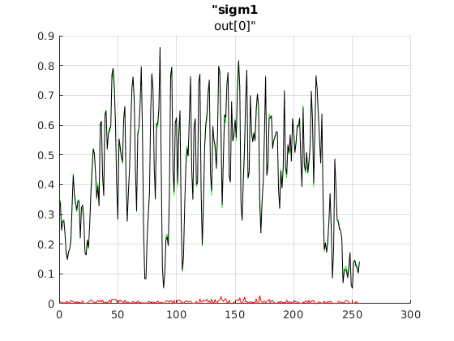

*Figure 11:  tensor 0 output from first Sigmoid layer, float32 (black) int8 (green) and their difference (red)*

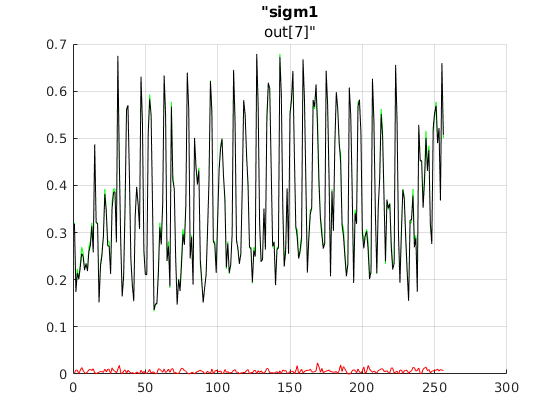

*Figure 12:  tensor 7 output from first Sigmoid layer, float32 (black) int8 (green) and their difference (red)*


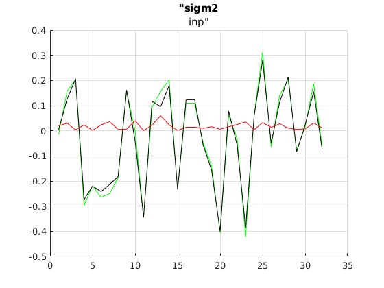

*Figure 13:  input tensor to second Sigmoid layer, float32 (black) int8 (green) and their difference (red)*


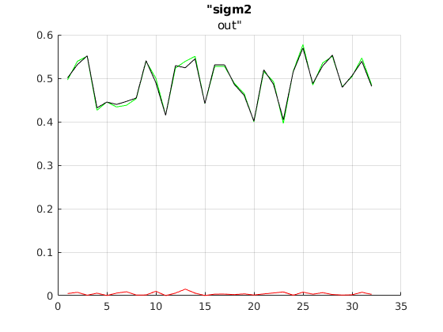

*Figure 14:  tensor output from second Sigmoid layer, float32 (black) int8 (green) and their difference (red)*


# 7 Run Predictions


## 7.1 ZCU102

To run predictions on the target board, you have to set in the python code the following variable:

```python
DEBUG = False
```
which will enable the launch of ``runDPU()`` routine, then you can launch the application using either VSC GUI (see [Appendix A1](#a1-ssh-debug-with-visual-studio-code)) or the following command lines:

```shell
  # from ZCU102 target board
  cd ./target/application/
  python3 main_subgraphs.py --model CNN_int_zcu102.xmodel
```
and you should see something like this:

```text
Command line options:
 --images_dir :  ../test_images
 --model      :  CNN_int_zcu102.xmodel

Found 2000 images - processing 2000 of them
Pre-processing  2000  images
run DPU

FPS=178.74, total frames = 2000 , time=11.1893 seconds

Post-processing
Correct:  1512  Wrong:  488  Accuracy:  0.756
```

## 7.2 ZCU104

Similarly to the ZCU102 case, you have to execute the following command lines on ZCU104 board:

```shell
  # from ZCU104 target board
  cd ./target/application/
  python3 main_subgraphs.py --model CNN_int_zcu104.xmodel
```

and you should see something like this:

```text
Command line options:
 --images_dir :  ../test_images
 --model      :  CNN_int_zcu104.xmodel

Found 2000 images - processing 2000 of them
Pre-processing  2000  images
run DPU

FPS=94.92, total frames = 2000 , time=21.0695 seconds

Post-processing
Correct:  1552  Wrong:  448  Accuracy:  0.776
```


## 7.3 VCK190 Production

Similarly to the ZCU102 case, you have to execute the following command lines on VCK190 board:

```shell
  # from ZCU104 target board
  cd ./target/application/
  python3 main_subgraphs.py --model CNN_int_vck190.xmodel
```

and you should see something like this:

```text
Command line options:
 --images_dir :  ../test_images
 --model      :  CNN_int_vck190.xmodel

Found 2000 images - processing 2000 of them
Pre-processing  2000  images
run DPU

FPS=243.75, total frames = 2000 , time=8.2052 seconds

Post-processing
Correct:  1552  Wrong:  448  Accuracy:  0.776
```


# Appendix

## A1 SHH Debug with Visual Studio Code

Download ``code_1.55.2-1618307277_amd64.deb`` package from [Visual Studio Code](https://code.visualstudio.com/download) website. Once done that, install it with the command:

```shell
sudo dpkg -i code_1.55.2-1618307277_amd64.deb
```

Turn on your target board, assuming its IP address be ``192.168.1.40`` for example, open VSC and press ``F1`` keyboard button and then type

```
Remote SSH: Connect Current Window to Host...
```

so that you can run [remote SSH debugging on a file hosted on the target board](https://code.visualstudio.com/blogs/2019/05/02/remote-development), as Figure A1 illustrates.

You can then open the folder ``/home/root/target/application`` as shown in Figure A2:


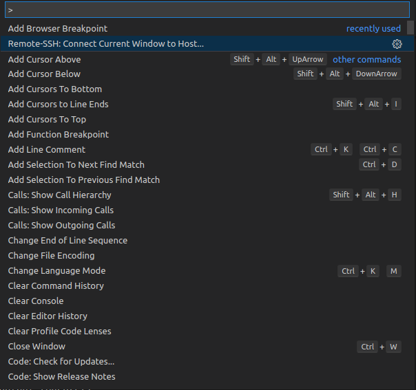

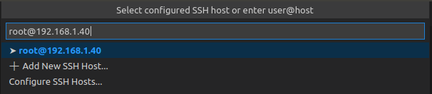

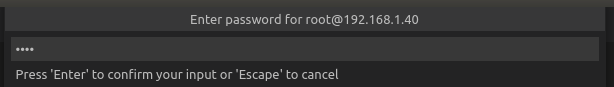

*Figure A1: Setting Visual Studio Code for remote SSH debugging.*


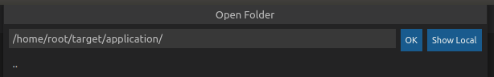

*Figure A2: Opening a folder from target board with SVC SSH debugging.*


<div style="page-break-after: always;"></div>

# AMD-Xilinx Disclaimer and Attribution


The information contained herein is for informational purposes only and is subject to change without notice. While every precaution has been taken in the preparation of this document, it may contain technical inaccuracies, omissions and typographical errors, and AMD is under no obligation to update or otherwise correct this information. Advanced Micro Devices, Inc. makes no representations or warranties with respect to the accuracy or completeness of the contents of this document, and assumes no liability of any kind, including the implied warranties of non infringement, merchantability or fitness for particular purposes, with respect to the operation or use of AMD hardware, software or other products described herein. No license, including implied or arising by estoppel, to any intellectual property rights is granted by this document. Terms and limitations applicable to the purchase or use of AMD’s products are as set forth in a signed agreement between the parties or in AMD's Standard Terms and Conditions of Sale. GD-18

© Copyright 2021 Advanced Micro Devices, Inc.  All rights reserved.  Xilinx, the Xilinx logo, AMD, the AMD Arrow logo, Alveo, Artix, Kintex, Kria, Spartan, Versal, Vitis, Virtex, Vivado, Zynq, and other designated brands included herein are trademarks of Advanced Micro Devices, Inc.  Other product names used in this publication are for identification purposes only and may be trademarks of their respective companies.  
