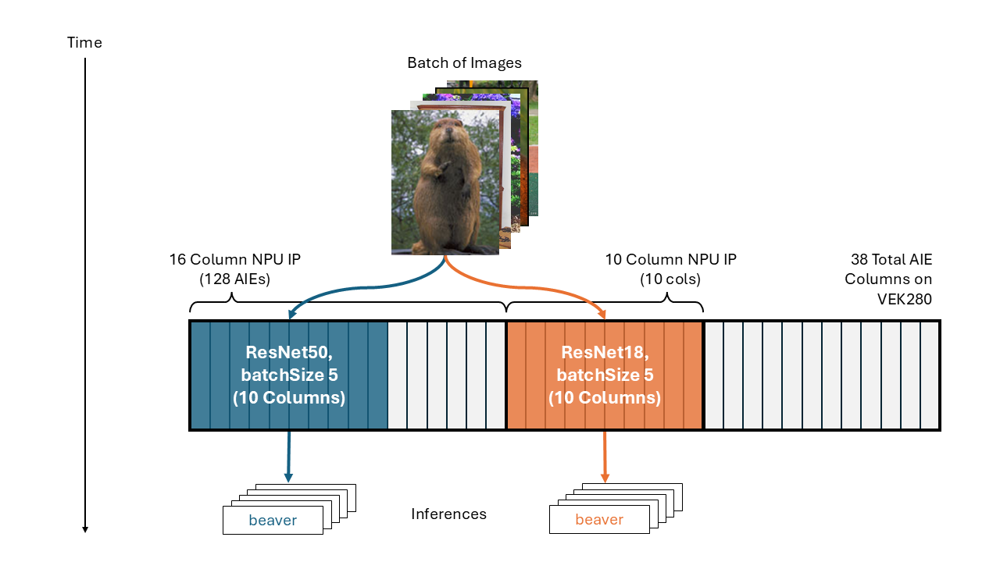

<!--

Copyright © 2025 Advanced Micro Devices, Inc.
All rights reserved.
MIT License

Author: Thomas Zerbs, AMD

-->

<table width="100%">
  <tr>
    <td align="center">
      <h1>Vitis™ AI Tutorials</h1>
    </td>
  </tr>
</table>


# Running Multiple Models (ResNet50+ResNet18) with Multi-Tenancy

- Version:      AMD Vitis™ AI 5.1
- Support:      AMD Versal™ AI Edge Series VEK280 Evaluation Kit
- Last update:  20 October 2025


## Table of Contents

[1 Introduction](#1-introduction)

[2 Setup Guide](#2-setup-guide)

[3 Temporal Multi-Tenancy](#3-temporal-multi-tenancy)

[4 Spatial Multi-Tenancy](#4-spatial-multi-tenancy)

[5 Comparing Performance](#5-comparing-performance)


## 1 Introduction

### 1.1 Vitis AI Overview

**Vitis AI** is an IDE (Integrated Development Environment) that you can leverage to accelerate AI Inference on AMD’s Adaptive SoCs and FPGAs. The IDE provides optimized IP (Intellectual Property), and supporting tools, libraries, models, etc., such as example reference designs and tutorials that aid you throughout the development process. It is designed with high efficiency and ease of use in mind, unleashing the full potential of AI acceleration.

The Vitis AI solution consists of three primary components:

1. **Neural Processing Unit (NPU) IP:** A purpose-built AI Inference IP that leverages a combination of Programmable Logic (PL) and the AI Engine (AIE) Array to accelerate the deployment of neural networks.

2. **Model Compilation Tools:** A set of tools to quantize, compile, and optimize ML models for NPU IP. The tools allow users to generate **snapshots** tailored for the deployment of each network. The snapshot contains a quantized model and instructions for execution by NPU IP on the target platform.

3. **Model Deployment APIs:** Vitis AI Runtime (VART) is a collection of setup scripts, examples, and reference designs to integrate and execute ML inference models on the NPU IP from a software application.

### 1.2 Multi-tenancy Overview

**Multi-tenancy** is a new feature in Vitis AI which enables the execution of multiple models. This tutorial shows how to execute **ResNet50** and **ResNet18** temporally and spatially on the **VEK280** to demonstrate the benefits of both methods and how the performance compares to single model execution. 

**Temporal** multi-tenancy executes multiple models in sequence on the same NPU IP, and the same AIE resources are shared over time. **Spatial** multi-tenancy executes multiple models in parallel on different NPU IPs. The available AIE resources are partitioned into sub-groups (e.g., a few columns of AIE per NPU IP) and enables the creation of multiple NPU IPs within the same design.

> **Note**  
> This is a feature-focused tutorial intended to illustrate multi-tenancy behavior; while some performance data is presented, detailed benchmarking and accuracy analysis are beyond the scope of this guide.


## 2 Setup Guide

This guide explains how to configure the Vitis AI software environment and VEK280 hardware, so you are ready to deploy multiple models with multi-tenancy.

### 2.1 Hardware & Software Requirements

| Component    | Requirement |
|--------------|-------------|
| Host Machine | Any 64-bit Linux host machine with Ubuntu 22.04.4 LTS OS or Ubuntu 20.04.4 LTS OS, 100 GB of free disk space and 64 GB |of RAM |
| Target Board | VEK280 Rev B3 card with pre-production silicon |
| SD Card      | SD card (at least 32GB) to flash the image. **Two SD Cards are required for this tutorial.** |
| Connectivity | VEK280 target board connected to the host machine with an ethernet cable and an UART USB cable. |
| HOST OS      | Ubuntu 22.04.4 LTS or Ubuntu 20.04.4 LTS (Kernel: 5.4.0- 165-generic) |
| Petalinux    | Version 2025.1 |
| Vivado       | Version 2025.1.1 |
| Vitis        | Version 2025.1.1 |
| Python       | Version 3.12.6 |
| Docker       | Version 24.0.5 |
| FFMpeg       | Version 6.0 or later |
| Gstreamer    | Version 1.24.4 or later |

### 2.2 Software Installation

The following steps explain how to install Vitis AI tools on the host machine using the Docker and how to set up the cross- environment for building applications. This release provides a pre-built Docker image for ease of use.

#### 2.2.1 Download Source Code and Pre-Builts

Follow these steps to download the Docker image from Docker Hub:

1. Download the source code `vitis-ai-5.1.tar`.

2. Change the directory to the location of the downloaded file and extract it:

    ```bash
    cd <path-to-downloaded-vitis-ai-5.1.tar>
    tar xf vitis-ai-5.1.tar

    # The extracted source code contains a docker folder with a Dockerfile and script to download the Docker image from Docker
    Hub. We will lauch the Docker image in step 2.2.3.
    ```
3. Navigate to the Vitis-AI directory and export the VITIS_AI_REPO variable:

    ```bash
    cd Vitis-AI
    export VITIS_AI_REPO=$PWD
    ```

#### 2.2.2 Set Up Cross-Compiler

1. Download the pre-built cross-compiler install script `sdk-vai-5.1.sh`.

2. Run the following command to provide execution permissions to the `sdk-vai-5.1.sh` script:

    ```bash
    chmod a+x sdk-vai-5.1.sh
    ```

3. Install the cross-compilation system environment on your local host Linux system (outside of Docker, which we will launch in the next section):

    ```bash
    ./sdk-vai-5.1.sh -d <path-to-sdk-installation>
    ```

4. When the installation is complete, follow the prompts and execute this command:

    ```bash
    source <path-to-sdk-installation>/environment-setup-cortexa72-cortexa53-amd-linux
    ```

#### 2.2.3 Launch Docker

Launch the pre-built Docker image and accept the license agreement. 

```bash
./Vitis-AI/docker/run.bash --acceptLicense -- /bin/bash
```

### 2.3 Hardware Configuration

#### 2.3.1 Flash SD Cards

Flash two SD cards with the following board images provided in Vitis AI 5.1 (with a flashing tool such as **Raspberry Pi Imager**):

- `V5.1_VE2802_NPU_IP_O00_A304_M3_sd_card.img.gz` (38 AIE Column NPU)
- `V5.1_VE2802_NPU_IP_O00_A128_M3__O16_A080_M3_sd_card.img` (16 AIE Column NPU + 10 AIE Column NPU)

#### 2.3.2 VEK280 Target Board Setup & Booting

1. Connect the following cables to the VEK280:

    - **Power cable (J16):** To power up the board.
    - **Ethernet cable (J307):** For host-target communication (required for `scp` and remote operations).
    -  **USB cable (U20):** For serial console connection.

2. Set up the VEK280 boot mode to SD card by configuring SW1[1:4] = Mode[0:3] = ON, OFF, OFF, OFF.

3. Using a serial communication tool (such as **Tera Term**), set up the COM connection with a baud rate of 115200. The VEK280 board introduces three COM ports to the host. Connect to the lowest or highest new COM port with a baud rate of 115200.

4. Insert the SD Card into the VEK280 board and power the board ON. **For this tutorial, start with the V5.1_VE2802_NPU_IP_O00_A304_M3_sd_card.img.gz SD Card.**

5. Log in with the username `root` and password `root`.

#### 2.3.3 Configure Network (Static IP)

Set a static IP on the VEK280 to communicate with your host machine. Make sure the IP you assign is on the same subnet as your host machine. For example, if your host IP address is 192.168.1.1, use the following IP address for the VEK280:

```bash
ifconfig end0 192.168.1.2
```

### 2.4 Download ImageNet Dataset & Copy to Board

1. Create a folder for the dataset:

    ```bash
    mkdir -p ./Vitis-AI/dataset/links
    ```

2. Copy the download script from the Vitis AI source code that was downloaded:

    ```bash
    cp /Vitis-AI/examples/python_examples/batcher/scripts/download_ILSVRC12.py dataset/
    cp /Vitis-AI/examples/python_examples/batcher/links/pictures_urls.txt dataset/links/
    cp /Vitis-AI/examples/python_examples/batcher/links/ILSVRC2012_synset_words.txt dataset/links/
    cd dataset
    ```

3. Run the following command to download the ImageNet dataset and ground truth files which are expected as input to the VART Runner application.

    ```bash
    python3 download_ILSVRC12.py imagenet
    ```

4. Copy the ImageNet dataset to the board.

    ```bash
    scp -r ./imagenet/ root@<vek280_board_ip>:/root
    ```


## 3 Temporal Multi-Tenancy

With temporal execution, multiple models are run sequentially per batch of images on the same NPU IP. The same hardware resources (AI engines) are shared over time. This approach may be effective when your hardware design is resource constrained to a single NPU IP, but near real-time inference across multiple models is still required. While it doesn’t offer true parallelism, it simplifies deployment by avoiding the need to manage multiple IPs, snapshots, and resource constraints across AIE, PL and DDR memory.


***Figure 1:** Images are fed into the first model, ResNet50, which occupies 10 AIE columns in the NPU IP. Once inference is complete, the AIE resources are freed up for the second model, ResNet18, to receive images and begin inference.*

### 3.1 Compile Multiple Models for Single NPU IP

This section guides you with generating snapshots for **ResNet50** and **ResNet18** to run on a **single NPU IP**. The default **VE2802_NPU_IP_O00_A304_M3** (304 AIEs) NPU IP will be used. 

> **Note**  
> For ResNet models, the Vitis AI compiler typically allocates two AIE columns per batch size. Batch size 5 is used in this tutorial, so ResNet50 and ResNet18 use 10 columns.

1. Navigate to Vitis AI source (from Docker).

    ```bash
    cd <path_to_Vitis-AI>
    ```

2. Enable the NPU software stack for the VE2802_NPU_IP_O00_A304_M3 NPU IP.

    ```bash
    source npu_ip/settings.sh  VE2802_NPU_IP_O00_A304_M3
    ```

3. Navigate to batcher folder.

    ```bash
    cd examples/python_examples/batcher
    ```

4. Build ResNet50 snapshot.

    ```bash
    VAISW_SNAPSHOT_DIRECTORY=$VAISW_HOME/SNAP.$NPU_IP/resnet50.PT.b5 ./run_classification.sh -f pytorch -n resnet18 --batchSize 5
    ```

5. Build ResNet18 snapshot.

    ```bash
    VAISW_SNAPSHOT_DIRECTORY=$VAISW_HOME/SNAP.$NPU_IP/resnet18.PT.b5 ./run_classification.sh -f pytorch -n resnet50 --batchSize 5
    ```

### 3.2 Execute Multiple Models with Single NPU IP

The execution of both models is scheduled from a single application using a single thread and issuing outstanding `execute_async` calls, and the associated `wait` calls. The inferences will start once the NPU HW (AIEs) are available.

Use following steps to execute the ResNet50 and ResNet18 snapshots on the VE2802_NPU_IP_O00_A304_M3 NPU IP with the VART Runner application.

1. Ensure the VEK280 board is up and running with the `VE2802_NPU_IP_O00_A304_M3_sd_card.img` SD Card.

2. Copy the ResNet50 and ResNet18 snapshots to target board.

    ```bash
    scp <path_to_Vitis-AI>/SNAP.VE2802_NPU_IP_O00_A304_M3/resnet50.PT.b5 root@<vek280_board_ip>:/root
    scp <path_to_Vitis-AI>/SNAP.VE2802_NPU_IP_O00_A304_M3/resnet18.PT.b5 root@<vek280_board_ip>:/root
    ```

3. Set up the Vitis AI tools environment on the board.

    ```bash
    source /etc/vai.sh
    ```

4. Use the `vart_ml_demo` application to execute ResNet50 and ResNet18 on the VE2802_NPU_IP_O00_A304_M3 NPU. You can provide multiple snapshots path with + symbol.

    ```bash
    vart_ml_demo --snapshot ./SNAP.VE2802_NPU_IP_O00_A304_M3/resnet50.PT.b5+./SNAP.VE2802_NPU_IP_O00_A304_M3/resnet18.PT.b5  --batchSize 5 --dataFormat native --imgPath ./imagenet/ILSVRC2012_img_val --labels /etc/vai/labels/labels --goldFile ./imagenet/ILSVRC_2012_val_GroundTruth_10p.txt --nbImages 10
    ```

    - You may also include the environment variable `VAISW_RUNSESSION_SUMMARY=all` in the above command to generate a detailed summary:

        ```bash
        ============================================================
        Accuracy Summary:
        [AMD] [resnet50 TEST top1] 60.00% passed.
        [AMD] [resnet50 TEST top5] 70.00% passed.
        [AMD] [resnet50 ALL TESTS] 60.00% passed.
        [AMD] [resnet18 TEST top1] 50.00% passed.
        [AMD] [resnet18 TEST top5] 70.00% passed.
        [AMD] [resnet18 ALL TESTS] 50.00% passed.
        [AMD] VART ML runner data format was set to NATIVE.
        [AMD] Running 2 models 1142.89 imgs/s (10 images)
        [VART]
        [VART]           board XIL_VEK280_REVB3 (AIE: 304 = 38x8)
        [VART]           2 inferences of batch size 5 (the first inference is not used to compute the detailed times)
        [VART]           1 input layer. Tensor shape: 5x224x224x3 (INT8)
        [VART]           1 output layer. Tensor shape: 5x1000 (INT8)
        [VART]           1 total subgraph:
        [VART]                   1 VART (AIE) subgraph
        [VART]                   0 Framework (CPU) subgraph
        [VART]           10 samples
        [VART]
        [VART] "resnet50" run summary:
        [VART]           detailed times in ms
        [VART] +-----------------------------------+------------+------------+------------+------------+
        [VART] | Performance Summary               |  ms/batch  |  ms/batch  |  ms/batch  |   sample/s |
        [VART] |                                   |    min     |    max     |   median   |   median   |
        [VART] +-----------------------------------+------------+------------+------------+------------+
        [VART] | Whole Graph total                 |       2.82 |       2.82 |       2.82 |    1774.31 |
        [VART] |   VART total (   1 sub-graph)     |       2.79 |       2.79 |       2.79 |    1792.76 |
        [VART] |     AI acceleration (*)           |       2.53 |       2.53 |       2.53 |    1973.17 |
        [VART] |     CPU processing                |       0.25 |       0.25 |       0.25 |            |
        [VART] |       Others                      |            |            |       0.25 |            |
        [VART] |   Others                          |            |            |       0.03 |            |
        [VART] +-----------------------------------+------------+------------+------------+------------+
        [VART] (min and max are measured individually, only the median sums are meaningful).
        [VART] (*) AI Acceleration time includes the transfer to/from the external memories.
        [VART]
        [VART]           board XIL_VEK280_REVB3 (AIE: 304 = 38x8)
        [VART]           2 inferences of batch size 5 (the first inference is not used to compute the detailed times)
        [VART]           1 input layer. Tensor shape: 5x224x224x3 (INT8)
        [VART]           1 output layer. Tensor shape: 5x1000 (INT8)
        [VART]           1 total subgraph:
        [VART]                   1 VART (AIE) subgraph
        [VART]                   0 Framework (CPU) subgraph
        [VART]           10 samples
        [VART]
        [VART] "resnet18" run summary:
        [VART]           detailed times in ms
        [VART] +-----------------------------------+------------+------------+------------+------------+
        [VART] | Performance Summary               |  ms/batch  |  ms/batch  |  ms/batch  |   sample/s |
        [VART] |                                   |    min     |    max     |   median   |   median   |
        [VART] +-----------------------------------+------------+------------+------------+------------+
        [VART] | Whole Graph total                 |       4.04 |       4.04 |       4.04 |    1238.85 |
        [VART] |   VART total (   1 sub-graph)     |       4.01 |       4.01 |       4.01 |    1246.88 |
        [VART] |     AI acceleration (*)           |       1.04 |       1.04 |       1.04 |    4807.69 |
        [VART] |     CPU processing                |       2.97 |       2.97 |       2.97 |            |
        [VART] |       Others                      |            |            |       2.97 |            |
        [VART] |   Others                          |            |            |       0.03 |            |
        [VART] +-----------------------------------+------------+------------+------------+------------+
        [VART] (min and max are measured individually, only the median sums are meaningful).
        [VART] (*) AI Acceleration time includes the transfer to/from the external memories.
        ```


## 4 Spatial Multi-Tenancy

In Vitis AI 5.1, the following two NPU IPs are used for the multi-instance design:

- **VE2802_NPU_IP_O00_A128_M3** (Offset 0, 16 AIE Column)
- **VE2802_NPU_IP_O16_A080_M3** (Offset 16, 10 AIE Column)

This is provided as a pre-built reference design on the `VE2802_NPU_IP_O00_A128_M3__O16_A080_M3_sd_card.img` SD Card image. In future releases, more combinations of NPU IPs will be supported, such as a 16 AIE Column + 16 AIE Column design.

The benefits of spatial multi-tenancy include:

- Better hardware utilization - workloads are distributed across different AIE sub-groups.
- Scalable performance, enabling developers to run diverse models simultaneously with dedicated compute resources.

Spatial multi-tenancy unlocks true parallelism and maximizes efficiency, making it easier to deploy multi-model workloads on the same platform.



***Figure 2:** Images are fed into ResNet50 and ResNet18 concurrently. The models are implemented on separate NPU IPs with their own dedicated AIEs.*

### 4.1 Compile Multiple Models for Multiple NPU IPs

This section guides you with generating snapshots for **ResNet50** and **ResNet18** to run on **multiple NPU IPs**. As **VE2802_NPU_IP_O00_A128_M3** and **VE2802_NPU_IP_O16_A080_M3** IPs are used for the multi-instance reference design, refer the steps below to compile the models for these IPs.

> **Note**
> A snapshot is bounded to a defined IP, so it is not possible to generate a single snapshot targeting different IP. In the steps below, we will generate the ResNet50 snapshot for the VE2802_NPU_IP_O00_A128_M3 IP, and ResNet18 snapshot for the VE2802_NPU_IP_O16_A080_M3.

#### 4.1.1 Generate ResNet50 Snapshot for VE2802_NPU_IP_O00_A128_M3 IP

1. Navigate to Vitis AI source.

    ```bash
    cd <path_to_Vitis-AI>
    ```

2. Enable the NPU software stack for the VE2802_NPU_IP_O00_A128_M3 NPU IP.

    ```bash
    source npu_ip/settings.sh  VE2802_NPU_IP_O00_A128_M3
    ```

3. Navigate to batcher folder.

    ```bash
    cd examples/python_examples/batcher
    ```

4. Build ResNet50 snapshot.

    ```bash
    VAISW_SNAPSHOT_DIRECTORY=$VAISW_HOME/SNAP.$NPU_IP/resnet50.PT.b5 ./run_classification.sh -f pytorch -n resnet18 --batchSize 5
    ```

#### 4.1.2 Generate ResNet18 Snapshot for VE2802_NPU_IP_O16_A080_M3 IP

1. Navigate to Vitis AI source.

    ```bash
    cd <path_to_Vitis-AI>
    ```

2. Enable the NPU software stack for the VE2802_NPU_IP_O16_A080_M3 NPU IP.

    ```bash
    source npu_ip/settings.sh  VE2802_NPU_IP_O16_A080_M3
    ```

3. Navigate to batcher folder.

    ```bash
    cd examples/python_examples/batcher
    ```

4. Build ResNet18 snapshot.

    ```bash
    VAISW_SNAPSHOT_DIRECTORY=$VAISW_HOME/SNAP.$NPU_IP/resnet18.PT.b5 ./run_classification.sh -f pytorch -n resnet18 --batchSize 5
    ```

### 4.2 Execute Models with Multiple NPU IPs

The multi-instance design supports concurrent execution of multiple models on separate NPU IPs, scheduled by a single application using multiple threads (one thread per model) with the `execute` blocking call.

Use following steps to execute the ResNet50 and ResNet18 snapshots on the VE2802_NPU_IP_O00_A128_M3 and VE2802_NPU_IP_O16_A080_M3 IPs with the VART Runner application. 

1. Ensure the VEK280 board is up and running with the `VE2802_NPU_IP_O00_A128_M3__O16_A080_M3_sd_card.img` SD Card (make sure to swap it out from the `VE2802_NPU_IP_O00_A304_M3_sd_card.img` SD Card image used in section 3).

2. Copy the ResNet50 and ResNet18 snapshots to target board.

    ```bash
    scp <path_to_Vitis-AI>/SNAP.VE2802_NPU_IP_O00_A128_M3/resnet50.PT.b5 root@<vek280_board_ip>:/root
    scp <path_to_Vitis-AI>/SNAP.VE2802_NPU_IP_O16_A080_M3/resnet18.PT.b5 root@<vek280_board_ip>:/root
    ```

3. Set up the Vitis AI tools environment on the board.

    ```bash
    source /etc/vai.sh
    ```

4. Use the `vart_ml_demo` application to execute ResNet50 and ResNet18 on both IPs. You can provide multiple snapshots path with **+** symbol.

    ```bash
    vart_ml_demo --snapshot ./SNAP.VE2802_NPU_IP_O00_A128_M3/resnet50.PT.b5+./SNAP.VE2802_NPU_IP_O16_A080_M3/resnet18.PT.b5 --batchSize 5 --dataFormat native --imgPath ./imagenet/ILSVRC2012_img_val --labels /etc/vai/labels/labels --goldFile ./imagenet/ILSVRC_2012_val_GroundTruth_10p.txt --nbImages 10
    ```

    - You may also include the environment variable `VAISW_RUNSESSION_SUMMARY=all` in the above command to generate a detailed summary:

        ```bash
        ============================================================
        Accuracy Summary:
        [AMD] [resnet50 TEST top1] 60.00% passed.
        [AMD] [resnet50 TEST top5] 70.00% passed.
        [AMD] [resnet50 ALL TESTS] 60.00% passed.
        [AMD] [resnet18 TEST top1] 50.00% passed.
        [AMD] [resnet18 TEST top5] 70.00% passed.
        [AMD] [resnet18 ALL TESTS] 50.00% passed.
        [AMD] VART ML runner data format was set to NATIVE.
        [AMD] Running 2 models 1660.37 imgs/s (10 images)
        [VART]
        [VART]           board XIL_VEK280_REVB3 (AIE: 128 = 16x8)
        [VART]           2 inferences of batch size 5 (the first inference is not used to compute the detailed times)
        [VART]           1 input layer. Tensor shape: 5x224x224x3 (INT8)
        [VART]           1 output layer. Tensor shape: 5x1000 (INT8)
        [VART]           1 total subgraph:
        [VART]                   1 VART (AIE) subgraph
        [VART]                   0 Framework (CPU) subgraph
        [VART]           10 samples
        [VART]
        [VART] "resnet50" run summary:
        [VART]           detailed times in ms
        [VART] +-----------------------------------+------------+------------+------------+------------+
        [VART] | Performance Summary               |  ms/batch  |  ms/batch  |  ms/batch  |   sample/s |
        [VART] |                                   |    min     |    max     |   median   |   median   |
        [VART] +-----------------------------------+------------+------------+------------+------------+
        [VART] | Whole Graph total                 |       2.69 |       2.69 |       2.69 |    1857.36 |
        [VART] |   VART total (   1 sub-graph)     |       2.66 |       2.66 |       2.66 |    1876.88 |
        [VART] |     AI acceleration (*)           |       2.44 |       2.44 |       2.44 |    2050.86 |
        [VART] |     CPU processing                |       0.23 |       0.23 |       0.23 |            |
        [VART] |       Others                      |            |            |       0.23 |            |
        [VART] |   Others                          |            |            |       0.03 |            |
        [VART] +-----------------------------------+------------+------------+------------+------------+
        [VART] (min and max are measured individually, only the median sums are meaningful).
        [VART] (*) AI Acceleration time includes the transfer to/from the external memories.
        [VART]
        [VART]           board XIL_VEK280_REVB3 (AIE: 80 = 10x8)
        [VART]           2 inferences of batch size 5 (the first inference is not used to compute the detailed times)
        [VART]           1 input layer. Tensor shape: 5x224x224x3 (INT8)
        [VART]           1 output layer. Tensor shape: 5x1000 (INT8)
        [VART]           1 total subgraph:
        [VART]                   1 VART (AIE) subgraph
        [VART]                   0 Framework (CPU) subgraph
        [VART]           10 samples
        [VART]
        [VART] "resnet18" run summary:
        [VART]           detailed times in ms
        [VART] +-----------------------------------+------------+------------+------------+------------+
        [VART] | Performance Summary               |  ms/batch  |  ms/batch  |  ms/batch  |   sample/s |
        [VART] |                                   |    min     |    max     |   median   |   median   |
        [VART] +-----------------------------------+------------+------------+------------+------------+
        [VART] | Whole Graph total                 |       1.46 |       1.46 |       1.46 |    3429.36 |
        [VART] |   VART total (   1 sub-graph)     |       1.42 |       1.42 |       1.42 |    3518.65 |
        [VART] |     AI acceleration (*)           |       1.06 |       1.06 |       1.06 |    4708.10 |
        [VART] |     CPU processing                |       0.36 |       0.36 |       0.36 |            |
        [VART] |       Others                      |            |            |       0.36 |            |
        [VART] |   Others                          |            |            |       0.04 |            |
        [VART] +-----------------------------------+------------+------------+------------+------------+
        [VART] (min and max are measured individually, only the median sums are meaningful).
        ```

## 5. Comparing Performance

The table below summarizes the performance results from temporal and spatial multi-tenancy with ResNet50 and ResNet18, using a batch size 5. As a referencce, single model execution on the 304 AIE NPU IP is also included (steps not shown in this tutorial).

| Mode & NPU IP                           | ResNet50 Throughput (imgs/s) | ResNet18 Throughput (imgs/s)  | Combined Throughput (imgs/s) | Total Inference Throughput (inferences/s) |
|:---------------------------------------:|:----------------------------:|:-----------------------------:|:----------------------------:|:-----------------------------------------:|
| **Single Model**, A304                 | 1792.11                      | -                             | -                            | -                                         |
| **Single Model**, A304                | -                            | 3949.45                       | -                            | -                                         |
| **Temporal Multi-Tenancy**, A304       | 1774.31                      | 1238.85                       | 1143                         | 2286                                      |
| **Spatial Multi-Tenancy**, A128 + A080 | 1857.36                      | 3429.36                       | 1660                         | 3321                                      |

The combined throughput reported by VART represents the number of images processed across the full model pipeline in one second. In the temporal execution example, 1143 **images** were processed across both ResNet50 and ResNet18 in one second, so the **total number of inferences** is twice this amount.

From the results in the detailed summaries, we can observe that for ResNet50 and ResNet18:

- Spatial multi-tenancy enables concurrent execution, resulting in a **~45% increase in total application throughput** compared to temporal. Latency is reduced from 4.04 ms (sequential) to 2.69 ms (parallel). The individual model performance in spatial mode is approximately the same as running the models individually on the 304 AIE NPU IP.

- Temporal multi-tenancy introduces scheduling overhead, reducing the overall throughput compared to single model execution.

Accuracy remains consistent across both modes - sequencing or partitioning has no effect on accuracy.

### Practical Considerations

While spatial multi-tenancy offers superior performance, there are important caveats in the current Vitis AI 5.1 release:

1. **IP Resource Limits:** Multi-instance NPU support is constrained by AIE GMIO availability, PL resources (LUTs, Flip-Flops, NMUs) and DDR bandwidth. Scaling beyond two NPU IPs is often impractical.

2. **Routing and IO Constraints:** The number of AIE columns per NPU IP is limited by AIE GMIO availability and Vitis routing capabilities. Splitting AIEs across multiple IPs requires careful consideration of physical silicon IO limitations and boundaries.

3. **Design Complexity:** Spatial designs require more upfront planning and validation, especially when targeting edge platforms with limited resources.

---

### License 

The MIT License (MIT)

Copyright © 2025 Advanced Micro Devices, Inc. All rights reserved.

Permission is hereby granted, free of charge, to any person obtaining a copy
of this software and associated documentation files (the "Software"), to deal
in the Software without restriction, including without limitation the rights
to use, copy, modify, merge, publish, distribute, sublicense, and/or sell
copies of the Software, and to permit persons to whom the Software is
furnished to do so, subject to the following conditions:

The above copyright notice and this permission notice shall be included in all
copies or substantial portions of the Software.

THE SOFTWARE IS PROVIDED "AS IS", WITHOUT WARRANTY OF ANY KIND, EXPRESS OR
IMPLIED, INCLUDING BUT NOT LIMITED TO THE WARRANTIES OF MERCHANTABILITY,
FITNESS FOR A PARTICULAR PURPOSE AND NONINFRINGEMENT. IN NO EVENT SHALL THE
AUTHORS OR COPYRIGHT HOLDERS BE LIABLE FOR ANY CLAIM, DAMAGES OR OTHER
LIABILITY, WHETHER IN AN ACTION OF CONTRACT, TORT OR OTHERWISE, ARISING FROM,
OUT OF OR IN CONNECTION WITH THE SOFTWARE OR THE USE OR OTHER DEALINGS IN THE
SOFTWARE.

